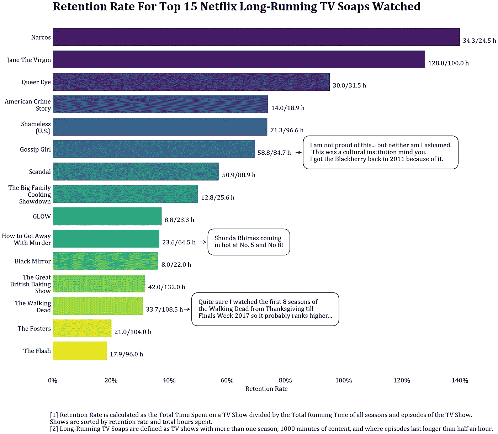

# 网飞项目:第一部分(保留)

> 原文：<https://medium.com/analytics-vidhya/netflix-viewing-trends-d41053f0c1fd?source=collection_archive---------14----------------------->

这个个人项目已经等了很久了。如果我必须选择三件我热爱的事情，它们肯定会是:食物、统计数据和电视节目——排名不分先后。为了使我的效用最大化，我一直把食物和电视放在一起。如果你在我的生活中随机选择一个时刻，我很有可能一直在吃饭和看电视。

我有一个想法，把另外两个我最喜欢的东西——统计数据和电视节目——放在一起，但是有太多关于网飞、Hulu 和 Prime 联合实力的好内容，我不能放弃。由于隔离，所有夏天的计划都被取消了，我终于有时间去做了。

# 我如何获得我的数据

网飞有一个不常听说但非常有用的功能。它允许你下载你所有的观看历史作为一个“csv”文件。总的来说，在过去的 3 年里，我的网飞坚持得到了大约 1000 个数据点的回报。那几乎是一天一个节目。我们甚至还没有包括我的 Hulu、Prime 和 CBS 账户。

资料来源:网飞

这些数据的一个局限性是，网飞会用最新的观看日期覆盖你的观看历史。例如，由于我看了两遍*击倒房子*(在那里对 AOC 大喊)，它只会报告我看的第二遍而不是第一遍。然而，由于我在过去三年里从一个朋友的账户跳到另一个账户(我这个廉价的自己试图从不太长时间地揩别人的油)，我能够捕捉到一些重新观看的画面，这为我的分析提供了更多的色彩。这种怪癖会导致对立即重播的节目和过一段时间重播的节目的偏见。然而，对我来说，前者比后者更罕见，这种偏见不是游戏规则的改变者。

在获得我的观看活动后，我想获得一组丰富的变量，如剧集长度、季数和剧集数、类型、标签和演员。正如你从下面的红框中看到的，我从 IMDb 的网站上找到了这些信息。

资料来源:IMDb

我肯定得到了比我分析的第一部分所需要的更多的信息，但是托管中的所有信息总有一天会派上用场。

# 衡量“保留率”

我想调查的每个电视节目的第一个衡量标准是我在开始后有多愿意结束这个节目。为了确定这一点，我创建了一个名为“保留率”的简单指标，即花费在电视节目上的总时间(观看的集数*总集长，作为花费在一集上的总时间的代理)除以总节目长(季数*集数*总集长)。

为什么这很重要？首先，如果你像我一样——正在寻找长期的东西。没有什么比在晚餐时间浏览网飞，浏览所有的“推荐”，然后才意识到自己无意中吃完了晚餐，不得不回去工作更令人反感的了。

我必须补充的一点是，如果我可以的话，我不会用一集的总长度来代表花在一个电视节目上的总时间，因为我怀疑我是否完成了我开始的每一集。不幸的是，网飞不会告诉你在任何一集上花了多长时间。对于我看过的前几部电视剧来说，这不太可能是个问题，因为我可能会看完我开始的每一集。尽管如此，这造成了保留率的上升，但在我甚至无法通过一集的节目中更是如此(是的，我说的是你*Glee*……)

将分子中我在网飞的观看活动与分母中来自 IMDb 的电视节目数据配对的另一个问题是，从有线电视到网飞的交错发布的节目在这里将处于不利地位。举例来说，我相当忠实地跟随 *Schitt 的小溪*，但是结果不会反映这一点。虽然所有的 6 季都报道了 IMDb，但不是所有的 6 季都可以在网飞看到(来吧，一起来吧，网飞，我需要看大卫和帕特里克发生了什么！！).显然，会有一个对网飞原创内容的实质性偏见。

# 如果你打算长期投资，我的网飞建议是…

我首先从我对一般值得观看的东西的建议开始。为了过滤电视节目，我查看了任何在 IMDb 录制了超过 1 集的节目。在下面的图表中，我先按保留率，然后按总时长对所有网飞电视节目进行了排名。

一般来说，真正的犯罪节目(*当他们看到我们时，缉毒警察，杰弗里·爱泼斯坦*)，感觉良好的节目(*简·处女，酷儿眼，欢呼*)和情景喜剧(*席特的小溪，在我的街区*)至少在我的书中做得很好。不足为奇的是，有大量有限的系列内容，因为这些内容更短。

任何优秀的和初露头角的数据分析师都知道，前 20 名之间有很大的差异。例如，虽然我看了 6 个小时的*欢呼*，但这真的能和我看了 100 多个小时的*简圣母*相比吗？虽然，我必须说，如果我能看 100 个小时的杰里做垫讲话，你知道我会。因此，我将我的数据分成三部分，以便更好地进行比较。

首先，我看的是长时间播放的电视剧。

令人惊讶的是，这里没有实质性的网飞偏见。唯一的偏见可能是对已经播出的节目，如《简·处女》和《T2 丑闻》。总之，我必须对*毒枭*大声疾呼。第三季太棒了——不明白马蒂亚斯·瓦雷拉怎么会被艾美奖忽略了。是的，我不止一次看过第三季。

总体趋势似乎是支持家庭剧(*《贞女》、《无耻之徒》、《福斯特夫妇》*)、犯罪剧(*《毒枭》、《美国犯罪故事》、《HTGAWM》*)和反乌托邦剧(*《黑镜》、《TWD》*)。

接下来，我调查情景喜剧和真人秀。

不幸的是，我看的情景喜剧不多，因此只能展示我最喜欢的 10 部。我会说这是一个不受欢迎的观点，但我甚至不喜欢第一季后的好地方。再说一次，关于家庭的节目( *Schitt's Creek，Kim ' s convenient*)，社会问题的节目(*牢不可破的童菲·施米特，亲爱的白人*)，以及成人节目(*在我的街区，中间人，德里女孩*)在这里都很受欢迎。

接下来，我把我最喜欢的限量系列进行排名。

正如所料，所有限量版剧集的平均保留率都较高，可能只是因为它们很短，而且通常都很悬疑，所以我一直看到大揭露的结尾。规则的一个例外——*坠毁在你身上*——出现在排行榜上仅仅是因为我的妻子想看完它(谢天谢地只有一季，尽管我很欣赏节目中所有的韩国炸鸡)。

# 不要看什么

最后，你可能有兴趣知道哪些 ***不*** 值得观看。为了找到一组不要看的节目，我采取了一种稍微不同的方法，而不是简单地看那些保留率最低的节目。我将解释为什么使用与我们之前所做的相反的方法并不奏效。如果我们看那些保留率最低的节目，它们总是那些我只看过一集的长时间播放的电视节目。然而，它们的保留率一定比那些连一分钟都吸引不了我注意力的限量系列低吗？

因此，我决定过滤掉那些我只看了一集的节目，然后根据剧集长度对它们进行排序。这也代表了每场演出花费的总时间。一般来说，我认为我甚至不能看完这些节目的第一集。因此，一集越短，它可能越不可看(刺耳的话…但这就是世界就像我的朋友)。

声明:这是个人观点。无意冒犯庞大的*社区*社区(看到我刚才做了什么吗？)在那里，以及巨大的阿齐兹·安萨里追随者——我仍然爱他。也许有一天我会把所有的*统统搞定*。

好吧，谢谢你让我沉迷于已经如此放纵的事情，下次我会报告我想研究的另一个指标——**兴奋度**。

*更新:见[此处](/swlh/the-netflix-project-part-ii-bingeability-b20ab7faa1)为第二部！