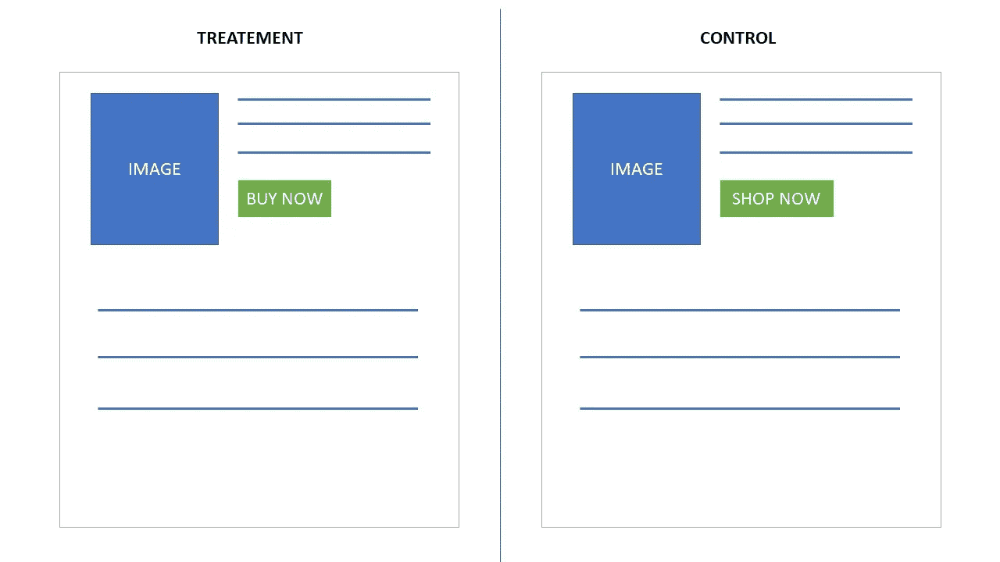
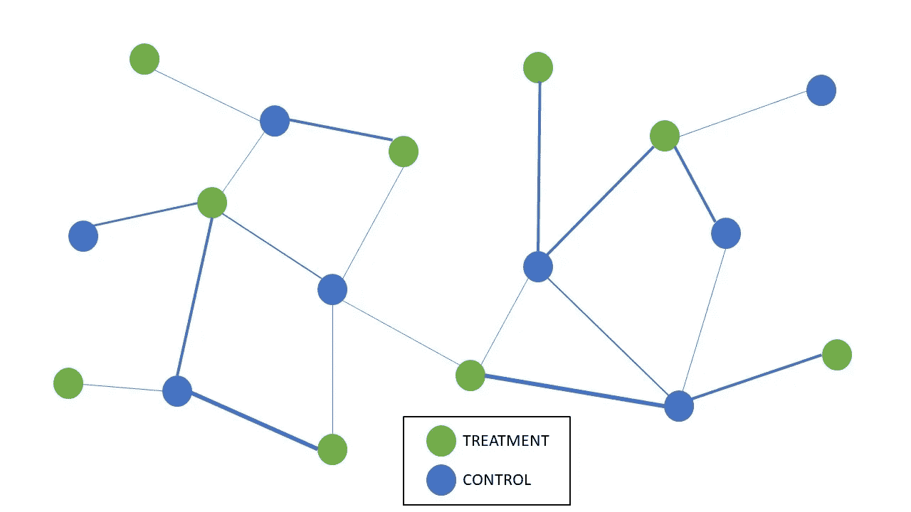
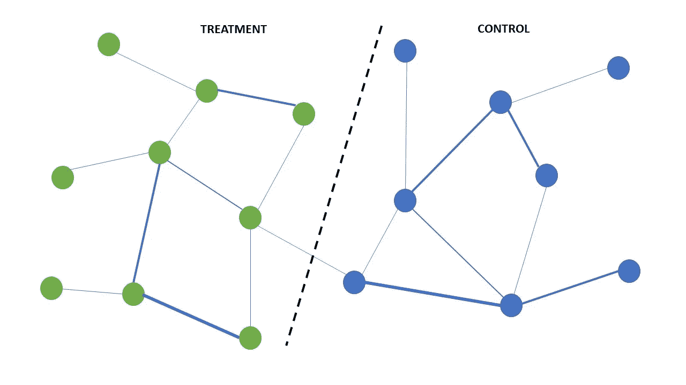

# 实验设计中的网络效应

> 原文：<https://medium.com/analytics-vidhya/network-effects-a95c42c10ff2?source=collection_archive---------3----------------------->

实验旨在衡量所提议的变革的有效性。任何实验设计中最基本的假设是 SUTVA(稳定单位治疗值假设)。控制和处理单元必须相互独立，并以完全随机的方式选择。治疗中的每个单元只受治疗的影响，不受其他因素的影响。

然而，在社交平台上，每个用户都是相互联系的。如果他们参与实验，使用者不仅会受到治疗的影响，还会受到实验中其他使用者的影响。这是网络效应，违反了萨特瓦假设。

资料来源:安娜·林德基金会(网络的网络)

**例子:**

考虑一个使用“立即购买”或“立即购买”CTA 按钮来测量网站转换率的实验。这可以用 A/B 测试来测试。处理和控制可以随机分配，因为它们彼此没有太大的影响。可以使用典型的测试方法来测量治疗的效果。

A/B 测试示例

但请考虑一个测试，你将在市场上推出“脸书支付”功能。在这里，处理和控制单元*不能*被随机分配。该功能本身是一个具有发送方和接收方的双向应用程序。随机选择治疗单位可能会导致创建有发送者而无接收者的组，反之亦然(如下例所示)。

随机选择

网络效应也存在于其他一些社交应用中，如 Skype、谷歌文档、Airbnb、优步、脸书等。他们的新闻源，内容排名模型，广告拍卖，任何其他社交产品。在所有这些情况下，每个用户都与其他用户相关。实验的结果依赖于这种连通性，违反了 SUTVA。监督网络效应会引入偏差并增加影响实验结果的方差。

为了检测网络效应， [**这篇**](https://web.media.mit.edu/~msaveski/assets/publications/2017_detecting_network_effects/paper.pdf) 论文解释了下面的方法——在一组随机分组的顾客和一组随机分组的顾客之间进行同样的实验。如果两组之间的估计值有显著差异，这将证明样本中存在网络效应。

**网络效应的影响:**

网络效应的主要影响之一是溢出效应。如果对一个提议进行治疗测试，可能会有顾客在治疗组和对照组之间进行交流。这将导致控制组的顾客利用这一优惠，从而减少实验的真实提升。

**可能的解决方案:**

处理网络效应的最佳方法是将相似的顾客分组，并测量处理和控制之间的总差异。这样，治疗组和对照组之间的溢出效应更小。聚类有两种方法— K 均值聚类和谱聚类。

[K 表示聚类](https://www.analyticsvidhya.com/blog/2019/08/comprehensive-guide-k-means-clustering/)根据质心将客户分成 K 个相似的组。作为一种无监督算法，通过减少点和质心之间距离的平方和，将点分配到一个聚类中。

[谱聚类](https://towardsdatascience.com/spectral-clustering-for-beginners-d08b7d25b4d8) —图聚类随机化基于谱定理。拉普拉斯矩阵是基于特征值创建图切割的主要工具，以将群体分成治疗组和对照组。

图形聚类随机化

**需要记住的事情:**

在网络环境中，用户的行为不仅受治疗的影响，还受其他用户行为的影响。这产生了两个模型— *治疗干扰与行为干扰* —在前者中，目标是最小化聚类之间的方差，在后者中，目标是最小化偏差和方差的权衡。根据应用，必须选择正确的方法。

注意那些没有或很少与他人联网的用户。制作几个图割可以将连接最少的用户隔离到单独的集群中

治疗组和对照组的时区和服务器延迟也会影响结果

确保治疗组中的每个人都接受治疗

网络暴露= %您和您的朋友接受治疗

**结论**

网络效应是当今几个行业普遍存在的问题。我整合了我遇到的资源，对这个问题有了一个基本的想法，并发布了一些可能的解决方案。图簇随机化是迄今为止最有效的一种。下面的参考文献详细解释了这个概念。

**参考文献:**

网络效果实验— [链接](https://www.youtube.com/watch?v=_axxSe66v4o&ab_channel=ICMEStudio)

IMS-微软研究研讨会:数据科学基础— [图簇随机化](https://www.youtube.com/watch?app=desktop&v=te6GxNO2HzE&ab_channel=MicrosoftResearch)

在[协作网络](http://www.unofficialgoogledatascience.com/2018/01/designing-ab-tests-in-collaboration.html)中设计 A/B 测试

检测网络影响— [链接](https://web.media.mit.edu/~msaveski/projects/2016_network-ab-testing.html)

**图聚类算法:**

图聚类算法— [链接](https://www.youtube.com/watch?app=desktop&v=-Afa1WI3iug&ab_channel=GraphXD%3AGraphsAcrossDomains)

在图中寻找聚类— [链接](https://www.youtube.com/watch?app=desktop&v=cxTmmasBiC8&ab_channel=MITOpenCourseWare)