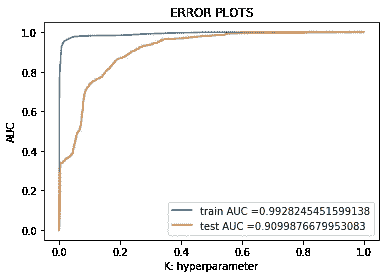
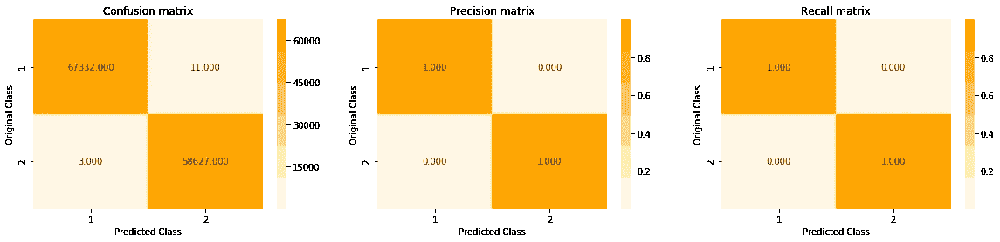

# 网络入侵检测系统

> 原文：<https://medium.com/analytics-vidhya/network-intrusion-detection-system-4bab3e5baccb?source=collection_archive---------7----------------------->


来源谷歌

## 端到端项目

我把这个博客分成三个部分:

*   第一部分:在这里我们将了解案例研究的所有基础，比如现实世界的商业问题，以及如何将它转化为一个 ML 问题。
*   **第二节**:该节专门用于探索性数据分析。
*   **第三节**:这里我们将讨论 ML 模型和一些特征工程技术。

# 第一节

# 1.(现实世界问题到机器学习问题)

在本节中，我们将尝试回答所有这些问题

1.  *我们首先想到的是* ***什么是网络入侵，我们为什么要关心？***

*2。我们要如何把这个当作一个* ***机器学习问题*** *？*

***3。我们 ML 任务的数据来源*** *？*

*4。我们应该从我们的 ML 模型(* ***目标和约束*** *)中期待什么，以及我们如何* ***衡量*** *它们？*

*5。一.我们要如何使用* ***机器学习*** *？
二。* ***现有的方法有哪些*** *？
iii。* ***我的方法*** *对于这个问题*

*6。如何将* ***这个问题公式化为机器学习问题*** *？*

# 1.1:什么和为什么(现实世界/业务问题)

*   网络入侵是计算机网络上任何未经授权的活动。未经授权的活动或异常网络活动威胁着用户的隐私，并可能破坏整个网络的功能和基础设施。
*   我们需要 NIDS，因为它对网络安全至关重要，使我们能够检测和响应恶意流量。NIDS 的主要目的是确保 IT 人员在攻击或网络入侵可能发生时得到通知。

# 1.2:问题陈述(机器学习问题)

*   入侵检测器的学习任务是建立一个预测模型(即分类器),能够区分称为入侵或攻击的不良连接和正常的良好连接。

# 1.3:数据来源:

*   这里使用的数据集是 NSL KDD(KDD-cup 99 的新版本)。
*   我们可以很容易地从这个链接下载数据集:[https://www.unb.ca/cic/datasets/nsl.html](https://www.unb.ca/cic/datasets/nsl.html)

# 1.4:机器学习的目标和约束，以及我们如何衡量它们

**目的:**给定一个数据点分类器，它是否是攻击- >二进制分类

**约束:**

1.  合理的延迟
2.  可解释性

**我们关心的 KPI(关键绩效指标)**

*   罗马纪元
*   f1 分数
*   二元混淆矩阵
*   检测率——它只不过是召回率

看到度量标准后，会出现一个问题，为什么是这些度量标准？

*   AUC:众所周知，当我们有两类分类问题时，AUC 是一个很好的选择，因为它告诉我们分类点的机会(百分比)。
*   f1 分数和检测率已经被用于几乎每篇论文和人们的工作中，这是有原因的，因为我们希望这项任务具有高精度和高召回率，这意味着 f1 分数是合适的。检测率无非是召回值。
*   二元混淆矩阵:对于解释来说，这个度量将帮助我们。

# 1.5:(一)机器学习的使用:

*   在本案例研究中，我使用了机器学习模型来对攻击与否进行分类。为此，我们使用了 ml 模型，如朴素贝叶斯、逻辑回归、决策树等等，我们将在后面的部分中探讨这些模型。

# ㈡现有方法:

*   清洗后，预处理和一些 EDA 人员消除了一些无用的特征，并尝试了不同的模型，如支持向量机，逻辑回归等，准确性作为他们的衡量标准

# ㈢我的方法:

*   我还做了清理、预处理和 EDA，为了消除特征，我使用了递归特征消除，并尝试了不同的基本 ML 模型和一些定制模型。采用 auc 作为度量，因为当我们有不平衡的数据时，它不适合使用准确性。

# 1.6:机器学习问题公式

## 1.6.1:数据概述

我们有两个数据集

*   训练数据:它有 125973 个数据点和 42 个特征
*   测试数据:它有 42 个特征的 22544 个数据点

下面是关于数据集[http://kdd.ics.uci.edu/databases/kddcup99/task.html](http://kdd.ics.uci.edu/databases/kddcup99/task.html)的详细描述

## 示例数据点

# 1.6.2 将现实世界的问题映射到 ML 问题

## 1.6.2.1 型机器学习问题

我们需要将攻击或正常分为两类->这是一个二元分类任务

# 第二节

# 2.探索性数据分析

为了方便起见，我没有公布所有的代码，如果你想要所有的代码，请随时访问我的 github 链接。

[](https://github.com/Jitendra-Dash/Network-Intrusion-detection-system) [## jitendra-Dash/网络入侵检测系统

### GitHub 是超过 5000 万开发人员的家园，他们一起工作来托管和审查代码、管理项目和构建…

github.com](https://github.com/Jitendra-Dash/Network-Intrusion-detection-system) 

本节涵盖的内容

*   读取数据
*   单变量分析
*   双变量分析
*   多变量分析

# 2.1 读取数据

## 读取列车数据

**输出**


有一个额外的功能出现在 43 号栏，这是没有用的，所以让我们删除它。

**输出:**

训练数据的形状(125973，42)
数据点数 125973
特征数 42

## 读取测试数据

**输出:**

测试数据的形状(22544，42)
数据点数 22544
特征数 43

# 2.1.3:给攻击加上类别标签

## 正常:0

## 所有其他攻击:1

## 列车数据类别标签分布


## 测试数据类别标签分布


**观察:**

*   在训练和测试数据集中有 42 个特征
*   15 个浮点值、23 个整数值和 4 个对象值
*   看起来我们没有空值，但是我们会再次检查。
*   在分布图中:训练数据集的 0 类数据点多于 1 类数据点，测试数据集的 1 类数据点多于 0 类数据点

# 2.2 数据清理

## 检查重复值

**输出:** (125973，43)

## 检查空值

```
null_rows = train_data[train_data.isnull().any(1)]
```

**观察**

*   不存在重复值
*   我们没有空值

# 2.3 攻击在数据集中的分布

## 2.3.1:列车数据


从上面的图中，我们没有得到太多的信息，所以让我们打印出来，这样我们可以得到更清晰的图片。

**属于每个类别的数据点**

**输出**

第一类数据点数:67343 ( 53.458 %)
第二类数据点数:41214 ( 32.717 %)
第三类数据点数:3633 ( 2.884 %)
第四类数据点数:3599 ( 2.857 %)
第五类数据点数:2931 ( 2.327 %)
第六类数据点数
第 7 类数据点数:1493 ( 1.185 %)
第 8 类数据点数:956 ( 0.759 %)
第 9 类数据点数:892 ( 0.708 %)
第 10 类数据点数:890 ( 0.707 %)
第 11 类数据点数:201 ( 0.16 %)
第 12 类数据点数:53
第 13 类数据点数:30 ( 0.024 %)
第 14 类数据点数:20 ( 0.016 %)
第 15 类数据点数:18 ( 0.014 %)
第 16 类数据点数:11 ( 0.009 %)
第 17 类数据点数:10 ( 0.008 %)
第 18 类数据点数:9 ( 0
第 19 类数据点数:8 ( 0.006 %)
第 20 类数据点数:7 ( 0.006 %)
第 21 类数据点数:4 ( 0.003 %)
第 22 类数据点数:3 ( 0.002 %)
第 23 类数据点数:2 ( 0.002 %)

**观察:**

在上面的图中，我们有 23 种不同类型的攻击及其分布:

*   正如我们在上面看到的，数据集不是均匀分布的
*   有许多攻击的数据点非常少，有些攻击，如 normal 和 Neptune，它们都有 85%的数据点，而不是 100%的数据点
*   23 次攻击中有 16 次攻击的数据点低于 1%

从上面的观察我们可以看到:正常有 53.5%的数据点，所有其他 22 类有 46.5%的数据点

我们得到了一个不平衡的数据集

# 测试数据


**属于每个类别的数据点**

**输出**

第一类数据点数量:9711 ( 43.076 %)
第二类数据点数量:4657 ( 20.657 %)
第三类数据点数量:1231 ( 5.46 %)
第四类数据点数量:996 ( 4.418 %)
第五类数据点数量:944 ( 4.187 %)
第六类数据点数量:737 ( 3 .
第 7 类数据点数:735 ( 3.26 %)
第 8 类数据点数:685 ( 3.039 %)
第 9 类数据点数:665 ( 2.95 %)
第 10 类数据点数:359 ( 1.592 %)
第 11 类数据点数:331 ( 1.468 %)
第 12 类数据点数:319
第 13 类数据点数量:293 ( 1.3 %)
第 14 类数据点数量:178 ( 0.79 %)
第 15 类数据点数量:157 ( 0.696 %)
第 16 类数据点数量:141 ( 0.625 %)
第 17 类数据点数量:133 ( 0.59 %)
第 18 类数据点数量:73 ( 0
第 19 类数据点数:41 ( 0.182 %)
第 20 类数据点数:20 ( 0.089 %)
第 21 类数据点数:18 ( 0.08 %)
第 22 类数据点数:17 ( 0.075 %)
第 23 类数据点数:15 ( 0.067 %)
第 24 类数据点数:14 ( 0
第 25 类数据点数:13 ( 0.058 %)
第 26 类数据点数:13 ( 0.058 %)
第 27 类数据点数:12 ( 0.053 %)
第 28 类数据点数:9 ( 0.04 %)
第 29 类数据点数:7 ( 0.031 %)
第 30 类数据点数:4(0.013
第 31 类数据点数:3 ( 0.013 %)
第 32 类数据点数:2 ( 0.009 %)
第 33 类数据点数:2 ( 0.009 %)
第 34 类数据点数:2 ( 0.009 %)
第 35 类数据点数:2 ( 0.009 %)
第 36 类数据点数:2 ( 0.009 %)
第 37 类中的数据点数:2 ( 0.009 %)
第 38 类中的数据点数:1 ( 0.004 %)

**观察**

*   在测试数据中有一个有趣的事情，我们有 38 个类。这一点以前没有注意到。
*   这里也正常和海王星类有更多的数据点
*   同一个故事数据不统一
*   数据集不平衡

# 2.3.3 不在列车数据中的攻击

**输出:** {'mailbomb '，' sqlattack '，' apache2 '，' udpstorm '，' snmpgetattack '，' ps '，' xterm '，' snmpguess '，' worm '，' mscan '，' processtable '，' saint '，' named '，' xsnoop '，' httptunnel '，' sendmail '，' xlock ' }
* * * * * * * * * * * * * * * * * * * * * * * * * * * * * * * * * * * * *
额外攻击次数:17

**输出:**

{'neptune '，' ftp_write '，' teardrop '，' imap '，' nmap '，' multihop '，' portsweep '，' land '，' perl '，' guess_passwd '，' pod '，' normal '，' back '，' smurf '，' buffer_overflow '，' satan '，' rootkit '，' ipsweep '，' loadmodule '，' phf '，' ware master ' }
* * * * * * * * * * * * * * * * * * * * * * * * * * * * * * * * * * * * * * * * * * * * * * * * * * * * * * *，在训练和测试数据 21 中都存在攻击

**输出:**出现在训练中而不在测试数据中的攻击{'spy '，' warezclient'}

**观察**

*   我们在测试数据中有 17 个额外的类
*   测试和训练数据集中存在 21 种攻击
*   有两个类别不存在于测试数据中，但存在于训练数据中，即:“间谍”、“仓库客户”

# 2.4 分类特征的单变量分析

为了分析这些分类特征，我们将提出几个问题，例如

*   给定特性中有多少个类别？
*   给定特征的分布？
*   如何特征化范畴特征？
*   这个 protocol_type 特性在预测 y_i 方面有多好？

# 2.4.1 协议类型的单变量分析

**[i]此功能中有多少个类别**

**输出:**

唯一协议类型的数量:3
TCP 102689
UDP 14993
icmp 8291
名称:协议类型，数据类型:int64

**观察**

*   我们在训练数据中有 3 个不同类别的原型类型，即:TCP、UDP 和 ICMP
*   很多点属于 tcp，而 udp 和 icmp 的点较少

**【二】该特征的分布**


**观察**

*   训练数据中有许多点属于 tcp 协议类型(102689)。普通类和攻击类只有在 tcp 方面是一致的。
*   大多数 udp 原型属于正常类，也有少数点属于攻击类。
*   在 icmp 协议类型中，大多数点属于攻击类别。

**【iii】使用一个热编码的特征**

**输出:**train _ protocol _ type _ encoding 是使用一键编码方法转换的特征。基因特征的形状:(125973，3)

**【iv】这个 protocol_type 特征对 y_i 的预测有多好？**

为了回答这个问题，将建立一个决策树模型，该模型仅使用协议类型特征(一个热编码)来预测 y_i

*   构建具有超参数调整的决策树仅使用该特征，我们发现最佳超参数是 max_depth = 10，min_samples_split =10。


**输出:**

重要特性:
UDP 0.59247
TCP 0.40753
icmp 0.00000

**观察**

*   通过仅使用该特征，我得到了 58 的 auc 分数，由此我们知道，当我们使用所有特征建立实际模型时，该特征可能有助于预测 yi。
*   建模认为最重要的类别是 udp，而 icmp 一点也不重要

# 2.4.2 服务的单变量分析

**[i]此功能中存在多少个类别**

**输出:**

唯一服务数量:70
http 40338
private 21853
domain _ u 9043
SMTP 7313
FTP _ data 6860
Name:service，dtype: int64

**观察**

*   有两种服务 http 和 private 比其他服务有更多的数据点。

**【二】该特征的分布**


**观察**

*   这是一个偏态分布
*   很少有服务发生得更多，大多数服务发生得更少。
*   在这种分布中，从左到右按降序(频率)服务。
*   第 0 个索引包含 http，第 1 个索引包含 private 等。


**观察**

*   前 20 到 25 个服务贡献了 90%的数据，这意味着这些服务比其他服务出现得更频繁。

**[iii]使用一个热编码的特征**

**输出:** train_service_encoding 是使用一键编码方法转换的特征。基因特征的形状:(125973，70)

**【iv】这个 protocol_type 特征对 y_i 的预测有多好？**

为了回答这个问题，将建立一个决策树模型，该模型仅使用协议类型特征(一个热编码)来预测 y_i

*   构建具有超参数调整的决策树仅使用该特征，我们发现最佳超参数是 max_depth = 5，min_samples_split = 5。


**输出:**

顶级重要特性:
http 0.463210
domain _ u 0.203939
SMTP 0.183398
FTP _ data 0.102040
其他 0.047413
nntp 0.000000
NTP _ u 0.00000
pm _ dump 0.000000
pop

**观察**

*   通过仅使用这一单一特征，我的模型给出了 87 个测试 auc 值，这非常有趣
*   70 个特征中，只有 5 个是重要。
*   此信息可能对特征工程有用(我们可以删除值为 0.0 的特征)

# 2.4.3 对 Flag 的单变量分析

**[i]此功能中有多少个类别**

**输出:**唯一旗帜数量:11
SF 74945
S0 34851
REJ 11233
RSTR 2421
RSTO 1562
名称:旗帜，数据类型:int64

**【二】该功能的分布**


**观察:**

*   有 3-4 个标志出现的次数更多
*   偏斜分布


**观察:**

在 10 个标记中，4 个标记贡献了 98 -99%数据，这 4 个标记出现得更频繁。

**【iii】使用一个热编码的特征**

**输出:** train_flag_encoding 是使用一键编码方法转换的特征。基因特征的形状:(125973，11)

**【iv】这个 protocol_type 特征在预测 y_i 方面有多好？**

为了回答这个问题，将建立一个决策树模型，该模型仅使用协议类型特征(一个热编码)来预测 y_i

*   构建具有超参数调整的决策树仅使用该特征，我们发现最佳超参数是 max_depth = 5，min_samples_split = 10。


**输出:**

重要特性:
SF 0.954620
s0 0.026476
S1 0.011691
S2 0.003657
rej 0.003556
oth 0.000000
rsto 0.000000
rstos 0.000000
rstr 0.00000【T13

**观察**

*   通过观察训练和测试 auc 值，该模型可能过度拟合，但是我们有 78 个测试 auc 值，这表明该模型将是有帮助的
*   有一个类别是最重要的:“科幻”这个类别本身就有 95 的价值。

# 2.5 对一些连续特征的单变量分析

## 持续时间

连接的长度(秒数)

**小提琴剧情**


**箱线图**


**观察**

*   均值、中值、第 25、第 50、第 75 百分位太小，无法分析，因为大部分持续时间为 0
*   让我们看看 0 到 100%的值

**输出:**
0 百分位值 0
10 百分位值 0
20 百分位值 0
30 百分位值 0
40 百分位值 0
50 百分位值 0
60 百分位值 0
70 百分位值 0
80 百分位值 0
90 百分位值 0
100 百分位值 42908

**观察**

*   大约 90%的持续时间值为 0
*   我们可以在 100%中看到很多价值
*   所以让我们看看从 90%到 100%之间

**输出:** 90 个百分点值为 0
91 个百分点值为 0
92 个百分点值为 0
93 个百分点值为 1
94 个百分点值为 2
95 个百分点值为 4
96 个百分点值为 15
97 个百分点值为 31
98 个百分点值为 2052
99 个百分点值为 9592
100 个百分点值为 4299

**输出:** 99.0 百分位值 9592
99.1 百分位值 10910
99.2 百分位值 12666
99.3 百分位值 13858
99.4 百分位值 16693
99.5 百分位值 19981
99.6 百分位值 25761
99.7 百分位值

**观察**

*   持续时间值从 90%开始增加。
*   如果我们观察类标签 1 的小提琴图，有一些值可能高达 2k 到 3k
*   从 99.0 到 100%，该值急剧增加..这些值可能是异常值。

# 2.5.2 .src _ 字节

从源到目的地的数据字节数

**小提琴剧情**


**观察**

*   对于标签 0 和 1 都很难分析。但是需要注意的一点是，1 类攻击比 0 类攻击具有更大的价值，这是正常的

**方块剧情:**


**观察**

*   从这个箱形图中，我们可以看到从第 25 到第 75 百分位的所有值都为零。这很难解释。
*   让我们再次放大 src_bytes 的百分比值。

**输出:** 0 百分位值为 0
10 百分位值为 0
20 百分位值为 0
30 百分位值为 0
40 百分位值为 1
50 百分位值为 44
60 百分位值为 192
70 百分位值为 235
80 百分位值为 307
90 百分位值为 848
100 百分位值为 137999

**观察:**

正如我们可以看到的，从 90%到 100 %有一个很大的跳跃

**输出:** 90 百分位值为 848
91 百分位值为 1006
92 百分位值为 1032
93 百分位值为 1087
94 百分位值为 1264
95 百分位值为 1480
96 百分位值为 1830
97 百分位值为 2974
98 百分位值为 8737
98

**输出:** 99.0 百分位值为 54540
99.1 百分位值为 54540
99.2 百分位值为 54540
99.3 百分位值为 54540
99.4 百分位值为 54540
99.5 百分位值为 54540
99.6 百分位值为 175337
99 .

**观察**

*   相当于 1.28GB 的 1379963888 字节从源到目标的 100 %价值巨大。

已经对 dst 字节和错误片段进行了类似分析

# 2.6 双变量分析(配对图)


**观察**

*   如果我们观察 dst_host_count 和 dst_host_same_srv_rate 特性，会发现它们有一些点(不完全)但部分分离，但也有一些重叠点。
*   dst_hst_srv_count 和 dst_host_count 在中间也有一些重叠，一些数据点是部分可分离的
*   如果我们看这四个特征的 pdf
*   *srv_diff_host_rate:类 0 的值高于类 1 的值*
*   *dst_host_count:整个类 1 都被放置并具有比类 0 高得多的值*
*   *dst_host_srv_count:类 1 和类 0 之间有一些重叠区域，类 1 的值高于类 0。*
*   dst_host_same_srv_rate:看起来类 1 和类 0 是分开，但是有很多重叠的数据点。让我们尝试分析 dst_host_srv_count 和 dst_host_same_srv_rate。

" **dst_host_srv_count** "


**观察**

*   这两把小提琴没有完全重叠，这个" **dst_host_srv_count** "特征在分类中可能是有用的

**dst_host_same_srv_rate**


**观察**

*   这里，这两个类别也没有完全重叠(就第 25、50 和 75 百分位而言)，因此在 dst_host_same_srv_rate 中存在一些可分离性。

# 2.7 使用 TSNE 的多变量分析

这里我们尝试将 32dim(连续变量)到 2dim 的数据可视化。


**观察**

*   这里采用 32 维连续变量，并将它们减少到 2 维
*   从图 3 中我们可以观察到，这 32 个连续变量将有助于确定类别标签。
*   在困惑度为 30 的第一个图中:类 1 和类 0 是分开的，是的，有一些重叠的区域，但大部分是分开的。我们可以在 2 号地块和 3 号地块看到同样的故事。

# 第三节

# 3.机器学习模型

机器学习模型如下:

*   我们有更少的功能，所以让我们建立模型，这往往是对更少的功能工作良好。

**1。朴素贝叶斯(基线模型)**

*   基线模型应该简单，以便我们可以与其他模型进行比较。

**2。KNN**

**3。逻辑回归**

*   因为，它的一个实验可能是线很好地分开两个类，让我们看看。

**4。决策树**

**5。随机森林**

**6。Xgboost**

7。普通堆积分类器

8。定制堆积分类器

9。特征工程

# 3.1 基线模型(朴素贝叶斯)

**超参数调谐**

*   我们找到的最佳超参数是 **alpha = 0.01**


训练 f1 分数 0.9258446608869385
测试 f1 分数 0.923333836

列车召回分数/检出率 0.8852294047415998
**测试召回分数/检出率**

**混淆矩阵:**


**列车混乱矩阵**


**测试混淆矩阵**

> **在开始观察之前，让我们知道如何阅读这些指标**
> 
> **测试 auc 分数 64** 的含义:-正确分类分数的几率为 64%
> 
> **F1 得分** —它是精度和召回率平均值的倒数。当精确度和召回率都很高时，它将给出高值
> 
> **读数精度和召回矩阵** :-
> 
> 精度(列总和为 1):在所有预测属于类 0 的点中，67%实际上属于类 0，33%属于类 1
> 
> 回忆(行和为 1):在所有实际属于类 1 的点中，63%被预测为类 1，36%被预测为类 0

**观察:**

*   训练和测试 AUC 值之间存在差距，这意味着模型过度拟合
*   让我们做一些特征选择来减少过度拟合
*   我们将通过递归特征消除来进行特征选择

# 3.2 通过递归特征消除的特征选择

给定将权重分配给特征(例如，线性模型的系数)的外部估计器，递归特征消除(RFE)的目标是通过递归地考虑越来越小的特征集来选择特征。首先，在初始特征集上训练估计器，并且通过 coef_ attribute 或通过 feature_importances_ attribute 获得每个特征的重要性。然后，从当前特征集中删除最不重要的特征。该过程在删减集上递归重复，直到最终达到要选择的特征的期望数量。
参考:[https://sci kit-learn . org/stable/modules/generated/sk learn . feature _ selection。RFE.html](https://scikit-learn.org/stable/modules/generated/sklearn.feature_selection.RFE.html)

**获得最佳或有用特征的程序**

*   *使用标签编码器对对象类型特征(表示分类)进行编码*
*   *合并编码器分类特征和数字特征*
*   *使用数据框方法 corr()计算相关矩阵，该方法默认使用皮尔逊相关系数*
*   *遍历两个 for 循环，取出相关矩阵中值大于. 8 的特征*
*   *现在通过使用递归特征消除(使用随机森林模型，我们可以使用我们选择的任何模型，但是 RF 给出良好的特征重要性)，它给出了 29 个在预测模型中有用的特征(称为最优特征)*
*   *然后通过观察绘制出最重要的特征，我们可以再次移除一些价值很小的特征*

```
print('Optimal number of features: {}'.format(rfecv.n_features_))
```

**输出:**最佳特性数:29


# 使用选定特征建模

# 3.3 带超参数调整的朴素贝叶斯

*   这里的最佳超参数:阿尔法= 10


**列车 f1 得分**0.9607209835382371
测试 f1 得分 0.966078607

**列车召回分数/检出率**0.9436465973051339
**测试召回分数/检出率**0.6443636366


**列车混乱矩阵**


**测试混淆矩阵**

**观察:**

**1->0 级和 2->1 级**

*   在移除一些不相关的特征后，f1 分数和召回率都有轻微的提高
*   回忆起来似乎有些混乱:在所有实际点中，64%被预测为第 2 类，而大约 36%被预测为第 0 类

# 3.4 KNN 超参数调谐

对于**最佳 alpha = 99** 的值，**训练 auc 分数**为:0.9997159094312437
对于**最佳 alpha = 99** 的值，测试 **auc 分数**为:0.8918894763568558

**训练 f1 分数** 0.9902896052698944
测试 f1 分数**0.799000001**

**列车召回分数/检出率**0.9897322190005117
**测试召回分数/检出率**0.6566666666


**列车混乱矩阵**


**测试混淆矩阵**

**观察:**

**1->0 级和 2->1 级**

*   简单的 knn 模型给了我们更多的 auc、f1 和回忆值，这是一个好现象
*   但是在召回事件中，第二类和第一类之间的测试数据仍然存在一些混淆
*   这可能是因为阶级不平衡

# 3.5 逻辑回归超参数调整



训练 f1 分数 0.96713555060034306
测试 f1 分数 0.96300001

**列车召回分数/检出率**0.9616919665700153
测试召回分数/检出率 0.60000001

**列车混乱矩阵**


**测试混淆矩阵**


**观察:**

**1->0 级和 2->1 级**

*   该模型具有较高的 auc 值，但 f1 和召回率低于基线模型
*   这里也在回忆模型有一些混乱

# 3.6 具有超参数调整的决策树


**训练 f1 得分** 0.9694895073671678
测试 f1 得分 0.

**列车召回分数或检出率**0.9999317755415317
列车召回分数或检出率 0


**列车混乱矩阵**


**测试混淆矩阵**

**观察:**

**1->0 级和 2->1 级**

*   这是迄今为止我们最好的模型
*   在做了一些职业平衡后，我们得到了相当好的 auc，f1 分数和召回率
*   现在，模型不会像以前一样与类 1 和类 0 混淆

# 3.7 随机森林超参数调整


训练 f1 分数 0.9812059973378651
**测试 f1 分数**0.9866766867

列车召回分数/检测率 0.9995565410199556
测试召回分数/检测率 0.8000001


**列车混乱矩阵**


**测试混淆矩阵**

**观察:**

**1->0 级和 2->1 级**

*   该模型在 AUC 方面优于其他模型，它也具有良好的 f1 和召回值，但不如决策树。

# 3.8 XGBOOST 超参数调整


**训练 f1 得分** 0.999880615342634
测试 f1 得分 0.999999999

**列车检测率/召回率**0.9999488316561488
**测试检测率/召回率**0.99999999



**列车混乱矩阵**


**测试混淆矩阵**

**观察:**

**1->0 级和 2->1 级**

*   xgboost 模型没有按预期执行
*   它不能很好地回忆起测试数据

# 3.9 基本堆积分类器

组合所有模型


训练 f1 分数**0.99947999259960271
测试 f1 分数**0.999999999

列车召回分数/检出率 0.9997441582807437
**测试召回分数/检出率**0.65000006


**列车混乱矩阵**


**测试混淆矩阵**

**观察:**

*   上述模型是正常的打桩模型，我已经采取了所有的模型，并堆叠他们
*   将所有模型的输出传递给元分类器
*   在这里，我们也获得了不错的 auc 分数，但 f1 分数和回忆没有那么好

# 3.10 定制堆叠分类器

## **方法:**

> 拿整个数据集来说
> 
> 定义培训和测试数据
> 
> 将训练数据分成两部分:数据 1 和数据 2(这里我们取 50–50%)
> 
> 从训练数据中创建 m 个样本，并用基本学习器(xgboost)进行拟合
> 
> 现在通过将数据 2 传递给我们拟合的每个样本来进行预测
> 
> 现在用数据 2 的给定预测值和目标值训练元分类器(meta clf:逻辑回归)
> 
> 现在使用适合的元分类器并预测测试数据

## 对于 1000 个样本


**测试 f1 分数** 0.7845882789317508
测试召回分数/检出率**0.65000001**

## **用 1500 个样本**


**测试 f1 分数**0.7895077122009792
测试召回分数/检出率 0.6666766766

# 有了 2000 个样本


测试 f1 分数 0.7801108059034406
测试召回分数/检测率 0.600000001

# 10000 个数据点和 100 个样本


测试 f1 分数 0.7667231957791597
测试召回分数/检测率 0.466767667

# 4.11 特征工程

让我们添加两个新特性

*   根据功能选择添加 2 个最重要的功能
*   使用正方形的一个重要特征

让我们使用随机森林


火车 f1 得分 0.9871886660545977
**测试 f1 得分**e 0。58666.68666866661

列车召回分数/检出率 0.9995053726761044
**测试召回分数/检出率**0.999999999


**列车混乱矩阵**


**列车混乱矩阵**

**观察:**

`this model is giving highest auc value better than our previous random forest model`

# 理解整个模型构建部分简而言之

*   *合并所有编码的分类和数字特征*
*   *建立基线模型在这种情况下，我们采用了朴素贝叶斯(我们也可以采用 KNN)*
*   *通过查看超参数调整后的朴素贝叶斯模型，该模型似乎过拟合(训练和测试分数中的差距)*
*   *为了克服这个问题，我们通过递归特征消除来选择特征(请阅读 3.2 节后的“理解特征选择”)*
*   *完成后，从训练数据中手动移除所有特征，并通过查看重要特征图移除那些没有附加值的特征*
*   *从朴素贝叶斯模型开始再次构建模型*
*   *在特征选择之后，我们获得了良好的 AUC，但是存在一些问题，如 f1 分数低和测试召回上的混乱，这是因为数据集不平衡，所以给一些类权重来解决这个问题，之后我们获得了相当好的结果。*
*   *到目前为止有两个很好的模型决策树和随机森林*
*   我以为 Xgboost 会给出最好的结果，但是没关系。
*   *尝试了两种堆叠方式，但是结果在 f1 分数和召回分数方面都不好。*
*   *在特征工程部分，我尝试了 2 个新特征，即通过我们的特征选择方法选择重要的特征，然后添加这些特征，其他的是方形特征*
*   *特征工程模型(尝试随机森林)的结果很好，这是我得到的最高 auc 值，但 f1 和召回分数低于决策树和随机森林*

# 模型比较


# 未来的工作

在这个案例研究中，我只尝试了 ML 模型，在未来的工作中，我们可以尝试一些深度学习模型和一些特征工程技术。

## 我的 github 和 Linkedin 链接

[](https://github.com/Jitendra-Dash/Network-Intrusion-detection-system) [## jitendra-Dash/网络入侵检测系统

### GitHub 是超过 5000 万开发人员的家园，他们一起工作来托管和审查代码、管理项目和构建…

github.com](https://github.com/Jitendra-Dash/Network-Intrusion-detection-system) [](https://www.linkedin.com/in/jitendra-dash-0738a616b/) [## Jitendra Dash -印度|职业简介| LinkedIn

### 查看 Jitendra Dash 在全球最大的职业社区 LinkedIn 上的个人资料。Jitendra 的教育列在…

www.linkedin.com](https://www.linkedin.com/in/jitendra-dash-0738a616b/) 

# 参考

*   应用人工智能课程
*   [https://medium . com/analytics-vid hya/building-an-intrusion-detection-model-using-KDD-cup 99-dataset FB 4c ba 4189 ed](/analytics-vidhya/building-an-intrusion-detection-model-using-kdd-cup99-datasetfb4cba4189ed)
*   [https://github . com/dimtics/Network-Intrusion-Detection-Using-Machine-Learning-Techniqu](https://github.com/dimtics/Network-Intrusion-Detection-Using-Machine-Learning-Techniqu)e
*   [https://github . com/imrp 26/基于网络的入侵检测系统](https://github.com/imRP26/Network-based-Intrusion-Detection-Systems)
*   [https://nycdatascience . com/blog/student-works/network-intrusion-detection/](https://nycdatascience.com/blog/student-works/network-intrusion-detection/)
*   [https://www.youtube.com/watch?v=M50pQfj9ZOI&feature = youtu . be](https://www.youtube.com/watch?v=M50pQfj9ZOI&feature=youtu.be)

谢谢你的时间