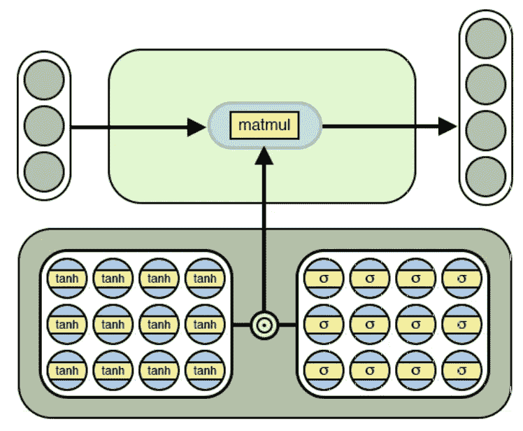
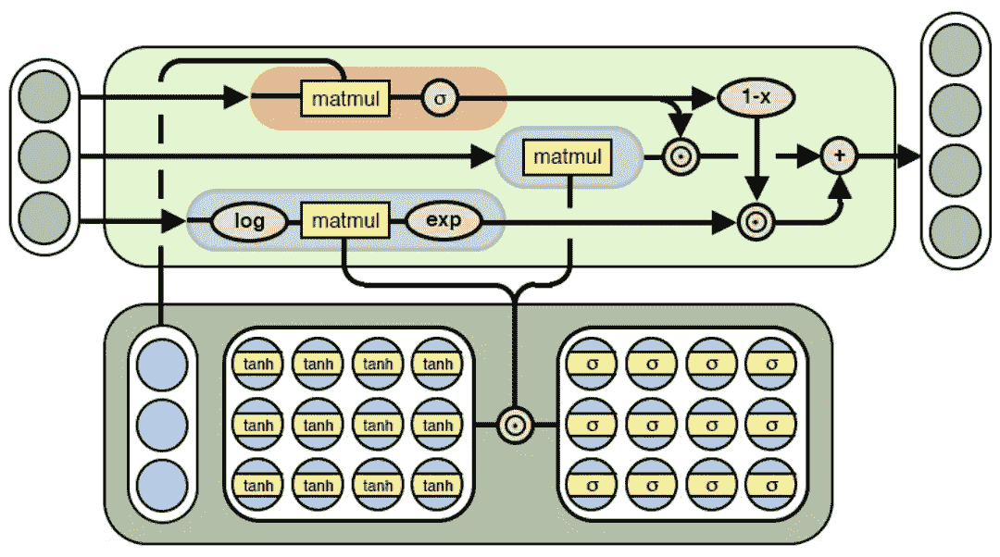

# 神经算术逻辑单元(NALU)——一个新的开始？

> 原文：<https://medium.com/analytics-vidhya/neural-arithmetic-logic-units-nalu-a-new-beginning-9b9b8a69eb32?source=collection_archive---------0----------------------->

当我很小的时候，我的分数最多只能算一般。很多人过去比我得分高，特别是在需要段落/文章类型答案的考试中。

*为什么？*

因为，我以前都是先理解底层概念，然后自己去解释。由于英语不是我的第一语言，我只能勉强解释我想说的，因此最多只能得到一般的分数。假设这是 A 型学习。

另一方面，我班上有些学生习惯于学习老师在课堂上提供的答案，而不一定理解它们。假设这是 B 型学习。

值得庆幸的是，我没有屈服于以理解主题为代价获得更高分数的冲动。因为，当考试中出现看不见的问题时——我可以回答，而其他大多数人却不能

# 这和**神经网络**有什么关系？

嗯，目前训练神经网络的方法与上面提到的 b 型学习非常相似。他们需要大量的数据来学习和工作，只有当他们看到相同的东西。

在这个训练范围之外，他们不能很好地概括。

安德鲁·特拉斯克(来自 Deepmind) *等人*最近表明[神经网络甚至不能在它们的训练集之外学习标量恒等函数](https://arxiv.org/abs/1808.00508v1)。

他们引入了两个新模型，神经累加器(NAC)和神经算术逻辑单元(NALU)。这两个模型的早期结果在附加到 CNN 和 LSTMs 时显示出更好的结果，即更多的 A 型学习。

# 什么是神经累加器(NAC)？

简而言之，NAC 是其输入的线性变换，其保持输入和输出向量的缩放一致。

NAC 是线性(仿射)层的特例，其变换矩阵 W 仅由 1、0 和 1 组成；也就是说，它的输出是输入行的加法或减法。

这可以防止图层在将输入映射到输出时更改数字表示的比例，这意味着无论有多少操作链接在一起，它们在整个模型中都是一致的

神经累加器(NAC)

# NALU 模特怎么样？它们是如何工作的？

为了鼓励更系统的数值外推，作者提出了一种将数值表示为线性激活的体系结构，该线性激活使用原始算术运算符进行操作，由学习门控制。

神经算术逻辑单元(NALU)

作者进一步称这个模块为神经算术逻辑单元(NALU)，类似于传统处理器中的算术逻辑单元(还记得 ALU 单元吗！).

# 早期结果

论文中的实验进一步表明，NALU 增强的神经网络可以学习跟踪时间，对数字图像执行算术，将数字语言翻译成实值标量，执行计算机代码，并对图像中的对象进行计数。

与传统架构相比，作者在训练期间遇到的数值范围内外都获得了实质上更好的概括，通常外推超出训练的数值范围的数量级。

更多细节可以在[https://arxiv.org/pdf/1808.00508v1.pdf](https://arxiv.org/pdf/1808.00508v1.pdf)的论文中找到

# 我的看法

这看起来是一个有趣的发展，可能会产生巨大的影响。几年后，当我们回顾当前训练神经网络的方法时，可能会觉得它们在本质上是非常初级的。

至于 NALU，只有时间和更详细的测试才能告诉我们他们是否真的属于 A 型学习——只有时间会告诉我们。

希望在接下来的几个月里看到更多这方面的行动。

参考:【https://arxiv.org/pdf/1808.00508v1.pdf 