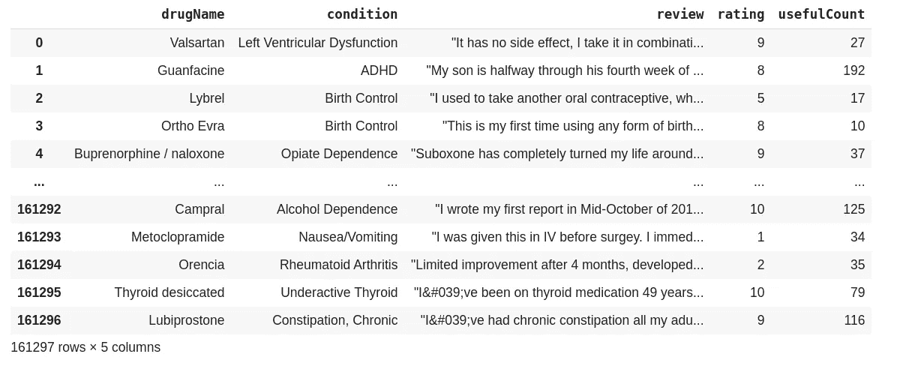
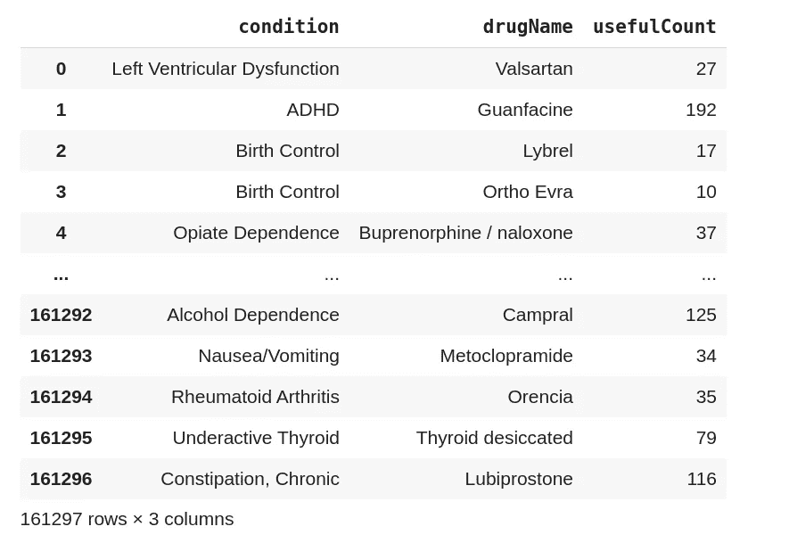
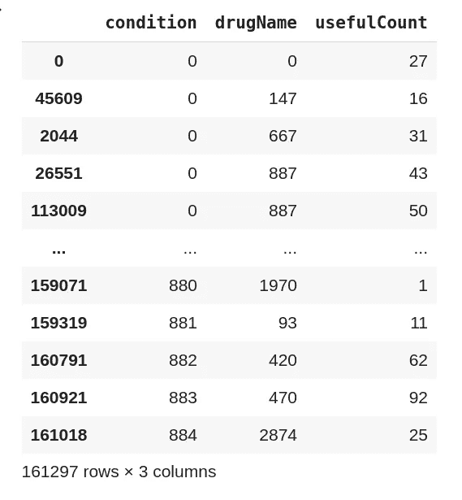
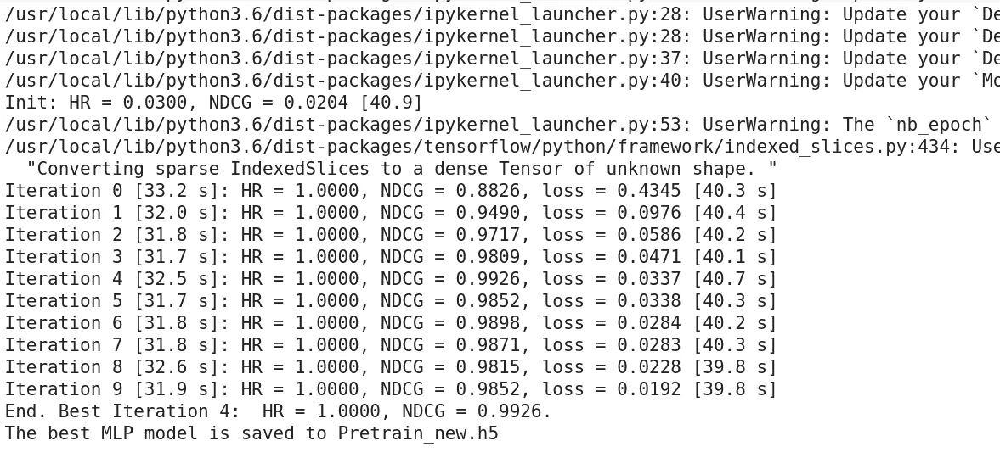
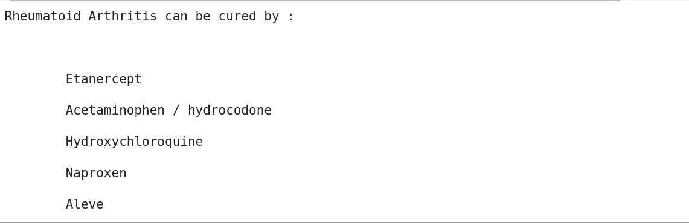

# 用于药物预测的神经协同过滤

> 原文：<https://medium.com/analytics-vidhya/neural-collaborative-filtering-for-drug-prediction-e8d0c552317b?source=collection_archive---------9----------------------->

> 用多层感知器模型预测药物

神经协同过滤研究论文[1]

机器学习可以用于人类生活的各个方面。

药物检测的思想类似于推荐系统的思想，在推荐系统中，基于某些因素将项目推荐给用户。

同样，我们可以根据某些因素推荐该药物用于治疗某些医疗状况。

为了做到这一点，我们在这里使用神经协同过滤方法来预测特定医疗条件下的药物。我们将使用在 ***研究论文【1】***中提出的多层感知器模型

我们已经做了某些**修改**来匹配当前的需求。

有了这个项目，我们将能够做到以下几点:

> 给定一种医疗状况，以建议用于治疗该医疗状况的适当药物(在此解释)
> 
> 给出一种药物，以找到该药物可以帮助的医学状况(可以通过将同一项目中的(药物，状况)改为(状况，药物)来完成)

现在我们开始吧

# 导入必要的库

> 完整的神经网络模型是基于 Keras API 开发的

# 资料组

> 了解数据集

我们使用的是 drug_com 数据集，你可以从 Kaggle [**这里**](https://www.kaggle.com/jessicali9530/kuc-hackathon-winter-2018) 下载

该数据集包括不同的药物及其在不同医疗条件下的有效性/用途。

现在，让我们分析数据集，以了解数据。

> 3436
> 
> 885

我们的数据集包含药品名称和各自的医疗状况，以及所有其他信息，如综述、评级、有用计数…

现在，我们希望发现特定药物在不同条件下的有效性(例如，预测药物在特定条件下的有效性)

这里我们可以看到，我们有 3436 种独特的药物，885 种独特的条件，以及 161297 种积极的相互作用，我们可以将所有其他相互作用(即 3436*885 - 161297)视为消极的相互作用

# 将药品名称映射到唯一 id，并将唯一 id 映射到药品名称

> 让数据准备好工作

删除字符串数据可能会很复杂，所以我们将字符串值映射到可用的整数(只需获取索引值)

我们可以使用任何一列来表示药品名称和医疗状况之间的相互作用。(即使我们现在不使用任何它的罚款)

这里我们用有用的计数作为药物和特定医疗条件之间的相互作用

绘图

由于这是一个二元分类问题，我们不考虑药物的性质(可以在下一部分完成)

我们将构建稀疏矩阵来表示药物和医疗条件之间的相互作用

为了进行测试，我们选取了 200 名用户及其积极和消极的交互(请查看参考研究论文[1]中的“负采样的对数损失”部分，以了解关于消极交互和评估过程的开始)

# 评估流程

> 药品推荐的绩效

为了评估药物推荐的性能，我们采用了留一法评估。如**所述*所指*研究论文**

**HR**→命中率

**NDCG**→归一化贴现累计收益

人力资源直观地衡量测试项目是否出现在前 5 名的列表中，NDCG 通过给排名靠前的命中项目分配较高的分数来说明命中项目的位置。我们将计算每个测试用户的两个指标，并分配平均分。

# 准备模型

> **多层预置**:(如 ***引用研究论文【1】***所述)

由于 NCF 采用两种途径来模拟药物和条件，所以通过连接它们来组合两种途径的特征是直观的。这种设计在多模态深度学习作品中被广泛采用。然而，简单的向量连接并不考虑药物和条件潜在特征之间的任何相互作用，这不足以对协同过滤效果进行建模。我们将在连接向量上添加隐藏层来解决这个问题，使用标准 MLP 来学习药物和条件潜在特征之间的相互作用。从这个意义上说，我们可以赋予模型很大程度的**灵活性和非线性。**

# 培训测试和评估:

> 培训和评估 MLP 模型

神经网络体系结构将具有 6 个隐藏层，其中一个是输入层(通过串联药物和条件嵌入形成),另一个是输出层

优化器、学习速率、批量大小、时期……都是在做了一些实验后决定的，并为这项工作选择了最佳的。

该过程包括:

1.  创建模型
2.  火车模型
3.  测试/评估模型
4.  计算 HR，NDCG
5.  检查最佳人力资源，NDCG 和保存模型
6.  对“纪元”时间重复步骤 3、4 和 5

这将保存最好的模型

宾果我们得到了一个非常好的命中率(1.00)和标准化折扣累积收益(0.99)，损失高达 0.02

尽管我们的性能很好，但现实世界中的模型预测可能没有那么高，但这仍然是一个好结果！！

现在让我们试着找出治疗风湿性关节炎的可能药物

类风湿性关节炎(RA) →一种自身免疫性疾病，可导致关节痛和全身损伤

# 结论:

> 解决模型性能问题

该模型预测了一些正确的药物，如:

*   **羟氯喹**

并且还提出了治疗类风湿性关节炎的可能药物

*   依那西普
*   对乙酰氨基酚/氢可酮
*   萘普生
*   阿列夫

虽然这些药物的作用只能由在这些领域工作的科学家来证实。

该模型的预测可能不是 10/10，但我们甚至可以通过做某些修改和大量研究来实现。

# ***修改*** :

> 让模型更好地工作

这是药物预测的基本模型

可以通过修改来学习一些更复杂的关系

*   我们可以考虑药物的特性(如蛋白质结构、在不同环境中的活性……)
*   大型数据集也有助于增加可能性的范围，并能带来更好的预测
*   使用更深的神经网络结构
*   微调超参数
*   …

在第二部分，我们将尝试创建这样一个模型，并为新冠肺炎找到可能性……:)

# 谢谢你…

**Github:**[https://Github . com/mankar 1257/Drug-Prediction-using-neural-collaborative-filtering](https://github.com/mankar1257/Drug-Prediction-using-neural-collaborative-filtering)

**卡格尔:**

https://www.kaggle.com/vaibhavmankar/kernel484ca8db6 b

# 参考资料:

[1]何湘南，廖，张汉旺，，聂，，蔡达生(2017)。神经协同过滤。澳大利亚珀斯 WWW '17 会议录，2017 年 4 月 3 日至 7 日。