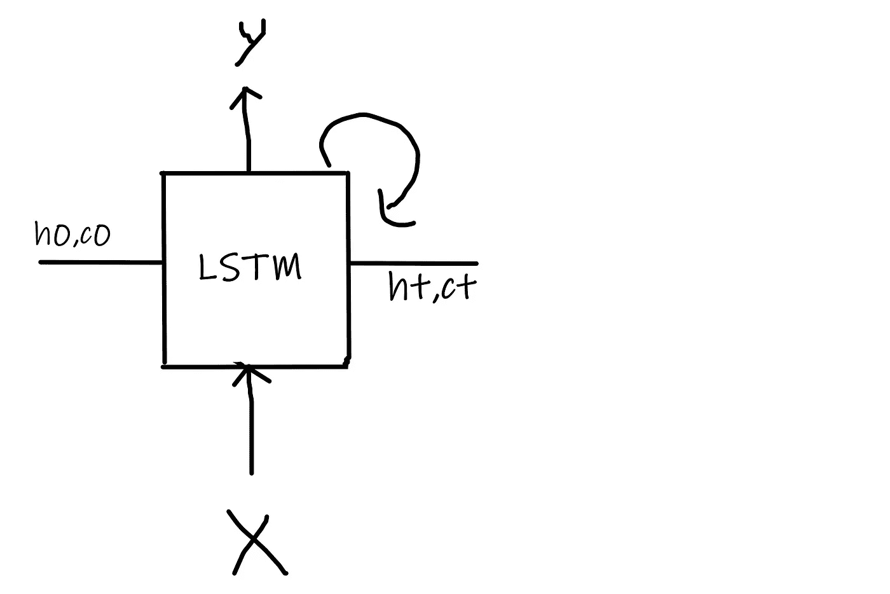
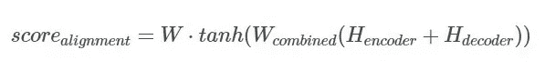

# 神经机器翻译和对注意机制的需求

> 原文：<https://medium.com/analytics-vidhya/neural-machine-translation-and-the-need-for-attention-mechanism-60f9a39da9a?source=collection_archive---------5----------------------->

# **目录:**

1-简介

双编码器架构

3 解码器架构

4-推理阶段

5-问题

6-什么是注意力？

7-实施不同类型的注意机制

8-注意力的缺点

9-参考文献

## 1.简介:

序列对序列学习(Seq2Seq)完全是关于将序列作为输入并输出序列的模型。这方面有很多例子和应用，但今天我将集中讨论一个具体的应用，即机器语言翻译。例如从英语到印地语。

有许多方法可以用来解决这个特殊的任务，但是最先进的技术是编码器-解码器方法(稍后将详细介绍)。

从技术上讲，编码器是一个 RNN 单元，它将一个序列作为输入，并将其编码为一个状态向量，然后将该状态向量与一些输入一起馈送给解码器，以预测所需的输出。

直观地说，编码器将英语序列总结成一个特殊的向量，该向量被提供给解码器以将它们翻译成等效的印地语输出。

*需要注意的一点:一般这个 RNN 单位是 LSTM 或者 gru*

所以我们最终的建筑看起来像这样。


与其在这里描述一切，不如让我们一步一步来:

## 2.编码器架构:

我会选择一个 LSTM 单位来简化生活，但在现实世界中，会使用深层 LSTM 层，这样模型就可以用新的可能的多种方式学习。

就上下文而言，LSTM 单元接受三个输入并返回三个输出。



这里 X、h0 和 c0 是输入。y、ht 和 ct 是输出。上图是 LSTM 单位的滚动版本。基本上，它一次接受一个单词/字符，并随着时间的推移而展开。下图将会清楚地说明这一点。


第一个输入是我们要翻译的序列，另外两个输入是两个向量，单元格状态和隐藏状态。

例如，让我们看看这个序列。**“这是一部好手机”。**该序列包含 5 个单词，因此我们的编码器 lstm 将以单个时间步长处理每个单词。

在上图中，x1 是输入字“This”，h0、c0 是输入状态向量，在开始时被随机初始化。它将输出三个向量 y1(输出向量)、h1 和 c1(状态向量)。

直观地，这里的 h1 和 c1 包含我们在时间步 t0 输入的‘This’单词的信息。现在，在时间步骤 t1，LSTM 将把 h1 和 c1 作为输入，序列中的下一个字**是**。向量 h3，c3 包括直到字 3 的信息，字 3 是**‘a’**。直到上一次步骤 5，我们将得到 h5 和 c5，它们包含了整个输入序列的信息。

所以现在我们的输入序列**“这是一个好手机”**被转换成向量 h5 和 c5。我们丢弃输出向量(y1 到 y5 ),因为这里不需要它们。我们只需要输出状态向量，因为它们将包含关于给定输入序列的信息。

我们现在将用这些最终的编码器状态向量 h5 和 c5 初始化我们的解码器，而不是像我们用编码器 LSTM 那样随机初始化。从逻辑上讲，这也是有意义的，因为我们希望我们的解码器不只是随机启动，而是对输入序列有所了解。

## 3.解码器架构:

解码器 LSTM 也将具有与编码器相同的架构，但具有不同的输入和输出。现在有两件事，训练阶段，和推理阶段。我们将在后面谈到推理阶段。首先，完成训练阶段。

我们有 LSTM 编码器编码的矢量。解码器的 h0 和 c0 没有被初始化为随机的，而是用我们从编码器得到的 h5 和 c5 初始化。

同样，为了使事情正常进行，我们在目标序列的开始和结束处添加 _START_ symbol 和 _END_ symbol。现在最后的序列变成了**' _ start _यहएकअच्छाफोनहै_ end _ '**


这里 X1=_Start_ 和 Y1=यह，编码器的 h0=h5，编码器的 c0=c5。这返回在下一时间步输入到解码器的状态向量 h1、c1，并输出 Y1，Y1 作为基础事实输入到解码器。这种情况一直持续到模型遇到 _END_ 符号。在最后一个时间步，我们忽略解码器的最终状态向量(h6，c6 ),因为这对我们没有用，我们只需要输出 Y。

这种技术也被称为**“老师强迫”。**更多关于这个[这里](https://machinelearningmastery.com/teacher-forcing-for-recurrent-neural-networks/)。

整个训练架构(编码器+解码器)可以总结在下图中:


给定最终架构，我们现在可以预测每个时间步长的输出，然后将误差通过时间反向传播，以便更新整个网络的参数，然后计算我们的训练损失。

## 4.推理阶段:

应用经过训练的模型来生成翻译的任务被称为**推理**，或者更常见的是在机器翻译中解码序列。

我们有一个训练好的模型，现在我们可以根据给定的输入序列生成预测。这一步基本上被称为推理。你可以称之为测试阶段，而上述步骤是培训阶段。在这一步，我们只有学习的权重和要解码的输入序列。

为训练定义的模型已经学习了该操作的权重，但是该模型的结构没有被设计为被递归调用以一次生成一个单词。为此，我们需要设计新的模型来测试我们训练好的模型。有许多方法来执行解码。

推理阶段包含两个不同的编码器-解码器模型，它们将作为独立的模型用于各自的目的。

编码器模型很简单，因为它从训练模型中的编码器获取输入层，并输出隐藏和单元状态张量。


[https://machine learning mastery . com/define-encoder-decoder-sequence-sequence-model-neural-machine-translation-keras/](https://machinelearningmastery.com/define-encoder-decoder-sequence-sequence-model-neural-machine-translation-keras/)

解码器模型更复杂。它需要三个输入，来自编码器的隐藏和单元状态作为新定义的编码器模型的初始状态，以及到目前为止编码的翻译输出。对于每个单词，它都将被调用，也就是说，我们必须在一个循环中进行调用，一旦看到 _END_ 符号，循环就会结束。


[https://machinelingmastery . com/define-encoder-decoder-sequence-sequence-model-neural-machine-translation-keras/](https://machinelearningmastery.com/define-encoder-decoder-sequence-sequence-model-neural-machine-translation-keras/)

我们将使用这个推理模型最终将序列从一种语言翻译成另一种语言。

## 5.问题是:

**【关注】**是深度学习社区最近的趋势之一。Ilya Sutskever 是上述 seq2seq 机器翻译架构背后的人，他提到“注意力机制”是上述编码器-解码器方法中最令人兴奋的进步之一，并且它们将一直存在。但是这种方法背后的问题是什么，注意力解决了什么？

为了理解注意力能为我们做什么，让我们回顾一下上面同样的机器翻译问题。我们想把“这是一部好手机”这句话翻译给'यह एक अच्छा फोन है'.记得我们用 LSTM 编码器将英语句子映射成最终状态向量。让我们直观地看看:


图 8

我们可以看到，向量 h5，c5 必须编码我们需要知道的关于源句子的一切。它必须完全抓住它的意义。

但是有一个条件。

它基本上抓住了整个句子的意思，但这是在句子不长的时候。例如，我们采用的句子只有 5 个单词长，正常的编码器会公正地对待它，但当句子有 50 或 100 个单词长时，这个单一的最终向量将无法映射整个序列。这么看，如果句子长 100 个单词，那么源句的第一个单词很可能与目标句的第一个单词高度相关。但这意味着解码器必须考虑 100 步前的信息，并且这些信息需要以某种方式编码到矢量中。RNN 有长期依赖的老问题。理论上，像 LSTM 这样的架构应该能够处理这个问题，但是在实践中，长期依赖仍然是个问题。有一些方法可以让事情变得更好，但它们不是原则性的解决方案。

*这就是“注意力”的来源。*

## **6。什么是关注:**

注意力是对前面方法的一点修改。我们不再试图将完整的源句子编码成最终的固定长度向量。相反，我们共同利用所有中间或局部向量信息，以便在解码目标句子时决定下一个序列。

例如，在图 8 中，我们将使用所有的 h 和 c，而不是只使用 h5 和 c5。所以现在，如果我们的解码器想要将“This”解码成'यह'，它可以直接访问第一状态向量 h1，c1。这种想法被认为是给予当前单词更多的注意力，因此得名“注意力”。直觉上，你可以认为解码器在产生第一个印地语单词时会注意第一个英语单词，等等。

## 自定义 Keras 层的实现:

为了实现我们自己的注意力机制，我们需要编写[自定义 Keras 层](https://keras.io/layers/writing-your-own-keras-layers/)。

要在 Keras 中实现它，我们只需要编写三个简单的方法。

*   这是你定义体重的地方。这个方法必须在末尾设置`self.built = True`，这可以通过调用`super([Layer], self).build()`来实现。
*   `***call(x)***`:这是层的逻辑所在。
*   `***compute_output_shape(input_shape)***`:如果你的层修改了它的输入的形状，你应该在这里指定形状转换逻辑。

## 7.实施不同类型的注意机制:

以上解释是顶层观点。我们需要深入挖掘才能完全理解它。自 2015 年以来，注意力成为解决 NLP 问题的一个非常流行的概念和工具。近年来，许多进步和修改发生在简单的注意机制之上，导致不同类型的模型。尽管所有不同类型的注意力的基本原理是相同的，但它们的差异主要在于它们的结构和计算。下面我将讨论一些流行的方法，以及它们在 Keras 中的实现。为了简单起见，我们可以用 GRU 单位代替 LSTM，因为 GRU 只包含一个隐藏态，而 LSTM 包含两个隐藏态。

**7.1-关注由**[巴丹瑙 T6:](https://arxiv.org/pdf/1409.0473.pdf)

现在我们有了所有编码的状态向量(h1)到(h5)。注意层将把这些编码向量和解码器在先前时间步长的内部状态作为输入。为了预测第一个字本身，解码器没有任何当前的内部状态。为此，我们将编码器的最后状态(即 h5)视为先前的解码器状态。使用这些向量，将计算对齐分数，该分数随后将用于计算注意力权重。这将在下面详细讨论:

给定上下文向量 c 和先前预测的输出，解码器被训练来预测时间步长 t 的输出 y。


这里 y 是先前预测的输出，c 是上下文向量。换句话说，我们可以说，解码器正在试图找到上述条件概率。条件概率部分可以建模为:


其中 g 是一个非线性的、潜在的多层函数，它输出“yt”的概率，而“st”是 GRU/LSTM 的解码器隐藏状态，计算如下:


这里你可以看到，概率取决于不同的向量 c，它是每个目标单词的上下文向量。上下文向量 ci 取决于编码器将输入句子映射到的编码器输出序列(h1，h2，…hTx)。

然后，上下文向量 ci 被计算为这些状态向量的加权和。


如果我们展开上面的五个单词的例子的公式，我们将得到:

> *context _ vector =(*α*1 * h1+*α*2 * H2+*α*3 * H3+*α*4 * H4+*α*5 * H5)*


是一个对齐模型，它对位置 j 周围的输入和位置 I 处的输出的匹配程度进行评分。分数基于解码器 GRU/LSTM 隐藏状态 si1 和输入句子的第 j 个输出 hj。这里的“a”是一个简单的前馈神经网络，它与所提出的系统的所有其他组件一起被联合训练。这些比对模型 eij 也被称为能量分数。

为了计算 energy _ score/allignment _ score t[,论文](https://arxiv.org/pdf/1409.0473.pdf)引入了三个权重矩阵 W_combined、W_decoder、W_encoder。下面的公式将使它变得清楚。


让我们在 AttentionLayer 类的 build 函数中定义这些权重。

我们已经定义了计算 alignment_score 所需的权重。现在让我们来定义这个类的调用函数，代码的实际计算和逻辑将驻留在这个类中。

关注层最终会返回 allignment_score 和关注权重。然后，权重将用于计算最终的上下文向量。

```
context_vector = attention_wts * enc_output_seq
```

我们最后的注意力层类定义如下:

**2 -关注由**[梁](https://arxiv.org/abs/1508.04025) **:**

这一机制是 Thang Luong 在 Bahdanau 机制之后于 2015 年推出的。它建立在以前的机制之上，有一些不同之处。

1.  计算校准分数的方式。
2.  解码器中引入注意机制的位置。

在 Bahdnau 注意力中，注意力层将前一时间步的编码输入向量和解码器隐藏向量作为输入。然后使用它计算上下文向量。使用该上下文向量预测输出。但是在 Luong 的注意中，上下文向量仅在 RNN/LSTM 产生该时间步长的输出之后才被使用。在解码器级，先前的解码器隐藏状态和解码器输出通过**解码器 RNN** 传递，以生成该时间步长的**新隐藏状态**。使用新的解码器隐藏状态和编码器隐藏状态，计算**对齐分数**。

与只有一种类型的 Bahdanau 的方法相比，共有三种类型的方法来计算比对分数。这些类型是:

## 圆点:

在这个函数中，我们只需要解码器的隐藏状态和编码器的隐藏状态来计算对齐分数。


## 常规:

这类似于点函数，除了在点函数之后有一个权重矩阵。


## 连接:

该函数以下列方式计算分数。



这里 H_decoder 是通过传递先前的隐藏状态和解码器输出而生成的新的隐藏状态。

下面是实施 Luong 注意事项:

**8。注意力的缺点:**

如上一段所述，它为每个单词计算 context_vector，这是有计算成本的。序列越长，训练的时间就越长。同样，如果你看到人类的注意力是为了节省计算资源。专注于一件事，我们可能会忽略许多其他事情。但这并不是我们在上面的模型中所做的。在决定关注什么之前，我们本质上是在关注每件事情的细节。从直觉上来说，这相当于输出一个翻译的单词，然后回过头来检查文本的所有内存，以决定下一个单词是哪个。这似乎是一种浪费，根本不是人类正在做的事情。事实上，它更类似于内存访问，而不是注意力，在我看来这有点用词不当。尽管如此，这并没有阻止注意力机制变得非常流行，并在许多任务中表现出色。

## 9.参考资料:

1-[https://machine learning mastery . com/define-encoder-decoder-sequence-sequence-model-neural-machine-translation-keras/](https://machinelearningmastery.com/define-encoder-decoder-sequence-sequence-model-neural-machine-translation-keras/)

https://github.com/tensorflow/nmt2-

3-[https://www . tensor flow . org/tutorials/text/NMT _ with _ attention](https://www.tensorflow.org/tutorials/text/nmt_with_attention)

4-[https://machine learning mastery . com/encoder-decoder-recurrent-neural-network-models-neural-machine-translation/](https://machinelearningmastery.com/encoder-decoder-recurrent-neural-network-models-neural-machine-translation/)