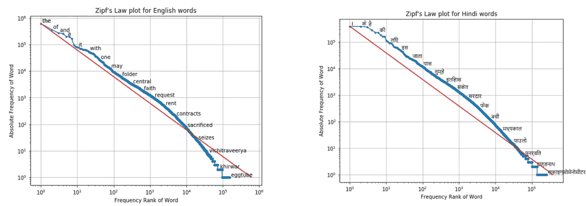
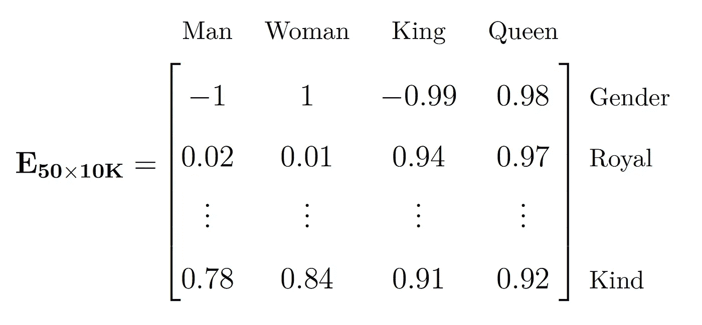
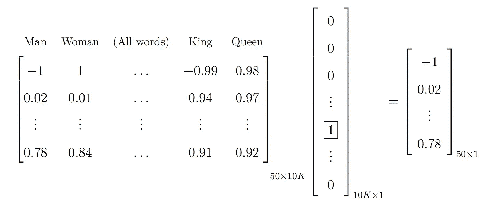
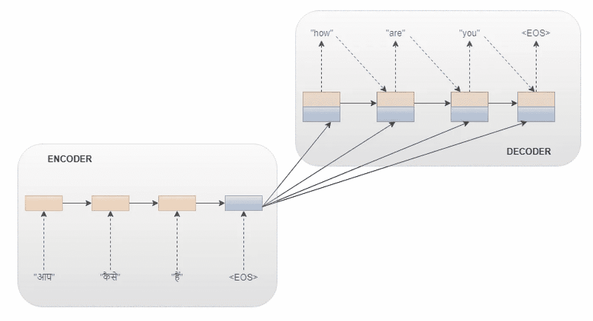
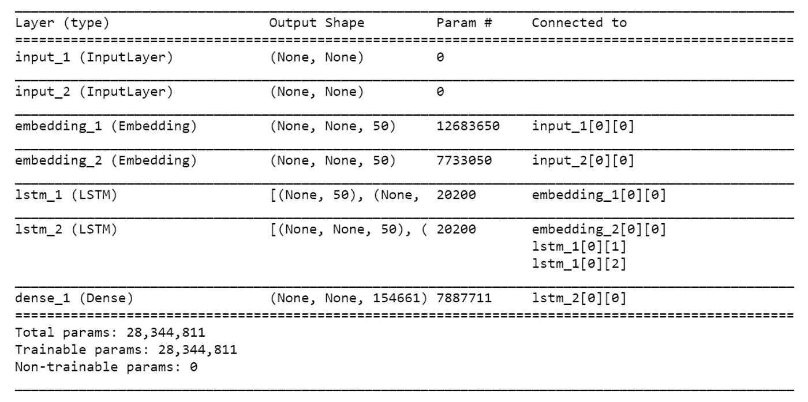
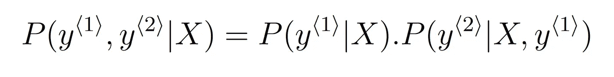
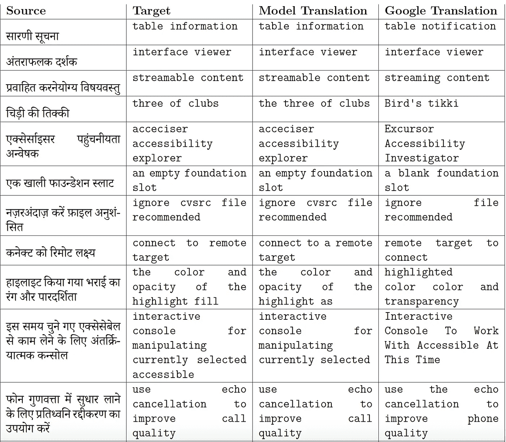
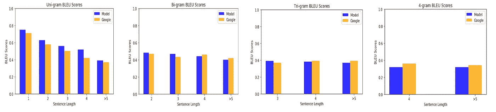

# 印地语-英语的神经机器翻译:序列到序列学习

> 原文：<https://medium.com/analytics-vidhya/neural-machine-translation-for-hindi-english-sequence-to-sequence-learning-1298655e334a?source=collection_archive---------1----------------------->


图片鸣谢:[https://www . be translated . com/blog/how-good-is-Google-translate/](https://www.betranslated.com/blog/how-good-is-google-translate/)

你好，机器学习者！去年夏天，我在一个机器翻译项目上有一次惊人的经历。我认为这将是一个伟大的想法，与任何人分享，谁是这个领域的新手，像我一样奋斗，一年前，也与人谁做了类似的研究。本文阐述了使用序列到序列学习方法，利用 LSTMs(长短期记忆)构建基本神经机器翻译(NMT)模型的各个方面。虽然有许多关于 NMT 的论文和博客，但这是强调一些直观功能的另一种尝试，也是执行类似 NLP 任务的一步一步的指南。在本文中，我试图在技术和非技术细节之间保持平衡。希望有帮助。所以让我们开始吧！

我们将关注 NMT 的以下方面:

1.  语料库——预处理
2.  准备培训数据
3.  单词嵌入
4.  序列对序列学习
5.  预测:波束搜索
6.  结果:BLEU 评分

> 注意:为了理解翻译步骤，我强烈建议查看 LSTMs 上这个令人惊叹的[博客](http://colah.github.io/posts/2015-08-Understanding-LSTMs/)。

# 第一部分:语料库——预处理

构建该翻译模型选择的语言为*印地语*和英语，平行语料库从 [*IIT 孟买印地语-英语平行语料库*](http://www.cfilt.iitb.ac.in/iitb_parallel/) 中获得。这是一个印地语-英语平行语料库，包含 1492827 对句子。为了了解两种语言中的单词分布，下面分别展示了 [***齐夫定律***](https://www.ncbi.nlm.nih.gov/pmc/articles/PMC4176592/)*的情节:*

**

*齐夫词频定律*

*除了处理两种语言和语义不同的语言的挑战之外，还需要其他预处理任务，例如:*

1.  *处理句子长度**异常值**(一些句子被组合在一起，导致整个序列长度为 2000，这在语法上是不符合逻辑的！去掉这些总是更好，特别是在这种情况下，有 4 个这样的句子。)*
2.  *基本文本**清理**:文件中的错误数据(引用其他语言)、版权声明和电子邮件地址(无需翻译)、标点符号、数字、转换为小写字母等..*
3.  *将“START_”和“_END”添加到目标句子中(英语)。我们将在后面的章节中看到这样做的原因。*

*预处理消耗了你大部分的时间，尤其是。从数据科学的角度来看，你可能需要对数据进行详细的研究，例如发现平均句子长度、异常值、词频的 Zipf 定律等..这种分析提供了更好的见解，有助于做出更好的决策。例如，我发现两种语言的平均句子长度分别是 14 和 15，这让我考虑长度不超过 30 的句子。在继续设计模型之前，您可能需要做出许多类似的决定。这就是为什么我建议对数据预处理阶段给予足够的重视。*

# *第二部分:准备培训数据*

*我们仍然有文本格式的数据。我们需要让它为训练我们的模型做好机器准备。因此，在模型设计之前，我们将执行**标记化**和**索引**(您可以使用 [NLTK](https://www.nltk.org/_modules/nltk/tokenize.html) 标记化器或其他可从 [*IndicNLP*](https://indic-nlp-library.readthedocs.io/en/latest/) 库中获得的工具。我选择手动操作。)对于标记化，我们会找出两种语言中所有的独特词。这将决定索引数组的维数。现在，创建 3 个 [numpy](https://docs.scipy.org/doc/numpy/reference/generated/numpy.array.html) 数组，一个用于编码器输入，一个用于解码器输入，一个用于解码器目标。我们将用它来索引每个单词。*

*在上面的步骤中，维度 30 和 32 是因为我们已经决定的最大句子长度。编码器为 30(印地语)，解码器为 32(英语)。解码器限制为 32，因为“START_”和“_END”被附加到目标句子(在本例中为英语)的开头和结尾，所以解码器具有停止条件，该条件要么是遇到“_END ”,要么是达到最大字数限制。此外，使用“START_”是因为解码器输出将超前一个时间步长。*

*这一步听起来很复杂，但我们所做的是，打破句子，并为每个独特的单词分配一个整数，主要是创建一个字典。下面的例子可以帮助解释这一点:*

```
*Sentence:       This is my homeTokenization:   ['This','is','my','home']Indexing:       This -> 1
                is -> 2
                my -> 3
                home -> 4*
```

> ***注意:**下一节只针对有兴趣了解单词如何嵌入特征向量的人。如果你很清楚这一点，请跳到第四部分。*

# *第三部分:词语嵌入*

*这是我最喜欢的部分！为了在文本数据上训练我们的模型，我们需要为每个单词建立一个**特征化的**表示，也称为单词**嵌入**。这个想法是学习一组特征和它们的值，这样我们就有了单词的密集向量表示。*

*解释单词嵌入最常见的例子是“*男人-女人-国王-王后*”的例子。如果我们有一个 10000 的词汇量，并且这些词在语料库中的位置是:*【男人-5545，女人-9678，国王-4426，王后-7523】*。我们首先为这些单词创建 [*个独热编码向量*](/@michaeldelsole/what-is-one-hot-encoding-and-how-to-do-it-f0ae272f1179) 。如果‘man’在大小为 10，000 的词汇表中位于位置 5545，则‘man’的独热向量是 0 的 10，000 维向量，只有一个条目为‘1’，即位于位置 5545，表示为 *O₅₅₄₅* 。现在，如果我们通过一些特征来定义这些单词，比如说 50 个，我们可以为语料库中的每个单词定义所有 50 个特征的值的矩阵。“嵌入矩阵”的非正式表示如下:*

**

*这个矩阵是随机初始化的。“性别”、“皇家”和“亲切”是 50 个特征中的 3 个。因此，这个矩阵中的每个单词都是一个 50 维向量。例如，如果男性性别被认为是-1，女性被认为是 1 ( *在这个例子中只是为了区分，这是一个完全无偏的随机假设*)，在嵌入矩阵中，单词‘Man’对于‘Gender’特征的值是-1，而‘King’对于同一特征的值是-0.99。这表明“男人”和“国王”在性别上非常相似。因此，当这些单词向量将被放置在 50 维向量空间中时，如果所有其他特征也相似，则向量之间很可能有更大的*余弦相似度*。现在，为了找到‘man’的单词嵌入，将嵌入矩阵(e)乘以‘man’的独热编码向量( *O₅₅₄₅* ):*

**

*结果是‘人’的 50 维向量表示。这被称为“人”这个词的“嵌入”。同样，这个语料库中的所有单词都表示为 50 维向量。一些比较知名的预训练单词嵌入有[*word 2 vec*](https://radimrehurek.com/gensim/models/word2vec.html)[*Glove*](https://nlp.stanford.edu/projects/glove/)[*fast text*](https://fasttext.cc/)。我选择不使用这些(没有原因，只是想试验和探索手动训练方法)。*

*Keras 提供了一种与上面提到的略有不同的方法。在预定义的类别'*'嵌入'*中，keras 从嵌入矩阵(E)中仅取出对应于输入单词的列，并直接产生该列作为单词嵌入。这避免了大矩阵 E(在词汇大小很大的情况下)和独热码编码向量的相乘。每个输入整数都被视为从嵌入矩阵中挑选相关列的索引。这使得嵌入过程更快。我个人选择使用这种方法，你总是可以省去这个麻烦，并且使用预先训练的嵌入来获得更好的结果。*

# *第四部分:序列到序列学习*

> *注意:在继续之前，可能值得看一看 Keras 的这个[博客](https://blog.keras.io/a-ten-minute-introduction-to-sequence-to-sequence-learning-in-keras.html)，关于序列到序列的学习。当他们做基于字符的嵌入时，我使用了基于单词的方法。*

*当要在读取整个序列后预测输出时，使用序列到序列模型。基本的序列到序列模型具有编码器-解码器架构。该模型有两个 LSTMs，编码器和解码器各一个。序列对序列模型的一般工作方式概述如下:*

1.  *将源序列(印地语)的嵌入向量一次一个字地输入编码器网络。*
2.  **将*输入的句子编码成固定维的状态向量。在这一步，我们从编码器 LSTM 获得*隐藏的*和*单元状态*，并将其馈送给解码器 LSTM。*
3.  *这些状态被解码器视为*初始状态*。此外，它还有目标词(英语)的嵌入向量。*
4.  **解码*输出翻译的句子，一次一个字。在该步骤中，解码器的输出被发送到整个目标词汇上的 *softmax* 层。*

**

*编码器-解码器结构，改编自 **towardsdatascience** 博客上的 Sequence to sequence，最初灵感来自 [Cho 等人](https://arxiv.org/pdf/1406.1078.pdf)*

***编码器 LSTM:** 在结构上，LSTM 层位于*嵌入*层之后，因此将嵌入向量作为输入。这里需要注意的重要一点是，输入序列的长度不同。因此，为了保持输入的恒定长度，计算句子的最大长度(这里是 30)，并相应地选择输入矩阵的维数。编码器 LSTM 处理输入序列并返回内部状态。在这个阶段，输入序列被映射到固定维度的状态向量，该状态向量被进一步馈送到解码器 LSTM 作为其初始状态。*

***解码器 LSTM:** 解码器 LSTM 将编码器映射的状态向量作为输入，然后训练它输出翻译，一次一个单词。这个 LSTM 预测目标序列的下一个单词，给定序列中先前翻译的单词。它基本上使用来自编码器的状态向量作为初始状态，产生未来偏移一个时间步长的目标序列。这种学习方法也被称为 [*师逼迫*](https://blog.keras.io/a-ten-minute-introduction-to-sequence-to-sequence-learning-in-keras.html) 法。*

***模型:**解码器 LSTM 的输入通过嵌入层，在这里为英语单词创建单词嵌入。为编码器和解码器网络选择的嵌入维数都是 50。这意味着我们指定了源词汇表和目标词汇表中每个单词的特征数量。LSTM()调用的第一个参数是单位数，即输出空间的维数。在这种情况下，单元数选择为 50(与嵌入大小相同)。每个概率分布使用目标词汇表上的 *softmax* 来表示。LSTM 输出使用密集连接的网络层*密集*包装。最后，模型摘要如下所示:*

**

*模型摘要*

***训练:**模型是在 GPU 上训练的，原本有 100 万个句子对。像这样的大数据集，用通常的 *model.fit()* ，我亲身经历了几次内存耗尽错误，即使是在 GPU 机器上。我建议看看 Keras [***生成器***](https://keras.io/models/sequential/) (fit_generator)或者其他框架中的等效方法。*

> *对于 100 万个句子对，我只训练了我的模型 10 个纪元！:)*

*使用的训练参数的详细说明可以在 my [Github](https://github.com/richaranjan23/My_Projects/tree/master/MSc_dissertation) 的文档中找到。敬请期待“ *final_thesis.pdf* ”。*

# *第五节:预测—波束搜索*

*现在模型训练好了，我们来做一些预测吧！理想情况下，给定一个输入的印地语句子，该模型估计不同的对应英语翻译的概率，即 *P(Y | X)其中(Y = y⟨1⟩，y⟨2⟩，…。*)y⟨tʸ⟩。为了挑选最可能的翻译，如果从该分布中随机地对输出进行采样，对于最初的几次，可以获得好的翻译。但是随着越来越多的采样，翻译准确度可能会变差。所以，为了最大化条件概率:*

**

*使用*波束搜索*算法。该算法的目的是“限制源语言和目标语言之间可能的单词排序，以便进行有效的搜索”。基本的从左到右波束搜索以如下方式工作:*

1.  *如果我们选择波束宽度= B = 3，在第一步中，仅给定输入 x，即*【p(y‹₁›|x】*，模型评估第一个单词的概率。在这一步中，输入的印地语句子通过编码器 LSTM，解码器 LSTM 的第一步将是一个覆盖英语词汇中所有可能性的 *softmax* 输出。现在，对于第一个单词，在所有可能的翻译中，选出了前三个。该算法为接下来的步骤存储这三个选择。*
2.  *在该步骤中，对于所挑选的三个选项中的每一个，估计下一个选择，即 *P(y‹₂›|X，y‹₁›)* 。网络硬连线第一个单词 *y‹₁›* 。在这一步之后，我们将条件概率计算为:*

**

*3.同样，在第三步中，网络片段将硬连接前面步骤中计算的前两个字。而如果 B > 3，则模型遵循相同的过程输出它去的最可能的句子，直到遇到 *< EOS >* 或者达到最大字数限制。*

*我使用的波束宽度为 2。这是我的光束搜索功能的样子:*

*实现波束搜索的完整代码可以在[这里](https://github.com/richaranjan23/My_Projects/blob/master/MSc_dissertation/NMT_final_code/predictions/pred_with_beam.py)找到。下面给出了一个使用波束搜索显示预测的例子:*

> **来源:कालबैक फोन**
> 
> **目标:回拨电话**
> 
> **带贪婪搜索的翻译:回拨电话**
> 
> **翻译用波束搜索(B=2): [('回拨电话'，0.195772)，('电话对比'，0.003202)]**

*波束搜索的优点是显示预测的前两个概率，然后验证转换是否有意义。*

> *注意:一旦你有了一个训练好的模型，你就可以进行预测，不管有没有波束搜索。我试图在本[笔记本](https://github.com/richaranjan23/My_Projects/blob/master/MSc_dissertation/NMT_final_code/hindi_eng_seq2seq_word_1M-BEAM-transfer_learning.ipynb)中记录这两种方法的基本步骤。*

# *第六部分:结果——BLEU 分数*

*下面显示了通过该模型获得的一些示例翻译，以及相应的 Google 翻译输出:*

**

*模型翻译与谷歌翻译输出的比较*

*通过 BLEU 分数计算来评估整体模型性能。在 **4 克**精密系统上，发现最佳训练和测试 BLEU 分数分别为 **0.33** 和 **0.30** 。*

*我很想对这些数据进行一些抽样调查。我对大约 25 个句子进行了分析，并与谷歌翻译的结果进行了比较。该模型在 n-gram 精度系统中获得的 BLEU 分数与 Google 的分数相当！(当然，我们必须考虑这样一个事实，即谷歌可以访问这两种语言的巨大语料库，而在我的情况下，我只在 100 万个句子对上训练了我的模型)。BLEU 分数比较总结如下:*

**

*模型翻译和谷歌翻译结果之间的 n-gram BLEU 分数比较*

*我确实意识到这需要大量的阅读，但我认为这个项目是一次重要的学习经历，我希望我的发现也能帮助你。完整的代码和文档可以在[这里](https://github.com/richaranjan23/My_Projects/tree/master/MSc_dissertation)找到。请随时提供反馈和改进建议。*

> *注意:如果你看一下我的实现，请注意大多数文件会有两个版本，“有和没有波束搜索”。谁不想一步一步来呢？:)祝你阅读愉快，如果你喜欢，请鼓掌！:)*