# 使用 Bahdanau 注意机制的神经机器翻译

> 原文：<https://medium.com/analytics-vidhya/neural-machine-translation-using-bahdanau-attention-mechanism-d496c9be30c3?source=collection_archive---------0----------------------->

# 目录

1.  介绍
2.  神经机器翻译
3.  NMT 使用 Seq2Seq 模型时没有注意
4.  注意机制
5.  巴赫达瑙注意机制
6.  结果
7.  参考


来源- [页面](https://www.google.com/search?q=machine+translation&tbm=isch&sxsrf=ALeKk00cIM7hcz3bU25VVJT94fQccxFYPg:1587228333785&source=lnms&sa=X&ved=0ahUKEwigxoyotvLoAhWk7nMBHSV4DtoQ_AUIECgD&biw=1536&bih=754&dpr=1.25#imgrc=My1KhSBjNzxv9M&imgdii=5jybvdZEugIQxM)

# 介绍

机器翻译概念的起源可以追溯到 20 世纪 30 年代，当时 Peter Troyanskii 提出了第一台用于从一种语言翻译到另一种语言时选择和打印单词的机器。从那以后，机器翻译领域有了很多发展。从自动将 60 个俄语句子翻译成英语的 IBM 701 计算机到可以将几乎任何句子翻译成任何语言的 Google Translate，我们走过了漫长的道路。下面是 1950 年到 2015 年机器翻译从基于规则的机器翻译到神经机器翻译的演变图。

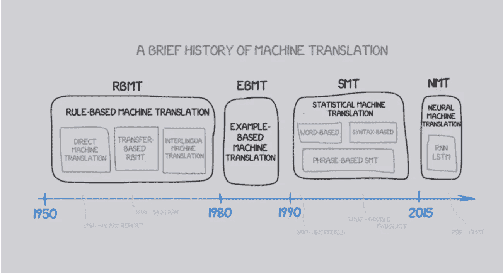

来源— [页面](https://www.freecodecamp.org/news/a-history-of-machine-translation-from-the-cold-war-to-deep-learning-f1d335ce8b5/)

# 神经机器翻译(NMT)

神经机器翻译是最近提出的机器翻译方法。与传统的统计机器翻译不同，神经机器翻译旨在建立一个单一的神经网络，可以联合调整以最大限度地提高翻译性能。最近提出的神经机器翻译模型通常属于编码器-解码器家族，并将源句子编码为固定长度的向量，解码器从该向量生成翻译。

# NMT 利用序列对序列模型不加注意

具有递归神经网络的编码器-解码器结构成为神经机器翻译(NMT)的有效方法。该方法的主要优点是能够直接在源和目标句子上训练单个端到端模型，并且能够处理可变长度的文本输入和输出序列。

下图是基于 RNN 的编码器-解码器架构的 NMT。

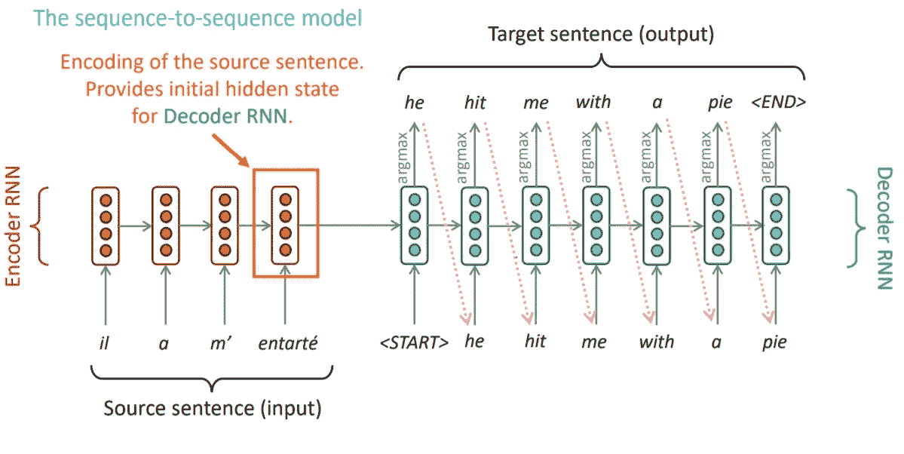

编码器-解码器架构来源- [页面](https://web.stanford.edu/class/archive/cs/cs224n/cs224n.1162/)

## 编码器

编码器从源语言中读取输入的句子，并将这些信息编码到称为隐藏状态的向量中。我们只取最后一个 RNN 的隐藏状态，并丢弃编码器输出。

## 解码器

解码器将最后一个编码器 RNN 单元的隐藏状态作为其第一个 RNN 单元的初始状态，并将<start>标记作为初始输入，以产生输出序列。我们使用教师强制来更快更有效地训练解码器。教师强制是一种快速有效地训练递归神经网络模型的方法，该模型使用来自先前时间步骤的基础事实作为输入。在这种方法中，给出正确的答案作为训练的开始，这样模型将快速有效地进行训练。</start>

你可以从这个[博客](https://towardsdatascience.com/word-level-english-to-marathi-neural-machine-translation-using-seq2seq-encoder-decoder-lstm-model-1a913f2dc4a7)中读到这个模型的详细解释。对于 LSTM 和 GRU 等 RNN 变体，我建议查看[了解 LSTM 网络](http://colah.github.io/posts/2015-08-Understanding-LSTMs/)和[了解 GRU 网络](https://towardsdatascience.com/understanding-gru-networks-2ef37df6c9be)

## 这种模式有什么问题？


Seq2Seq 模型的缺点来源— [页面](https://machinetalk.org/2019/03/29/neural-machine-translation-with-attention-mechanism/)

来自编码器的信息将变得越来越不相关，因为编码器的状态仅被传递到解码器的第一个 RNN 单元。在这个模型中，输出序列很大程度上取决于编码器最后一个 RNN 单元的隐藏状态。这使得模型很难处理长序列。所以，这个系统的明显缺陷是它不能记住更长的序列。输出序列严重依赖于编码器最终输出中隐藏状态定义的上下文，使得模型处理长句具有挑战性。

# 注意机制

英语单词“Attention”的意思是注意到某人或某事；认为某人或某事令人兴奋或重要。注意机制是基于这一确切的概念，即在预测序列模型的输出时，将注意力集中在重要的因素上。

现在，让我们来看看这个帖子。


来源- [页面](https://imgflip.com/tag/you+read+that+wrong)

我们大多数人(不包括一些聪明的人)在生活中的某个时候都曾被这种迷因所迷惑。这种模因基于一个简单的心理学事实，即当人们阅读一个句子时，我们一起而不是单独地解释单词和句子，也就是说，我们不是顺序阅读，而是在阅读时一起关注两个或更多的单词。([来源](https://towardsdatascience.com/the-fall-of-rnn-lstm-2d1594c74ce0))

在无注意的序列模型中，我们顺序地处理和预测句子。然而，在 NMT，从一种语言到另一种语言的单词预测可能依赖于句子中该特定单词之前或之后的单词，这是可能的并且是非常可能的。

下图显示了单词的预测如何依赖于句子中的两个或多个单词。在下面的 gif 中，细的链接对单词预测的贡献较低，而粗的链接的贡献较高。我们可以观察到，目标序列中的大部分预测单词都依赖于源序列中相应单词前后的单词。

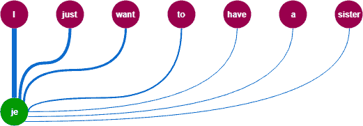

注意机制(来源— [页面](https://machinetalk.org/2019/03/29/neural-machine-translation-with-attention-mechanism/)

所以，我想我们现在明白了为什么我们需要关注。

现在，让我们来理解 Bahdanau 注意机制。

我们将同时实现每一步的代码。你可以从这个[链接](http://www.manythings.org/anki/ita-eng.zip)下载数据集。该数据集包含意大利语-英语翻译的 336614 个数据点。

数据准备可参考此[页面](https://www.tensorflow.org/tutorials/text/nmt_with_attention#translate)。

# 巴赫达瑙注意机制

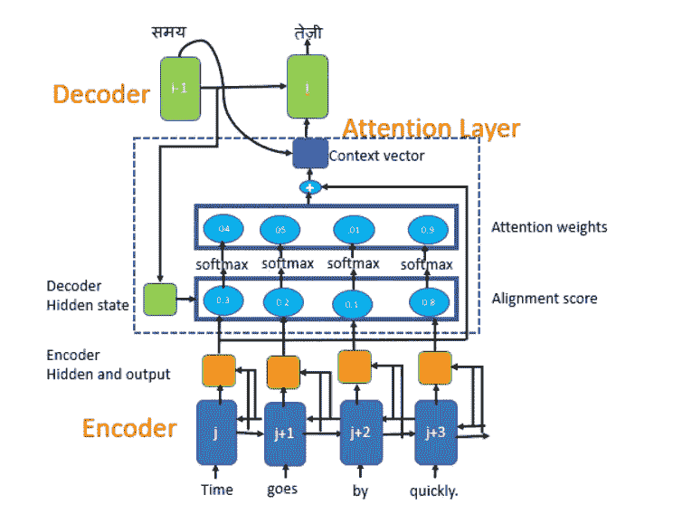

Bahdanau 注意机制(来源- [页面](https://towardsdatascience.com/sequence-2-sequence-model-with-attention-mechanism-9e9ca2a613a)

Bahdanau 注意力也被称为附加注意力，因为它执行编码器状态和解码器状态的线性组合。现在，让我们来理解巴赫达瑙提出的机制。

## 伪代码:

```
Notations:**FC** = Fully connected (dense) layer,**EO** = Encoder output,**H** = hidden state,**X** = input to the decoder.*** score = FC(tanh(FC(EO) + FC(H)))***** attention weights = softmax(score, axis = 1)**. Softmax by default is applied on the last axis but here we want to apply it on the *1st axis*, since the shape of score is *(batch_size, max_length, hidden_size)*. Max_length is the length of our input. Since we are trying to assign a weight to each input, softmax should be applied on that axis.*** context vector = sum(attention weights * EO, axis = 1)**. Same reason as above for choosing axis as 1.*** embedding output** **= The input to the decoder** X is passed through an embedding layer.*** merged vector = concat(embedding output, context vector)**This merged vector is then given to the GRU (Source - [Page](https://www.tensorflow.org/tutorials/text/nmt_with_attention))
```

**步骤 1:生成编码器隐藏状态**

我们可以使用 RNN 的任何变体，如 LSTM 或 GRU 来编码输入序列。对于传递的每个输入，每个单元格都将产生一个隐藏状态。现在，与序列到序列模型不同，我们将所有 RNN 单元产生的所有隐藏状态传递到下一步。

可以使用以下代码在 Tensorflow 中构建编码器。

```
class Encoder(tf.keras.Model):
    def __init__(self, vocab_size, embedding_dim, enc_units, batch_sz):
        super(Encoder, self).__init__()
        self.batch_sz = batch_sz
        self.enc_units = enc_units
        self.embedding = tf.keras.layers.Embedding(vocab_size, embedding_dim)
        self.gru = tf.keras.layers.GRU(self.enc_units,
                                       return_sequences=True,
                                       return_state=True,                                    recurrent_initializer='glorot_uniform')def call(self, x, hidden):
        x = self.embedding(x)
        output, state = self.gru(x, initial_state = hidden)
        return output, statedef initialize_hidden_state(self):
        return tf.zeros((self.batch_sz, self.enc_units))
```

如果我们查看 Bahdanau 注意机制的解码器的图表，我们可以看到所有的编码器隐藏状态以及解码器隐藏状态都用于生成上下文向量。

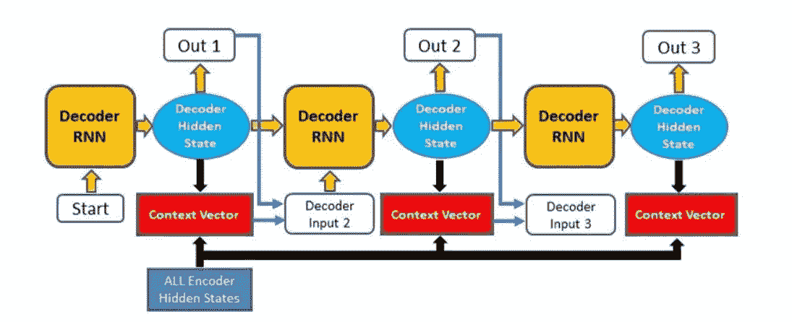

**步骤 2:计算对齐向量**

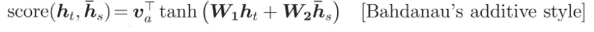

Bahdanau 注意力的得分函数

现在，我们必须计算比对分数。它是在前一个解码器隐藏状态和每个编码器隐藏状态之间计算的。每个编码器隐藏状态的校准分数被组合并表示在一个向量中，然后被软最大化**。**比对向量是与源序列具有相同长度的向量。它的每个值都是源序列中相应单词的得分(或概率)。对齐向量对编码器的输出进行加权。有了这些权重，解码器就可以决定在每个时间步长关注什么。

**第三步:计算上下文向量**

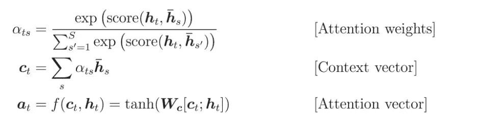

巴哈马注意力方程式

编码器隐藏状态和它们各自的对齐分数(上述等式中的注意力权重)相乘以形成上下文向量。上下文向量用于计算解码器的最终输出。

```
class BahdanauAttention(tf.keras.layers.Layer):
    def __init__(self, units):
        super(BahdanauAttention, self).__init__()
        self.W1 = tf.keras.layers.Dense(units)
        self.W2 = tf.keras.layers.Dense(units)
        self.V = tf.keras.layers.Dense(1)def call(self, query, values):
        query_with_time_axis = tf.expand_dims(query, 1)
        score = self.V(tf.nn.tanh(
            self.W1(query_with_time_axis) + self.W2(values)))
        attention_weights = tf.nn.softmax(score, axis=1)
        context_vector = attention_weights * values
        context_vector = tf.reduce_sum(context_vector, axis=1)
        return context_vector, attention_weights
```

**步骤 4:解码输出**

在前一步骤中获得的上下文向量与前一解码器输出连接，并馈入解码器 RNN 单元，以产生新的隐藏状态。然后，这个过程从步骤 2 开始再次重复。对于解码器的每个时间步长，该过程重复进行，直到产生一个“<end>”标记或输出超过指定的最大长度。时间步长的最终输出是通过将新的隐藏状态传递给线性层来获得的，该线性层充当分类器来给出下一个预测单词的概率分数。</end>

```
class Decoder(tf.keras.Model):
    def __init__(self, vocab_size, embedding_dim, dec_units, batch_sz):
        super(Decoder, self).__init__()
        self.batch_sz = batch_sz
        self.dec_units = dec_units
        self.embedding = tf.keras.layers.Embedding(vocab_size, embedding_dim)
        self.gru = tf.keras.layers.GRU(self.dec_units,
                                       return_sequences=True,
                                       return_state=True,
                                       recurrent_initializer='glorot_uniform')
        self.fc = tf.keras.layers.Dense(vocab_size)
        # used for attention
        self.attention = BahdanauAttention(self.dec_units)def call(self, x, hidden, enc_output):
        context_vector, attention_weights = 
                                 self.attention(hidden, enc_output)
        x = self.embedding(x)
        x = tf.concat([tf.expand_dims(context_vector, 1), x], axis=-1)
        output, state = self.gru(x)
        output = tf.reshape(output, (-1, output.shape[2]))
        x = self.fc(output)
        return x, state, attention_weights
```

**步骤 5:使用编码器-解码器模型训练数据集**

首先，我们将定义一个优化器和一个损失函数。

```
optimizer = tf.keras.optimizers.Adam()
loss_object = tf.keras.losses.SparseCategoricalCrossentropy(
    from_logits=True, reduction='none')def loss_function(real, pred):
    mask = tf.math.logical_not(tf.math.equal(real, 0))
    loss_ = loss_object(real, pred)
    mask = tf.cast(mask, dtype=loss_.dtype)
    loss_ *= mask
    return tf.reduce_mean(loss_)
```

现在，为了进行培训，我们将实现以下内容。

通过编码器传递输入和初始隐藏状态，编码器将返回编码器输出序列和编码器隐藏状态。编码器隐藏状态、编码器输出和解码器输入被传递给解码器。在第一个时间步长，解码器将'<start>'作为输入。解码器返回解码器隐藏状态和预测字作为输出。我们使用教师强制进行训练，在每一个时间步将实际单词传递给解码器。然后，计算梯度下降，将其应用到优化器和反向传播。(来源- [第](https://towardsdatascience.com/implementing-neural-machine-translation-with-attention-using-tensorflow-fc9c6f26155f)页)</start>

```
def train_step(inp, targ, enc_hidden):
    loss = 0
    with tf.GradientTape() as tape:
        enc_output, enc_hidden = encoder(inp, enc_hidden)
        dec_hidden = enc_hidden
        dec_input = tf.expand_dims([targ_lang.word_index['<start>']] * BATCH_SIZE, 1)
        # Teacher forcing - feeding the target as the next input
        for t in range(1, targ.shape[1]):
            # passing enc_output to the decoder
            predictions, dec_hidden, _ = decoder(dec_input, dec_hidden, enc_output)
            loss += loss_function(targ[:, t], predictions)
            # using teacher forcing
            dec_input = tf.expand_dims(targ[:, t], 1)
    batch_loss = (loss / int(targ.shape[1]))
    variables = encoder.trainable_variables + decoder.trainable_variables
    gradients = tape.gradient(loss, variables)
    optimizer.apply_gradients(zip(gradients, variables))
    return batch_loss
```

多纪元训练。

```
EPOCHS = 4
for epoch in range(EPOCHS):
    start = time.time()
    enc_hidden = encoder.initialize_hidden_state()
    total_loss = 0
    for (batch, (inp, targ)) in enumerate(dataset.take(steps_per_epoch)):
        batch_loss = train_step(inp, targ, enc_hidden)
        total_loss += batch_loss
        if batch % 1000 == 0:
            print('Epoch {} Batch {} Loss {:.4f}'.format(epoch + 1,
                                                       batch,
                                                      batch_loss.numpy()))
    # saving (checkpoint) the model every 2 epochs
    if (epoch + 1) % 2 == 0:
        checkpoint.save(file_prefix = checkpoint_prefix)
    print('Epoch {} Loss {:.4f}'.format(epoch + 1,
                                      total_loss / steps_per_epoch))
    print('Time taken for 1 epoch {} sec\n'.format(time.time() - start))
```

该模型在由 Google Colab 提供的 Tesla K80 GPU 上进行训练。训练 4 个纪元大概用了 2400 秒。在第 4 个时期结束时，损失为 0.0837。

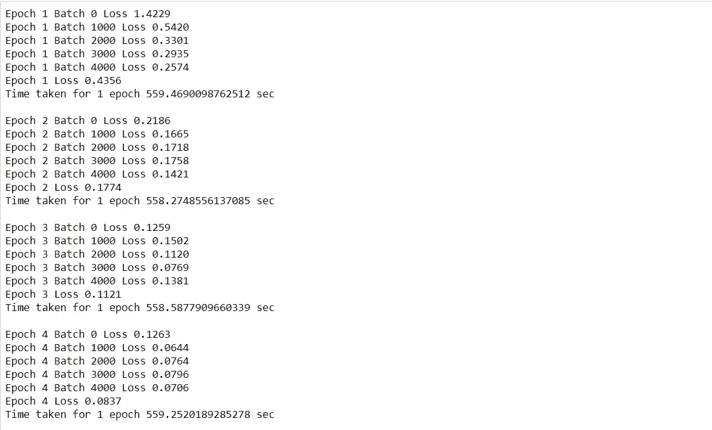

编解码器模型的训练

**第六步:预测**

在这个阶段，我们不使用老师强迫。相反，我们将前一时间步的预测字作为输入传递给解码器。我们还存储了注意力权重，以便它们可以用于绘制注意力图。

对于评估，首先，我们对句子进行预处理。然后，我们使用在数据准备期间创建的 tokenizer 对象创建令牌。在传递和创建输入张量之后，我们初始化一个隐藏状态，它被初始化为零，并与输入向量一起传递给编码器。在此之后，编码器隐藏状态和'<start>'标记被传递给解码器。然后，我们使用解码器输入、隐藏状态和上下文向量找到具有最大概率的预测 id，并且我们存储注意力权重。现在，我们将 predicted_id 转换为 word，并将其附加到结果字符串中。这一直持续到遇到'<end>'标签或达到最大目标序列。</end></start>

函数来评估一个句子。

```
def evaluate(sentence):
    attention_plot = np.zeros((max_length_targ, max_length_inp))
    sentence = preprocess_sentence(sentence)
    inputs = [inp_lang.word_index[i] for i in sentence.split(' ')]
    inputs =  tf.keras.preprocessing.sequence.pad_sequences([inputs],maxlen=max_length_inp,padding='post')    
    inputs = tf.convert_to_tensor(inputs)
    result = ''
    hidden = [tf.zeros((1, units))]
    enc_out, enc_hidden = encoder(inputs, hidden)
    dec_hidden = enc_hidden
    dec_input = tf.expand_dims([targ_lang.word_index['<start>']], 0)
    for t in range(max_length_targ):
        predictions, dec_hidden, attention_weights =     decoder(dec_input,dec_hidden,enc_out)
        # storing the attention weights to plot later on
        attention_weights = tf.reshape(attention_weights, (-1, ))
        attention_plot[t] = attention_weights.numpy()
        predicted_id = tf.argmax(predictions[0]).numpy()
        result += targ_lang.index_word[predicted_id] + ' '
        if targ_lang.index_word[predicted_id] == '<end>':
            return result, sentence, attention_plot
        # the predicted ID is fed back into the model
        dec_input = tf.expand_dims([predicted_id], 0)
    return result, sentence, attention_plot
```

用于绘制注意力权重的函数。

```
# function for plotting the attention weights
def plot_attention(attention, sentence, predicted_sentence):
    fig = plt.figure(figsize=(10,10))
    ax = fig.add_subplot(1, 1, 1)
    ax.matshow(attention, cmap='viridis')
    fontdict = {'fontsize': 14}
    ax.set_xticklabels([''] + sentence, fontdict=fontdict, rotation=90)
    ax.set_yticklabels([''] + predicted_sentence, fontdict=fontdict)  
    ax.xaxis.set_major_locator(ticker.MultipleLocator(1))
    ax.yaxis.set_major_locator(ticker.MultipleLocator(1))
    plt.show()
```

翻译句子的功能

```
def translate(sentence):
    result, sentence, attention_plot = evaluate(sentence)
    print('Input: %s' % (sentence))
    print('Predicted translation: {}'.format(result))
    attention_plot = attention_plot[:len(result.split(' ')), :len(sentence.split(' '))]
    plot_attention(attention_plot, sentence.split(' '),    result.split(' '))
    return result
```

# 结果

**来自训练模型的预测:**

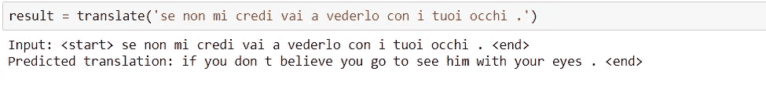

来自编码器-解码器模型的预测结果

**谷歌翻译结果:**


谷歌翻译从意大利语到英语的测试句子。

除了‘它’被预测为‘他’和‘我’被预测为‘你’之外，模型预测的大多数单词都是对的。

**关注剧情:**

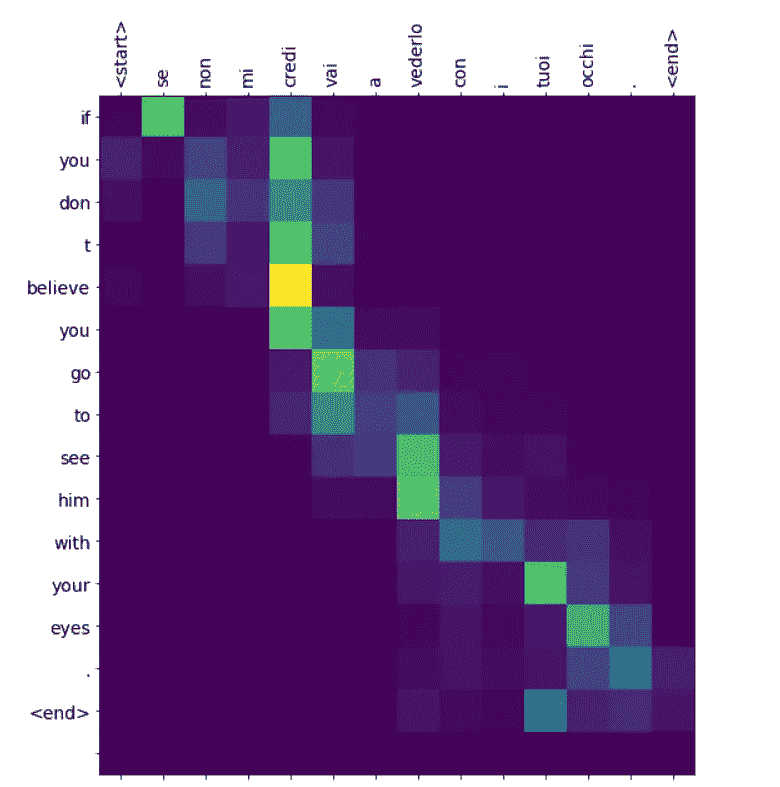

注意力图

黄色和绿色阴影表示在预测目标序列的单词时，对源序列中的相应单词给予更高的关注权重。

**Bleu 评分:**

双语评估替角得分，简称 BLEU，是一种将生成的句子与参考句子进行评估的指标。完全匹配的得分为 1.0，而完全不匹配的得分为 0.0。

Bleu 分数可以计算如下

```
import nltk.translate.bleu_score as bleu
reference = 'if you don t believe me , go and see it for yourself .'
print('BLEU score: {}'.format(bleu.sentence_bleu(reference, result)))
```

输出

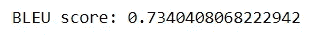

Bleu 评分

# 参考

1.  [https://blog.floydhub.com/attention-mechanism/](https://blog.floydhub.com/attention-mechanism/)
2.  [https://www . tensor flow . org/tutorials/text/NMT _ with _ attention # translate](https://www.tensorflow.org/tutorials/text/nmt_with_attention#translate)
3.  [https://machine talk . org/2019/03/29/neural-machine-translation-with-attention-mechanism/](https://machinetalk.org/2019/03/29/neural-machine-translation-with-attention-mechanism/)
4.  [https://towards data science . com/implementing-neural-machine-translation-with-attention-using-tensor flow-fc 9 c6f 26155 f](https://towardsdatascience.com/implementing-neural-machine-translation-with-attention-using-tensorflow-fc9c6f26155f)
5.  [https://towards data science . com/sequence-2-sequence-model-with-attention-mechanism-9e 9 ca 2 a 613 a](https://towardsdatascience.com/sequence-2-sequence-model-with-attention-mechanism-9e9ca2a613a)