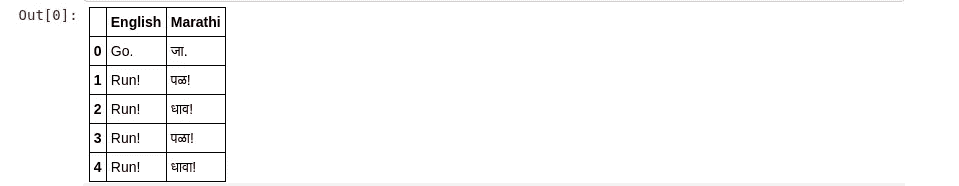
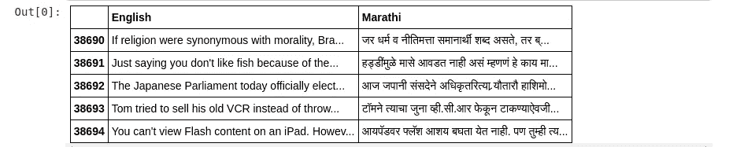
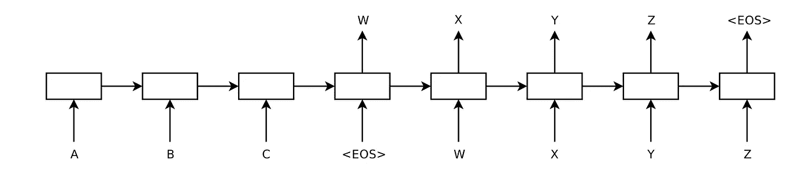
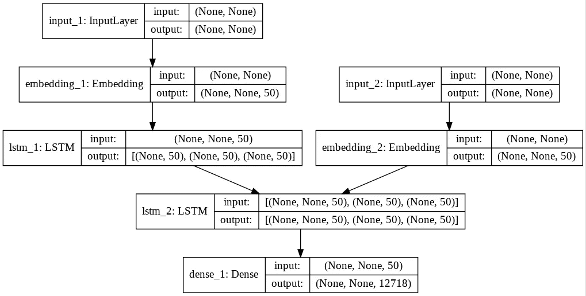
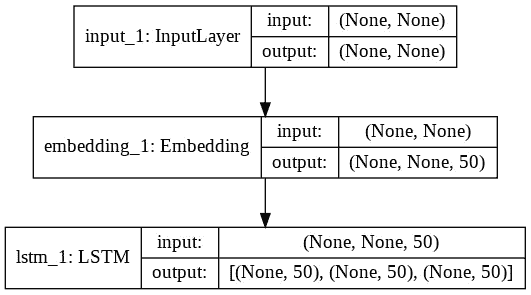
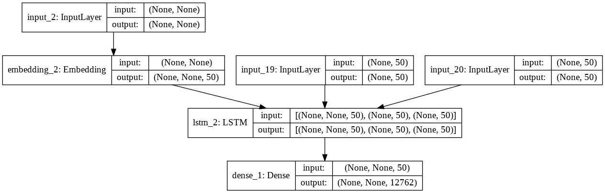
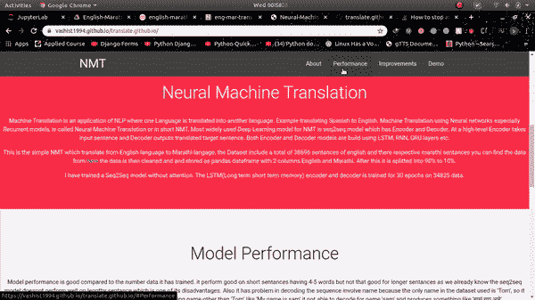

# 使用简单 Seq2Seq 模型的神经机器翻译

> 原文：<https://medium.com/analytics-vidhya/neural-machine-translation-using-simple-seq2seq-517b5ce1ae0f?source=collection_archive---------5----------------------->


在当今全球化时代，各国以某种方式相互联系，语言翻译起着至关重要的作用。尽管英语是被普遍接受的交流语言，仍然有许多国家更喜欢用他们的母语交流。如果我们暂时把全球视角放在一边，仍然有一些人用他们的母语更好地理解事物。因此，考虑到所有这些需求，从很长一段时间以来，语言翻译都是人类文明的一部分。在技术进步之前，有人类曾经在各民族之间充当翻译。但是技术发展后不久，我们创造了机器来做这种翻译。这种机器翻译不断发展久而久之，研究人员不断研究，使机器翻译更加准确和正确。随着深度学习和神经网络(如 RNN、LSTM 和更多基于序列的神经网络)的发展，构建一个简单的语言翻译器现在并不困难。

所以在这篇教程博客中，我将展示如何创建一个简单的神经机器翻译器，将英语句子翻译成马拉地语句子。我选择了一个马拉地语句子，因为它有助于我更好地理解翻译。此外，印地语数据集非常小。所以不浪费更多的时间，让我们开始吧。

# 目录

1.  介绍
2.  数据收集和清理
3.  编码器和解码器的输入创建
4.  模型结构
5.  推理模型构建
6.  预言；预测；预告
7.  模型性能
8.  改进的范围
9.  结论
10.  参考
11.  与我联系

# 1.介绍

在这一部分，我将简单介绍一下什么是神经机器翻译，也称为 NMT。所以，NMT 是使用神经网络构建的，因此“N”代表“神经”,因为它使用机器来进行翻译，“M”代表“机器”,最终，它会进行翻译，因此“T”代表“翻译”。我希望你已经理解到这里，对于非机器学习和深度学习的读者，你们可能想知道这个“Seq2Seq 模型”是什么，我将尝试为他们解释它。简而言之，在深度学习中，我们利用神经网络来训练我们的深度学习模型(进行预测)，所以有一些像 RNN，LSTM，GRU 这样的神经网络，它们以序列作为输入，就像我们例子中的英语句子序列一样。所以 Seq2Seq 模型就是这些特殊神经网络的代表。Seq2Seq 模型有两个部分，一个称为编码器，另一个称为解码器，顾名思义，编码器对我们输入的英语句子进行编码，解码器将这些编码的英语句子解码成马拉地语句子。这是一个简单 seq2seq 模型的简单介绍，基于进一步的改进和研究，我们不断寻找新技术来改进输入序列的编码，但 seq2seq 模型的核心是编码器和解码器。关于编码器和解码器的更多信息，可以参考[这个](https://machinelearningmastery.com/encoder-decoder-long-short-term-memory-networks/)链接。

# 2.数据收集和清理

因此，在快速介绍了 NMT 和 seq2seq 模型之后，是时候让我们深入研究这个 NMT 的编码部分了。在本节中，我们将获取原始数据并执行一些基本的文本清理。要获取数据集，您可以参考[这个](http://www.manythings.org/anki/)链接。

在从我在上面段落中给出的链接加载数据之前，我们需要导入我们将在这个项目中使用的所有必要的库。

## 导入库

现在我们已经导入了所有的库，我们可以继续加载我们的原始文本数据文件了。

```
**with** open('mar.txt','r') **as** f:
  data = f.read()*# len(data)*
```

以上要点显示了原始文本文件的内容，您可以看到我们需要清理该文件，因此让我们进入数据清理过程。

在上面的代码中，我将原始数据文本的每一行都分离出来，并存储到名为 uncleaned_data_list 的列表中。之后，我将所有的英语和马拉地语句子分离出来，分别存储到英语单词和马拉地语单词列表中，最后，我打印出了英语句子和马拉地语句子的总数。

之后，我创建了一个熊猫数据框架，它有两列，分别命名为 English 和 Marathi，并将其保存为 CSV 文件。

```
language_data.head()
```



```
language_data.tail()
```



您可以看到我们新创建的 pandas 数据框架的头部和尾部数据。将数据表示为这种格式的原因是，它使数据处理更加有效，同时我们也可以利用 panda 的工具。现在让我们进一步进入我们的文本清理过程。

我认为上面的代码部分是不言自明的，但我还是会简单地解释一下。在上面的代码部分，我做了文本预处理，包括一些基本的东西，如小写文本，删除标点符号，删除数字和空白。

```
*# Putting the start and end words in the marathi sentances*
marathi_text_ = ["start " + x + " end" **for** x **in** marathi_text_]
```

上面的代码部分看起来很简单，但它是使用 seq2seq 模型的神经机器翻译中最重要的一步。当我们要构建 Seq2Seq 模型时，我将解释在马拉地语句子中添加“start”和“end”标签的原因，直到请耐心等待，这样，我们就到了数据收集和数据清理部分的末尾。

# 编码器和解码器的输入创建

在本节之前，我们已经有了干净且经过处理的文本数据集，在本节中，我将向您展示如何为您的 NMT 模型准备数据。

在我们进入数据准备步骤之前，我们将把数据分成训练和测试，我在这里做的是 90-10 分割。

你要记住的第一件事是，seq2seq 模型希望所有的输入序列长度相同，因此实现这一点的一种方法是，我们计算英语和马拉地语中每个句子的长度，然后我们选择最大长度，即英语和马拉地语中最长的句子。因此，最后，我们有两个 max_length，一个用于英语句子，另一个用于马拉地语句子，你也可以在代码部分看到。在后面的章节中，我会告诉你如何使用这些最大长度来使所有的英语和马拉地语序列长度相等。在此之后，由于机器只能理解数字而不能理解文本，我们需要一种方法将输入的文本序列转换成数字，其中一种方法就是索引句子中的单词。我们可以使用 Keras 的“Tokenizer”方法进行索引。我们还需要获取英语和马拉地语语料库的词汇量，这是我们为模型训练创建输入数据时所需的。我现在解释的所有事情都在上面的代码块中完成了。

下面的代码很长，但是不要害怕，我会完整地解释它。

如你所见，我创建了一个名为“generator_batch”的函数，它接受三个参数“X”、“Y”、“batch_size”，你可以自己算出所有这些参数的含义。现在函数中的第一件事是一个“While True ”,即 While 循环，这个循环被设置为总是运行 ok！好吧，我可以理解到这里，但在循环内发生了什么？当我第一次在我用来创建这个项目的引用博客上看到这段代码时，我想到了同样的问题。其实理解起来没那么复杂。我们正在运行一个从 0 到 X(训练数据)长度的“for 循环”,在本例中，这个循环的步长是 batch_size，即 128。在循环中，我有三个变量“编码器 _ 数据 _ 输入”、“解码器 _ 数据 _ 输入”、“解码器 _ 目标 _ 输入”。现在让我们更详细地看看每个变量。我已经创建了一个全零的度量，其行数等于“批处理 _ 大小”，列数等于“最大 _ 长度 _ 英语”，类似地，我们对解码器输入也是如此，但您可以看到解码器目标数据是三维形状的，因为解码器输出是三维的。但是等等，我已经告诉过你们，解码器是把翻译的句子作为输出的东西，所以我们也创建了解码器输入。这是因为它使训练更快，这种方法被称为“教师强迫”技术。在教师强制中，我们将目标数据作为输入传递给解码器，例如，如果解码器要预测“the ”,那么我们也将“the”传递给解码器的输入，您可以将它与实际的师生学习过程联系起来。因此，它使学习过程更快。

到目前为止，我们已经创建了三个零矩阵。在嵌套的 for 循环中，我一个接一个地获取索引、X_train 和 Y_train 数据，还有另一个 for 循环，它从外部 for 循环 X_train 语句中获取单词以及索引，然后， 我在我们的 encoder_data_input zeros 度量中填充了输入句子中单词的相应索引，这里，外部循环“I”是按行排列的，嵌套循环的“t”是按列排列的，正如您所观察到的，所有输入序列都将具有相同的长度，因为我已经将列设置为等于 max_length_english，所以如果输入序列小于 max _ length _ English，我们将为其其余列填充零。 在 decoder_input_data 的 for 循环中做了类似的事情，但在 decoder_target_input 中没有。请记住，我们已经在目标马拉地语句子中填充了“start”和“end”标签，因此在 t = 0 时，我们将“start”作为单词，我们不希望这个单词出现在目标输入序列中，因此我们从 t>0 开始对 decoder_target_input 进行排序。

到目前为止，我已经为 seq2seq 模型创建了输入和输出，并使用 yield 分批发送数据，而不是同时发送。在下一节中，我将告诉你在目标语句中添加“开始”和“结束”标签的原因，以及编码器和解码器的详细工作和模型代码。

# 模型结构



编码器和解码器

上图是一个简单的编码器和解码器的示意图。这里的横轴是时间戳，而‘A’、‘B’、‘C’是输入序列的单词。现在假设我们有 10 个输入句子，存储在我们的编码器 _ 数据 _ 输入指标中，指标中的每一行是一个句子，因此我们有 10 行和 max_length_english 列，比如 X1，X2，…。，X10 用来表示每个序列。

现在，

对于 X1，假设序列中有 3 个单词，

在 t = 0 时，我们将 w1 传入编码器并获取其状态

在 t = 1 时，我们将 w2 和 t = 0 时的状态一起传入编码器

在 t = 2 时，我们将 w3 和 t = 1 时的状态一起传入编码器

现在，在序列的末尾，我们将编码器的输出及其在 t=2 时的状态作为输入传递给解码器，然后将 t=0 时的解码器输出作为输入传递给 t=1 时的解码器，依此类推，直到没有到达字符串的末尾。

现在将“开始”和“结束”附加到解码器输入的原因是，“开始”标签用于启动解码器开始解码，“结束”标签用于通知解码器停止解码过程。如果我们不使用这一点，那么解码器将永远无法产生第一个字，因为我们知道，如果我们将该字作为输入传递给解码器，它将预测序列的下一个字，并且该预测将永远不会停止，因为它不知道何时停止。

上面的代码正是我之前解释过的，也显示在编码器-解码器图像中。参考上面的编码器-解码器图像，尝试理解代码。

```
plot_model(model, to_file='train_model.png', show_shapes=**True**)
```



培训模式

在上面的代码部分中，我正在保存训练好的模型并加载它。请注意一件事，只像这样保存模型，而不是其他任何方式，因为我们必须创建推理编码器和解码器，以便稍后进行预测，并且该模型也使用训练好的模型层。

# 推理模型构建

以下部分是推理模型的代码，该模型用于进行预测。



编码器推理模型



解码器推理模型

编码器推理模型类似于训练模型，不同之处在于解码器推理模型。如果您看到编码器-解码器图，我们可以看到前一个时间戳的状态被传递到下一个时间戳，因此我们需要找到一种方法来保存前一个时间戳的状态。解码器推理中的以下代码也在做同样的事情。

```
*#inference decoder*
*# The following tensor will store the state of the previous timestep in the "starting the encoder final time step"*
decoder_state_h_input = Input(shape=(latent_dim,)) *#becase during training we have set the lstm unit to be of 50*
decoder_state_c_input = Input(shape=(latent_dim,))
decoder_state_input = [decoder_state_h_input,decoder_state_c_input]
```

然后，我们创建解码器推理模型。为了创建解码器模型，我们首先定义了输入层。这是经过训练的解码器模型的输入层。之后，我们创建与训练解码器模型中相同的层，但唯一的区别是解码器 LSTM 的初始状态被设置为先前时间戳的状态。正如我们在上面的编码器-解码器图表中看到的，推理模型的其余部分与训练解码器模型相似。

```
*# inference decoder input*
decoder_input_inf = model_loaded.input[1] *#Trained decoder input layer*
*# decoder_input_inf._name='decoder_input'*
decoder_emb_inf = model_loaded.layers[3](decoder_input_inf)
decoder_lstm_inf = model_loaded.layers[5]
decoder_output_inf, decoder_state_h_inf, decoder_state_c_inf = decoder_lstm_inf(decoder_emb_inf, initial_state =decoder_state_input)
decoder_state_inf = [decoder_state_h_inf,decoder_state_c_inf]
*#inference dense layer*
dense_inf = model_loaded.layers[6]
decoder_output_final = dense_inf(decoder_output_inf)*# A dense softmax layer to generate prob dist. over the target vocabulary*

decoder_model = Model([decoder_input_inf]+decoder_state_input,[decoder_output_final]+decoder_state_inf)
```

# 预言；预测；预告

现在，我们已经训练了 seq2seq 模型，并使用训练好的模型创建了用于进行预测的推理模型，因此是时候使用以下代码进行预测了。

上面的函数将翻译后的句子返回给我们，它首先对输入的句子进行编码，然后获取编码器最后一个时间戳的状态值。然后，我们创建了称为“target_seq”的单值度量，它保存下一个预测的马拉地语单词的索引，但是为了开始解码过程，我们需要传递第一个单词，即“start”。因此，在开始时，我们将把单词“start”的索引存储到“target_seq”中，然后，因为我们必须执行解码过程，直到我们到达“end”单词。因此，我们需要在一个循环中调用解码器推理模型。在循环中，我们将“target_seq”和编码器最后的时间戳“states”作为解码器推理模型的输入。推理解码器模型返回下一个单词索引和解码器状态，在此之后，我们将该索引转换回单词并将其添加到字符串变量“decoder_sentance ”,然后我们将新生成的单词索引放入“target_seq ”,并用解码器模型状态更新“state_value”。此过程继续，直到我们得到预测的单词“end”。因此，在 while 循环的末尾，我们得到了完整的翻译句子。以下是我得到的一些输出。

```
**for** i **in** range(30):
  sentance = X_test[i]
  original_target = y_test[i]
  input_seq = tokenizer_input.texts_to_sequences([sentance])
  pad_sequence = pad_sequences(input_seq, maxlen= 30,padding='post')
  *# print('input_sequence =>',input_seq)*
  *# print("pad_seq=>",pad_sequence)*
  predicted_target = decode_seq(pad_sequence)
  print("Test sentance: ",i+1)
  print("sentance: ",sentance)
  print("origianl translate:",original_target[6:-4])
  print("predicted Translate:",predicted_target[:-4])
  print("=="*50)
```

# 模型性能

与用于训练 seq2seq 模型的数据量相比，该模型的性能良好。对于在 34825 个数据集上训练了 50 个时期的模型，我已经获得了 54.8%的准确度。简单的 seq2seq 模型的局限性在于，它不能有效地翻译一个长句子。所以这个模型也有这个局限性。

# 改进的范围

因为这只是一个简单的模型，向您展示如何创建一个神经机器翻译器，正如我们所知，没有解决方案是完美的，一切都随着时间的推移而不断改进。这个解决方案不是唯一的解决方案，您可以根据您的理解和技能进一步改进它。

为了进一步改进这一模式，我可以提出以下建议:

1.  我们可以在一个有很多变化的大型数据集上训练这个模型。
2.  对于它冗长的呈现限制，我们可以加入注意机制。
3.  我们可以试着用 LSTM 代替 GRU，检查模型的性能。

# 结论

这是博客的结论部分。这篇博客向你展示了神经机器翻译是怎么回事，这个世界对翻译的需求是什么，以及你如何利用深度学习自己创造一个 NMT，你已经详细了解了 seq2seq 模型是什么。在下一篇博客中，我将向您展示如何部署这个 NMT 并使用 Flask 创建一个 REST API，以便您可以通过任何应用程序访问您的模型。以下是我们将在下一篇博客中制作的最终产品的视频。所以请在媒体上关注我，这样你就可以在我的下一篇博客发表时收到通知。



下一篇博客最终产品演示

# 参考

 [## Keras 中序列对序列学习的十分钟介绍

### 我经常看到这个问题——如何在 Keras 中实现 RNN 序列对序列学习？这里有一个简短的介绍…

blog.keras.io](https://blog.keras.io/a-ten-minute-introduction-to-sequence-to-sequence-learning-in-keras.html) [](https://github.com/keras-team/keras/blob/master/examples/lstm_seq2seq_restore.py) [## keras-team/keras

### 人类的深度学习。通过在 GitHub 上创建一个帐户，为 keras-team/keras 开发做出贡献。

github.com](https://github.com/keras-team/keras/blob/master/examples/lstm_seq2seq_restore.py) [](https://machinelearningmastery.com/develop-encoder-decoder-model-sequence-sequence-prediction-keras/) [## 如何在 Keras - Machine 中开发用于序列到序列预测的编码器-解码器模型…

### 编码器-解码器模型提供了一种模式，使用递归神经网络来解决挑战性的…

machinelearningmastery.com](https://machinelearningmastery.com/develop-encoder-decoder-model-sequence-sequence-prediction-keras/) [](https://machinelearningmastery.com/encoder-decoder-long-short-term-memory-networks/) [## 编码器-解码器长短期记忆网络-机器学习掌握

### 使用示例 Python 代码对用于序列间预测的编码器-解码器 LSTMs 进行简单介绍。的…

machinelearningmastery.com](https://machinelearningmastery.com/encoder-decoder-long-short-term-memory-networks/) [](https://towardsdatascience.com/word-level-english-to-marathi-neural-machine-translation-using-seq2seq-encoder-decoder-lstm-model-1a913f2dc4a7) [## 使用 Seq2Seq 编码器-解码器 LSTM 模型的单词级英语到马拉地语神经机器翻译

### 目录

towardsdatascience.com](https://towardsdatascience.com/word-level-english-to-marathi-neural-machine-translation-using-seq2seq-encoder-decoder-lstm-model-1a913f2dc4a7) 

# 与我联系

你可以在 [LinkedIn](http://linkedin.com/in/vashistnarayan-singh) 上和我联系。

你可以在我的 [GitHub](https://github.com/vashist1994/Neural-machine-translation-seq2seq) 上找到这个博客的完整代码。