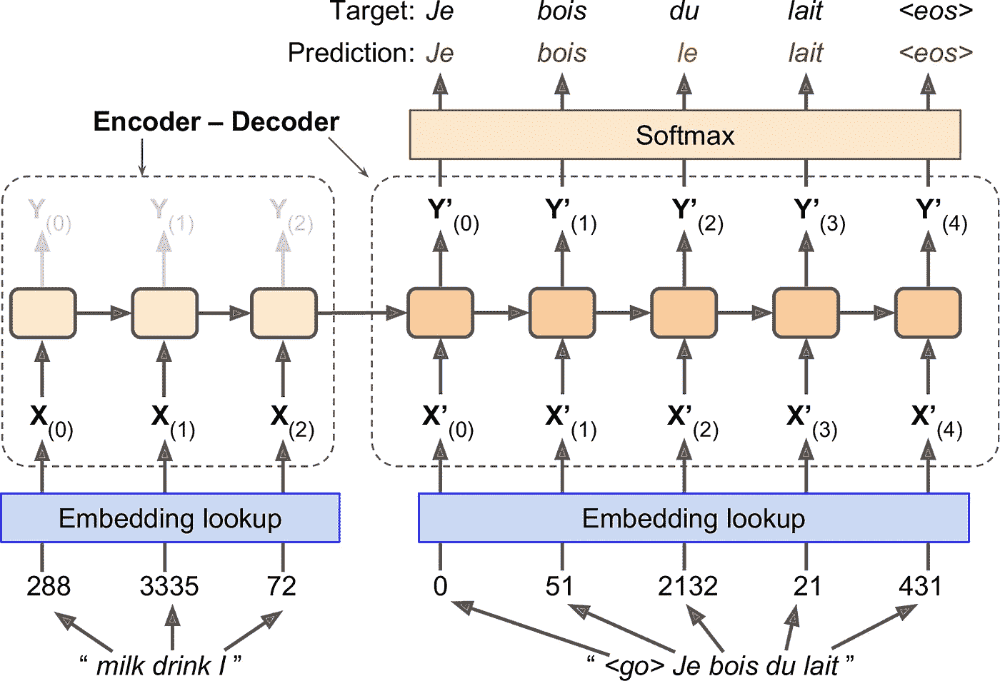

# 神经机器翻译(实现编码器-解码器)

> 原文：<https://medium.com/analytics-vidhya/neural-machine-translations-implementing-encoder-decoder-658c3facd530?source=collection_archive---------12----------------------->

我们一生中都至少使用过一次翻译器，不管是为了真正的目的还是为了精彩的字幕，废话。但是有没有想过它是如何工作的或者如何创建一个？让我们潜入**神经机器翻译的世界。**

# 表面上的编码器-解码器模型

**编码器:**编码器的作用是吸收输入句子中存在的信息，并将这些信息编码成一个数组/一组数字，因此得名编码器。

**解码器:**同样，对于解码器来说，它的工作是学习如何使用编码器提供给它的信息，将其转换成与提供给编码器的句子/文本具有相同含义的另一种语言句子。

# 深入研究模型

要理解下面的解释和代码，您必须熟悉一般的**和[***tensor flow***](https://www.tensorflow.org/tutorials)。**

## ****预处理****

**在下面的函数中，参数是您的数据集拥有的句子的一个 ***语言*** ( *NumPy 数组*)，***vocab _ size***(*int*)这是您认为您的语言将拥有的唯一且有意义的完整单词的数量(这是一个可以调整的超参数，例如，您可以将其作为 10000)，**

****现在，如果语言是我们模型的输出，我们希望它有*‘序列开始’*和*‘序列结束’*标记，“sos”将作为*第一时间步*输入，这样我们可以让模型学习仅使用编码器隐藏状态(解码器的初始状态)来预测输出句子中的第一个单词。 然后使用*‘Tokenizer’*类创建一个记号化器，因为我们使用的是文本，即句子，所以我们将使用 *fit_on_text* 方法，这样记号化器可以为文本尸体中的每个唯一单词分配一个记号，最后，为了将每个句子转换成一个记号向量，我们使用 *texts_to_sequence* 方法。****

****接下来，由于成批的句子必须具有相同的长度，我们必须填充它们，输出填充*、*和输入填充*、【pre】、*，原因是我们将反转输入张量，因此翻转*、【pre】、*后，填充将变成*、【post】、*，这就是我们想要的。****

****如果文本被输入，它通常在输入到编码器之前被反转。例如,“我踢足球”变成了“我踢足球”。这很有用，因为这里的“I”是解码器需要翻译的第一件事。****

# ****模型****

********

****机器翻译(oreilly.com)****

******编码器型号******

****编码器模型由两个主要层组成，*嵌入层，*这一层创建每个记号映射到的高维空间，例如，让我们假设"< sos >"具有记号" 2 "，嵌入层的输出将是形状的向量(1，嵌入维度)，现在每个记号的嵌入在训练期间被学习，因此，像"好"、"棒极了"、"很棒"这样的词将被聚集在一起，而像"最差"、"悲伤"这样的词， “bad”将在距离前一组一定距离处形成一个簇，简而言之，具有相同含义或相似性的单词被聚集在一起，嵌入的另一个优点是它不是离散的而是矢量化的。因此，模型可能在训练期间将“great”和“est”学习为不同的单词，但是它将能够在预测期间理解“greest”。 [了解有关嵌入的更多信息](https://towardsdatascience.com/deep-learning-4-embedding-layers-f9a02d55ac12)。****

****函数 *init_hidden_state* 用于返回形状(batch，num。神经元的)所以，它可以作为可以传递给编码器的第一个状态。模型的其余部分是琐碎的。****

******解码器型号******

****解码器模型与编码器相同，只有一个完全连接层的不同，因此我们可以预测稀疏类，即目标语言的离散标记。****

******自定义损失功能******

****现在，我们需要一个定制的损失函数来计算损失，因此，我们可以使用它进行反向传播来更新权重。需要自定义损失，因为你们可能已经注意到，我们刚刚创建了两个类 Encoder 和 Decoder，但从未将它们绑定到 Keras 模型类，我们这样做是因为在训练期间，我们希望将一个时间步长传递给模型以及模型可能预测的任何内容，对于下一个输入，我们将传递真实标签作为输入，这样模型就可以为下一个时间步长进行自我训练。 这种方法叫做 [*老师逼迫*](https://towardsdatascience.com/what-is-teacher-forcing-3da6217fed1c) ，就像我们做错了事，老师纠正我们一样。 在推断过程中，我们只是将解码器的输出作为下一个时间步长的输入，这种类型的控制使用 Keras 模型类是不可行的。因此，我们必须使用自定义的训练循环和损耗。****

****首先，我们不希望我们的损失考虑填充令牌(一种令牌，使得特定语句中的每个句子可以具有相同的长度)，我们为此使用简单的[掩码](https://keras.io/api/layers/core_layers/masking/)，并使用‘SparseCategoricalCrossentropy’计算损失，并返回平均损失。****

******训练******

****在此函数中执行的所有张量操作都在一个由 [*梯度带*](https://www.tensorflow.org/api_docs/python/tf/GradientTape) *、*组成的块内，正如其名称所暗示的那样，它是一个“带”，记录所有张量操作，以便以后梯度可以沿网络向下流动。****

****输入和隐藏状态张量被传递给编码器，然后第一个时间步，即“sos”令牌加上编码器的最终隐藏状态被传递给解码器，解码器预测下一个时间步，即目标句子中的第一个单词，该时间步的真实标签和预测标签然后被传递给损失函数以计算损失，解码器的下一个输入是当前时间步的真实标签。这种类型的训练被称为*教师强制*。最后，计算并应用梯度。****

******预测******

****在进行预测*时，不执行教师强制*，并且先前的解码器输出充当当前时间戳的输入。****

****“argmax”方法用于获取预测数组中最大值的索引，如果这是一个“eos”标记，则返回结果，否则将该单词附加到结果中。****

# ******结果******

********