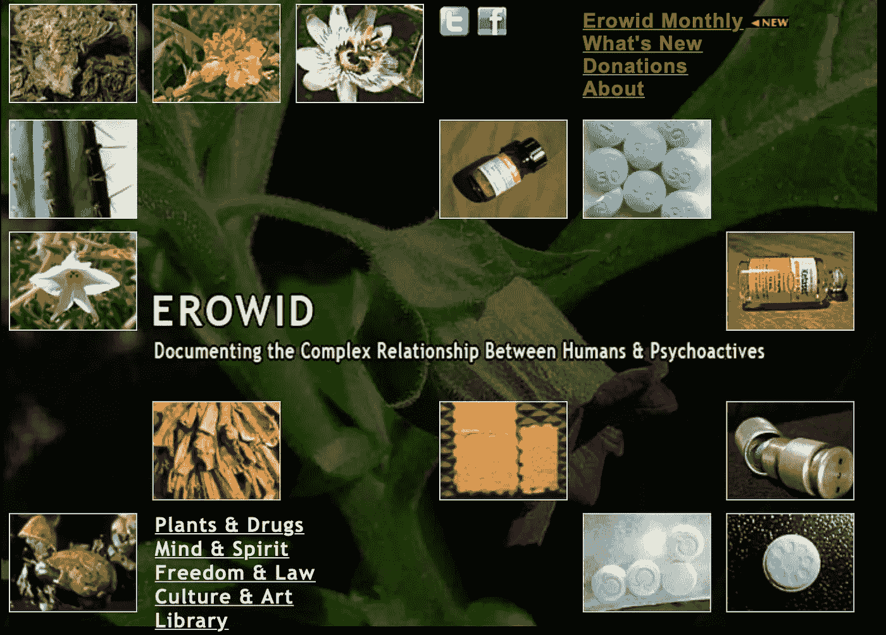

# 药物神经网络*

> 原文：<https://medium.com/analytics-vidhya/neural-nets-on-drugs-7cef2ac16726?source=collection_archive---------19----------------------->

*自我报告的吸毒经历

加勒特·考夫曼和维克多·科莱蒙

# **简介**

在我们默认的意识模式下，人类思维的能力远远超过我们在任何给定时刻所意识到的。尽管在过去的几十年里，关于迷幻物质及其引发的意识扩展状态的研究一直在争论不休。对于我们的项目，我们想探索一个神经网络系统是否可以为扩展物质的精神现象学提供新的见解。我们希望**使用从用户体验中训练出来的顺序神经网络模型**生成文本，以便为一些经典迷幻剂创造一种‘通用’版本的体验。我们希望从这些文本中找到每种物质独特的语音模式，以及生成的文本是否能捕捉到用户体验的一般化版本。

但是我们从哪里获得数据来使用呢？自 20 世纪 50 年代以来，研究人员一直在收集少量物质的 trip 账户，包括但不限于 LSD、MDMA、裸盖菇素和大麻。这些经历数量很少，也很少被数字化。我们找不到一个简洁的数据集来组织这些经验，以便数据科学家轻松访问。虽然这令人失望，但我们找到了一个看起来很有希望的来源。

# **数据:Erowid**



Erowid 数据库的主页

Erowid 数据库包含了几乎所有人类曾经摄入的化学物质的信息。这个网站([www.erowid.org](http://www.erowid.org/))上有丰富的信息，从 1985 年到现在不断更新，我们兴奋地发现，对于数据库中列出的每种药物，都有一个页面，人们可以匿名地自我报告他们的药物经历。然后我们决定，我们的第一步将是构建一个 scraper，它可以将药物的名称作为输入，并返回给我们来自每个没有混合药物的用户的文本。然后，我们将我们的数据组织到一些经典精神药物的物质特定目录中:**大麻、裸盖菇素(蘑菇)、摇头丸和迷幻药**。


Erowid 上的“体验”页面示例

# **模型行程安排:文本生成**

我们的下一步是为我们想要研究的每种药物创建一个文本生成器模型。为了做到这一点，我们训练了一个单层， **128 节点 LSTM** ，为每个模型的 **50 个时期使用一键字符编码。我们的训练集包含**4000–20000 个字符**。我们认为应该从一个相对简单的模型开始，因为我们使用的四个模型中的每一个都需要两个小时以上的培训。我们获得了平均损失为 1.2 的**和大约 60%的精度**。虽然我们的模型不需要学习大量的文本格式，但每个神经网络都开发了一个独特的词汇，用于 Erowid 药物体验。文本输出既深刻又有趣(见下文)。现在我们有了输出文本，我们必须决定如何处理新数据。虽然数据可能在语法上不美观，但我们认为分类器模型可以量化文本生成性能。*如果分类器可以根据文本描述的药物准确地对文本进行分类，那么我们的文本模型学习的语言将是该药物独有的，因此表明我们的模型已经学习了通用特征*。**

```
model = Sequential()
model.add(LSTM(128, input_shape=(seqlen, len(chars)),      
    return_sequences=True))
model.add(Dense(len(chars), activation='softmax'))#################################################################
#step from training----- Generating text after Epoch: 25
----- diversity: 0.5
----- Generating with seed: "ad in a long time. This feeling lasted f"
ad in a long time. This feeling lasted for the fact that I was all the people was a strong started to see the morning I was taken so continued and we started to get up and some of the concept and constant I was about to see the trees and the woods of the trip, that was a small or so fully and the similar mind perhaps that was so straight that seemed to a parents was still so decided to do the shrooms that was only a small briefly seeing
Epoch 27/50
62585/62585 [==============================] - 97s 2ms/step - loss: 1.2711 - categorical_crossentropy: 1.2711 - accuracy: 0.6151
```

# 生成模型性能

这里是我们的四个模型在 50 个时期后的性能统计。

## 蘑菇

**损失:** 1.2581 **，分类交叉熵:** 1.2581 **，准确率:** 61.84%

## 亚甲基双氧甲基苯丙胺

**损失:** 1.2435，**分类交叉熵:** 1.2435 **，准确率:** 62.55%

## 二乙基麦角酰胺

**损失:** 1.2760，**分类交叉熵:** 1.2760 **，准确率:** 61.33%

## 大麻

**损失:** 1.2318，**分类交叉熵:** 1.2318 **，准确率:** 62.78%

# **使用 BERT 进行 NLP 分类**

鉴于这种文本分类需要大量的自然语言处理，我们很高兴能够利用 BERT 迁移学习模型。我们想利用 BERT 根据上下文标记文本数据的能力。这个模型是由谷歌的研究人员开发的，在“下一句话预测”和“问答”等任务中显示出了令人难以置信的结果。我们认为，使用这样一个强大的模型来分类我们的药物体验数据可能会产生一些有趣的结果。我们期望训练好的模型能够很好地预测原始经历是写在哪种药物上的，但是在 LSTM 生成的药物账户上表现不佳。

我们使用了[这篇](https://mc.ai/a-guide-to-simple-text-classification-with-bert/)关于多类文本分类的文章，以 BERT 为指导。在下载预训练模型之前，我们必须将数据格式化，使其对 BERT 更加友好。为此，我们使用了*熊猫*图书馆。所有的记录都被读入并写入一个*。tsv* 逐行。 *train.tsv* 需要有 **4 列:索引、类、杂项和行**。测试 tsv 只需要列 **1 和 4** 。我们将 80%的数据写入 *train.tsv* 文件，而剩余的 20%被平均分配到 *test.tsv* 和 *dev.tsv* 中进行验证。现在我们准备好实现 BERT 了。

# BERT 故障排除

我们决定使用“只有”1.1 亿个参数的装箱基础版本。在克隆了存储库并下载了模型之后，我们的麻烦就开始了。我们花了接下来的两天时间来密切熟悉 BERT 存储库中的文件，以便修复我们的错误(不幸的是没有错误消息的截图)。我们遇到的一个问题是 bert_config 文件上的*没有这样的文件或目录*错误。有趣的是，所有使用的文件都在同一个目录中，脚本在抛出错误之前能够访问其他文件，所以我们很困惑。最终，这个错误通过**给 BERT_BASE_DIR 分配一个相对路径而不是绝对路径**得以解决。弹出的另一个错误抱怨了我们的数据所包含的类的数量。问题在于 BERT 只配置了 2 个类，而我们的数据只有 4 个。为了解决这个问题，我们修改了 *run_classifier.py* 中的 *get_labels()* 方法，增加了两个额外的类。另一个神秘的错误声称找不到 Tensorflow。原来 BERT 需要的是 *Tensorflow 1.15* ，不会和 *2.0** 一起用。不幸的是，关于伯特错误的问题，尤其是解决方案在互联网上很少见，这使得它们更难克服。

```
**def** get_labels(self):"""See base class.""" **return** ["0", "1", "2", "3"]. <-- one digit for each class
```

*   上面:包含 BERT 类的方法。对于二进制分类，默认返回值为“['0 '，' 1']”。

# 训练伯特

最后，伯特开始训练。一路上它没有提供太多信息，只有*全局 _ 步/秒*和*示例/秒*。这让我们了解了训练的进度，但没有进展的迹象。通过粗略的计算，我们估计了 5 个小时的培训时间，虽然很多，但还是可以管理的。**伯特最终训练了 20 个小时**，这是意料之外的。更令人意想不到的是，它在我们的测试数据中的评价是如此之差。损耗在 **5.0** 以上，精度为 **~10%** 。此时，我们既失望又沮丧。我们是否在开始训练前做错了什么，或者我们的数据如此“不可分类”？即使后者是真的，我们也应该得到 50%左右的准确率。我们怀疑伯特出了什么问题。

```
#eval_results.txteval_accuracy = 0.14463277
eval_loss = 5.6167216
global_step = 1994  #number of batches
loss = 5.61461
```

# 戴上手套，真的…

和伯特的失败之后，我们必须决定下一步的行动。一种选择是诊断出了什么问题，并重新训练模型的最后一层。我们很快放弃了这个选项，因为在我们的机器(Macbook 8GB RAM)上 20 小时的培训时间使得在这个项目的时间框架内做这件事不可行。相反，我们选择利用一个(弱得多的)分类模型:1D 卷积神经网络。我们将在这个模型中添加一个在 **100 维** [**手套**](https://blog.keras.io/using-pre-trained-word-embeddings-in-a-keras-model.html) **嵌入**上预处理的嵌入层。这允许我们的分类器通过在 **100 维‘嵌入空间’**中的位置来识别每个单词。在嵌入空间中，具有较高程度的上下文相似性的单词被彼此紧密地分配。例如，“king”和“queen”之间的距离将小于“scoot”和“apple”。同样，使用上下文驱动嵌入的目的是希望获得更丰富的分类方案。我们训练这个模型的数据被分成多个文件，每个文件有两行长。这是为了增加我们可以分类的样本数量，从而有望改善结果。

```
sequence_input = Input(shape=(MAX_SEQUENCE_LENGTH,), dtype='int32')
embedded_sequences = embedding_layer(sequence_input)
x = Conv1D(128, 5, activation='relu')(embedded_sequences)
x = MaxPooling1D(5)(x)
x = Conv1D(128, 5, activation='relu')(x)
x = MaxPooling1D(5)(x)
x = Conv1D(128, 5, activation='relu')(x)
x = GlobalMaxPooling1D()(x)
x = Dense(128, activation='relu')(x)
preds = Dense(len(labels_index), activation='softmax')(x)model = Model(sequence_input, preds)
model.compile(loss='categorical_crossentropy',
              optimizer='rmsprop',
              metrics=['acc'])
```

经过训练，我们获得了相对较高的准确性和较低的损失，但验证分数仍然很低。

```
Epoch 10/10
11856/11856 [==============================] - 476s 40ms/sample - loss: 0.4500 - acc: 0.8249 - val_loss: 1.4107 - val_acc: 0.5386
```

我们发现，我们的简单分类器在上下文丰富的环境中运行良好，但它没有足够大的文本样本来生成有意义的结果。对于大量一致的文本数据的问题，这是一个简单的解决方案:我们只需找到更多的数据和格式，这样我们就可以在更大的文本文件上训练更长的时间。然而，考虑到我们有限的数据集，增加文本文件的丰富性(使训练文件更长)意味着将我们的初始数据集分割成更大的子文件。这反过来减少了可用于培训的文件数量。

然而，我们将训练好的分类器应用于模型生成的文本，得到了更令人印象深刻的结果:25%的分类准确率。

尽管在分类上的结果不太引人注目，但我们认为这个项目是成功的。我们在 Erowid 上发现的数据非常适合简单分析，但是报告的**风格不一致**。一些叙述比其他叙述更具描述性，它们经常包含错别字(它们毕竟是来自吸毒经历的自我报告)，并且在讨论的主题中存在不一致。尽管如此，我们简单的文本生成器生成的文本具有不错的语调和词汇意识，这表明每个模型都学习了特定物质的书面描述的半独特特征。在提炼这些结果后，我们可以将我们的分类器应用于每种物质特有的改进的生成文本。这表明自我报告中使用的语言存在明显的差异。相信我们的方法，就有可能将这些分析技术应用于更大、更一致的药物报告数据集。通过基于药物描述的概括产生文本，我们希望巩固我们对这些神秘和强大物质的现象学的理解。如果我们能够用低维语言描绘出一幅清晰的画面，说明一种药物如何让一个人产生感觉，那么我们就能够更好地传达这些效果，以便更安全地使用，并让公众更好地理解精神药物及其诱导的扩张状态。

现在，请尽情欣赏我们的文本生成器编写的这些诗歌片段:

“*我带他去看了一条小径，接下来似乎有了感知的特定概念，并准备尝试预防这种声音，我开始了解所有情况，并开始循环楼上的对话，还在生活道路的整个喘息之前，给了我和我们更多的重复时间…*——迷幻药

”*我花了几分钟时间，思考着我的朋友们和我说过的话，我的身体几乎完全和床融为一体了。*——蘑菇

”*像袜子一样僵硬的香肠充满了世界的一部分——用它们在任何一条有洼地的街道上为一些人遮挡阳光。我被保证不会有过去的效果。在意志开始降临到最好的朋友身上的时候。没有很长的时间，有很多真正的精神上的大排档，几分钟对我来说是一个怪胎。*-摇头丸

*“有几盏最亮的灯似乎一直照着我，我们可以看到我正在开始睡觉，接近令人担忧，有点现实，只是说，‘我不能说我们都有感情’”——*蘑菇

“*因为这是一个真实的人的压力，一切都变得越来越多，我太多的购物和沟通的事实，我的朋友们感觉*——大麻

“*我* *做不到我的头上，她想去最喜欢的地方，我全程带我去了*——MDMA

"*我的朋友走进了我的嘴里，当我感到非常模糊时，我就消失在摇头丸中，我享受着思考口香糖的乐趣，我不得不去听音乐，感觉几乎要发生了，我是我朋友的冲浪手，完美对一个满意的同伴来说完全是一粒药丸，音乐是音乐的整体，比一些人有快感，他们在几个聚会和整个道琼斯指数中更有把握。*-摇头丸

”*这是世界我的浴室，我以为他们是一个令人难以置信的权利旁边，我过去控制她的背部之一，并认为太阳将是其中的课程，然后我开始思考浴室和有方式有开始的音乐会。*-迷幻药

”*我曾牵过它的手，当时我正和我的朋友一起卷着一个惊喜的感觉，想说一说，出了一个惊喜的背影，此时我感到散漫……*”——MDMA

**截至 2019 年 16 月 12 日的修订版，提供了一个使用 tensorflow 2.0 构建的 BERT 实施。*

*这个项目是为我们的人工神经网络和深度学习课程做的。在 GitHub 上找到我们的代码* [*这里*](https://github.com/gtdlk20/NN_final) *。*