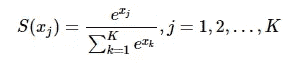
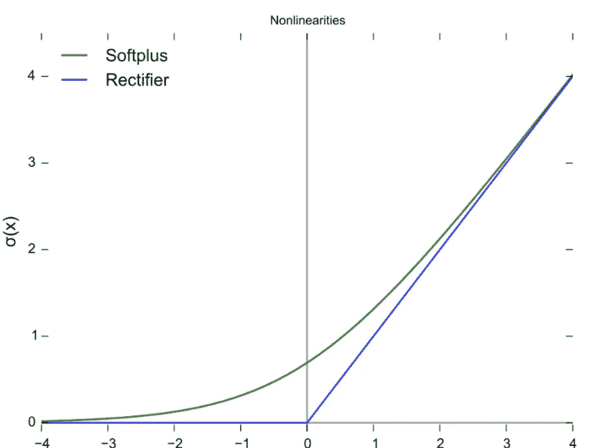

# 神经网络激活函数

> 原文：<https://medium.com/analytics-vidhya/neural-network-activation-function-c53a3f334364?source=collection_archive---------13----------------------->

在神经网络中，激活函数用于确定神经网络的输出。这种类型的函数被附加到每个神经元，并基于每个神经元的输入是否与模型的预测相关来确定该神经元是否应该激活。在这篇文章中，我们将学习不同类型的激活函数及其优缺点。

在学习激活函数之前，让我们看看激活函数是如何工作的。

图一。激活功能

*我们知道每个神经元都含有激活功能。它将输入视为前一层输出与其各自权重的乘积之和。这个总和值被传递给激活函数。*

## 常用激活功能

## 1.Sigmoid 函数:-

Sigmoid 函数是最流行的激活函数之一。sigmoid 函数的方程表示为

sigmoid 函数总是给出(0，1)范围内的输出。sigmoid 函数的导数为 f`(x) =f(x)(1-f(x))，其取值范围在(0，0.25)之间。

通常，sigmoid 函数用于末端层。

sigmoid 激活函数

> 优势

*1 平滑渐变，防止输出值“跳跃”。*

*2 个输出值绑定在 0 和 1 之间，归一化每个神经元的输出。*

> 不利之处

1 不是以零为中心的函数。

2 遭受梯度消失。

3 远离质心的值的输出接近于零。

4 计算成本高，因为它必须计算函数中的指数值。

## 2 双曲正切激活函数:-

为了克服 sigmoid 函数非零中心函数的缺点，人们引入了 tanh 激活函数。Tanh 激活函数方程和图形表示为

Tanh 激活函数

双曲正切函数的输出总是在(-1，1)之间，它的导数在(0，1)之间

> *优点*

双曲正切函数具有 sigmoid 函数的所有优点，并且是零中心函数。

> 不足之处

比 sigmoid 函数多 1 倍的计算成本。

2 遭受梯度消失。

3 远离质心的值的输出接近于零。

## 3 RELU(校正线性单位):-

在上面两个激活中，我们有梯度消失的主要问题，为了克服这个问题，人们引入了 relu 激活函数。

Relu 激活函数很简单 f(x) = max(0，x)。这意味着如果 x(输入值)为正，则输出也为 x。如果 x(输入值)为负，则输出值为零，这意味着特定神经元被去激活。

RELU 激活函数

> 优势

1 无渐变消失

2 导数是常数

3 较少的计算开销

> 不足之处

1 无论对于什么负值，神经元都是完全不活动的。

2 非零中心函数。

## 4 漏 RELU

泄漏的 ReLU 是解决“*死亡 ReLU* 问题的一种尝试。当 x <为 0 时，函数不是零，而是泄漏的 ReLU 具有小的负斜率(大约 0.01)。

泄漏 relu

> *理论上，漏 ReLU 具有 ReLU 的所有优点，加上死 ReLU 不会有任何问题，但在实际操作中，并没有完全证明漏 ReLU 总是比 ReLU 好。*

## 5 ELU(指数线性单位):-

为了克服死中子，还引入了 Elu 活化函数。而不是用 0.01 的倍数当 x <0 ,a ELU do α.( ex — 1).

ELU activation function

> Advantages

*1 时没有死 ReLU 问题。*

*2 输出的平均值接近 0，以零为中心*

> 不足之处

一个小问题是它的计算量稍微大一些。类似于 Leaky ReLU，虽然理论上比 ReLU 好，但是目前在实践中没有很好的证据证明 eLU 总是比 ReLU 好。

## 6 预逻辑(参数重新逻辑):-

PReLU 也是 ReLU 的改进版本。在负区，PReLU 斜率小，也可以避免 ReLU 死的问题。与 ELU 相比，PReLU 是负区域中的线性运算。虽然斜率小，但不趋向于 0，这是一定的优势。

普雷卢

我们看了 PReLU 的公式。参数α一般是 0 到 1 之间的数，一般比较小，比如几个零。当α = 0.01 时，我们称 PReLU 为 Leaky Relu，它是 PReLU it 的一个特例。

上面，yᵢ是第 I 个通道上的任何输入，aᵢ是负斜率，它是一个可学习的参数。

*   如果 aᵢ=0，f 变成了 ReLU
*   如果 aᵢ>0，f 变成泄漏的 ReLU
*   如果 aᵢ是一个可学习的参数，f 变成 PReLU

## 7 swish(开关门控)功能:-

Swish 函数是由 google brains 提出的，它只是将输入与 sigmoid 函数相乘，即 f(x) = x .sigmod(x)。

谷歌大脑的实验表明，在一些具有挑战性的数据集上，Swish 比 ReLU 更容易工作。

自门控的优点是它只需要一个简单的标量输入，而正常门控需要多个标量输入。这一特性使得自门控激活函数(如 Swish)能够轻松替换以单个标量作为输入的激活函数(如 ReLU)，而不改变隐藏容量或参数数量。

## 8 Softmax(归一化指数函数):-

当我们想要建立多类分类器时，在神经网络中使用 **softmax 激活函数**。软最大值函数的等式为

softmax 激活功能

Softmax。它总是“返回多类分类问题中目标类的概率分布”。

例子

例如，如果你有***【A，B，C】***三个类，那么在输出层会有三个神经元。假设你得到神经元的输出为[-0.21，0.47，1.72]。对这些值应用 softmax 函数，您将得到以下结果— [0.1，0.2，0.7]。这些表示数据点属于每个类别的概率。从结果中我们可以看出输入属于 c 类。

## 9 Softplus 激活功能:-

softplus 函数和 ReLU 函数类似，但是比较平滑。是像 ReLU 一样的单方面打压。接受范围广(0，+ inf)。

RELU vs 软加

Softplus 函数: **f(x) = ln(1+exp x)。****soft plus**的导数为 f′(x)= exp(x)/(1+exp⁡x)= 1/(1+exp(x))也叫逻辑**函数**。

## 10 MaxOut 激活功能

**Maxout 激活**是 ReLU 和 leaky ReLU **功能**的概括。这是一个可学习的**激活功能**。这是一个分段线性**函数**，它返回输入的最大值，旨在与丢失正则化技术结合使用。

最大输出

— — — — — — — — — — — — — — — — — — — — — — — — — — — — — —

**注意** : *一般来说，这些激活功能各有利弊。没有说明哪些不行，哪些激活功能好。所有的好与坏都必须通过实验来获得。*