# 神经网络反向传播解释

> 原文：<https://medium.com/analytics-vidhya/neural-network-back-propagation-explained-398f76e7b49a?source=collection_archive---------11----------------------->

# 介绍

反向传播是允许神经网络学习的核心机制。

在本文中，我将从数学和描述两个方面解释反向传播，以便更好地理解这个重要的概念。

希望你喜欢它。

# 神经网络的数学观点

我们将用于这种解释的神经网络模型是*多类感知器*(听起来很花哨，不是吗？).


基本上，每个感知器由 **A** 矩阵中的一行表示， **x** 列向量表示输入， **y** 列向量表示输出。矩阵 **A** 中的元素称为*权重*。

您可能以前见过这种形式:

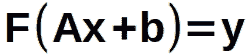

应用于矩阵乘法结果的函数称为*激活函数*；这是一个非线性函数，必须根据应用进行选择。 ***softmax*** 和 ***ReLu*** 是热门选择。

向量 **b** 称为*偏差*，包含一组非零值；它确保如果输入 **x** 全为零，网络仍然可以输出非零值，用于训练/评估。

这肯定是一个更严格的公式，但它使数学变得更难，而且对理解这里揭示的原理没有太大帮助。

此外，在本文中，我们假设偏差是矩阵 **A** 的一部分，输入有一个额外的常数元素等于 1，与偏差相关联。

输出的意义取决于输入数据和神经网络的目的。在数据分类中，输出向量中的每个元素被映射到输入的一个*类*。

面临的挑战是找到权重，使得该类很有可能对输入是正确的。

输出的概率方面是由于通过神经网络建模的系统——像任何数学模型一样——是真实函数的近似。以泰勒多项式为例。这是一种用多项式逼近任何函数的方法，但它只在计算点周围的特定边界内有效；我们离边界越远，得到错误值的机会就越大。

我们如何确定 **A** 的值？

这就是训练的目的。就像篮球运动员学习如何投球一样，训练的主要算法使用试错法的数学版本。

让我们看看这是如何工作的。

# 我们期望的和我们得到的

投篮，错过篮筐，调整力量，移动到不同的位置，再次投篮，击中篮筐，调整力量，再次移动，一遍又一遍地尝试，直到你的大脑知道，不知何故，力量，距离和轨迹角度之间的关系，让球几乎一直穿过篮筐。

从数学上讲，这相当于这个算法:

1.  为权重分配随机值
2.  应用一个具有已知输出的输入(这个已知输出的值称为*标签*；特别是在数据分类中，它代表输入的*类*
3.  使用某个函数将标签与神经网络计算的标签进行比较；计算出的输出称为*预测*。
4.  使用某种方法根据比较结果改变权重
5.  冲洗并从步骤 2 开始重复；当步骤 3 中的函数告诉我们标签和预测足够接近时停止

步骤 3 中使用的函数称为*损失函数*。

通常用于在步骤 4 中更新权重的机制被称为*梯度下降法*。

让我们更详细地研究一下，好吗？

# 梯度下降

如果你还记得你在学校学的微积分，你会记得你可以通过计算函数对感兴趣的变量的导数，使其等于 0 并求解方程来找到函数的局部最小值或拐点。或者，换句话说，我们希望找到 *x* 使得:

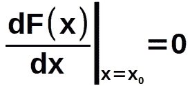

我们如何写一个算法来做到这一点？好吧，我们来看看函数最小值前后的导数的值(我们这里的主要假设是我们的函数确实有最小值)。

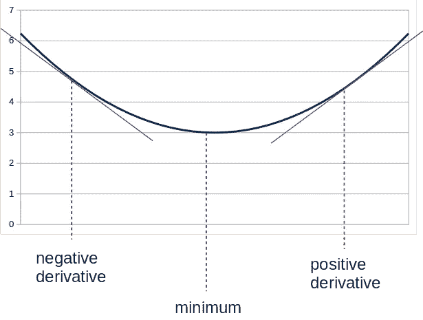

希望从图中可以清楚地看到，如果我们为 *x* 选择某个随机值，并计算该点的函数导数，那么:

a.如果导数为负，我们选择一个点 ***在*** 最小值之前

b.如果导数为正，我们在 后选择一个值 ***为最小值。***

哼，有意思。

基于此，可以使用以下算法确定逐渐接近最小值的 *x* 的值:

1.  得到一个随机的 *x*
2.  计算该点的导数
3.  使用以下公式计算下一个 *x* :

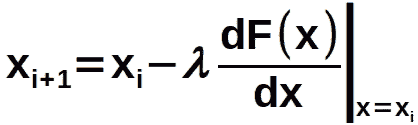

4.从步骤 2 开始重复，直到我们达到最小值(或足够接近我们的需求)

如果导数 ***为负*** 则 *x* 的下一个值比当前值 ***高*** ，使我们更接近最小值；有道理，毕竟当前值是 ***之前*** 的最小值。

另一方面，如果导数是 ***正的*** ，那么 *x* 的下一个值是比当前值低的 的**；也有道理，毕竟当前值是 ***后*** 的最小值。**

该算法被命名为 ***梯度下降*** 。

在我们的例子中，变量是矩阵 **A** 中的权重，我们将对它们中的每一个应用算法。

所以现在我们知道了计算权重的算法，我们必须确定我们应该使用哪个函数来进行比较。换句话说，我们应该选择哪个损失函数。

# 损失函数

*损失函数*或 ***代价函数*** 就是我们要最小化的函数。它是输出的预期值和计算值的函数。

这个函数必须有一些有用的特征:

1.  必须是可微的，所以我们可以在梯度下降计算中使用导数
2.  理想情况下，只有一个全局最小值，否则我们可能会陷入局部最小值，这不是权重的最优解
3.  同样理想的是，它应该迅速收敛到解

根据神经网络的目的，使用不同的损失函数。比如在分类问题中 ***交叉熵损失*** 就是一个比较热门的选择。公式如下:

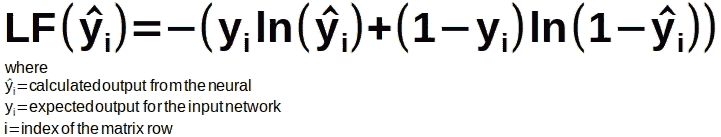

等式 1:交叉熵损失函数

让我们检查这个损失函数是否满足我们上面建立的标准。

*可微吗？*

当然是，因为它是对数的组合。这是关于预测的导数

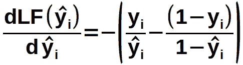

它有一个最小值吗？

毫无疑问，正如你在图表中看到的。没有极大值，没有拐点，只有一个全局极小值。完美。

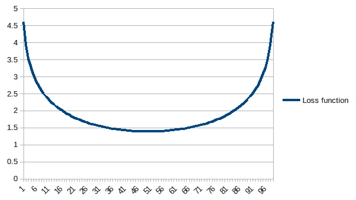

*是否* *快速收敛到解？*

没问题，只要看它的导数的图表(记住，损失函数的导数用于梯度下降法)

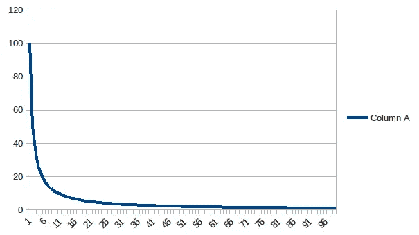

所以这似乎是一个损失函数的明智选择。

我们必须引起读者注意的一件事是，这个函数从 100 到 10 用了大约 20 个点，但从 10 到大约 0 又用了 80 个点。这是训练神经网络的一个固有特性:训练时间呈指数增长，越需要精确。这就是为什么我们需要巨大的计算能力来在可行的时间内训练非常精确的神经网络。

一切看起来都很好。我们只需要最后一条信息。

# 损失函数对重量的导数

为了计算损失函数相对于每个重量的导数，我们将使用链式法则。

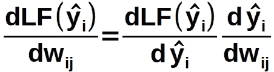

但是自从

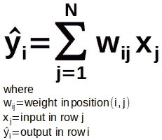

等式 2:神经网络的输出 **i**

然后我们可以写作

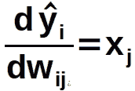

最后，每个重量的梯度下降公式为:

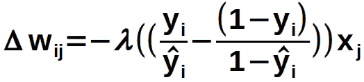

等式 3:应用于矩阵 **A** 中每个权重的值

这就是为什么我们选择一个非常简单的神经网络来展示数学。

在具有复杂图形和不同激活函数的多层神经网络中，不仅数学变得更复杂，而且应用链规则也变得更难以数学表示。

好的，让我们把它们放在一起。

# 计算重量

现在我们已经有了所有的片段，让我们来训练我们的网络。

1.  用一组随机的权重创建矩阵 **A**

2.使用等式 2 计算输入的预测值

3.使用等式 1 计算每个预测的损失函数

4.使用等式 3 计算新的权重

5.用新输入重复步骤 2，直到损失函数低于所需阈值

你可能注意到了 **𝜆** 参数乘以梯度下降方程中的导数；我——故意——一直等到现在才提到它。

这个常数被称为*学习率*，为其选择一个合适的值非常重要。太低，训练过程将永远持续；太高，训练算法可能永远不会收敛。

描述寻找最佳学习率的技术的论文可以在这里找到:[https://arxiv.org/abs/1506.01186](https://arxiv.org/abs/1506.01186)

现在你知道了。利用 TensorFlow 或 Caffe2 等机器学习框架，人们可以用 Python 编写一个程序来定义、训练和执行一个神经网络，其代码行数几乎与上面的项目符号列表相同。

下面是 TensorFlow 的一个例子:

```
import tensorflow as tf
mnist = tf.keras.datasets.mnist

(x_train, y_train),(x_test, y_test) = mnist.load_data()
x_train, x_test = x_train / 255.0, x_test / 255.0

model = tf.keras.models.Sequential([
  tf.keras.layers.Flatten(input_shape=(28, 28)),
  tf.keras.layers.Dense(128, activation='relu'),
  tf.keras.layers.Dropout(0.2),
  tf.keras.layers.Dense(10, activation='softmax')
])

model.compile(optimizer='adam',
              loss='sparse_categorical_crossentropy',
              metrics=['accuracy'])

model.fit(x_train, y_train, epochs=5)<--training is done here
model.evaluate(x_test, y_test)
```

# 最终意见

反向传播似乎相对简单。它不是。以下是它的一些缺点:

## *过拟合*

为训练和测试选择错误的输入集(例如，一个类别的样本比其他类别的样本多)，计算出的权重将会有偏差，并且您的神经网络将无法为其他类别正常工作。

## *欠配合*

选择错误的标准来停止训练，神经网络将在测试和真实数据中表现不佳。如果没有足够大的数据集用于训练，也会发生这种情况。

## *损失函数不收敛*

选择错误的输入序列，损失函数可能永远不会收敛(例如，每个输入“抵消”了根据前一个输入计算的权重的变化)

## 损失函数最小值过于平坦

如果损失函数具有非常平坦的最小值，则损失值可能在最小值附近振荡，但永远不会达到最小值

## 训练率太高或太低

选择一个合适的训练率可能很棘手。选择一个太低的值，损失函数可能永远无法收敛；选择一个过高的值，权重可能会在最佳值附近振荡，永远不会收敛。

# 结论

希望这篇文章有助于揭示反向传播背后的基本原理。正如我之前提到的，这是一个数学上复杂的过程，需要大量的计算能力和聪明的算法——几乎必须使用动态规划——才是可行的。

反向传播是神经网络直到最近才被认真地认为是解决问题的可行机制的主要原因。

有许多与反向传播相关的其他细节使其具有挑战性(例如，层数；权重使用浮点值；正常化；初始权重值),因此这篇文章将为您提供一些关于该主题的更高级文本的基础。

感谢阅读。