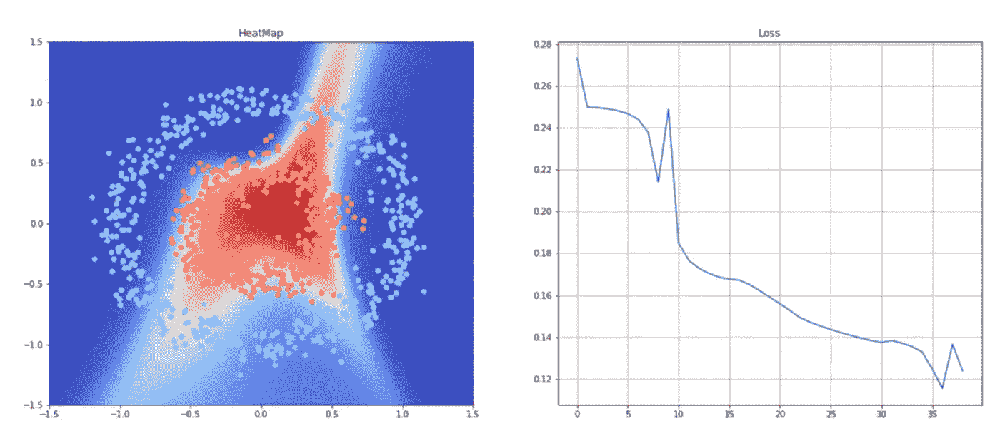

# 从零开始的神经网络

> 原文：<https://medium.com/analytics-vidhya/neural-network-from-scratch-e2c5abc9febe?source=collection_archive---------22----------------------->

## 玩和探索神经网络

众所周知，有几个人认为神经网络是“一个黑匣子”，我们不知道里面是什么，也不知道它们是如何工作的。然而，我不同意这种说法，我认为理解他们如何学习一些任务是一个好的数据科学家的重要组成部分。