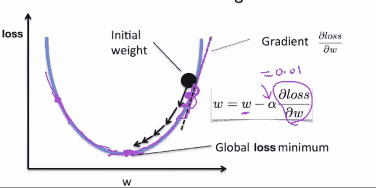

# 从无到有的神经网络

> 原文：<https://medium.com/analytics-vidhya/neural-network-from-scratch-ed75e5e14cd?source=collection_archive---------23----------------------->

照片由 [Artyom Kim](https://unsplash.com/@nezelenoe?utm_source=medium&utm_medium=referral) 在 [Unsplash](https://unsplash.com?utm_source=medium&utm_medium=referral) 上拍摄

owadays 神经网络在科技领域是一个响当当的名字，就像达斯·维德在《星球大战》中一样。许多技术人员确实钦佩神经网络的美丽，但同时又把它当作一个黑匣子。东西进进出出。所以我决定写这篇文章来解释神经网络背后的直觉、理论和数学结构，以便更好地理解。

神经网络背后的想法是人类大脑内部神经元的映射。人类大脑有大量的神经元(根据最近的一项研究，有 860 亿个)，用于执行各种各样的任务。大脑有三个主要部分:大脑、小脑和脑干。

**大脑:** *是大脑最大的部分，由左右半球组成。它执行更高级的功能，如解释触觉、视觉和听觉、语言、推理、情感、学习和对运动的精细控制。*

**小脑:** *位于大脑下方。它的功能是协调肌肉运动，保持姿势和平衡。*

**脑干:** *作为连接大脑和小脑与脊髓的中继中枢。它执行许多自动功能，如呼吸、心率、体温、觉醒和睡眠周期以及吞咽等。*

对于大多数研究来说，**Why**一直是**T21 的一个重要因素，神经网络也是如此。如果我们的大脑中有一张神经元地图，那么我们为什么不能用数字方式实现它呢？这导致了 1944 年芝加哥大学的两位研究人员 Warren McCullough 和 Walter Pitts 创立了神经网络，他们于 1952 年搬到麻省理工学院，成为第一个认知科学系的创始成员。**

从这里，我们将深入研究这些网络背后的理论和数学。

# 什么是神经网络？

有很多定义强调数字神经元(感知器)与人类神经元的相似性，所以我不会去那里，我会尽量保持它的新鲜和更数学化。

神经网络是一组算法，它将一个数学量作为输入，对其进行处理并产生输出，同时不断更新权重和偏差(分别在神经元之间和与神经元一起),以降低预测的不确定性。

# 人工神经网络的应用:

1.  异常检测
2.  语音识别
3.  数据分类
4.  时间序列分析
5.  计算机视觉
6.  还有很多。

# 神经网络的数学结构:

像任何神经元一样，神经网络分为 3 个阶段:输入阶段、处理阶段和输出阶段。

**感知器**:感知器是一个没有任何隐藏层的神经网络。感知器只有一个输入层和一个输出层。

这个网络有一个输入层，两个隐藏层和一个输出层。输入层包含 5 个感知器，隐藏层有 5 个(3+2)感知器，输出层有 1 个感知器。

**一个神经网络由以下组件组成:**

*   一个输入层， *x*
*   任意数量的隐藏层(本例中为 2 层)
*   输出图层，ŷ
*   各层之间的一组权重和偏差， *W 和 b*
*   为每个隐藏层选择激活函数，*∑*。

# **基于理论的简单神经网络类:**

一个有输入 x，输出 y，2 个权重矩阵和 1 个输出预测变量的类。

# **神经网络背后的理论:**

上面已经解释了神经网络的结构。现在让我们来关注一下这种安排是如何工作的。

训练神经网络:针对输入数据微调网络的权重和偏差的过程称为训练神经网络。该培训涉及 2 个参数。这些参数如下所述:

任何神经网络的主干都是**前馈过程**和**反向传播。**这两者结合起来给出了机器学习领域的最佳预测之一。

前馈和反向传播

**前馈过程:**将通过每层激活函数获得的值传递给输入值&(加上偏差，乘以权重)以预测输出的过程称为前馈过程。简单来说，计算预测输出*，就是所谓的前馈。*

**

*两层系统的流程图*

*2 层神经网络的输出是:*

**

*对于 3 层或 n 层系统，可以通过将权重和偏差添加到(n-1)层(即前一层)的输出来扩展方程。*

*在上面的表达式中，有一个函数应用于感知器的加权输入，这个函数被称为激活函数。在我们的例子中，我们使用了 sigmoid 函数，将输出限制在 0 和 1 之间。*

***反向传播:**更新感知器的权重和偏差的连续过程被称为反向传播。反向传播用于减少输出预测中的误差。输入是恒定的，因此我们减少误差的唯一方法是更新权重和偏差矩阵，以便获得所需的值。*

***编辑** : *输入值以矩阵的形式出现，这些矩阵上的所有数学运算都是逐位进行的，即逐元素进行。上面描述的等式下面的&是针对标量值的。在实际情况下，相同的方程对输入矩阵的每个元素都起作用。**

**

***编辑***

*总之，还是回到正题吧。我们需要更新权重和偏差矩阵，但是用什么值来更新它呢？这是成本函数的图像。*

***代价函数**:对于给定的数据，**衡量机器学习模型**的性能的函数。成本函数量化预测值和期望值之间的误差，并且**以单个实数**的形式呈现。*

*预测或分类系统的目标是最小化成本函数，从而获得更高的精度。*

*在我们的例子中，成本函数可以被描述为真实产出(Y)值与预测产出(Y_cap)值之差。*

*在这个例子中，我们将使用误差平方和作为我们的成本函数，但我也将添加我编写的不同成本函数的代码。*

**

***上交所***

*平方和误差就是每个预测值和实际值之差的总和。对差值求平方以获得绝对误差值。*

*既然我们已经找到了误差，我们需要一种方法来反向传播计算出的误差，以便更新权重和偏差。现在我们将需要微积分，尤其是链式法则，这条法则帮助我们找到一个量相对于另一个量的**梯度**(或变化)，同时具有中间依赖性。*

****

****梯度下降法是一种寻找可微函数局部极小值的一阶迭代优化算法。****

*现在，如果我们想要更新权重和偏差，我们需要找出一种方法来检查损失函数对权重(w)的响应，为此，我们需要应用链式法则，因为损失函数和网络权重之间没有直接关系。*

*梯度下降算法试图找到图上的局部极小值。局部最小值是成本函数值最小的权重值，即可以预测更高精度的结果。*

**

*这里我们有一个关于权重的损失函数的结果或导数，帮助我们反向传播误差，更新权重和偏差。*

*现在理论已经被解释了，我们应该用 python 来实现。所以在这里我在神经网络类中增加了两个函数。*

**

*前馈和反向传播*

*想了解更多关于神经网络的视觉见解，请观看这个播放列表。*

# ***包装完毕***

*现在一切都差不多完成了，所以我们应该尝试将基本的神经网络模型应用于一些输入值。*

*X=[[0，0，1] [0，1，1] [1，0，1] [1，1，1]]#训练集输入*

*Y=[0，1，1，0] #训练集输出*

*由于数据集很小，我们应该训练模型，即多次训练前馈和反向传播。让我们选择 2500 作为迭代速率。*

*每次迭代的误差朝着最小值单调递减。过度迭代会导致错误增加，因为模型对训练数据拟合得太紧&因此对测试数据来说表现不佳。*

**

*搞定了！！！我们的模型运行良好。经过 2500 次迭代后，它训练了模型并微调了权重和偏差，这为我们的目标值(Y)提供了非常接近的预测。*

**

*我们终于和平了*

# *临时演员*

*在这一部分，我们将探索不同的激活和成本函数。*

## *激活功能*

**

*激活功能*

*激活函数是限制加权和有偏输入值的函数，这样值不会变得模糊&系统可以处理它。它们限制了功能，并且所获得的输出被作为输入传递给下一层。*

*在大多数情况下，神经网络从业者使用 sigmoid & Relu(校正线性单元)函数，但还有许多其他的函数可供探索。记住这一点，我写了几个可以在不同环境下使用的激活函数。以下是其中的几个。*

**

***不同类型的激活功能***

**

***不同类型的激活功能***

*我发现在这里讨论这些激活函数的数学公式并不合适，因为这会增加这篇已经很长的文章的长度，所以我张贴这个链接来帮助理解[激活函数](https://en.wikipedia.org/wiki/Activation_function)。*

## *价值函数*

**

*正如我已经讨论过什么是成本函数，我想我们应该选择不同类型的成本函数。这里有一个理解不同类型的成本函数的好来源- [来源](/machine-learning-for-li/a-walk-through-of-cost-functions-4767dff78f7)。*

*下面是我写的一些成本函数:*

**

# ***下一步是什么***

**

*下一步是什么？*

*在神经网络领域有很多东西需要学习和理解，比如用于图像分类的卷积网络、生成对抗网络等等。我以后也会写关于他们的文章。*

*超越障碍，尝试理解黑盒背后更深层的算法总是更好的。*

*事实上，学习语言会让你变得更聪明。语言学习的结果是大脑中的神经网络得到加强。*

***结局***