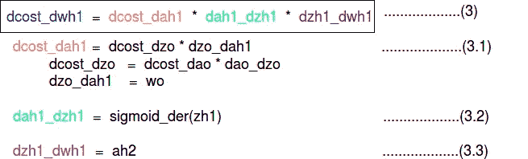

# 神经网络实现:导数、链式法则和乘法。

> 原文：<https://medium.com/analytics-vidhya/neural-network-implementation-derivatives-chain-rule-and-multiplications-818ea3aaf06e?source=collection_archive---------2----------------------->

在本文中，我们试图将重点放在神经网络背后的数学实现上。在阅读这篇博客之前，建议你应该对神经网络有一些基本的了解。

神经网络有两个主要阶段:

1.  正向传播
2.  反向传播

**神经网络(NN):** 神经网络是一种监督算法，其中我们有输入数据(自变量)和输出标签(因变量)。通过使用训练数据，我们将训练神经网络来预测输出变量。开始时，神经网络作出一些几乎是随机的预测。将这些预测与实际输出进行比较，并将误差计算为预测输出和实际输出之间的差值。我们的目标是训练神经网络来减少这个误差/成本函数。

现在，让我们借助一个例子来理解神经网络的数学实现。我们将要创建的神经网络具有以下可视化表示形式。

具有两个隐层的神经网络

上图表示一个有两个隐藏层的神经网络，每个层有 4 个神经元。在输入层，我们有两个神经元指示训练数据中的两个特征列。

1.  **正向传播:**在神经网络的前馈步骤中，使用输入节点值、权重和偏差进行预测。
    数学上:
    *zh21 = x1 w1+x2 w2+b
    ah21 = activation _ function(zh21)* 相似类型的计算将在每个节点发生，并且计算将向前传播直到最后一个节点
2.  **反向传播(BP):** 一旦我们完成正向传播，我们在输出层得到预测为 *ao* 。使用此输出和实际标签，成本函数/误差表示如下:

成本函数/误差

*   我们的目标是微调网络参数以最小化误差项(成本函数)，以这种方式使预测更接近实际标签。
*   如果你观察我们的神经网络，你会注意到我们只能控制权重和偏差。为了最小化成本，我们需要找到成本函数返回可能最小值的权重和偏差值。成本越小，我们的预测就越准确。这是一个 [*优化问题*](https://en.wikipedia.org/wiki/Optimization_problem) 在这里我们要找到 [*函数极小值*](https://en.wikipedia.org/wiki/Maxima_and_minima) *。*
*   求函数的极小值，我们可以使用 [*梯度下降*](https://www.youtube.com/watch?v=sDv4f4s2SB8&t=722s) 算法。

**反向传播的数学实现:**

*   在神经网络的每一层引入的权重负责在预测中引入误差。因此，我们必须更新每一层的权重。在进行反向传播时，我们将从输出层到第一个隐藏层以相反的顺序更新权重。
*   如上图所示，我们必须依次更新三层的权重，即输出层(BP_Phase1)、隐藏层 2(BP_Phase2)和隐藏层 1(BP_Phase3)
*   更新权重时，我们将使用梯度下降，如下所示:

梯度下降

*   在上面的等式中，`J`是成本函数。基本上，上面的等式表示:找到成本函数相对于每个权重和偏差的偏导数，并从现有权重值中减去结果，以获得新的权重值。
*   现在，我们将一步一步地更新上面提到的所有三层的权重。

**渐变下降:**请参考此 [*视频*](https://www.youtube.com/watch?v=sDv4f4s2SB8&t=722s) 深入了解。

*   对损失函数中的每个参数(截距/重量)求导数。
*   为参数选择随机值
*   将参数值代入导数
*   计算步长:**步长=斜率*学习率**
*   计算新参数:
    **新参数=旧参数-步长**
*   重复最后三个步骤，直到步长非常小或达到最大步数。

**A) BP 阶段 1:** 在这个阶段，我们将在输出层更新权重。在这里起作用的数学部分是导数、链式法则和乘法。

*   我们将在该层计算成本函数 w.r.t .权重的导数为***dcost _ dwo***
    由于我们没有这些项的直接值，我们将使用链式法则来计算它们，如下所示:

现在，我们准备计算等式 2。
现在，我们可以使用上述术语更新输出层的权重:
***wo-= lr * dcost _ dwo***，
其中 lr:学习速率。

**B) BP 阶段 2:** 在这个阶段，我们将更新隐藏层 2 的权重。

现在，我们准备计算等式 3。
现在，我们可以使用上述术语更新输出层的权重:
***wh1-= lr * dcost _ dw h1*** *其中 lr:学习速率。*

*BP 阶段 3: 在这个阶段，我们将更新隐藏层 1 的权重。*

**

*现在，我们准备计算等式 4。
现在，我们可以使用上述术语更新输出层的权重:
**wh2-= lr * dcost _ dwh 2**
其中 lr:学习速率。*

*最后，我们更新了所有的权重，从而完成了我们的第一个纪元。对于下一个时期，将使用这些更新的权重，并且该过程将继续该数量的时期。*

****源代码:****

*Python 中的完整脚本*

*为了保持篇幅小且集中于数学部分，我们没有详细解释所有的术语。*

***参考文献**:*

*   *[https://stack abuse . com/creating-a-neural-network-from-scratch-in-python-adding-hidden-layers/](https://stackabuse.com/creating-a-neural-network-from-scratch-in-python-adding-hidden-layers/)*
*   *[https://www.youtube.com/watch?v=sDv4f4s2SB8](https://www.youtube.com/watch?v=sDv4f4s2SB8)*