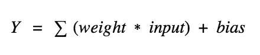
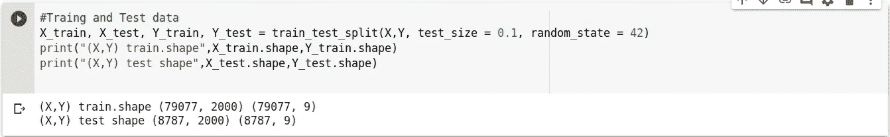
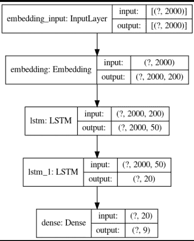

# LSTM 神经网络:文本分类的例子

> 原文：<https://medium.com/analytics-vidhya/neural-network-lstm-example-of-text-classification-398e01cab054?source=collection_archive---------6----------------------->

首先，我们将解释什么是神经网络，更具体地说是 LSTM。

**ANN-人工神经网络**是人工智能中使用的数学模型。它使用大脑的处理过程作为基础来开发算法，这些算法可用于对复杂模式和预测问题进行建模。

**人类大脑中的灵感**。在我们的大脑中，有数十亿个被称为神经元的细胞，它们以电信号的形式处理信息。外部信息/刺激由神经元的树突接收，在神经元细胞体中处理，转化为输出，并通过轴突传递到下一个神经元。下一个神经元可以根据信号的强度选择接受或拒绝它。

当我们说人工神经网络学习图像和语音识别、手写或预测时，它实际上是在调节它的权重。这意味着，给予这个输入信息更多或更少的重要性，以提供一个输出，加强或抑制节点之间的连接。

学习是找到给定输入的权重矩阵，使网络产生一个期望的输出。

例子:从一个神经元到 B 有一条线，这条线可能在 0，这意味着输出乘以 0，因此它是抑制性的。

**总之:**

当我们出生时，我们有 100 亿个神经元。它们都在那里，但它们之间的联系仍有待一个完整的定义。在我们的一生中，伴随着错误和测试，以及我们的父母说“这可以或不可以”，我们在学习，这在这些神经连接中产生了变化。

# 它的应用呢？

关于在哪里可以找到它的一些例子

**自动驾驶汽车**

制造这种驾驶辅助服务的公司，以及像谷歌这样的成熟自动驾驶汽车，需要教会计算机如何使用数字传感器系统而不是人类的感官来接管驾驶的关键部分(或全部)

为了做到这一点，公司通常会从使用大量数据训练算法开始——谷歌用来检测不安全访问的验证码作为图片中的检测元素，也用于训练神经网络。

**医疗保健和图像识别中的深度学习**

乳腺癌或皮肤癌诊断、移动和监测应用，或者预测和个性化药物

**语音搜索&声控助手**

像 Cortana，Siri，Alexa …

**文本分类**

客户投诉、银行活动分类、rrhh 候选人(LinkedIn 和 Bright)

**预测**

西班牙和葡萄牙的研究人员已经将人工神经网络应用于能源网，试图预测价格和使用量的波动。银行应用(预测客户收入/结果)，股票预测的物流，金融市场…

**广告**

预测消费者行为，创造和理解更复杂的买家群体，销售预测

**预测地震**

哈佛大学的科学家利用深度学习来教计算机如何进行粘弹性计算，这些计算用于地震预测。

# **放大模型**

这是一个典型的多层完全连接的人工神经网络:

1.  输入层-神经网络的初始数据。
2.  隐藏层-输入和输出层之间的中间层，所有计算都在此完成。
3.  输出图层-生成给定输入的结果。
4.  Wi，j，k 权重是节点对于下一层有多重要
5.  激活函数-将输入乘以相应的权重，将偏差添加到结果中，最后应用激活函数将该值转换为范围。

激活函数将确定 Y 是否足以产生下一层的输出。

激活功能的一些例子是:

*   谭:[-1，1]
*   西格蒙德:[0，1]
*   softmax: [0，1](仅适用于最终层之类的多类)。
*   ReLU: [0，inf]

根据拓扑和问题，激活函数可能比其他函数更好。您可以在中找到更多信息

 [## 神经网络中的激活函数

### Sigmoid，tanh，Softmax，ReLU，Leaky ReLU 解释！！！

towardsdatascience.com](https://towardsdatascience.com/activation-functions-neural-networks-1cbd9f8d91d6) 

**总之，这是神经元从输入到输出的过程:**

# 我们几乎准备好开始了！

最后，准备好之前的最后概念；)

在每次迭代中，网络产生一个输出。如果该输出不是预期的，学习算法(反向传播)会重新计算这些权重，以减少损失并提高精度，从而提高预期输出。

因此，在每次迭代中，我们将获得训练模型的精度和损失。

**训练和验证模型是什么意思？？？**

当我们加载一组例子来训练人工神经网络(csv 文件，h5 等)时，我们决定它的哪一部分专用于训练我们的模型。其余部分将用于验证这一学习过程。

最后，LSTM 是一种递归神经网络。在非常高的水平上，在一次迭代中获得的输出也被考虑到下一次迭代中，允许记忆有用的信息。

有三个门(输入、输出和遗忘)

非常有用的手写和语音识别，预测(缺乏信息)

**我们终于获得了启动 LSTM 安项目所需的所有信息！！！**

# 问题定义和步骤

我们将对呼叫中心生成的投诉 csv 文件进行分类。

该文件包含投诉、日期和标签分类(预付卡、抵押贷款、储蓄账户、债务、转账、个人贷款、车辆贷款、学生贷款、客户报告和消费者报告)

在机器学习中，无论使用什么技术，过程总是相同的:

1.  读取文件并清除数据。删除无用的单词，如冠词、特殊字符等。确保尽可能同质的配置。这对于我们的网络获得最好的学习是很重要的。
2.  将信息矢量化，因为 ANN、Bayes、Random Forest 等只理解浮点而不理解文本
3.  建立模型
4.  适合的
5.  使用图、热图收集和分析准确性和损失信息，以测量预测和实际产出之间的偏差
6.  最后用真实数据进行预测

# 1.-第一步:读取源并准备数据

要阅读 python 中的文件，你可以使用 pandas 库。这样你就可以打开 csv 或 h5(用于训练过的模型)文件**。**

您还可以使用 df.head()获取第一行，df.get_values()等

这是条目数据的直方图:

删除无用的单词，如冠词、特殊字符…

# 2.-第二步:将信息矢量化

ANN 只理解 float，因此我们必须将文本转换成数字

# 3.-第三步:模型创建

我们已经创建了一个用于准备输入数据的嵌入层，两个具有 50 和 20 个单元(神经元)的 lstm 层和一个具有 9 个单元(用于这 9 个类别)的输出层

# 4-第四步:训练模型

对于 5 个时期(迭代)，我们将在/logs 目录中保存每个迭代的精度和损失。使用 tensorboard，我们可以看到这些度量的图(训练和测试模型的准确性和损失)

# 第五步:分析结果

在这些与精度和损耗相关的数字中，您可以看到一点过度拟合

在这些图中，您可以看到一点过度拟合(步骤 2)。当训练数据的准确性持续提高，而测试数据的准确性持平甚至下降时，就会发生这种情况。

这意味着，人工神经网络是记忆数据而不是学习，因此无法适应额外的数据或预测未来的信息。

这个问题可以通过在训练过程中添加噪声来解决，就像我们之前对辍学所做的那样，更新数据源以确保所有类别都得到代表并且信息是可靠的。以及调整 ANN(添加或删除层、神经元、激活函数、ANN 类型、学习速率、优化方法等)

啊！您可以使用以下方式启动 tensorboard:

> tensorboard — logdir=。/logs 您还可以指定添加其他端口— port=

在您的导航器中，您将能够调试、检查准确性、查看拓扑…

# 第六步:预测

> 该公司拒绝根据 FDCPA 向我提供债务验证和确认。我不相信这笔债是我的。**【讨债】**
> 
> 我质疑 Chex-Systems 在我的信用报告上的不准确信息。我最初提交了一份关于 XXXX/XXXX/16 的警方报告，Chex Systems 只删除了我在信中提到的项目，而不是警方报告中实际列出的所有项目。换句话说，他们想让我逐字逐句地告诉他们哪些商品是欺诈性的。完全无视警方的报告以及报告中所说的欺诈性账目。如果他们稍微关注一下警方的报告，我现在就不会处于这种境地，他们也不会再一次调查。我希望报告的信息被删除:XXXX XXXX XXXX **['信用报告']**
> 
> 我在和我的学生贷款车 paypal**[‘学生贷款’]**
> 争论我在和我的抵押混淆误导术语**[‘抵押’]**
> 加钱**[‘转账’]**

> ***如你所见，它运行得很好！***

# **就这些！！！**

您可以在以下位置下载代码和文件:

 [## 伊娃·安德烈斯/LSTM·安

### GitLab.com

gitlab.com](https://gitlab.com/eva.emandres/lstm-ann/) 

**在下一篇文章中，我们将使用卷积神经网络、朴素贝叶斯、随机森林等来解释这个例子……**