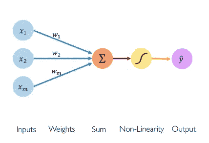

# 神经网络第一部分:单个神经元内部

> 原文：<https://medium.com/analytics-vidhya/neural-network-part1-inside-a-single-neuron-fee5e44f1e?source=collection_archive---------8----------------------->

感知器或单个神经元是神经网络的基本构件。神经元的概念是基本的，但也是必要的。

让我们开始理解信息通过单个神经元的*正向传播。*

**

*我们将该神经元的一组输入定义为 x1，x2 …xn。并且这些输入中的每一个都具有相应的权重 w1 …wn。我们能做的是用…*