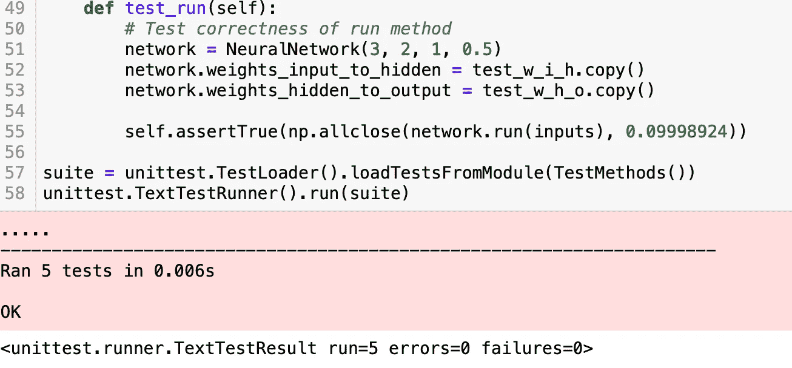

# 神经网络预测自行车共享骑行

> 原文：<https://medium.com/analytics-vidhya/neural-network-to-predict-bike-sharing-rides-397e0358ba45?source=collection_archive---------8----------------------->


在本文中，我们将讨论从头构建一个神经网络，使用真实数据集进行预测。这种方法将帮助我们更好地理解神经网络的概念。数据集可在以下位置找到:

[https://archive . ics . UCI . edu/ml/datasets/Bike+Sharing+Dataset](https://archive.ics.uci.edu/ml/datasets/Bike+Sharing+Dataset)

我们将创建两个文件:Jupyter Notebook 和 my_answers.py，它们将实际包含我们的神经网络和超参数。

1.1 我们开始用木星笔记本预测 _ 自行车 _ 共享 _ 数据。我们执行所有必要的进口:


第`*%matplotlib inline*`行将 matplotlib 图形放在代码旁边。

*下两行:*

```
%load_ext autoreload
%autoreload 2
```

每次执行新的一行之前，都会重新加载所有更改过的模块。

`%config InlineBackend.figure_format = ‘retina’` 的目的是增加我们绘图的分辨率。

`import numpy as np` 是用 Python 包导入的基础科学计算。

*import pandas as pd* 是 Python 库的导入，用于数据操作和分析。

`import matplotlib.pyplot as plt` 导入模块“matplotlib.pyplot”，pyplot 是 matplotlib 的绘图框架。

1.2 我们用`rides = pd.read_csv(data_path)`**读取数据集用 *rides.head()* 看数据帧的前 5 行**

****

**1.3 让我们来看一个图表，显示数据集中前 10 天左右骑自行车的人数。并不是每天 24 个条目。周末的客流量较低，而当人们骑自行车上下班时，客流量会出现高峰。**

****

**1.4 我们用熊猫`get_dummies()`创建二进制虚拟变量**

****

**1.5 我们通过移动和缩放变量来标准化每个连续变量，使其平均值为零，标准差为 1。**

****

**1.6 我们将数据分为训练集、测试集和验证集。**

****

**2.1 现在我们要在 my_answers.py 文件中构建我们的网络。在我们的类 NeuralNetwork(object)中，我们定义了构造函数方法 __init__。我们设置输入层、隐层和输出层的节点数，初始化权重，将 self.activation_function 设置为 sigmoid 函数。**

****

**2.2 我们在 forward_pass_train 中实现前向传递，当我们在网络的各层中工作时，计算每个神经元的输出。我们使用初始化的权重将信号从神经网络的输入层向前传播到输出层。输出层只有一个节点，它用于回归，因此节点的输出和节点的输入是相同的。**

****

**2.3 我们在反向传播中实现反向传播。我们还使用权重将误差从输出反向传播回网络，以更新我们的权重。**

****

**2.4 我们在 update_weights 中更新梯度下降步骤上的权重。**

****

**2.5 我们在`run`方法中实现向前传递。**

****

**2.6 我们定义了用于训练神经网络训练。**

****

**3.1 我们回到 Jupiter 笔记本 Predicting_bike_sharing_data，在这里导入我们的神经网络。**

****

**3.2 我们运行这些单元测试来检查我们的网络实现的正确性。**

********

**4.1 我们要训练我们的神经网络。我们在您的 myanswers.py 文件中设置超参数**

****

**设定超参数时需要考虑的事情**

****

**4.2 我们将它们导入我们的笔记本**

****

**4.3 我们训练我们的网络。**

********

**4.4 最后，我们检查我们的预测**

****

**您可以在这里找到完整的代码:**

**[](https://github.com/forfireonly/Bikesharing_neural_network) [## for fire only/bike sharing _ neural _ network

github.com](https://github.com/forfireonly/Bikesharing_neural_network) 

快乐编码我的朋友们！**