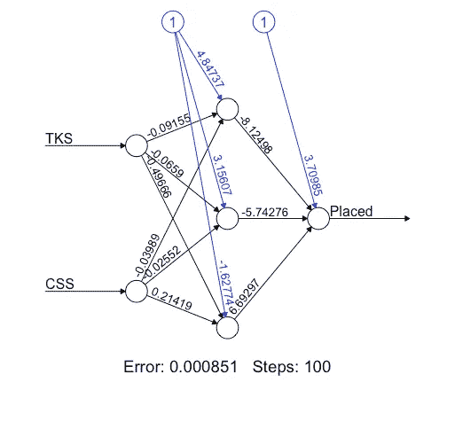
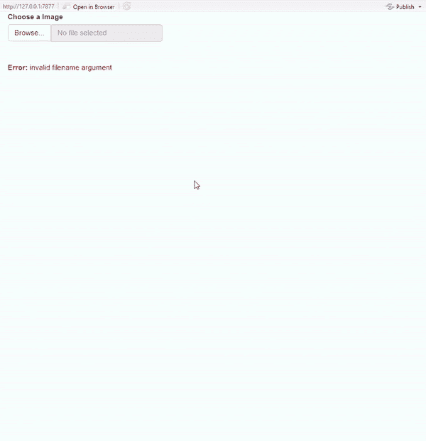

# 如何使用 R 创建神经网络

> 原文：<https://medium.com/analytics-vidhya/neural-network-using-r-fbd9156a2ffa?source=collection_archive---------20----------------------->

## 创建并可视化神经网络，该网络接收数据集并训练模型来预测结果。


由[乌列尔 SC](https://unsplash.com/@urielsc26?utm_source=medium&utm_medium=referral) 在 [Unsplash](https://unsplash.com?utm_source=medium&utm_medium=referral) 上拍摄的照片

[](https://github.com/mridulrb/Neural-Network-in-R) [## mridulrb/人工神经网络

### 在这个研讨会中，我们将把它应用到机器学习领域，并向您展示如何使用 R 来创建和…

github.com](https://github.com/mridulrb/Neural-Network-in-R) 

**什么是 R？**
R 是一种用于统计计算和图形的编程语言和免费软件环境。统计学家和数据挖掘者广泛使用 R 语言来开发统计软件和数据分析。

**使用 R 的优势**
它是一种开源语言，与其他语言相关，使其能够跨平台兼容。

**安装指南**
下载[R](https://cran.r-project.org/bin/)&[R studio](https://www.rstudio.com/products/rstudio/download/)

**软件包**
**CRAN —全面的 R 归档网络**
CRAN 是一个分布在世界各地的 FTP 和 web 服务器网络，为 R 存储相同的、最新的代码和文档版本

要在 R 中安装软件包，请在 R 控制台中键入下面提到的命令，或者转到“工具”并单击*安装软件包*并安装下面提到的软件包。

```
 shiny — install.packages(“shiny”) 
nnet — install.packages(“nnet”) 
EBImage — install.packages(“BiocManager”) 
 BiocManager::install(“EBImage”) 
```

R 中的**语法**和
来熟悉 R .从[语法运行代码。R](https://github.com/mridulrb/Neural-Network-in-R/blob/master/Syntax.R) 包含 if-else 语句、for 循环、while 循环、break &下一条语句和一个函数的示例。

**线性回归和曲线拟合**
线性回归是一种对标量响应相关变量和独立变量之间的关系进行建模的线性方法。

曲线拟合是构建曲线或数学函数的过程，它对一系列数据点具有最佳拟合，可能受到约束。

运行来自 [**回归&曲线拟合的代码。R**](https://github.com/mridulrb/Neural-Network-in-R/blob/master/Regression%26Curvefit.R) 了解 r 中线性回归和曲线拟合的工作原理。

**神经网络**
**神经网络入门**
人工神经元网络(ANN)，俗称神经网络，是基于生物神经网络结构和功能的计算模型。就计算机科学而言，它就像一个人工人类神经系统，用于接收、处理和传输信息。
基本上，一个神经网络中有 3 个不同的层:-
**(所有的输入都通过这一层馈入模型)
**隐藏层**(可以有一个以上的隐藏层，用于处理从输入层接收的输入)
**输出层**(处理后的数据在输出层可用)**

****

****输入层**
输入层与向神经网络呈现模式的外部环境通信。它的工作只是处理所有的输入。这个输入被传递到下面解释的隐藏层。输入层应该代表我们训练神经网络的条件。每个输入神经元应该代表影响神经网络输出的某个独立变量。**

****隐层**
隐层是应用了激活函数的神经元的集合，是输入层和输出层之间的中间层。它的工作是处理前一层获得的输入。因此，该图层负责从输入数据中提取所需的要素。在评估隐藏层中的神经元数量方面已经进行了许多研究，但是仍然没有一个研究能够成功地找到准确的结果。此外，在一个神经网络中可以有多个隐藏层。所以你一定在想，对于哪种问题，需要使用多少个隐藏层。假设如果我们有可以线性分离的数据，那么就没有必要使用隐藏层，因为激活函数可以被实现到输入层，这可以解决问题。但是在处理复杂决策的问题的情况下，我们可以根据问题的复杂程度或所需的精确度使用 3 到 5 个隐藏层。这当然不意味着如果我们继续增加层数，神经网络将给出高精度！如果我们增加一个额外的层，精度会变得不变或下降。此外，我们应该计算每个网络中神经元的数量。如果与问题数据的复杂性相比，神经元的数量较少，那么在隐藏层中将有非常少的神经元来充分检测复杂数据集中的信号。如果网络中存在不必要的更多神经元，则可能出现过度拟合。目前使用的几种方法都没有提供计算隐含层数目以及每个隐含层中神经元数目的精确公式。**

****输出层**输出层呈现的模式可以直接追溯到输入层。输出层中神经元的数量应该与神经网络执行的工作类型直接相关。要确定输出层中神经元的数量，首先要考虑神经网络的预期用途。**

**为了理解神经网络，我们需要将神经网络可视化。
运行 [**NeuralNet_Visualization 中的代码。R**](https://github.com/mridulrb/Neural-Network-in-R/blob/master/NeuralNet_Visualization.R) 其中会绘制一个小的神经网络。**

****

****运行您的第一个神经网络！**
再简单不过了。步骤如下:
1。克隆这个 [**库**](https://github.com/mridulrb/Neural-Network-in-R)
2。打开数字识别器/神经网络。RStudio
3 上的 r 文件。安装自述文件中前面提到的所有软件包。
4。通过点击屏幕下半部的终端选项卡并键入 Rscript“yourfilepath”来运行 R 文件。Mac 中有效文件路径的一个例子是“~/NeuralNetwork”。r”。在这个文件中，神经网络已经准备好从一个名为 MNIST 的手写数据集中识别数字。观察终端，直到它显示迭代。这表示训练已经发生，并且网络处于其第 n 次迭代。等到终端空了。
5。打开 DigitRecognizer。R，这是一个 R 文件，其中 GUI 界面使用 Shiny，一个 R 包已经使用。
6。安装自述文件中前面提到的所有软件包。
7。运行程序并使用界面上传该存储库中的测试图像。然后观察你的神经网络，因为它成功地识别数字。**

****

**注册一个 **IBM Cloud** 账户来尝试这个关于云的教程。**

 **[## IBM 云

### 使用 190 多种独特的服务立即开始建设。

ibm.biz](https://ibm.biz/BdqQBT)** 

# **结论**

**在本教程中，我们学习了如何创建和可视化神经网络，该网络接受数据集并训练模型来预测结果。**