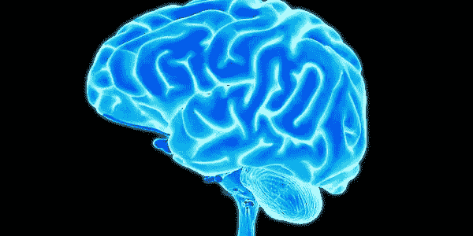

# 神经网络:模仿人脑的艺术

> 原文：<https://medium.com/analytics-vidhya/neural-networks-an-art-to-mimic-human-brain-7c5fcbe5c921?source=collection_archive---------28----------------------->

来源:互联网

为了从人类大脑的一个音符开始，决定一个人到底应该从哪里开始有点矛盾。人脑是人类已知的最复杂的机器之一。无论是存储日常活动(数据)的准确能力，还是以一种不安的方式监控复杂的人类系统，它一直是我们的灵感，甚至对我们来说更是一个谜。它控制身体的大部分活动，处理和协调从感觉器官接收的信息，并在此后做出决定。人脑从出生的那一刻起就开始工作，直到人的最后一口气，以最高的效率完成任务。人类被认为是进化的顶峰，唯一的功劳归于人脑。

来源:互联网

使我们的大脑极其独特的是它从以前的经历中学习的显著特征。杰夫·贝索斯关于人脑的一句名言阐述了大脑是一台不可思议的模式匹配机器。人脑的这种独特能力为许多现代分支奠定了基础，这些分支统称为人工智能。人工智能的一个分支领域是神经网络。神经网络的定义相当模糊。其中之一是将神经网络视为对人脑内部结构的研究，以便在机器上人工诱导智能。如果你在谷歌上搜索神经网络这个词的定义，弹出的结果是这样的:*“一个模仿人脑和神经系统的计算机系统”*。因为它完全基于模拟人脑，所以让我们深入研究人脑的结构。

人脑是神经系统的中枢器官。它由大脑、髓质和小脑组成。但在细胞水平上，大脑是一群被称为神经元的基本单元。神经元是大脑和神经系统的基本工作单位，具有细胞体、轴突和树突。细胞体是由细胞核和细胞质组成的神经元的动力室。从细胞体发出的是轴突，轴突进一步分支成称为神经末梢的更小的末梢。树突从神经元胞体延伸出来，接收来自其他神经元的信息。大脑的全部活动都以神经元中神经冲动的运动为特征。这就形成了一个系统，神经细胞通过这个系统进行交流。冲动来源于神经元的树突，通过细胞体和轴突到达神经末梢。从神经末梢传到附近的神经元。来自邻近神经元的神经冲动由树突收集，累加并传递给细胞体和轴突以进一步传输。这个过程随着时间的推移不断重复。神经元对神经冲动的传递和接收构成了我们的智力、行动、反应等特征的基础。

来源:互联网

在总结了神经元的知识之后，让我来解释一下神经网络的概念。神经网络基本上是各层的密集互连，这些层进一步由称为感知器的基本单元组成，感知器从神经元获取其基本功能。感知器由输入端、处理单元和输出端组成。感知器的输入端连接到前面的感知器的输出端。像神经元一样，感知器通过输入端接收来自前面感知器的所有输入信号。处理单元将从输入端接收的所有信号相加，对其进行激活，并将结果信号传输到输出端。

一个简单的神经网络

感知器接收一组输入值。感知器基于权重向量 w 计算向量输入值的加权平均值，并向结果添加偏差。该计算的结果通过非线性激活函数传递，该函数形成该单元的输出。这些感知器的集群被排列成密集的层，这些层进一步相互连接，形成我们所感知的神经网络。神经网络是以顺序方式堆叠的层的集合。一组层的输出是下一组层的输入。深度学习，神经网络的一个应用，纯粹是基于神经层的构建。

输入向量的加权平均结果被传递给激活函数。激活函数是神经网络的关键特征之一。传统的机器学习方法基于线性的思想，并且主要关注系统的线性建模。然而，神经网络仅仅基于非线性。这些网络的整体节奏取决于它对系统进行非线性建模的能力。因此，在没有激活函数的情况下，神经网络变成输入信号的线性组合。非线性元件允许在学习过程中更大的灵活性和复杂函数的创建。然而，在构建神经网络的过程中，应该始终小心，以避免模型过度拟合。对于那些想知道更多关于过度拟合及其补救措施的人，请阅读下面我写的博客。

 [## 适配过度与适配不足:对完美平衡的追求

### "完美的平衡，就像所有事物应该的那样……！"你们都记得电影《无限战争》中的这句著名对白…

medium.com](/analytics-vidhya/overfitting-and-underfitting-the-quest-for-a-perfect-balance-4e0f499c12ad) 

神经网络作为参考建立了一系列的算法，在数据中建立一些关系。它为现代上下文自然语言处理(NLP)奠定了基础。通过改变感知器的权重向量 w 来训练神经网络，同时跟踪其在指定数据集上的性能。我们应用于传统机器学习的所有预处理方法也适用于神经网络，以获得更好的性能。神经网络已经成为应用最广泛的人工智能工具之一。它们用于解决许多业务问题，如预测、客户研究、数据分析和验证以及风险管理。

在即将到来的博客中，我将详细讨论神经网络背后的数学原理。现在，我想让你们清楚地了解神经网络到底是什么，以及它到底是如何工作的。

> 在这篇博客中，我已经向你介绍了神经网络的基本概念以及它是如何工作的。我希望这篇博客对你有所帮助，并能激励你深入主题