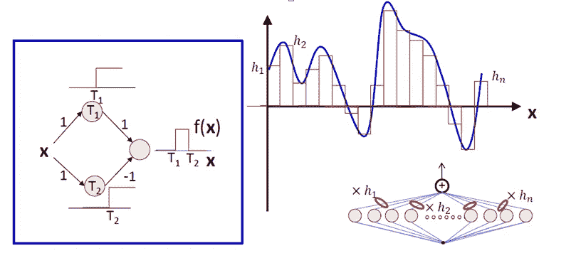
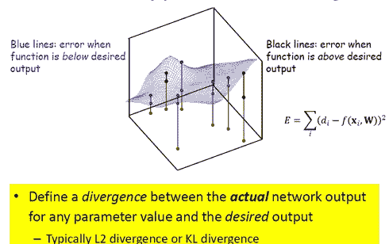
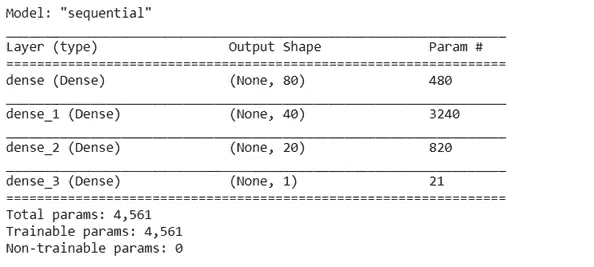
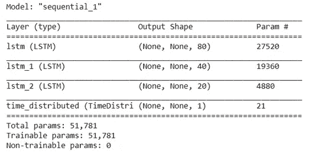
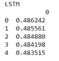
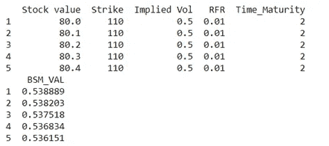
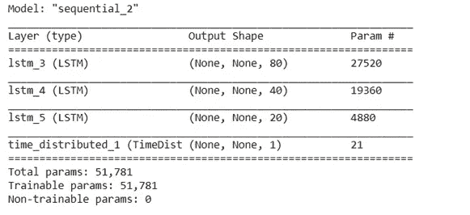
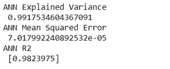
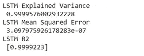

# 神经网络、通用逼近定理和期权估价

> 原文：<https://medium.com/analytics-vidhya/neural-networks-and-the-universal-approximation-theorem-e5c387982eed?source=collection_archive---------9----------------------->

作者:CQF 阿布西塞克·达斯



用阶跃函数逼近连续函数的 3 单元多层感知器

“数据科学”、“机器学习”，这些似乎是 21 世纪第二个十年主导技术和计算机科学叙事空间的流行语。从国家政府到墨守成规的企业，每个人似乎都渴望赶上这股潮流。“数据是新的黄金”似乎是这个美丽新世界和机器学习新领域的号角。神经网络和深度学习似乎在观众中有着特殊的声望，因为它似乎唤起了“真正的人工智能”及其无限可能性的梦想。

然而，正如在现实世界中不可避免的那样，有很多怀疑论者。“黑箱”、“不合理的期望”、“未能实现”是对这些明显的勒德分子的反驳，他们指出，“包装在浮华和魅力中的统计数据”未能实现过去赌客的高期望。


罗森布拉特的感知机在当时确实激怒了媒体

因此，这个可能价值数十亿美元的问题是，谁是对的？狂热分子还是怀疑论者？依我拙见，都不是。

数据科学或机器学习基本上是基于数学和统计学的算法在现实世界问题中的应用。现在我知道机器学习还有很多内容，尤其是它的实现，但是让我们继续讨论它的基本内容。众所周知，数学和统计学是由少数天才开发的，他们坐在所谓的象牙塔里，想出令人惊讶的聪明的办法来解决困扰世俗世界的问题。但是这种方法存在一些问题。数学被认为是“上帝的笔迹”，被用来理解和解决自然提出的问题。通常，我们说大自然变化无常，但当谈到她的规律时，她却一点也不。万有引力、热力学和电磁学定律是不可违背的，不会因为现实世界的应用而改变。使用这些定律设计的飞机不会在某个特定的地方停止工作，因为“基本假设不再成立，或者用于开发模型的初始数据不足以捕捉实际的系统机制”。但是，当涉及到人类的情况时，没有什么是神圣不可侵犯的。

这对机器学习提出了一个相当严重的问题。我们基本上是在使用开发出来的工具，来理解一个按照基本的、固定的规则运行的世界，来分析绝对不是这样的情况。这一问题在金融等行业更加严重，因为这些行业的条件随时都可能发生变化，过去并不能保证未来(尽管大多数金融模型都是基于这一假设，参见鞅和马尔可夫过程)。

此外，当涉及到金融时，并不是所有的 ML 算法都是平等的。我们经常谈论 ML 工具箱，这是有原因的。想想像无处不在的 SKLEARN 或 TENSORFLOW 这样的库，你可以进入工具箱来修理特定的设备。现在，不同的工具有不同的效用，为了解决你的问题，或者“修理你的设备”，你必须知道哪一个工具，或者哪一个特定的组合，会给你最佳的结果。为此，我们需要知道每个算法实际上是如何工作的。

当然，在这一点上有一个现成的反驳，即我们尝试了所有的算法，并坚持那些对特定情况最有效的算法。但是这种方法的问题是:如果一旦你找到了你的“最佳算法或组合”并构建和实现了你的系统，你的问题空间也就是你的数据改变了怎么办？记住数据科学或数据分析的基本规则，“垃圾输入，垃圾输出或 GIGO”。ML 的整个工作方式都是基于数据的，所以你需要理解 a)你的算法是如何工作的，以及它的局限性 b)你的数据可能如何变化，以及它在未来可能的行为，以便建立一个高效的系统。

**神经网络如何工作(真正简化版)**:

神经网络是通用函数逼近器，单层神经元可以逼近任意精度水平的任何函数，尽管这可能需要数量不切实际的神经元(可能是无限的)来实现，因此最好有多层和非线性激活函数(tanh、sigmoid、ReLu 等)。



一个函数和网络如何试图逼近它

上图中，我们有一个函数，网络未知，点代表我们馈入网络的输入数据。通过使用**反向传播**(基本上取损失函数 w.r 的导数，t 输入的权重)**，**，网络试图最小化误差，即 e

通用近似定理指出:

*   一种前馈网络，其具有:1)线性输出层，2)至少一个包含有限数量神经元的隐藏层，以及 3)某些激活函数可以以任意精度逼近紧致子集上的任何连续函数。

该定理首先针对 sigmoid 激活函数得到证明(Cybenko，1989)。后来表明，通用近似性质并不特定于激活的选择(Hornik，1991)，而是多层前馈结构。

然而，让我们后退一步，想想这个定理的含义。基本上是说，如果你有足够的(这是非常重要的)来自连续函数的输入数据，并且你有一个分类或回归问题，你就是黄金。只需建立一个，最好是多层网络，编写一个框架将输入数据输入网络，瞧，成功了！

当涉及到语音识别(这是一种功能，想想你的 MP4 音频文件是如何工作的)，人脸识别(还是功能)或基于规则的游戏(围棋)等问题时，神经网络是冠军。但是，然后我们听到这样的说法，对于用户推荐系统或时间序列分析或现实生活数据，集成技术击败了网络，我们想知道神经网络是否真的是我们认为的灵丹妙药。

答案是否定的。如果你想要通过一个函数将输入数据和输出数据联系起来的预测，那就用神经网络吧。否则，看看其他地方，如随机森林，集成技术，甚至懒惰的基于实例的技术，如 K-Nearest。如果您的输入是不确定的数据或非参数，那么神经网络可能不是最好的。

在金融领域，神经网络非常适合预测期权的价值，以及 SABR 波动率等模型的输出。现在我们必须注意的是，SABR 代表随机α，β，ρ，因此输出(在这种情况下的波动率)将是随机的，即随机的。那么，如果神经网络能够很好地预测‘随机’过程，为什么我们不能用它来预测股票市场价格呢？

这个问题的答案在于“随机”和“不确定”之间的细微差别。如果我们有一枚**公平或无偏见的**硬币，我们掷一次硬币，获得正面的概率是多少？它是 0.5，我们有可能得到一条尾巴。这是“随机过程”建立在例如由 dW 表示的 Weiner 过程上的前提，其中


但是如果硬币是**不公平的呢？**那么我们就不能用维纳过程来模拟这个过程，也不能模拟它的结果。

现在股票价格变化的通常模型给出如下:


其中第一部分是漂移，第二部分是扩散。投资者真正感兴趣的是股价随时间的漂移，或逐渐上升或下降。如果你有 100 美元，你想知道你选择的股票是否会在 5 年内翻倍，漂移是你感兴趣的。

但是，在期权估值模型的圣杯，Black Scholes 模型中，使用巧妙的技巧(delta 对冲)，漂移项被去掉了，我们剩下的是第二部分，包含波动率或噪声(可以知道，或再次建模)的扩散，股票价格(在最终的 BSM 方程中不存在)和 dW，dW 是时间梯度的平方根(因此在一个时间相关的过程中不是严格随机的)。

但是当我们谈到现实世界的股市预测时，硬币实际上是有偏差的。市场可以根据一个简单的谣言或一个骗局或新法规的消息上下波动，不可预测的消息可以使它快速移动或突然挣扎。它不是随机的，它是不确定的，非参数的。因此，试图将股市简化为一个参数函数是非常困难的，甚至可能是徒劳的。

**以上所有编码示例:**

下面我将尝试使用神经网络及其变体 LSTM(长短期记忆)网络来预测数字期权的价值。

通俗地说，数字期权是一种期权，根据某个条件(到期时的基础价值减去合同开始时的价值)在期权到期时是否大于 0，要么支付全部，要么不支付。所以它的值是基于函数的，应该很容易用神经网络来近似。

首先，我使用 Black Scholes 模型和 Monte Carlo 模拟对其进行评估，然后我将这两个函数的输入与标记数据一起输入到网络中，并尝试进行预测。

初始步骤，加载所有库:


在本节中，我们从 excel 文件中获取特征和目标数据。目标数据是使用单独的代码生成的，该代码使用 Black Scholes 模型对数字期权进行定价，还使用 50000 次迭代的蒙特卡罗模拟。但是要使用的文件只有 BSM 估价。请注意，在此估值中，隐含波动率、无风险利率和到期时间保持不变。只有基础价格和期权执行是变量。

人工神经网络代码:

```
start_time_ANN=datetime.now()data=pd.read_excel(r'C:\Users\abhis\Desktop\Digital_Option_Val_conventional_100.xlsx', sheet_name="Sheet1", index_col=0, usecols=[0,1,2,3,4,5,6])print(data.head())X_Features=pd.DataFrame(data)Y_Response=X_Features[['BSM_VAL']].copy()X_Features=X_Features.drop(columns='BSM_VAL')print(X_Features.head())print(Y_Response.head())Y_Response=Y_Response['BSM_VAL'].ravel()
```

我们有以下输出(检查特性和响应数组，以确认特性数组没有任何输出，即标签。初学者的好练习)

输出:


初始数据、特征和响应(标有输出)

对 ANN(人工神经网络)模型进行编码并获得输出:

```
model=Sequential([Dense(units=80, input_shape=(5,), activation='relu'),Dense(units=40, activation='relu'),Dense(units=20, activation='relu'),Dense(units=1, activation=**None**)])model.summary()model.compile(optimizer=Adam(learning_rate=0.0001),loss='mean_squared_error',metrics=['accuracy'])model.fit(x=X_Features, y=Y_Response, validation_split=0.1,batch_size=1,epochs=30,shuffle=**True**,verbose=2)predictions=model.predict(x=X_Features,batch_size=1,verbose=0)dataframe_predictions=pd.DataFrame(predictions)end_time_ANN=datetime.now()print('ANN**\n**',dataframe_predictions.head())
```

输出:



模型.摘要()


人工神经网络输出(前五个)

LSTM(长短期记忆):

现在我们创建 LSTM 模型，用双曲正切函数激活，就像实践一样。

```
start_time_LSTM=datetime.now()X_Features_LSTM=np.array(X_Features).reshape(802,1,5)*#data is arranged as [batch_size, time steps, dimensionality]*model_LSTM=Sequential([LSTM(units=80, input_shape=(**None**,5), activation='tanh',return_sequences=**True**),LSTM(units=40, activation='tanh',return_sequences=**True**),LSTM(units=20, activation='tanh',return_sequences=**True**),TimeDistributed(Dense(1))])model_LSTM.summary()model_LSTM.compile(optimizer=Adam(learning_rate=0.0001),loss='mean_squared_error',metrics=['accuracy'])model_LSTM.fit(x=X_Features_LSTM, y=Y_Response, validation_split=0.1,batch_size=1,epochs=30,shuffle=**True**,verbose=2)predictions_LSTM=model_LSTM.predict(x=X_Features_LSTM,batch_size=1,verbose=0)predictions_LSTM=np.array(predictions_LSTM).reshape(802,1)dataframe_predictions_LSTM=pd.DataFrame(predictions_LSTM)end_time_LSTM=datetime.now()print('LSTM**\n**',dataframe_predictions_LSTM.head())
```

输出:



model.summary()，注意模型参数相对于人工神经网络有了显著的增加



罢工 100 和 105 的 LSTM 输出(前五)

现在，我们使用 LSTM 网络来预测走向 110 的选项值，但是我们只根据走向 100 和 105 的数据(特征集)来训练网络。这将允许我们发现网络是否过拟合并且具有高偏差。

```
start_time_LSTM_new=datetime.now()data_new=pd.read_excel(r'C:\Users\abhis\Desktop\Digital_Option_Val_conventional_110.xlsx', sheet_name="Sheet1", index_col=0, usecols=[0,1,2,3,4,5,6])X_Features_LSTM_New=pd.DataFrame(data_new)Y_Response_LSTM_New=X_Features_LSTM_New[['BSM_VAL']].copy()X_Features_LSTM_New=X_Features_LSTM_New.drop(columns='BSM_VAL')print(X_Features_LSTM_New.head())print(Y_Response_LSTM_New.head())
```

输出:



新建数据

```
model_LSTM_split=Sequential([LSTM(units=80, input_shape=(**None**,5), activation='tanh',return_sequences=**True**),LSTM(units=40, activation='tanh',return_sequences=**True**),LSTM(units=20, activation='tanh',return_sequences=**True**),TimeDistributed(Dense(1))])model_LSTM_split.summary()model_LSTM_split.compile(optimizer=Adam(learning_rate=0.0001),loss='mean_squared_error',metrics=['accuracy'])model_LSTM_split.fit(x=X_Features_LSTM, y=Y_Response, validation_split=0.1,batch_size=1,epochs=30,shuffle=**True**,verbose=2)
```

请注意，当拟合模型时，我们使用旧特征(X _ 特征 _LSTM)，即走向 100 和 105 的数据。

```
predictions_LSTM_split=model_LSTM_split.predict(x=X_Features_LSTM_New,batch_size=1,verbose=0)predictions_LSTM_split=np.array(predictions_LSTM_split).reshape(401,1)dataframe_predictions_LSTM_split=pd.DataFrame(predictions_LSTM_split)end_time_LSTM_new=datetime.now()print(dataframe_predictions_LSTM_split.head())
```

当使用预测功能时，我们使用新的特征(X _ Features _ LSTM _ 新)ie 用于罢工 110。

输出:



模型.摘要()


罢工 110 的 LSTM 产量(前五)

**代码预测的准确性分析:**

运行时分析:

我们首先比较蒙特卡罗模拟过程和神经网络方法之间的运行时间:

```
print('This is the ANN run time:**{}**'.format(end_time_ANN-start_time_ANN))print('This is the LSTM run time:**{}**'.format(end_time_LSTM-start_time_LSTM))print('This is the New LSTM run time:**{}**'.format(end_time_LSTM_new-start_time_LSTM_new))
```

输出:


安、LSTM 和 MCS 的运行时间

预测准确性分析:

由于我们要进行基于回归的预测，即输入向量的单一输出，我们使用解释方差、均方误差和


拟合度

。对于拟合度和解释方差，越接近 1 越好，而均方差应尽可能小，以获得最佳预测质量。

代码:

```
ann_explained_variance=explained_variance_score(Y_Response,predictions)ann_mean_squared_error=mean_squared_error(Y_Response,predictions)ann_r2=r2_score(Y_Response,predictions, multioutput='raw_values')lstm_explained_variance=explained_variance_score(Y_Response,predictions_LSTM)lstm_mean_squared_error=mean_squared_error(Y_Response,predictions_LSTM)lstm_r2=r2_score(Y_Response,predictions_LSTM, multioutput='raw_values')lstm_new_explained_variance=explained_variance_score(Y_Response_LSTM_New,predictions_LSTM_split)lstm_new_mean_squared_error=mean_squared_error(Y_Response_LSTM_New,predictions_LSTM_split)lstm_new_r2=r2_score(Y_Response_LSTM_New,predictions_LSTM_split, multioutput='raw_values')print('ANN Explained Variance**\n**',ann_explained_variance)print('ANN Mean Squared Error**\n**',ann_mean_squared_error)print('ANN R2**\n**',ann_r2)print('LSTM Explained Variance**\n**',lstm_explained_variance)print('LSTM Mean Squared Error**\n**',lstm_mean_squared_error)print('LSTM R2**\n**',lstm_r2)print('LSTM New Data Explained Variance**\n**',lstm_new_explained_variance)print('LSTM New Data Mean Squared Error**\n**',lstm_new_mean_squared_error)print('LSTM New Data R2**\n**',lstm_new_r2)
```

输出:



罢工 100 和 105 的人工神经网络指标



罢工 100 和 105 的 LSTM 指标


罢工 100 的 LSTM 指标

因此，我们可以从解释的方差、均方差和拟合度中看出，普通神经网络和 LSTM 都给出了非常好的结果，其中 LSTM 由于其记忆持久性特征而优于普通网络。即使我们试图摆脱样本预测，就像上一个例子，结果也相当令人印象深刻。此外，更短的运行时间和保存预训练模型并按需运行它们的功能(Keras: model.save)意味着，一旦我们有了样本数据输入及其输出，我们就可以使用预训练模型为相同的近似函数的任何输入数据提供近乎精确的预测。

因此，神经网络在逼近数字期权估价函数方面表现得非常好。

来源:

W.(https://papers.ssrn.com/sol3/papers.cfm 的麦克格·SABR 报纸？抽象 _id=3288882)