# 神经网络和深度学习

> 原文：<https://medium.com/analytics-vidhya/neural-networks-deep-learning-1184fb3635f6?source=collection_archive---------35----------------------->

## 深度学习入门笔记

持续学习又是一个人们经常混淆和互换使用的术语。

# 什么是神经网络？

像人脑一样，试图识别输入数据的潜在关系的`Neural Network is a series of algorithms`。这样，神经网络指的是`systems of neurons`，无论是自然的还是人工的。神经网络可以适应变化的输入；因此，网络无需重新设计输出标准即可生成最佳结果。

神经网络`a series of algorithms`努力识别输入数据之间的`underlying relationship`，就像人脑一样。

最小的神经网络可能有一个**神经元**，一个**输入(x)** 和一个**输出(y)。** 这里的神经元是`**computing unit**` **，**它接受一个输入，并反馈一个输出。

在`**input layer(x)**`和`**output layer(y)**`之间的神经元层被称为`**hidden layers,**` ，这些隐藏层中的每一个神经元被称为`**hidden unit.**` 这些隐藏单元中的每一个都从所有`**input features(x).**`接收输入

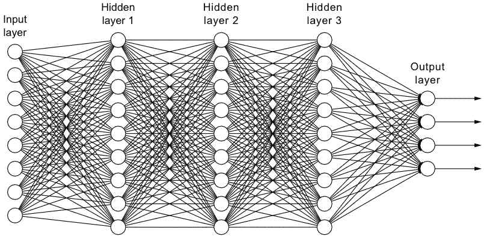

标准神经网络

大多数令人着迷的神经网络应用来自于[监督学习](https://en.wikipedia.org/wiki/Supervised_learning#:~:text=Supervised%20learning%20is%20the%20machine,a%20set%20of%20training%20examples.)，基于`inputs`的类型可以有不同的神经网络，例如`Ad or user info` `**Standard NN**` **，**表示`images`我们使用`**CNN**` **，**表示`sequential data` 例如音频和自然语言我们有`**RNN**` **，**用于输入图像和雷达信息，这些有时会更复杂我们使用`**custom made/hybrid NN architecture.**`

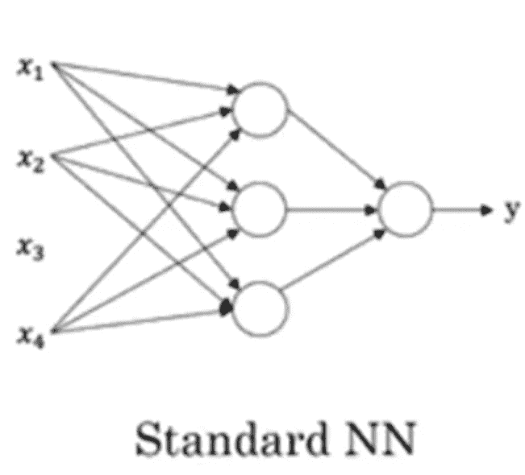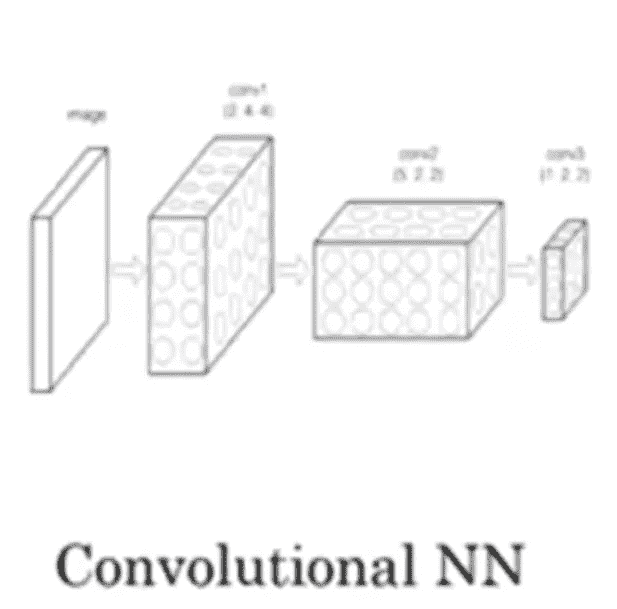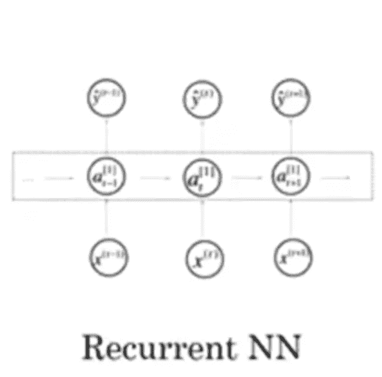

不同的神经网络架构

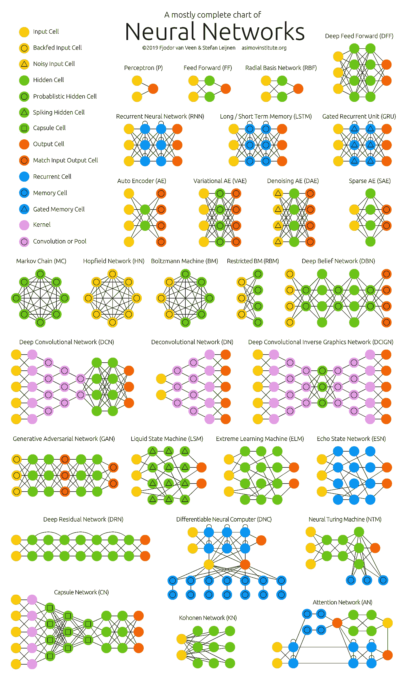

只是想让你知道还有比你现在知道的更多的东西: )来源—[https://www.asimovinstitute.org](https://www.asimovinstitute.org/neural-network-zoo/)

参考上面的[图片](https://www.asimovinstitute.org/neural-network-zoo/)，他们对所有的神经网络架构都有简要的解释..！

## 结构化与非结构化数据

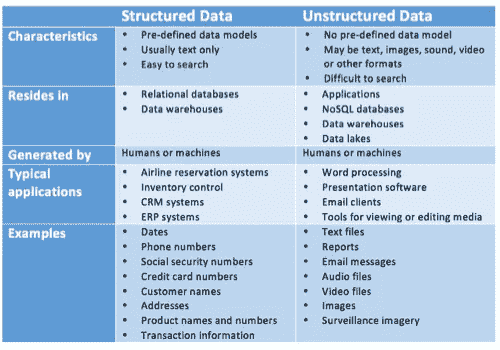

结构化与非结构化数据(来源—[www.datamation.com](http://www.datamation.com))

对于传统的学习算法，如`SVM`和`Logistic regression`，当数据增加时，算法的性能会增加，但随着数据的进一步增加，性能会趋于平稳。随着我们变得更加数字化，几乎在每个地方都介绍 IOT，在过去 20 年里，数据有了很大程度增长。因此我们需要一个`learning algorithm that could give more performance with respect to rising data`，为此我们有了`**Deep learning**`。

即`**larger the NN**` 与`**amount of data**`同在， `**better**` 就是我们的`**performance**`。

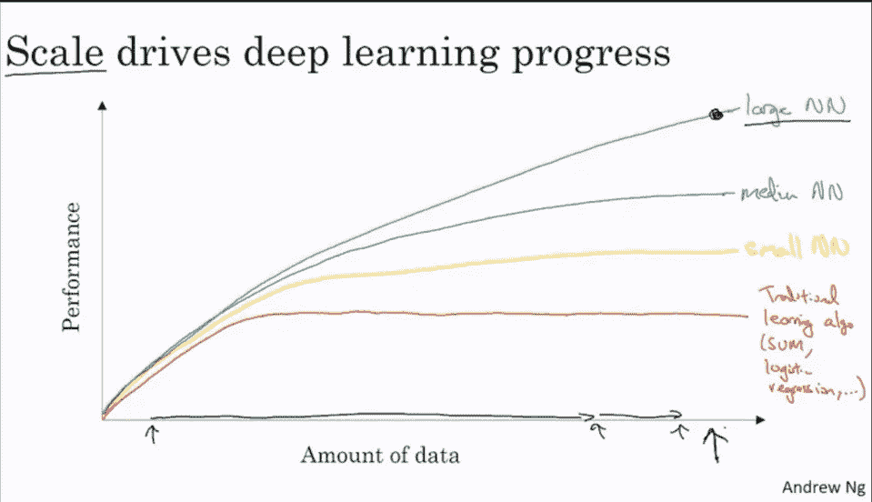

吴恩达机器学习公司的**数据量(x)** 到**性能(y)** 图

虽然对于`smaller training set**(the amount of data)**`来说，事情是`not certain`并且更依赖于什么特征被赋予输入数据，对于一些甚至`SVM`可能比`NNs.`给出的更好

在过去的几年里，我们不仅获得了`added up the data`，还获得了`much more computation ability`，更重要的是，在过去的几年里，我们获得了巨大的`algorithmic innovation`。

突破之一是从`[Sigmoid](https://en.wikipedia.org/wiki/Sigmoid_function#:~:text=4%20Applications-,Definition,refer%20to%20the%20same%20object.)` 切换到`[ReLu](https://en.wikipedia.org/wiki/Rectifier_(neural_networks)#:~:text=The%20rectifier%20is%2C%20as%20of,neural%20nets%20and%20computational%20neuroscience.)`功能。ReLu 函数使得像`gradient descent`这样的算法更快，因为 sigmoid 接近于 0，对这样的值应用梯度会使它更慢，需要更多的时间。

这种算法创新和计算可行性的影响比预期的要大得多，因为这种学习方法通常是`iterative`、you `train a model`、you get`better idea`、you code 和`again train a model`，如果训练一个迭代过程的模型需要很多时间，那就需要更多的时间`much more time and computation expensive`。对于较少的培训时间，可以做`more experiments`并可能找到更适合应用的模型。这对创新新学习算法的人来说是一个福音。

## 逻辑回归

这是一个`algorithm for binary classification`，让我们在进入之前先了解一些符号，

这是一个`training pair`示例的样子(x，y ),其中 x **∈**

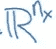

y **∈ {0，1}**

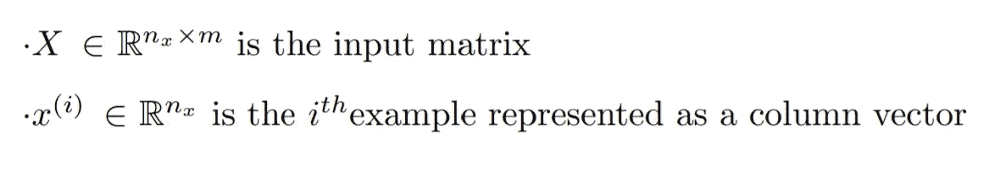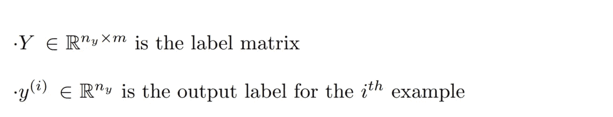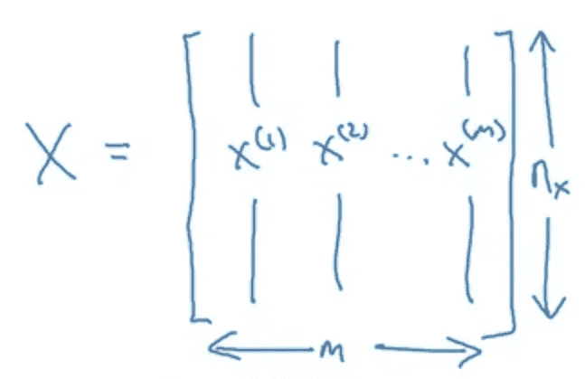

就好像我们谈论的是`64 x 64`像素的彩色图像，我们首先需要将图像转换成一个`feature vector **X**`，对其进行逻辑回归，所以在这里输入特征 nₓ = `64 x 64 x 3 =12288` 3 这里是 RGB 通道，也就是我们图像的深度。

逻辑回归对于二元分类是有用的，因为它给出了给定特征向量 X.
`yˆ= P(y=1|X)`时输出为 y 的概率，这里`yˆ`是输出为`y`的概率。

**逻辑回归参数为**:

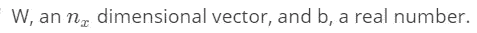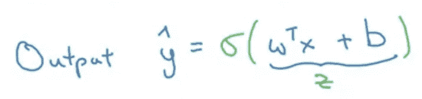

Sigmoid 基本上是将值重新调整为 0 和 1

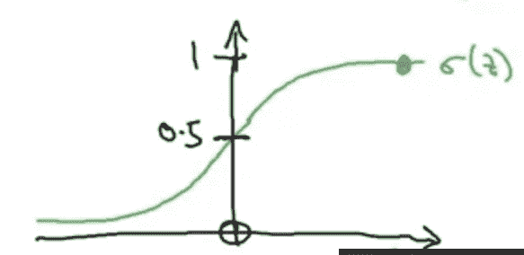

如果输出变得更负，值变得更接近 0，而对于更正的值，它变得更接近 1。

**Sigmoid** 和 **Softmax** 功能听起来可能相似，但它们是不同的，

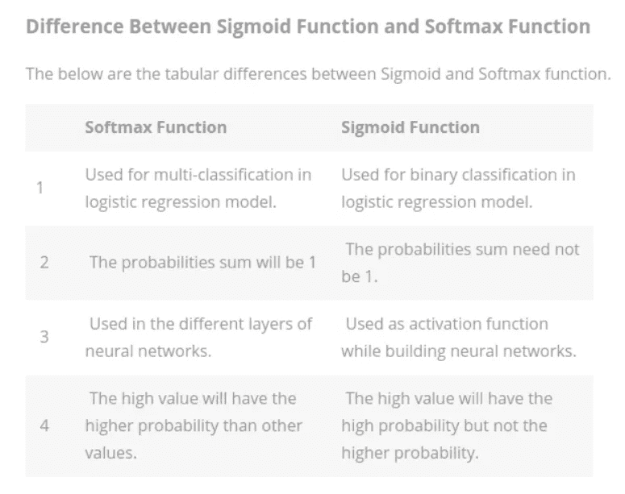

## 总结:

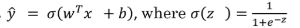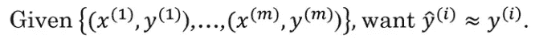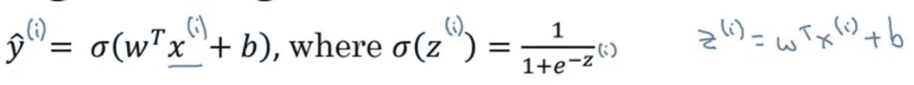

## 损失函数

我们可以像线性回归一样计算 MSE(均方误差),但如果我们在这里这样做，我们将得到一个非凸函数，这将导致一个以上的最小值，因此不是最优解。

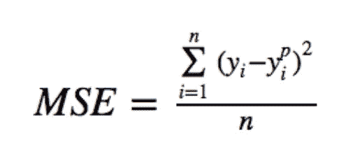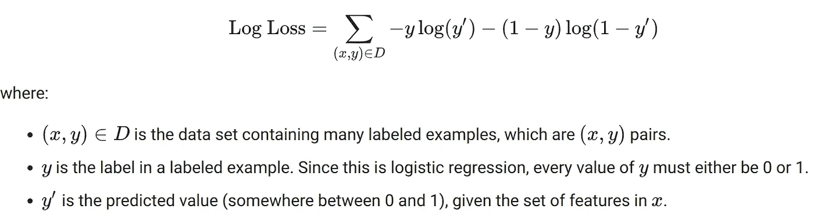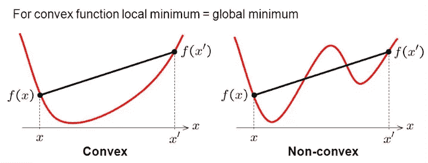

凸函数与非凸函数

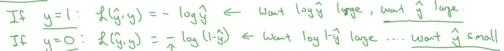

## 成本函数(J)

由于**损失函数**是针对单个训练示例定义的，它显示了您在单个训练示例中的表现。
为了衡量你在整个训练集上的表现，你需要成本函数，

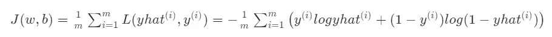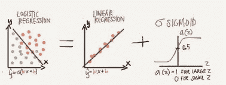

我会就此做更多的介绍，如果有任何疑问，你可以联系[哈什特·贾因](https://medium.com/u/ef356a883f8e?source=post_page-----1184fb3635f6--------------------------------)——LinkedIn:[哈什特·贾因](https://www.linkedin.com/in/harshit-jain-1202/)

别忘了加上掌声👏👏如果你觉得有用的话。