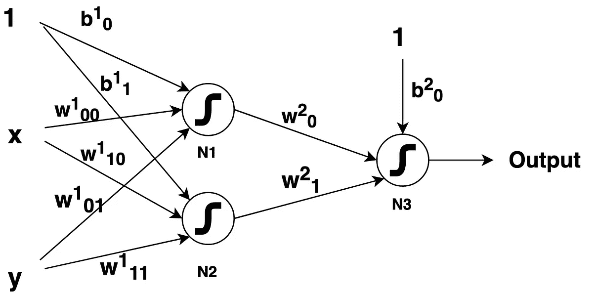

# 为机器学习初学者解释的神经网络

> 原文：<https://medium.com/analytics-vidhya/neural-networks-explained-for-machine-learning-beginners-b2acc4d24a95?source=collection_archive---------14----------------------->

这是我关于解释神经网络的文章的第二部分。那些熟悉我在[上一篇文章](/@randomthingsinshort/neural-networks-explained-for-machine-learning-beginners-cff7e4c7fc5c)中解释的概念的人可以直接进入这篇文章。然而，我建议至少浏览一下[的文章](/@randomthingsinshort/neural-networks-explained-for-machine-learning-beginners-cff7e4c7fc5c)，以便熟悉本文中使用的先决条件和符号。本文假设读者知道术语神经元、特征、权重、偏差和 sigmoid 激活函数。

让我们通过实际实现一些模型来尝试理解神经网络背后的数学。所有的模型都已经使用 [keras](http://keras.io) 库实现。本文中产生的所有结果都可以使用这些[代码](https://github.com/bhanu77prakash/Medium-Blog-Experiments)重现。

## 示例 1

对于图 1 中提供的数据集，当我们运行两层神经网络(也在同一图中提到)时，该模型达到了 100%的准确性(我假设数据中没有异常，并且可以使用两条线简单地分类)。

图 1:数据集和相应的架构

为了深入分析网络，让我们看看通过使用反向传播算法实际学习到的权重。学习的权重是:对于神经元 N1，权重是 w00(1) = 3.55，w01(1) = 3.53 和 b0(1) = -10.14，这对应于图 2 中的线 L1。

图 2:绘制的分类线

神经元 N2 的权重是 w10(1) = 0.99，w11(1) = 1.03 和 b1(1) = -7.18，这对应于图 2 中的线 L2。现在，神经元 N3 必须应用在我的[早期帖子](/@randomthingsinshort/neural-networks-explained-for-machine-learning-beginners-cff7e4c7fc5c)中解释的逻辑，该逻辑通过权重 w0(2) = 12.95、w1(2) = -15.16 和 b0(2) = -5.08 来模拟。这个神经元 N3 的真值表如图 3 所示，这正是所需要的。

图 3:神经元 N3 的真值表

## 示例 2

如果我们对简单的数据使用复杂的模型会怎么样？即使在这种情况下，这种解释也成立吗？让我们回到我们最初的简单的两类分类问题。

图 4:两条分类线相互重叠。

让我们将我在[之前的帖子](/@randomthingsinshort/neural-networks-explained-for-machine-learning-beginners-cff7e4c7fc5c)中使用的模型 1 修改为之前例子中的两层架构，即比所需的神经元更多。在这种情况下，神经元 N1 和 N2 都学习相同的分类线，这通过权重 w00(1) = 1.67，w01(1) = 1.66，b0(1) = -4.50(线 L1)和 w10(1) = -1.58，w11(1) = -1.58，b1(1) = 4.27(线 L2)来反映。如果我们看两组重量的符号，它们是完全颠倒的。但是我们需要对神经元 1 的信息进行交互(因为我们已经用 0 标记了蓝色神经元，即 ve 输出)。这是通过权重 w0(2) = 9.35、w1(2) = -10.46 和 b0(2) = -0.70 来实现的。因此，神经元 N2 和 N3 实际上对这个数据集来说是冗余的。

图 5:神经元 N3 的真值表。

> 注意:神经元 N3 学习的权重双向工作，使神经元 N1 的信息往复，并反转神经元 N2 的输出。(因为神经元 N2 的输出正好与神经元 N1 相反)。

## 示例 3

现在，让我们检查一个这个逻辑不能解决分类问题的案例。通过假设的推广，图 6 中所示的数据集不应该使用两层网络(第一层中有三个神经元用于三条分类线)进行完美分类。这是因为在层 1 之后有 4 种情况要处理([L-L1，L-L2，L-L3]，[R-L1，L-L2，L-L3]，[R-L1，R-L2，L-L3]，[R-L1，R-L2，R-L3]其中 L-L1 意味着线 L1 的左侧)(即使理论上应该有 8 种情况，其他 4 种情况是不可能的)。在对该数据集运行两层模型后，这被证明是正确的。

图 6:三条分类线中的两条相互重合

达到的最大精度是 81.4%(在 500 个周期后饱和)。在图 6 中绘制了学习线。因此，我们在第二层需要更多的神经元来处理这种复杂的逻辑信息(可能还有第三层)。为了证明这个数据集是否可以分类，我刚刚使用了一个具有 3–10–10–1 个神经元的三层网络，并达到了 100%的准确率(显然我使用的神经元比需要的多)。然而，这可以通过以有效的方式解决上述逻辑情况，用更简单的网络来解决(留给读者作为练习)。

## 神经网络中权重的大小意味着什么？

在数学术语中，线 2*x + 2*y + 4 = 0 与 4*x + 4*y + 8 = 0 完全相同。但是在神经网络的情况下，这两条线完全不同，不是在分类边界方面，而是在 sigmoid 激活函数的输出方面。关于这方面的更多解释，请查看我关于 sigmoid 激活功能的博客，你可以在我的网站上找到。

## 我们如何概括这些信息？

现在，如果我们看下面的图 7，我们可以通过学习 4 条简单的线来解决所有的逻辑情况，或者学习 10 条简单的线来解决所有的逻辑情况。我们学习的线路越多，为了处理信息，网络需要变得越来越复杂。

图 7:高阶复杂分类示例

随着更多的神经元加入到网络中，我们也可以学习更精细的边界。这是否意味着我们可以使用更复杂的网络而不是简单的网络(因为根据我的逻辑，具有过多神经元的复杂模型总是可以解决具有较少神经元的较小网络的任务)？答案是不，我们不能。过度拟合的问题取代了通过使用更多神经元获得的优势。(在前面图 6 的例子中，当我使用 3–15–20–10–1 层网络时，它将[-15，-15]和[15，15]分类为 1 类)。因此，我建议在实际决定模型之前，应该首先研究数据(你可以使用主成分分析或 t-SNE 来可视化高维数据)。有时候一个简单的模型(像单个神经元一样简单)就能解决你手里的问题:)

我希望这篇文章对你理解神经网络体系结构的基础有所帮助。因为这是我的第一篇文章，有些概念解释可能是无序的。鼓励提出改进建议。另外，如果你喜欢阅读我的文章，请访问我的网站，获取更多关于人工智能、机器学习、自然语言处理等方面的博客..