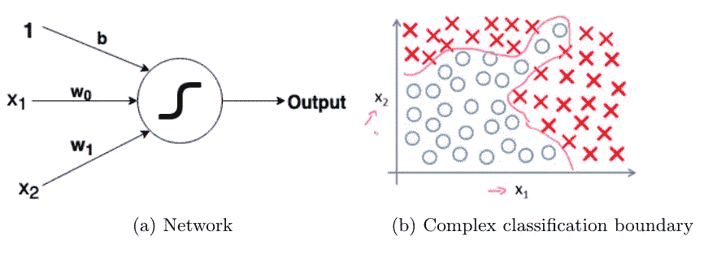
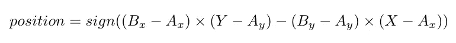
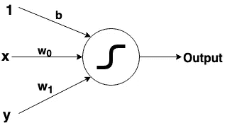
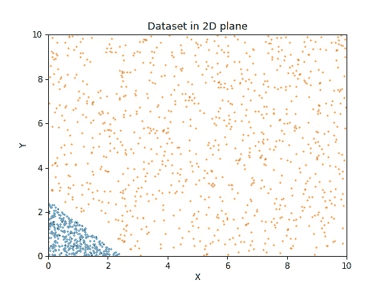
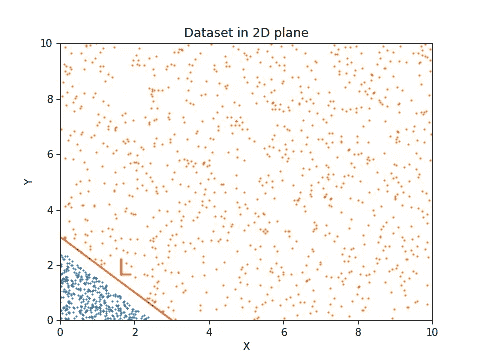
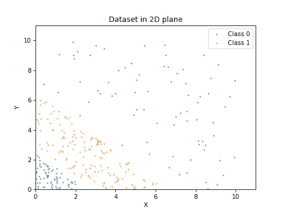
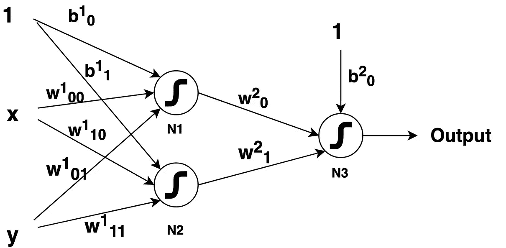
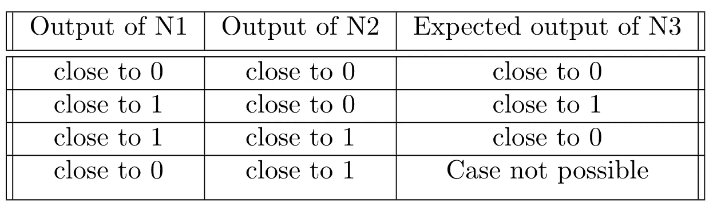

# 机器学习初学者理解神经网络的循序渐进指南

> 原文：<https://medium.com/analytics-vidhya/neural-networks-explained-for-machine-learning-beginners-cff7e4c7fc5c?source=collection_archive---------10----------------------->

这是我写的第一篇关于机器学习基础的博客。特别是，我想在某种程度上解释神经网络架构的工作原理(到我们可以用我们的想象力来可视化网络的程度)。我写这篇文章的动机是大卫·罗宾逊给我的建议，“当你写了三次相同的代码时，写一个函数。当你已经当面给了同样的建议三次，写一篇博文“相信我，我已经解释了不止三次了。虽然这是一篇有点长的文章，但考虑到机器学习初学者，我以如此细致的方式写了这篇文章。

大多数介绍神经网络结构的课程使用标准的两类分类法，使用逻辑回归算法。如果您没有意识到这一点，这是一个简单的分类算法，它学习一条线来分隔两个类。他们使用图 1 所示的网络来解释这种算法背后的直觉。

图 1

然后，他们引入了一个复杂的例子，其中需要学习高阶曲线，以便对这些例子进行分类，他们说神经网络是解决方案，因为它引入了“非线性”的概念。在这篇文章中，我想填补这个简单的线性分类器和“非线性”神经网络分类器之间的空白。我假设读者知道术语神经元、特征、权重、偏差和 sigmoid 激活函数。有了这个介绍，我想在解释实际的分类器之前解释一些先决条件。意识到这一点的人可以直接移动到我的[下一篇文章](/@randomthingsinshort/neural-networks-explained-for-machine-learning-beginners-b2acc4d24a95)。为了可视化的目的，我们对输入使用两个特征，即每个输入点可以在 2D 笛卡尔平面中表示。

## 线段中点的方向

这个问题的目的是确定一个点位于线段的右边还是左边。给定线段 AB，我们使用向量(AB，AM)的行列式的符号，其中 M(X，Y)是查询点，位置由下式确定

图 2:确定位置相对于线段的位置

如果位置值为 0，则该点在直线上，一边为+1，另一边为-1。然而，由于我们没有点 A 和 B(我们手里有一条无限长的线，而不是一条线段)，我们用一个替代物来代替它。我们可以通过使用符号(L11/L22)来确定 P1(x1，y1)和 P2(x2，y2)这两个点是在一条直线的同侧还是相对侧，其中 L 是直线 ax+by+c，L11 = ax1+by1+c(类似于 L22)。如果它是正的，就意味着这两个点都在相反的两边。因为我们没有任何参考点，所以我们使用原点(L00)来分隔这些点。现在 L00 = a*0+ b*0 + c = c(一个常数)。因此，只需使用 L11 的符号，我们就可以确定点 x1 和原点是在线 l 的同侧还是相对侧。一个类包含原点，而另一个类不包含原点。L11 的大小与点 P1 到线 l 的距离成正比。就分类而言，它意味着我们可以有把握地说它属于相应的类别(靠近分类线的点更容易被错误地分类)。

## 一个神经元代表什么？

在神经网络中，神经元被定义为通过权重连接到前一层神经元的最基本单元，具有偏置项和激活函数。但是它在数学上代表了什么呢？让我们一次解剖神经元的一部分。查看图 3，我们可以认为神经元代表线 w1*x + w2*y + b = 0。

图 3:具有乙状结肠激活的神经元

根据上一节，我们可以说，给定一个输入点(x1，y1)，我们可以通过查看 w1*x1 + w2*x2 + b 项的大小来确定它的类别。但是，通过使用这个线性项，我们无法实现复杂的边界，这将在本文后面解释。那么救命恩人来了，乙状结肠激活功能。所有负值都有输出< 0.5 and all positive values have output > 0.5。sigmoid 的输出越接近 1(或 0)，意味着正值越大，这反过来意味着该点远离该线(在其他方向远离该线)，即该点更有可能属于上述类别。

## 神经元输出的什么符号被分配到哪个类？

这完全取决于你如何标记你的输入点。让我们看一个例子来理解这一点。需要分类的数据如图 4 所示。

图 4:绘制数据集和分类线

我已经使用 keras 库开发了这个网络，它使用起来非常简单。你可以在这里找到所有的实现。这对应于代码中的模型 1。现在，因为这是一个两类的例子，我们需要的只是一个简单的线性分类器。所以 1 个具有 sigmoid 激活功能的神经元(用这个网络和数据达到 100%的准确率是显而易见的)。模型学习的权重为 w0 = 3.510 和 w1 = 3.507，偏差为 b = -10.593。图 4 显示了分类器和数据的关系。

当在点[-15，-15]上测试时，该网络给出完美的 0(暗示 L11 是-ve)作为输出，并且在[15，15]上给出完美的 1(暗示 L11 是+ve)作为输出。可以清楚地观察到[-15，-15]和[0，0]在同一侧，因此是-ve 值。如果我们把标签反过来呢？当我简单地颠倒了数据的标签时，[-15，-15]的输出应该是 1，这对于当前的权重和数据是不可能的，因为[-15，-15]和[0，0]在线的同一侧。相反，该模型反转了权重的符号来实现这一点。修改后的权重为 w1 = -3.509，w2 = -3.508，b = 10.602。尽管这两种权重配置表示相同的线，但是模型只是颠倒了参数的符号，以便将正值分配给包含原点的集合。

> N 注:即使[-15，-15]和[0，0]在线的同一侧，该模型也能够将+ve 值赋给该点，因为我们将分母项 L00 固定为 1，而不是 c(=b)。我们没有在模型中的任何地方使用 L00 术语。

## 网络中的复杂学习(非线性的使用)发生在哪里？

到目前为止，我们已经研究了连接神经元的输入层。所有连接到输入层的神经元学习一个简单的线性分类器(线性边界)。内层的神经元呢？为此，我们必须参考使用 MLP 的逻辑门的实现。我假设读者一定知道感知器(如果不知道，请在继续之前阅读[本文](/@stanleydukor/neural-representation-of-and-or-not-xor-and-xnor-logic-gates-perceptron-algorithm-b0275375fea1))。与此类似，隐藏层神经元通过其学习到的权重来模仿其中一个逻辑门。

图 5:数据集 2

让我们看一下图 5 中的示例数据集来详细理解这一点。显然，数据集不能使用一条线进行分类。使用逻辑回归，必须使用更高阶的特征，例如(x1)，(x2)，..以便模仿圆形或其他复杂的边界。

通过查看数据，我们可以想到一个非常简单的解决方案，即绘制两条直线，如果该点在两条直线之外，则属于 1 类，如果该点在直线之间，则属于 2 类。这种解决方案不能使用逻辑回归或简单的一层神经网络来实现。此外，我们不需要 4 到 5 层网络，每层 10 个神经元来分类这个数据集(使用它，你显然可以，我们称之为过拟合数据)。

图 6:直观的分类线和相应的分类模型

我们只需要两个神经元来模拟这两条线，并在其上实现一个逻辑门来处理信息。逻辑门应该处理以下信息:如果给定点位于 L1 线的左侧(神经元 N1 的输出是-ve)和 L2 线的左侧(神经元 N2 的输出是-ve ),那么它属于第 1 类。如果该点位于 L1 线的右边(神经元 N1 的输出是+ve)和 L2 线的左边(神经元 N2 的输出是-ve ),那么它属于类别 2。如果给定点位于 L1 线的右边(神经元 N1 的输出是+ve)和 L2 线的右边(神经元 N2 的输出是+ve ),那么它再次属于类别 1。以下信息可以通过图 7 中给出的表格来表示。

图 7:神经元 N3 的真值表

因此，神经元 N3 必须充当逻辑门，其真值表应该如图 7 所示。我们如何确认模型确实在学习我假设的东西？为此，你必须继续阅读我的下一篇文章,在那里我通过实现这些模型来测试这些假设。