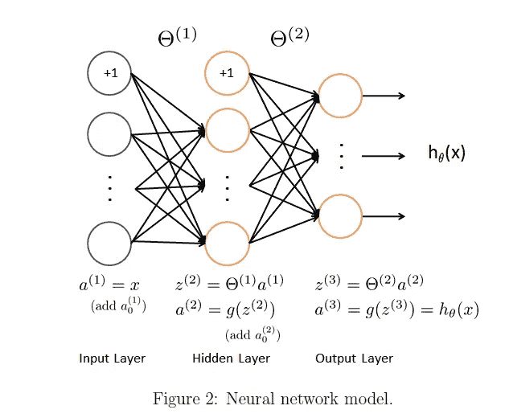
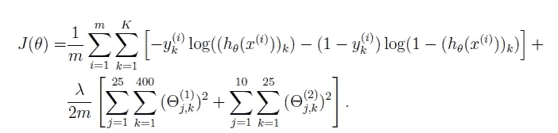
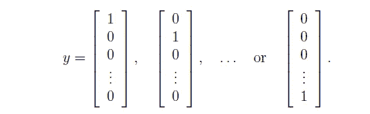
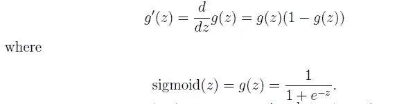
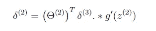
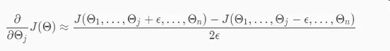

# 了解如何用 Python 从头开始构建用于数字识别的神经网络

> 原文：<https://medium.com/analytics-vidhya/neural-networks-for-digits-recognition-e11d9dff00d5?source=collection_archive---------0----------------------->


吴恩达的机器学习课程仍然是成千上万有抱负的数据科学家的敲门砖和门户。但是如何用现代语言来实现他的教导的问题经常成为人们的一个障碍。

这就是为什么我继续写下我对每周课程的想法，以及如何用 Python 实现他的所有教导。

在我的上一篇文章中，我们看到了像逻辑回归这样的简单算法是如何被用来识别手写数字的。我们得到了`95.08%`的精度！但是，请记住，逻辑回归是一个线性分类器，因此不能形成复杂的边界。

# 我们将在这篇文章中讨论的内容

因此，在这篇博文中，我们将了解神经网络如何用于相同的任务。由于神经网络可以适应更复杂的非线性边界，我们应该看到我们的分类器精度也有所提高。

这部分帖子基于吴恩达的机器学习课程第 5 周的内容。你可以在这里访问编程练习和数据集[。](https://s3.amazonaws.com/spark-public/ml/exercises/on-demand/machine-learning-ex4.zip)

在这里，我不打算解释反向传播之类的概念，因为这将偏离为你提供课程的 Pythonic 式翻译的目标。每个概念本身都可以很快变成一篇博文，老实说，我认为吴恩达在解释这些概念方面做得非常好。

> 在开始编程练习之前，我们强烈建议观看[视频讲座](https://www.coursera.org/learn/machine-learning/home/week/5)，并完成相关主题的复习题。

# 1.前馈传播

我们首先使用已经给定的权重实现神经网络的前馈传播。然后，我们将实现反向传播算法来为自己学习参数。这里我们互换使用术语权重和参数。

# **1.1 可视化数据:**

每个训练示例都是手指的 20 像素乘 20 像素的灰度图像。每个像素由一个浮点数表示，表示该位置的灰度强度。20×20 像素网格被“展开”成 400 维向量。这些训练示例中的每一个都成为我们的数据矩阵`X`中的一行。这给了我们一个 5000 乘 400 的矩阵`X`，其中每一行都是一个手写数字图像的训练示例。训练集的第二部分是一个 5000 维的向量`y`，它包含训练集的标签。

```
from scipy.io import loadmat
import numpy as np
import scipy.optimize as opt
import pandas as pd
import matplotlib.pyplot as plt# reading the data
data = loadmat('ex4data1.mat')
X = data['X']
y = data['y']# visualizing the data
_, axarr = plt.subplots(10,10,figsize=(10,10))
for i in range(10):
    for j in range(10):
       axarr[i,j].imshow(X[np.random.randint(X.shape[0])].\
reshape((20,20), order = 'F'))          
       axarr[i,j].axis('off')
```


# 1.2 模型表示



我们的神经网络有三层——输入层、隐藏层和输出层。请记住，输入将是“展开”的 20 x 20 灰度图像，以形成 400 个输入特征，我们将把这些特征输入到神经网络中。所以我们的输入层有 400 个神经元。此外，隐藏层有 25 个神经元，输出层有 10 个神经元，对应于我们的模型预测的 10 个数字(或类别)。上图中的+1 代表偏置项。

已经向我们提供了一组已经训练好的网络参数。这些存储在 ex4weights.mat 中，将被加载到`theta1`和`theta2`中，然后展开成一个向量`nn_params`。参数的尺寸大小适合于在第二层具有 25 个单元和 10 个输出单元(对应于 10 个数字类别)的神经网络。

```
weights = loadmat('ex4weights.mat')
theta1 = weights['Theta1']    #Theta1 has size 25 x 401
theta2 = weights['Theta2']    #Theta2 has size 10 x 26nn_params = np.hstack((theta1.ravel(order='F'), theta2.ravel(order='F')))    #unroll parameters# neural network hyperparameters
input_layer_size = 400
hidden_layer_size = 25
num_labels = 10
lmbda = 1
```

# 1.3 前馈和成本函数

首先，我们将实现成本函数，然后是神经网络的梯度(为此我们使用反向传播算法)。回想一下，具有正则化的神经网络的成本函数是



正则化神经网络的代价函数

其中`h(x(i))`如图 2 所示计算，K = 10 是可能标签的总数。注意`h(x(i)) = a(3)`是输出单元的激活。此外，鉴于原始标签(在变量 y 中)是 1、2、…、10，为了训练神经网络，我们需要将标签重新编码为只包含值 0 或 1 的向量，这样



一键编码

这个过程被称为一键编码。我们这样做的方法是使用“熊猫库”中的`get_dummies` 函数。

**乙状结肠功能**

```
def sigmoid(z):
    return 1/(1+np.exp(-z))
```

## 价值函数

使用给定的权重调用`nnCostFunc` 给我们成本。

```
nnCostFunc(nn_params, input_layer_size, hidden_layer_size, num_labels, X, y, lmbda)
```

你应该看到费用大概在`0.383770`左右。

# 2 反向传播

在这部分练习中，您将实现反向传播算法来计算神经网络的梯度。一旦你计算出梯度，你将能够通过使用先进的优化器如`fmincg`最小化成本函数来训练神经网络。

## 2.1 Sigmoid 梯度

我们将首先实现 sigmoid 梯度函数。sigmoid 函数的梯度可计算如下



```
def sigmoidGrad(z):
    return np.multiply(sigmoid(z), 1-sigmoid(z))
```

## 2.2 随机初始化

训练神经网络时，随机初始化[对称破缺](https://stackoverflow.com/a/20029817/)的参数很重要。这里，我们随机初始化对应于隐藏层和输出层的名为`initial_theta1`和`initial_theta2`的参数，并像前面一样展开成一个向量。

## 2.3 反向传播

一旦你掌握了诀窍，反向传播算法就不是那么复杂了。
我强烈建议你在 backprop 上多次观看 Andrew 的[视频。](https://www.coursera.org/learn/machine-learning/lecture/1z9WW/backpropagation-algorithm)

总之，我们通过循环每个训练示例来做以下事情。计算正向传播以获得输出激活`a3`。
2。计算误差项`d3` ，这是通过从我们的计算输出`a3`中减去实际输出而获得的。
3。对于隐藏层，误差项`d2`可计算如下:



4.累积`delta1`和`delta2`中的梯度。
5。通过用`m`除以(步骤 4 的)累积梯度，获得神经网络的梯度。
6。将正则项添加到梯度中。

顺便说一下，如果您可以使用高度矢量化的实现，可以消除上面代码中的 for 循环。但是对于那些不熟悉反向投影的人来说，使用 for-loop 可以获得更好的理解。使用初始参数运行上述函数会给出`nn_backprop_Params`，我们将在执行梯度检查时使用它。

```
nn_backprop_Params = nnGrad(nn_initial_params, input_layer_size, hidden_layer_size, num_labels, X, y, lmbda)
```

## 2.4 梯度检查

为什么我们需要梯度检查？以确保我们的反向传播算法没有错误，并按预期工作。我们可以用以下公式近似计算成本函数的导数:



使用反向投影和数值近似计算的梯度应该至少符合 4 个有效数字，以确保我们的反向投影实现没有错误。

```
checkGradient(nn_initial_params,nn_backprop_Params,input_layer_size, hidden_layer_size, num_labels,X,y,lmbda)
```


梯度检查的输出

## 2.5 使用`fmincg`学习参数

成功实现神经网络成本函数和梯度计算后，下一步是使用`fmincg` 为神经网络学习一组好的参数。`theta_opt`包含我们刚刚学习的展开参数，我们滚动这些参数以获得`theta1_opt`和`theta2_opt`。

## 2.6 使用学习参数进行预测

是时候通过计算模型的准确性来看看我们新学习的参数表现如何了。回想一下，当我们使用像逻辑回归这样的线性分类器时，我们得到了 95.08%的准确率。神经网络应该会给我们一个更好的精度。

```
pred = predict(theta1_opt, theta2_opt, X, y)
np.mean(pred == y.flatten()) * 100
```

这应该给出一个`96.5%`的值(由于随机初始化，这个值可能会有大约 1%的变化)。值得注意的是，通过调整超参数，我们仍然可以获得更好的精度。

# 结束注释

我们刚刚看到了神经网络如何用于执行数字识别等复杂任务，并在此过程中了解了反向传播算法。

谢谢你能走到这一步。如果你喜欢我的作品，给我一个(或几个)掌声。