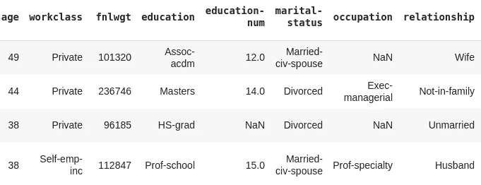
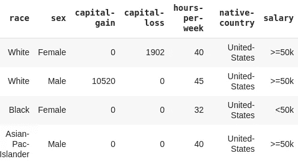
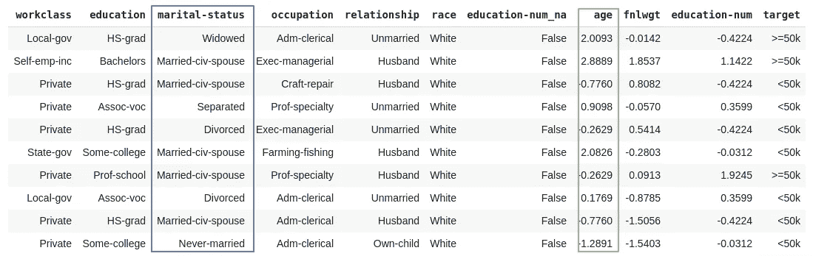
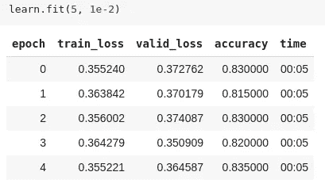
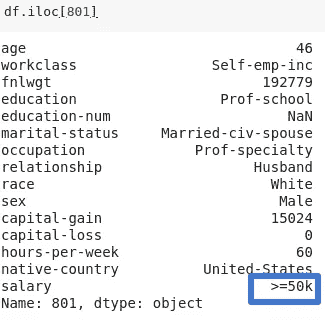
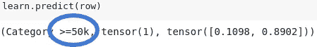

# 表格数据的神经网络

> 原文：<https://medium.com/analytics-vidhya/neural-networks-for-tabular-data-touching-the-untouched-efd66c950463?source=collection_archive---------7----------------------->

## *这是一篇关于神经网络如何适应表格数据的快速而完整的帖子。我正在使用 fastai 库来实现它。我们开始吧。*


照片由[卡洛斯·穆扎](https://unsplash.com/@kmuza?utm_source=unsplash&utm_medium=referral&utm_content=creditCopyText)在 [Unsplash](https://unsplash.com/s/photos/tabular-data?utm_source=unsplash&utm_medium=referral&utm_content=creditCopyText) 上拍摄

# 理论洞察力

表格数据用电子表格、关系数据库、财务报告等来表示。有许多领域需要表格数据分析，例如:

*   简历筛选
*   推荐系统
*   产品定价

对表格数据使用神经网络是一个全新的想法，因为市场上已经有很多方法，如随机森林、GBM 等。但是神经网络对表格数据也非常有用。对表格数据使用神经网络需要较少的维护，并且该方法是高效和可靠的。

Fastai 使得使用神经网络分析表格数据变得非常容易。库`fastai.tabular`中有一个模块是专门为此目的而构建的。

# 实用知识

让我们按如下方式导入库:

```
from fastai.tabular import *
```

除了 fastai 之外，pandas 库还便于分析表格数据。Pandas DataFrame 是 Python 中表格数据的标准格式。

让我们解开数据。数据作为 fastai 学术数据集之一提供。然后我们将使用熊猫来访问数据库。

```
path = untar_data(URLs.ADULT_SAMPLE)
df = pd.read_csv(path/'adult.csv'); df
```



上传数据后，我们需要定义因变量、连续变量和分类变量。

❓因变量、连续变量和分类变量是什么意思

*   因变量——我们需要找到其值的变量，其值依赖于自变量的变量。
*   连续变量——可以取任何值的变量。
*   分类变量—具有一组已定义的取值的变量。这些值是有限的，代表不同的类别，如男性/女性、交通方式等。
*   对于分类变量，我们将使用一种叫做嵌入的东西。对于连续变量，它们可以像神经网络中的像素一样被发送到神经网络中。

在此之后，我们需要提前定义将要发生的过程。因此，我们对数据帧进行预处理，而不是边走边处理。在输入训练数据集以训练模型之前，对训练数据集进行预处理。相同的预处理变量被带到测试和训练数据集。

*   FillMissing 它将通过列中存在的值的平均值来填充数据集中缺失的值。可能还有另一种方法来填充空值。
*   分类—将分类变量转换为类别，即熊猫类别。
*   归一化—最后，归一化我们的数据，使平均值等于 0，标准差等于 1。

让我们如上所述定义流程，如下所示:

```
**dep_var** = 'salary'
**cat_names** = ['workclass', 'education', 'marital-status', 'occupation', 'relationship', 'race']
**cont_names** = ['age', 'fnlwgt', 'education-num']
**procs** = [FillMissing, Categorify, Normalize]
```

让我们使用 [fastai 数据块 API](https://docs.fast.ai/tabular.data.html) 创建一个数据束。

```
data = (TabularList
                   .**from_df**(df, path=path, cat_names=cat_names, cont_names=cont_names, procs=procs)
                   .**split_by_idx**(list(range(800,1000)))
                   .**label_from_df**(cols=dep_var)
                   .**databunch**())
```

*   在上面的例子中，我们试图根据输入的类型创建一个表格列表。由于我们的输入是表格格式，因此我们将使用 **TabularList** 来生成数据串。
*   from_df —我们希望获得由`df`定义为数据帧的输入列表。我们还需要定义定义数据的路径。与此同时，我们需要定义分类变量和连续变量。最后，我们还需要为我们的数据传递流程。
*   split_by_idx —我们希望从数据中提取 200 行到我们的验证数据集中。
*   label_from_df —我们希望使用因变量来标记我们的数据。

如果您想查看一批数据:

```
data.show_batch(rows=10)
```



**蓝色**:分类变量，**绿色**:连续变量的平均值

## 学习者

对于表格数据串，我们有一个表格学习器。

```
learn = tabular_learner(data, layers=[200,100], metrics=accuracy)
learn.fit(5, 1e-2)
```



`layers=` —这是我们定义架构的地方，就像我们为卷积网络选择 ResNet 34 或其他东西一样。它是指输入(嵌入后)和分类层之前的隐藏全连接层的大小。隐藏层的数量决定了列表的长度。

如果您想获得更相关的结果，可以取消冻结，然后对学习者进行微调。想了解更多这方面的内容，可以去看看我的[分类](/analytics-vidhya/image-classification-using-fastai-5ff5b374d414)帖子。

## 结论

```
row = df.iloc[801]
df.iloc[801]
```



```
learn.predict(row)
```



我们的推断与实际数据相符。

总有更多研究的空间，对表格数据的神经网络是一个非常大的研究来源。但在 gist 中，这就是我们如何使用神经网络来处理表格数据。