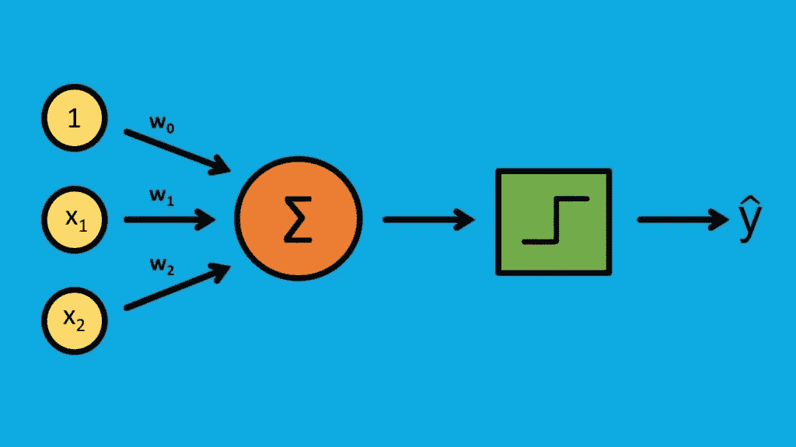
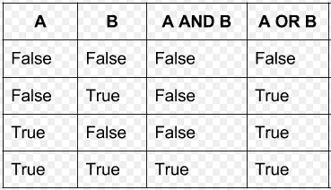

# 从零开始的神经网络——感知器方法——I

> 原文：<https://medium.com/analytics-vidhya/neural-networks-from-scratch-perceptron-approach-i-a7059ff276ac?source=collection_archive---------9----------------------->

温柔的尝试让你自己去建造它。

一个简单的神经网络结构。

# 介绍

欧洲网络，这个行话通过其近似艺术几乎统治了人工智能的世界。这些是通过考虑例子来“学习”执行任务的系统，通常没有用任何特定于任务的规则来编程。人工神经网络受到构成人脑的生物神经网络的启发。

感知器

神经网络是它们的基本构建模块****感知器**的集合。那么，什么是感知机呢？感知器是输入节点、**的**集合**、**、**输出节点**和将输入节点连接到输出节点的**连接/权重集合**的组合。**

## **感知器是做什么的？**

**当给定一组已知数据(输入、输出)，也称为训练数据时，它试图从这些反馈数据中学习。但是，学了之后呢？好戏来了，现在当给定一些未知的输入值时，经过训练的感知器将试图预测该数据的近似输出。**

**让我们通过一个分类示例来看看这是如何工作的:**

**是时候了，我们去上学，背 AND &OR 逻辑表。**

> **警告…！我们要学习火箭科学…**

**不确定。我们把它们作为一个简单的例子，来自你已经知道的主题。让我们继续…**

**在给定事件 A，B 中，如果两者都为真，那么 A，B 的**和**为真。如果任一事件为假，则 A，B 的 **(A 和 B)** 的**和**为假。同样，在给定的事件 A，B 中，如果任一事件为真，则 A，B 的 OR 为真。如果事件 A、B 都为假，那么 A、B 的**或****(A 或 B)** 为假。看下表就好理解了。**

****

**和或真值表。**

**假设假= 0，真= 1。根据表格，0 **和** 0 **=** 0 **、** 0 **和** 1 **=** 1、1 **和** 0 **=** 0、1 **和** 1 **=** 1 **。****

****输入:[[0，0]，[0，1]，[1，0]，[1，1]]。输出:[0，0，0，1]****

**现在，假设我们将上述输入和输出输入到我们的感知器中。通过查看反馈的数据，感知器试图在给定的时间段内学习 AND 函数。现在，如果我们传递任何随机输入，如[1，1] [0，1]等，感知器会给出它认为对给定输入正确的近似输出**

**现在，读完以上所有内容，一些问题可能会出现在你聪明的头脑中。它实际上是如何学习……？感知器内部发生了什么？**

**所有这些问题将在下一篇文章中讨论……:)**

**这一系列文章将有一个标准**很少一次**。我们不想一下子学会所有的东西。**

***谢谢……***

**以下是本系列下一篇文章的链接…**

** [## 从零开始的神经网络——感知器方法——II

### 一个温柔的尝试让你自己建造。

medium.com](/@yekabotep/neural-networks-from-scratch-perceptron-approach-ii-cbe96f411a6b)**