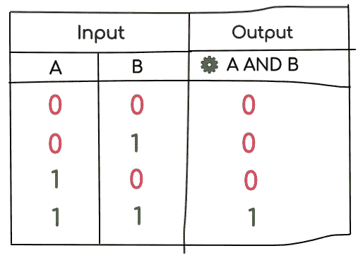
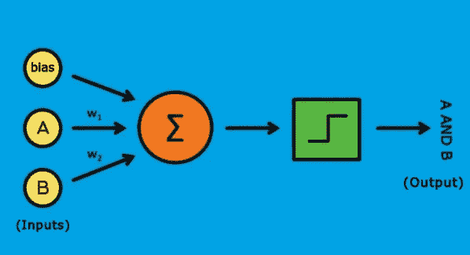
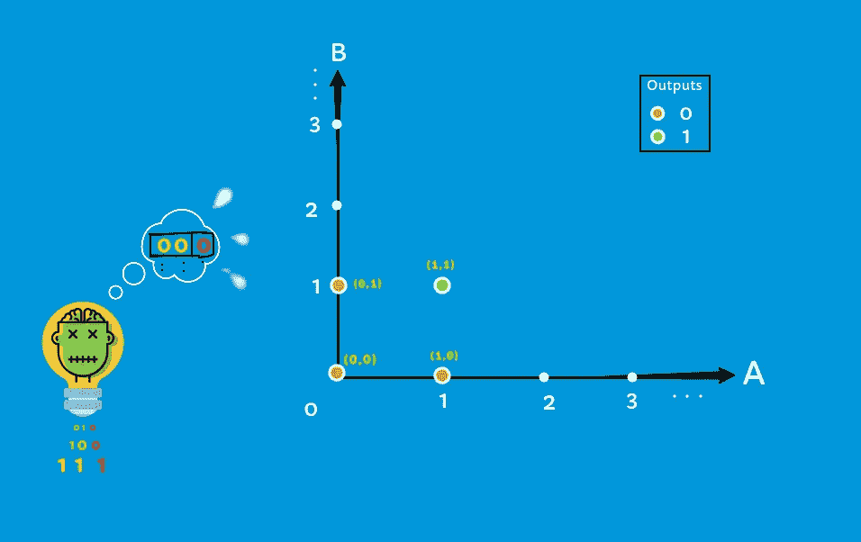
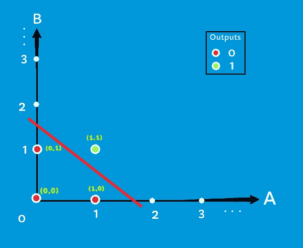

# 从零开始的神经网络——感知器方法——II

> 原文：<https://medium.com/analytics-vidhya/neural-networks-from-scratch-perceptron-approach-ii-cbe96f411a6b?source=collection_archive---------10----------------------->

温柔的尝试让你自己去建造它。

> 注意:你将会有人格分裂。准备好，去感受成为一个新角色的快乐。

这种简单的提问方式一直在改变着我们今天的生活方式。

从上一篇关于感知器介绍的文章中，你可能已经得到了你的问题的答案，**什么是感知器？**以下是上一篇文章的链接:感知器简介。

 [## 从零开始的神经网络——感知器方法——I

### 一个温柔的尝试让你自己建造。

medium.com](/@yekabotep/neural-networks-from-scratch-perceptron-approach-i-a7059ff276ac) 

在了解感知机内部实际发生了什么之前，重要的是要知道，**感知机实际上是如何看待给定的输入&输出数据的？**

让我们回滚到前面的**和**逻辑表的例子。

图 2:与运算—真值表

我们将认为， **0 为假，1 为真，因为感知器只理解数字**。现在，图 2 将是我们的结果和逻辑表。

***恭喜恭喜！*** 此时，我们已经成功创建了一个数据集(一组输入及其相应的输出)来训练我们的感知器。

好吧，我们感到自豪，并为我们到目前为止所做的一切感到欣慰。现在问题来了..！如何将这些数据输入感知器？很简单。因为我们在表中有我们的数据，每一行被一次馈送到感知器，如下所示:

让我们取出第一行即 **[ 0 0 ](输入 A，B)，[ 0 ](输出:A，B)。由于只有两个输入和一个输出，我们需要一个感知器，它接受两个输入并产生一个输出，如图 2.2 所示。**

图 2.2:感知器接受两个输入和偏差，产生一个输出

等等！我们需要两个输入。对吗？**那么，那些 bias，w1 和 w2 在那里做什么呢？**这时候别管那些了。你很快就会被介绍给他们。

现在，输入[0 0]分别放在感知器的 A，B 输入占位符中。

一旦接收到输入，**感知机就开始观察它们**，就像一个小婴儿在观察放在附近的球，并试图理解它是什么！我想从你这里知道一些事情。

> 你知道潜水吗？如果没有，请坚强起来，因为我们就要跳了。

是的，是时候我们深入到感知机的思想中去，知道当输入被接收时，它实际上在想什么了？

## 深入感知机的大脑…

图 2.3:感知器处理所有的输入和输出数据，并考虑每个轴上的每个输入，在图上绘制输入点。在 A、B 轴上绘制了相应的 A、B 值。

这里是感知机接收输入后的思考方式。

嗯！好的，我得到了两个输入，那么…让我把每个输入放在每个轴上，并在它们的交叉点上画一个点。好的，让我想想，他们给每个点起了什么名字？好吧…

> (一)——**【0，0】**他们称之为 **0** ，
> 
> (二)——**【0，1】**他们称之为 **0** ，
> 
> (三)——**【1，0】**他们又叫了， **0** ，几个零的纨绔子弟？
> 
> (四)——最后，**【1，1】**他们称之为 **1** 。

仅此而已。似乎，我已经阅读了所有的输入和输出，但是，这些名字(0，1)在这里看起来太吸引人了。让我把这些换成漂亮的颜色:绿色看起来适合 1，橙色更适合 0。你看看现在，多漂亮啊！啊哈！所有橙色点位于一侧，绿色点位于另一侧。**如果这个人将来说，“找到给定输入的名称(输出)”，而没有给出它的实际名称，那该怎么办？我该如何面对挑战？让我把这些点分组。**

图 2.4:感知器画一条线来区分橙色点(0)和绿色点(1)。

最后，**让我在这两个组之间划一条线，谁在线以下，我就把他们命名为橙色，即(0)，在线以上，我就把他们命名为绿色，即(1 )** 。万岁！！我已经完成了这项工作，因为如果有新的输入到来，我也不会担心。一切都很好地分类了。让我休息一下。

让我们从这个感知机的大脑中走出来，让它休息一下。

现在你知道了，感知器内部到底发生了什么。让我们回顾一下我们从感知器收集到的所有要点。

*   感知器接收所有给定的输入和输出。
*   它形成一个图表，将输入的每个值放在每个维度中。在这种情况下，A 轴上的 A 值和 B 轴上的 B 值(二维图形)。
*   然后，在图形的每个交叉点，它绘制一个点，并给它一个名称，即输出给它。
*   随后，它试图找到所有具有相似名称(输出)的点，并将它们分组为一个各自类型的组。
*   在我们的示例中，橙色(0)点属于橙色(0)组，绿色(1)点属于绿色(1)组
*   现在分组后，它画一条线，区分两组。
*   如果任何新的输入(已知/未知)进来，它只是在图上画出它的点，并检查…这个点在哪里？
*   最后，如果点落在线上，那么它说，**给定输入的输出是 1。**否则，如果低于该线，则表示，**输入的输出为 0。**
*   仅此而已。

你现在可以看到，理解和分类所有给定的输入是多么出色，尽管它们对它来说是新的。我们刚才说分类了吗？是的！我们终于实现了。**分类是我们希望我们的感知机学习的任务**。它已经通过看到输入&的输出数据来做到这一点了。这就是感知器如何从给定的数据集中学习。

现在，看完以上所有的故事，你可能会有一些疑问。我们人类，可以很容易地看到和理解这一切。但是，**感知器怎么能看见呢？感知器怎么能理解？背后的逻辑是什么？这些偏差和权重(w1，w2)是什么？所有这些萦绕在你脑海中的问题，都将在接下来的文章中得到解答。**

> 谢谢你…

微分是深入了解神经网络的重要部分之一。[这里](/analytics-vidhya/hi-im-differentiation-ce3ff7d8f38b)是一篇关于[分化](/analytics-vidhya/hi-im-differentiation-ce3ff7d8f38b)的搞笑文章，或许能帮你有趣的理解。

 [## 嗨，我是微分。

### 复杂？我吗？一点也不。我比你想象的要简单。

medium.com](/analytics-vidhya/hi-im-differentiation-ce3ff7d8f38b)