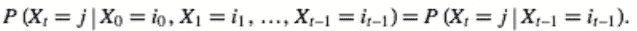
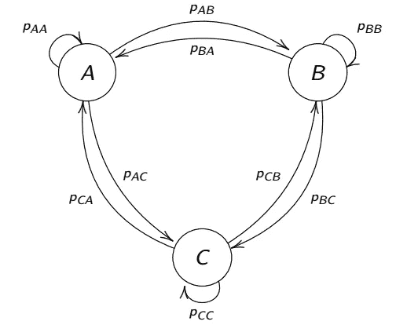
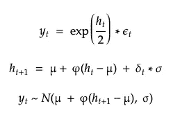
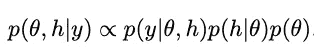
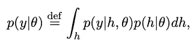

# 金融中的神经网络？马尔可夫链蒙特卡罗(MCMC)和随机波动模型

> 原文：<https://medium.com/analytics-vidhya/neural-networks-in-finance-markov-chain-monte-carlo-mcmc-and-stochastic-volatility-modelling-3f4f148c3046?source=collection_archive---------11----------------------->

> ***这个职位假设机器学习，计量经济学建模和期权定价的基本知识。对于下面的一些概念将不再进一步解释:
> 
> [AR 过程](https://en.wikipedia.org/wiki/Autoregressive_model)，[随机过程](https://en.wikipedia.org/wiki/Stochastic_process)， [ARCH](https://en.wikipedia.org/wiki/Autoregressive_conditional_heteroskedasticity) ， [Black-Scholes](https://en.wikipedia.org/wiki/Black%E2%80%93Scholes_equation) ，[期权定价](https://www.investopedia.com/ask/answers/062415/how-does-implied-volatility-impact-pricing-options.asp)，[贝叶斯统计](http://www.scholarpedia.org/article/Bayesian_statistics)

这篇文章的目的是向读者直观地介绍马尔可夫链蒙特卡罗(MCMC ),并展示其在金融领域的实际应用。

在金融市场中，波动性是评估资产回报、资产配置和风险的关键因素之一。传统上，波动率是用自回归条件异方差(ARCH)模型及其变体来建模的，然而，随着 Black-Scholes 定价在期权 SV 中的引入，开始引起业界更多的关注。Black-Scholes (1973 & 1976)的一个主要缺点是假设标的资产的波动率恒定，这是不现实的，SV 模型虽然可以解决这个缺陷。考虑到波动性的重要性及其广泛的文献，我认为这可能是一个很好的机会来介绍这个主题作为 MCMC 的应用。

在我们进入 MCMC 和波动性的数学和深度之前，让我们先了解一点历史背景。

# **蒙特卡洛:欧洲的赌博之都**

**蒙特卡罗方法最早是什么时候引入的？**

蒙特卡洛方法对于第二次世界大战期间开发第一批核武器的“曼哈顿计划”所需的模拟至关重要。

1946 年，冯·纽曼(以博弈论之父闻名)和他的同事乌兰正式提出了这个概念。他们正在研究辐射屏蔽和中子可能穿过各种材料的距离。虽然他们有足够的数据，但实验室的物理学家无法使用传统的分析数学来解决问题，于是，Ulam 有了用“真正随机”的数字进行随机实验的想法。

当时，这个项目是保密的，他们需要一个代号；是乌兰提出了蒙特卡洛这个名字。他的灵感来自他的叔叔，他似乎是摩纳哥“蒙特卡洛赌场”的行家，他会花时间赌家里的钱。

# **MCMC 分解**

MCMC 由两部分组成:马尔可夫链原理和蒙特卡罗模拟方法。

**蒙特卡洛方法:**蒙特卡洛方法是一种算法，当传统数学(确定性)无法输出单一结果或当问题太复杂而无法解析解决时，该算法简单地一遍又一遍地重复随机样本，以获得“答案”。

**马尔可夫链:**马尔可夫链形式上是一个随机过程，定义为随时间演化的随机变量。这个过程具有这样的性质，即给定现在，未来有条件地独立于过去。

换句话说，知道你在上一个时期的位置，就可以使其余的连锁历史变得无关紧要。如果我们知道 Xt=j，其中 j 是一个状态，那么其余的历史并没有为预测 Xt+1 增加任何信息；这就是为什么双方是平等的，我们只‘关心’我们在 Xt 中的当下状态。

## 我们需要什么来计算 MCMC？

您可能还记得贝叶斯统计，您的出发点是能够计算“先验”可能性，类似地，在马尔可夫链过程中，对于空间中任何可能的点，我们需要知道“先验”概率。简单来说，你需要对你的参数有所了解。

我们从一个随机点开始，根据我们在 t 时刻所处的位置计算先验似然度 Px。接下来，我们使用建议分布在参数空间中移动。我们向一个新的位置随机移动一步，然后计算“先验概率”*“提议概率”。在数千次迭代之后，你将会得到一个大维度空间的联合后验分布。

# MCMC 应用—随机波动性(SV)

如导言中所述，波动性估计是资本市场的关键指标。由于确定性假设不是经验可观察的，随机近似被认为是更好的估计。MCMC 在计算上非常昂贵，并且在行业中没有广泛使用，但是，我想为那些对这个主题感兴趣的人设置一个框架。

随机波动模型被定义为:

其中:y=对数回归； *h* =对数波动率；μ=对数波动的平均值；φ=波动率项的持续性；ε =资产回报上的白噪音(误差)；𝛿= t 时刻波动性的冲击

## **MCMC 算法——两步**

ARCH 和 SV 模型的主要区别在于，SV 认为波动率项具有不可预测的成分，而 ARCH 认为波动率是确定性的，因为它是一个自回归过程。

从计算的角度来看，这意味着什么？

让我们把θ看作一个随机向量，然后利用贝叶斯定理，我们可以把它的后验分布表示为

波动率状态 *h* 基于后验分布 p(θ，h|y)。因此，MCMC 推理的原理是模拟 p(θ|y ),其似然函数定义为:

由于该函数是一个 T 维积分问题，无法解析求解，因此需要进行估计。到了 90 年代，MCMC 开始被认为是一种有价值的技术。

MCMC 贝叶斯推断的原理是通过生成一个马尔可夫链随机样本抽取来模拟 p(θ|y)。

首先，我们使用马尔可夫链来生成收敛于后验分布 p(θ，h|y)的随机变量序列，这是通过对 t = 1，.。。，T 在马氏链空间中给定一个转移核。

接下来，蒙特卡罗计算参数的后验均值以平滑结果。

# 摘要

*   MCMC 有两个组成部分，马尔可夫链过程和蒙特卡罗模拟。
*   MCMC 有助于解决高维空间中的集成和优化问题。
*   随机波动率解决了 Black-Scholes 定价中确定性波动率的问题。