# 最简单的神经网络

> 原文：<https://medium.com/analytics-vidhya/neural-networks-in-nutshell-7d1cc3ae6443?source=collection_archive---------15----------------------->

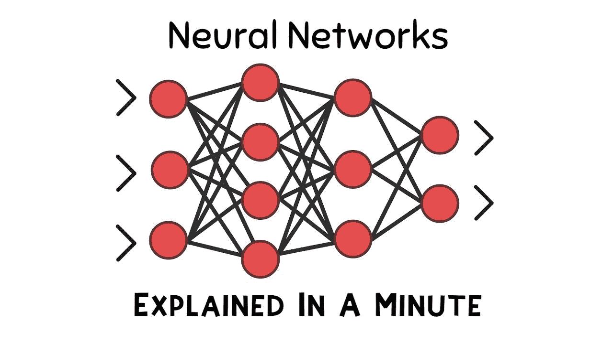

**神经网络:**

神经网络是强化领域下机器学习分支的一个分支，用于通过类似网络的结构从给定的原始数据中预测任意变量。神经网络的结构最有可能是人类的神经系统。

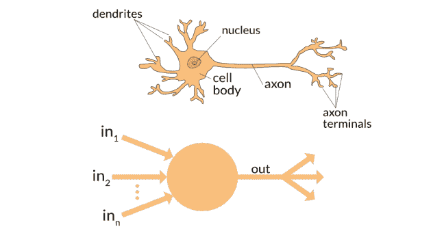

在这里，它的中心部分有核，树突用于接收电信号，轴突用于信号传递，轴突末端用于另一个神经元的树突的信号输出。

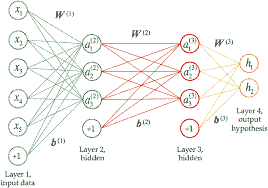

x =输入

h =输出

a =隐藏层

b =偏差系数

w =重量

**Perpectron:**

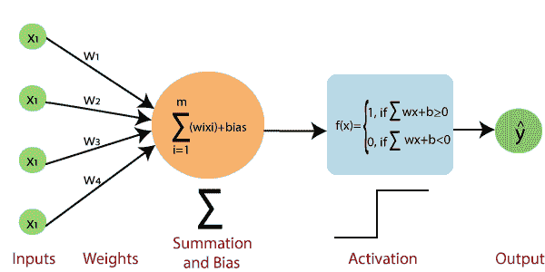

这里“x”是具有一些值的输入变量，并且每个输入节点都连接到隐藏层，在该隐藏层中，输入与其各自的权重相加，并且最后添加偏置因子。添加了进一步的“激活函数”来获取输出“y”hat。

根据特定节点对输出的影响，权重的值从 0 到 1 变化，在初始阶段，权重被随机初始化，稍后它将被相应地调整。

激活函数根据输入变量与偏差的和来决定是否激活节点。激活函数应用于隐藏层和输出层。

一些激活函数是阈值激活函数、Sigmoid 激活函数、正切双曲线激活函数、整流器激活函数等等。

这里将有一些决定值被设置，上面的值将被设置为高或激活节点，下面的值将被设置为低或停用节点。

**阈值激活功能:**

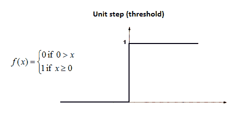

它也被称为二元函数。

**乙状结肠激活功能:**

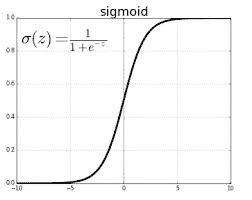

它最常用于概率情况。

**整流器功能(ReLU):**

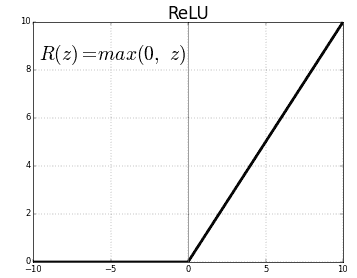

ReLU 是大多数人工神经网络中最常用的。

**正向传播:**

顾名思义，前向传播是前向数据流网络，因为在这里，数据在输入层被馈送，并且进一步被执行到隐藏层。隐藏层中的输入变量的处理是根据应用于该节点的激活函数来完成的，随后它被带到输出层，在输出层，将根据激活函数进行输出。

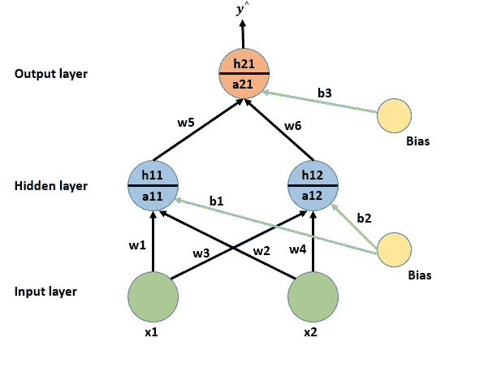

**注:**数据仅正向流动的网络称为**前馈网络。**在**前馈网络中不可能出现回流。**

**损失函数:**

它定义了模型的性能。这是通过计算实际输出和预测输出之间的差值来实现的。模型的损失值越低，模型的精度越高。

损失值有三种取法，有的一次取全组值作为**梯度下降**，或者在数据集的每个单点取一次作为**随机下降**，或者将全组分成 N 份作为**小批量随机下降。**

根据对神经元的影响来设置权重将减少损失函数。

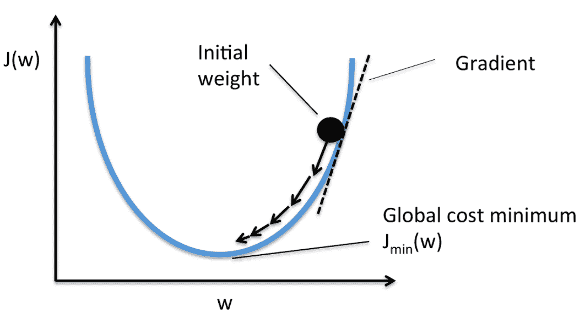

## **反向传播:**

反向传播与正向传播相同，但也与网络的反向传播相同。反向传播简单地说就是神经网络中的反馈，因为反向传播只是一个误差计算输出值。

神经网络的误差值简单地通过网络输出和期望输出之间的差来计算。

**误差=实际输出—期望输出**

计算的误差值用于反向传播，这意味着从输出层返回到隐藏层的所有神经元，以调整分配给它的权重，从而最小化输出中的误差，并获得期望的输出或更接近的值。

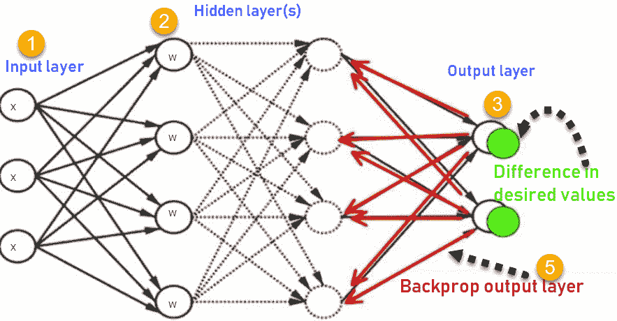

**梯度下降:**

梯度下降是一种广泛使用的算法，用于优化神经网络模型的参数，如系数和权重。考虑到 2D 曲线图，

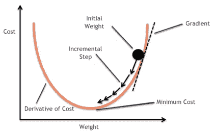

梯度下降只是下降到最小成本值/损失值，这是通过计算点的导数的斜率来完成的，当斜率为零时(向下的斜率为负，向上的斜率为正)，点被称为处于最小值，并且使用该算法的学习速率完成了成本函数的降低，其中必须设置正确的学习速率以达到图形的最小值。

**随机梯度下降:**

虽然梯度下降是伟大的，但其缓慢和高计算算法，需要大量的时间来执行。为了提高算法的速度，它被演化为随机 GD，这是一样的，但计算是在每个单点上进行的，这实际上更快，因为它同时使用多个线程来执行

随机梯度的另一个用途是它能有效地从几个极小值中找到全局极小值。

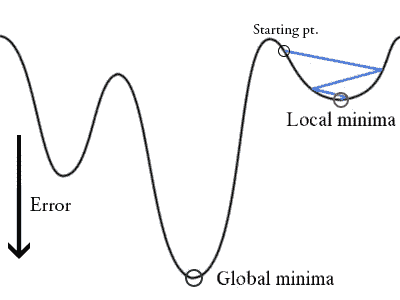

有时在成本函数中有许多极小值(局部极小值),但是在整个图中会有一个全局极小值(成本函数的极小值)。而适当的学习率会将点射向全局极小值。还是不能完全确定只有全局最小值。

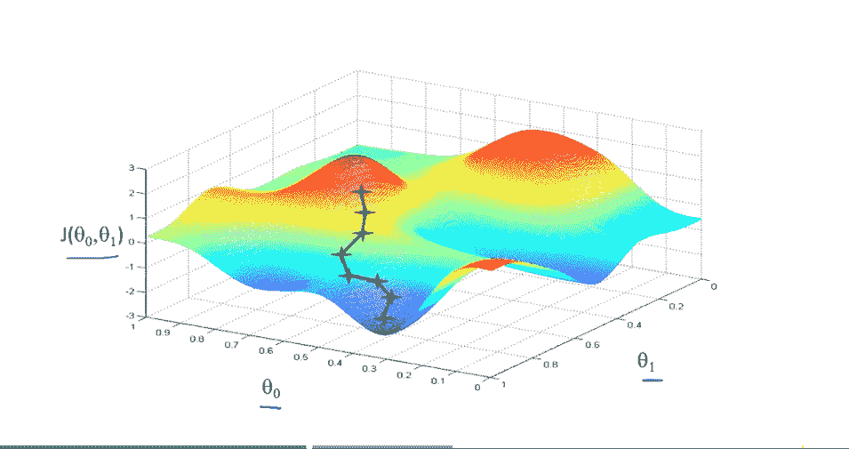

**三维成本函数图**

**最小随机梯度下降:**

Mini SGD 只是随机 GD，但误差计算是成批进行的(一组数据点，不像每个点的计算一样)。这比普通的 SGD 要好，因为它比 SGD 使用更少的线程，所以计算因素更少。