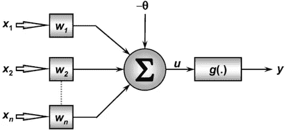
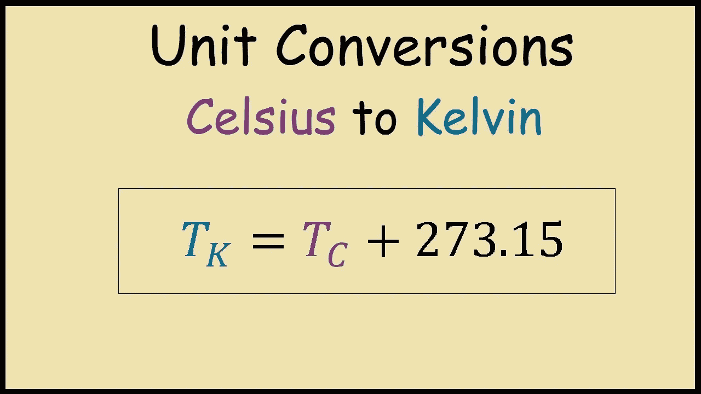
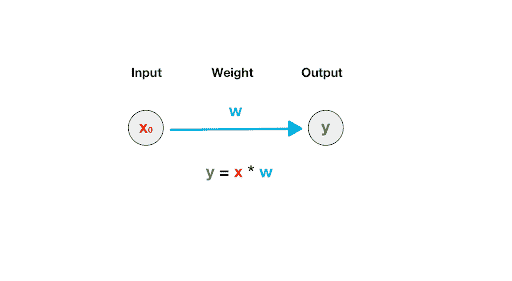

# 不到 5 分钟的人工神经网络直觉

> 原文：<https://medium.com/analytics-vidhya/neural-networks-intuition-in-less-than-5-minutes-74d0c4aeb64b?source=collection_archive---------26----------------------->

***神经网络*** 是如此强大的方法来解决许多 ***机器学习问题*** 。

神经网络的方法是 ***人脑*** 的衍生物，尤其是，这是 ***神经网络*** 最令人兴奋的特点！

在这篇文章中，你将看到神经网络 ***背后的直觉，并在不到 5 分钟的时间内解释清楚……***

来源[这里](https://www.google.com/url?sa=i&url=https%3A%2F%2Fgiphy.com%2Fexplore%2Fexplaining&psig=AOvVaw3dkF7vQ8uikPNj1fCRJmKN&ust=1591200099547000&source=images&cd=vfe&ved=0CAIQjRxqFwoTCKiQ7rjA4-kCFQAAAAAdAAAAABAD)

# 核心概念

你还记得我说过神经网络是人脑的衍生物吗？

作为人类，我们必须具备学习和保留信息的能力，这就是 ***神经网络*** 的核心思想！

> 显然，到目前为止，我们还不具备模拟人脑的计算能力，但我们正在快速进化。

# 神经网络如何工作

神经网络的基本架构如下图所示:

来源[此处](https://www.google.com/url?sa=i&url=https%3A%2F%2Fwww.wikiwand.com%2Fpt%2FPerceptron_multicamadas&psig=AOvVaw2HTmiTp3JbwX515Yc0oZVq&ust=1591201130768000&source=images&cd=vfe&ved=0CAIQjRxqFwoTCKDAzq3E4-kCFQAAAAAdAAAAABAO)

其中:

*   ***X，Y，Z:*** 是输入，可以是一个音频剪辑，也可以是一幅图像的像素；
*   ***W0，W1，W2:*** 是每个输入的权重，我们将在前面详细讨论；
*   ***σ:***是求和式，要乘以 X * W；
*   **θ:**是偏差值，用于改善神经网络的训练过程；
*   ***f:*** 是激活功能；

现在，我们已经知道了 ***神经网络*** 的基本架构，通常称为 ***【单层感知器】*** ，让我们看看这背后的数学！

# 神经网络背后的数学

实际上，神经网络背后的数学并不太复杂难以理解，让我们举一个实际的例子:

假设我们试图预测一个以摄氏度到开尔文给出的温度，我们的神经网络将如何解决这个问题？

> 显然，这是一个非常简单的问题，我们只需要几行代码就可以解决。当我们谈论机器学习时，我们想要解决的问题可能过于复杂，无法通过编码解决。我决定用这个例子来简单地理解神经网络背后的数学。

考虑到摄氏到开尔文的公式是:

来源[此处](https://www.google.com/url?sa=i&url=https%3A%2F%2Fwww.youtube.com%2Fwatch%3Fv%3D7dBOO9XLTno&psig=AOvVaw2WhNJ2Fc1b95z8Yco2DzJH&ust=1591201468734000&source=images&cd=vfe&ved=0CAIQjRxqFwoTCKD1icnF4-kCFQAAAAAdAAAAABAN)

我们的神经网络的挑战是找到这个公式来解决我们的问题！

我们想用一个输入来解决这个问题，所以我们的架构应该是这样的:

来源[这里](https://www.google.com/url?sa=i&url=http%3A%2F%2Fwww.curiousinspiration.com%2Fposts%2Fan-intro-to-linear-regression-using-a-single-neuron&psig=AOvVaw2ket3QapbsS-RWgkPTadV7&ust=1591201231088000&source=images&cd=vfe&ved=0CAIQjRxqFwoTCPiDptXE4-kCFQAAAAAdAAAAABAj)

在这个特殊的问题中，我们没有你们之前看到的 ***激活函数*** ，因为这是一个非常简单的问题，只有一个答案！

假设我们的第一个输入(以摄氏度计)是 ***65*** ，我们的神经网络将开始演算来解决我们的问题:

首先，我们的神经网络会为我们的权重和偏差设置一个值，通常是开发者制定的。因此，我们希望将 ***0.75*** 设置为我们的权重值，并将 ***1*** 设置为我们的偏差！

记住，在这种情况下我们只有一个重量！

现在，我们想应用我们的 ***总和*** 以及我们的输入和权重:

***σ= 65 * 0.75+1***

***σ= 49.75***

现在，我们已经有了我们神经网络第一次迭代的结果，这叫做***【Epoch】***。

但是如你所见，这是不正确的！我们的正确结果应该是:

***修正结果= 65 + 273，15 = 338.15***

我不会在本文中深入学习过程，以不超越我最初的承诺，但只是为了解释我们的神经网络将做什么:

*   ***从我们这里取正确的输出给；***
*   ***与预测产量比较，本例:48.75；***
*   ***如果它们不相等，将启动参数的重新调整(权重和偏差)；***

我将在其他帖子中写更多关于神经网络和学习过程的内容，但现在，这是神经网络背后的直觉！

如果你想了解更多关于学习过程的信息，请看这篇文章。

我们有许多架构，训练过程和参数调整技术，这个帖子的例子是所有这些的根源！

我希望你已经理解了 ***神经网络*** 是如何工作的！

目前，这就是全部！

下次见！

***我的社交媒体:***

***领英:****[https://www.linkedin.com/in/gabriel-mayer-779b5a162/](https://www.linkedin.com/in/gabriel-mayer-779b5a162/)*

****GitHub:*【https://github.com/gabrielmayers】***

****Instagram:***[https://www.instagram.com/gabrielmayerl/](https://www.instagram.com/gabrielmayerl/)*