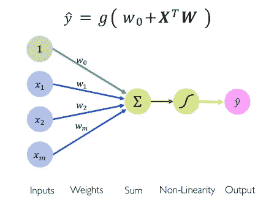

# 神经网络第 2 部分:构建神经网络&理解梯度下降。

> 原文：<https://medium.com/analytics-vidhya/neural-networks-part-2-building-neural-networks-understanding-gradient-descent-145718e91270?source=collection_archive---------13----------------------->

从[上一篇文章](https://link.medium.com/GQUMFxH7h7)中，我们了解了单个神经元或感知器如何通过获取输入向量和权重的点积，加上偏差，然后应用非线性激活函数来产生输出。现在让我们获取这些信息，看看这些神经元如何构建成神经网络。