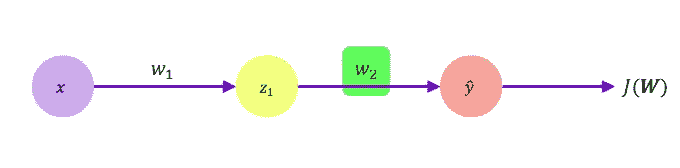
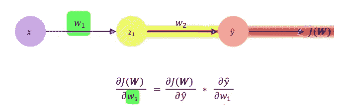
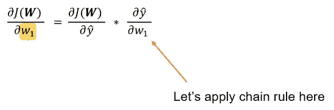
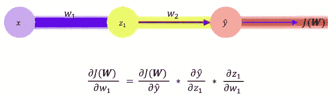
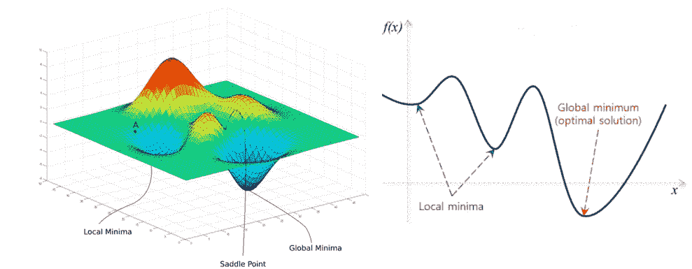
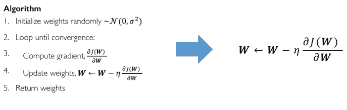
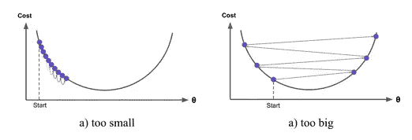
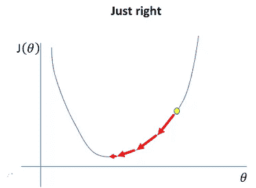
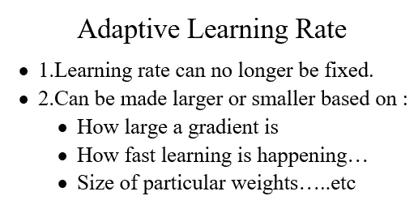
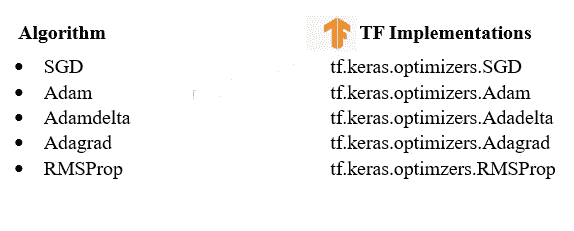

# 神经网络第 3 部分:理解反向传播和学习率

> 原文：<https://medium.com/analytics-vidhya/neural-networks-part-3-understanding-back-propagation-learning-rates-3482a981a2f0?source=collection_archive---------6----------------------->

在本文中，我们将了解如何计算梯度，以及网络如何通过反向传播进行学习。根据[上一篇关于我们讨论神经网络和梯度下降的文章](https://link.medium.com/2BL0UqqMm7)。我们讨论了梯度，以及它如何减少损失，直到我们收敛到全局最小值。

让我们来看看一个只有一个隐藏神经元和一个输出的网络。

一个小小的改变。:w2)影响最终损失 J(W)？

计算我们的损失相对于权重 W2(它是输出和隐藏层之间的第二个权重)的梯度。我们的输出可以告诉我们 W2 的微小变化会对我们的损失产生多大的影响。如果我们小幅度改变 W2，我们的损失变化有多大？它往下走吗？它改变了多少，改变了多少？让我们看看这个损失相对于 W2 的导数，为了评估它，我们可以应用微积分中的链式法则。

通过应用链式法则

我们可以将其分解为我们的损耗相对于输出的梯度 y_hat 乘以我们的输出相对于我们的重量的梯度(W2)。假设你想对一个神经网络重复这个过程，比如说 W1 而不是 W2，那么我们在两边都替换 W1 &我们也应用链式法则。

但是现在你会注意到，y 相对于 W1 的梯度是不可直接计算的。我们必须再次应用链式法则来评估它。再次应用链式法则后，我们把第二项分解成 y 相对于状态 z1 的梯度和状态 z1 相对于 W1 的梯度。

将所有这些梯度从输出反向传播到输入

*因此，我们将所有这些梯度从输出端一路反向传播到输入端，从而允许误差信号从输出端传播到输入端，并允许计算这些梯度。*现在在实践中，理解这里的复杂数学并不像在许多流行的深度学习框架中那样重要，我们有所谓的自动微分，它在引擎盖下完成所有这些反向传播，而我们甚至从未看到它……令人难以置信的是，您不必再从头开始实现反向传播，但理解这些如何在底层工作仍然很重要，这就是本文的目的。

现在，对网络中的每一层重复上述过程。这里我们只展示了 W1 和 W2，它们是一个单层，但是当你有更多层时，你可以再重复一次。继续应用输出、输入和计算的链式法则。这个过程就是反向传播。这就是网络如何从这种错误或损失中学习，并试图纠正那些旨在减少损失的错误。

在实践中，神经网络的优化是极其困难的，它不像第一张图所示的那样简单。如果我们尝试可视化一个景观，一个具有各种参数的神经网络，并尝试将其压缩到一个二维空间，这样你就可以可视化它。你可以看到，在现实中，景观是复杂的，可能会有许多局部最小值，梯度下降算法可能会陷入其中，在这些类型的环境中应用梯度下降在神经网络中是非常标准的，可能非常具有挑战性。

梯度下降算法会陷入局部极小值

根据梯度下降算法更新方程(第三点)

现在回想一下我们之前在梯度下降算法中定义的更新方程。这是同一个方程，我们将在梯度的相反方向上更新我们的权重。如果我们看看这个 **η** (eta)，它是决定我们应该在那个梯度的方向上走多少步的学习速率，在实践中设置这个学习速率会对你的表现产生巨大的影响。

如果你把学习率设置得太小，这意味着你没有真正相信你每一步的梯度，所以如果你的学习率太小，你只会向梯度的相反方向移动一点点，或者只是以很小的增量移动。可能发生的是，你会陷入这些局部极小值，因为你没有足够的进取心去逃避这些局部极小值。

a.)小学习率收敛慢，卡在伪局部极小。而 b .)大的学习速率超调，变得不稳定和发散。

如果你把学习速率设置得太大，实际上你可能会完全超调并发散，这是更不可取的。因此，在实践中设定学习率可能相当具有挑战性。

稳定的学习速率平稳地收敛并避免局部极小值。

所以，你一定会问，我们如何设定合适的学习速度？选项 1 是我们尝试一系列的学习率，看看什么效果最好。第二个选择是，我们可以尝试变得更聪明一点，尝试拥有一个*自适应学习速率*，它随着我们的环境或学习速度的变化而变化，或者随着我们网络优化中的一系列其他想法而变化。

这意味着我们的学习速度不再是固定的，而是可以在整个训练过程中增加或减少。因此，随着训练的进行，你的学习速度可能会加快，你可以采取更积极的步骤，你可以采取更小的步骤，更接近局部最小值，这样你就可以真正收敛到那个点。关于如何设计这种自适应算法，这里有许多选择，这是 ml & dl 损失优化理论中广泛研究的领域。对于这些不同类型的自适应学习率，tensorflow 中有不同类型的论文和实现。

SGD 是我之前展示过的普通梯度下降。所有其他的都是适应性学习率，这意味着它们在训练过程中改变它们的学习率。因此它们可以根据优化的进展而增加或减少

总之，我们可以在这个顺序包装器中定义我们的模型。在这个顺序包装器中，我们有所有由[感知器或单个神经元](https://link.medium.com/TOSFsnlxo7)组成的层。然后，我们可以使用我们的优化随机梯度下降，也可以是任何自适应学习率。

在我们的训练循环中，我们*通过那个模型向前传递*我们所有的输入，我们得到我们的预测。使用这些预测，我们可以评估它们，计算我们的损失&我们的损失告诉我们我们的网络在那次迭代中有多错误，它还告诉我们如何计算梯度，以及我们如何改变我们网络中的所有权重以在未来改进。

最后，采用这些梯度，实际上允许我们的优化器更新权重&训练变量，这样在下一次迭代中，它们会做得更好一点。随着时间的推移，如果我们继续循环，这将收敛，希望应该适合你的数据。

这就是神经网络中的反向传播和学习率。

*快乐学习。*

如果你想了解神经网络中单个神经元内部发生了什么(本文的第一部分)，请点击这里。

如果你想了解梯度下降是如何工作的，以及我们如何利用神经元构建神经网络(本文的第二部分)，请点击这里。