# 神经网络第一部分:一个神经元

> 原文：<https://medium.com/analytics-vidhya/neural-networks-part-i-one-neuron-473d1ac06207?source=collection_archive---------19----------------------->

我已经试着摆弄神经网络有一段时间了。问题是，我们喜欢把神经网络想象成一个黑匣子，在这个黑匣子里会发生一些神奇的事情，你会得到一些很酷的答案。

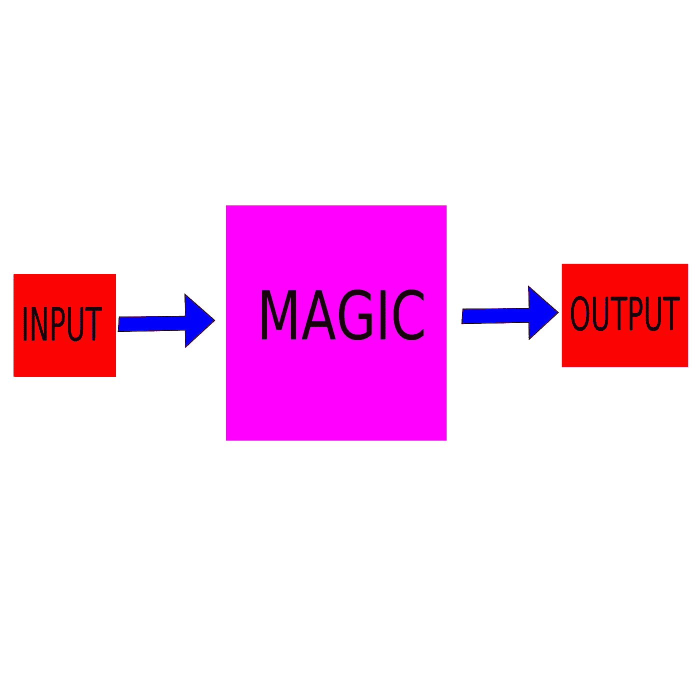

神奇的神经网络接管世界…

但是有些东西在那个盒子里，有些东西可能会被跳过，以便得到复杂的，理论上的东西。但是这些“东西”对于理解神经网络如何工作或不工作以及为什么工作是必不可少的。

基本上，神经网络的工作有点像人脑。我们的神经元相互连接，相互发出指令，最终产生输出。从这个角度来看，神经网络是一样的，但它们使用感知机。

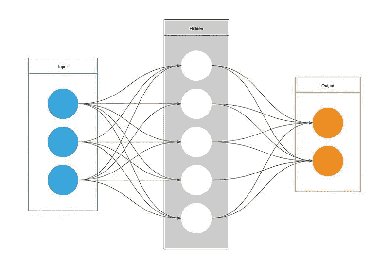

图片由 [LearnDataSci](https://www.learndatasci.com/) 通过[维基共享](https://en.wikipedia.org/wiki/File:Artificial_Neural_Network.jpg) (CC BY-SA 4.0)

我们来预测一下一个超级简单的水瓶的成本。唯一真正改变的是水瓶的大小；这家公司决定不管颜色如何，成本都保持不变。这是一张与瓶子大小相关的成本表:

```
Size(oz) | Cost($)5        | 23        | 124       | 30
```

这是一张图表:

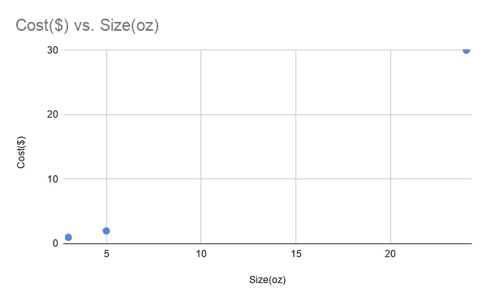

成本与规模

仅从 3 个数据点中很难得出任何准确的结论，但总体思路是存在的。

本质上，一个感知器的工作方式是它遵循一个函数，通常是一个非常简单的函数，如线性函数:

```
y = mx + b
```

那么 x 是我们的输入，y 是感知机预测的输出。第一步，我们将简单地让一个感知器工作，然后我们可以继续对多个感知器应用相同的概念。

所以我们有一个遵循线性函数的感知器，和三个点。最终，我们的目标是让这个非常小的神经网络能够输入和输出瓶子的大小，为了做到这一点，我们需要找出“m”(斜率)和“b”(y 轴截距)是什么。我们可以这样做。

# 1.得出 m 和 b 的随机值

随便取个值，大概在 1 到 0 之间。这将是我们(非常小的)神经网络的起点。

```
import numpy as np # For random numbers and simple matrix operations class Neuron: def __init__(self): # Initializing. self.m = np.random.rand() self.b = np.random.rand() # Created random values for m and b.NN = Neuron()
```

# 2.运行神经网络

现在，我们将在类中创建另一个函数，它接收一组输入，将它们传递给我们的神经元，然后返回一个输出。这又回到了整个 y = mx + b 的思想。

```
import numpy as np # For random numbers and simple matrix operationsclass Neuron: def __init__(self): # Initializing. self.m = np.random.rand() self.b = np.random.rand() # Created random values for m and b. **def runThrough(self, inputs):** **return [self.m * i + self.b for i in inputs]**data = np.array([[5, 2],[3, 1],[24, 30]])NN = Neuron()**print(NN.runThrough(data[:,0])) # Quick test run**
```

# 3.找出我们做错了什么

现在我们需要回溯一下，看看我们错在哪里。这使用了一个误差函数，在这种情况下，我们将使用均方误差。

均方差(MSE)的基本工作原理是计算每个不同点之间差异的平方，然后计算它们的平均值。用一种奇特的方式来说:

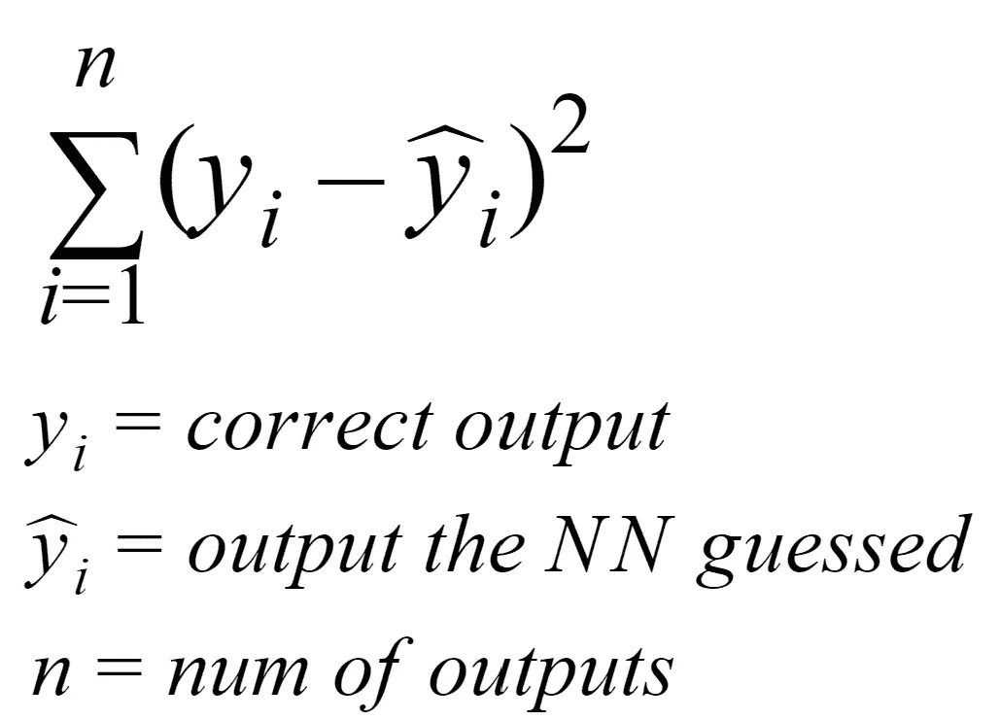

均方误差(mean square error)

现在让我们在代码中实现这一点:

```
import numpy as np # For random numbers and simple matrix operationsclass Neuron: def __init__(self): # Initializing. self.m = np.random.rand() self.b = np.random.rand() # Created random values for m and b. def runThrough(self, inputs): # Given inputs, output the NN's guess return [self.m * i + self.b for i in inputs] **def MSE(self, inputs, outputs):** **# Given inputs and outputs, provide the MSE** **results = self.runThrough(inputs)** **MeanSquaredErr = 0** **for i in range(len(results)):** **# Compare to outputs** **MeanSquaredErr += (results[i] - outputs[i])**2** **MeanSquaredErr /= len(results)** **return MeanSquaredErr**data = np.array([[5, 2],[3, 1],[24, 30]])NN = Neuron()**print(NN.MSE(data[:,0], data[:,1])) # Testing MSE function**
```

酷！现在我们已经初始化了一个感知器，正在运行，并使用 MSE 查看它做错了什么。

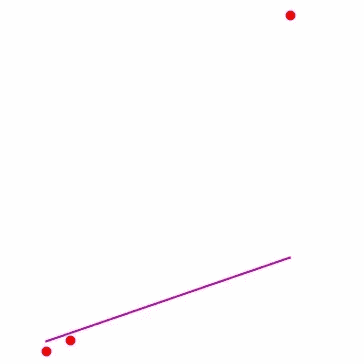

第一次训练！

# 4.使用衍生品反向传播

现在，这是我可能会回到 Tensorflow 并收工的部分。但我们不会那么做。

首先，我们要扩展我们的 MSE 方程。我们知道我们的神经网络输出等于:

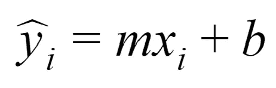

我们神经网络的输出

让我们把它代入等式。

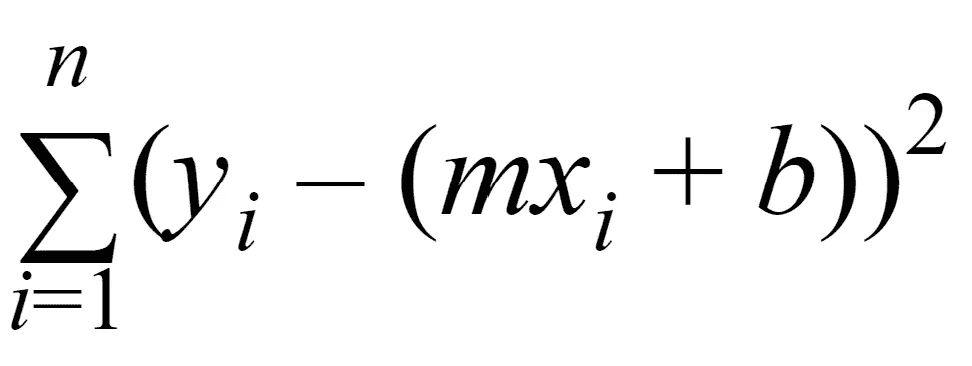

扩展 MSE

现在，关于偏导数，需要记住的最重要的事情是，它们基本上找到了瞬时斜率。有很多不同的规则和复杂的方法可以使用它们，但主要的想法是，给定一个函数中的变量，你可以找到该变量如何影响整体函数。

现在，我们使用以下规则来推导均方误差函数:


链式法则

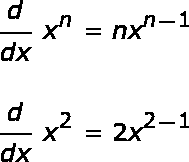

权力规则

当取偏导数时，每隔一个变量就被认为是一个常数，而常数在求导时是 0。所以我们要做的是，用这个来找出变量 m 和 b 如何影响我们的 MSE 函数，并找出它们的偏导数。

首先，我们用链式法则去掉外部函数；在这种情况下，这是均方误差的平方，对于任何 x，幂法则表明导数是 2x。现在我们会有:

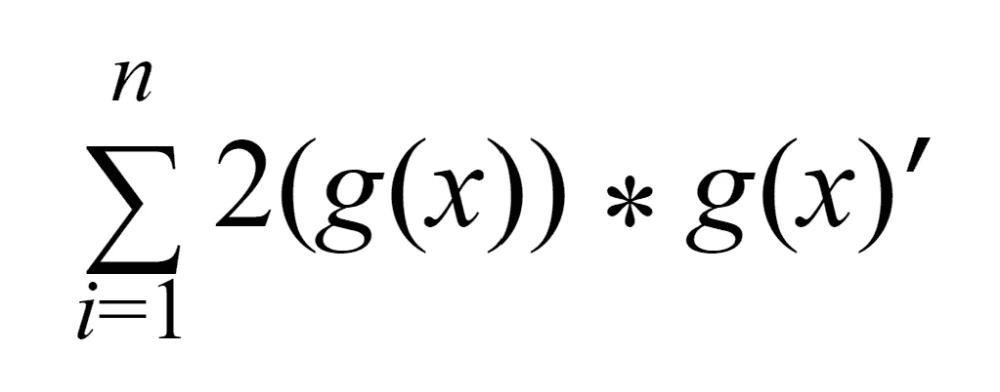

鉴于:

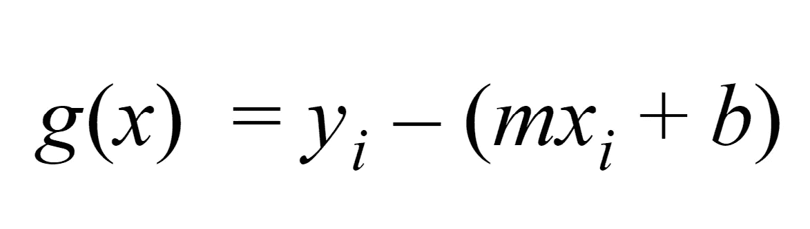

好吧。现在，我们需要为 m 导出 g(x)(我们马上就要做 b)。假设 y 和 b 都是常数和 0，我们剩下-mx，而且，因为 m 的导数是 1，那么 g(x)对 m 的偏导数留给我们-x，耶！

现在我们可以对 b 做类似的事情，我们知道 mx 和 y 都将被视为常数，所以它们被视为 0。b 的导数是 1，所以我们最终剩下-1 作为 g(x)对 g 的偏导数。

对于 m:

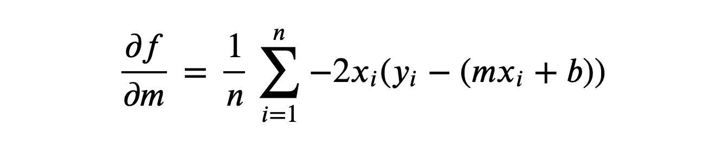

m 的导数

对于 b:

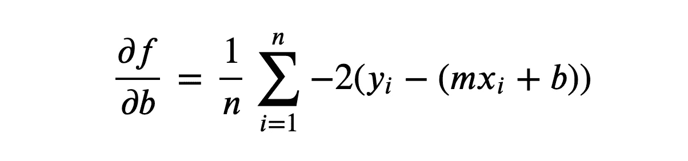

b 的导数

这具体地告诉神经网络 m 和 b 都必须改变多少。然而，由于过拟合问题和导数只计算瞬时斜率，我们需要一个学习率。学习率乘以我们的导数，就像在检查神经网络是否正常之前，朝着正确的方向迈出了一小步。你不会在没有考虑你是否在正确的方向上(如果你想走出迷宫的话)就在迷宫中冲刺。

现在让我们编码这个。注意:simpleError 只输出 g(x ),所以函数 MSE 被修改，以减少在求导时的运算次数。修改部分以粗体显示。

```
import numpy as np # For random numbers and simple matrix operationsclass Neuron: def __init__(self): # Initializing. self.m = np.random.rand() self.b = np.random.rand() # Created random values for m and b. def runThrough(self, inputs): # Given inputs, output the NN's guess return [self.m * i + self.b for i in inputs] **def simpleError(self, outputE, outputI):** **# Given one output and one expected output, return** **# y - runThorough(inputI)** **return outputE - outputI** def MSE(self, inputs, outputs): # Given inputs and outputs, provide the MSE results = self.runThrough(inputs) MeanSquaredErr = 0 for i in range(len(results)): # Compare to outputs **MeanSquaredErr += (self.simpleError(outputs[i], results[i]))**2**MeanSquaredErr /= len(results) return MeanSquaredErr **def derivMB(self, inputs, outputs):** **# Similar to MSE, iterate through the inputs and outputs and perform the partial derivative of MSE in terms of m and b.** **changeM = 0** **changeB = 0** **res = self.runThrough(inputs)** **for i in range(len(res)):** **# Add to changeM the derivative** **changeM += (-2*inputs[i])*self.simpleError(outputs[i], res[i])** **changeB += (-2)*self.simpleError(outputs[i], res[i])** **changeB /= len(res)** **changeM /= len(res)** **return changeM, changeB** **def learn(self, inputs, outputs, learningRate=0.001):** **changeM, changeB = self.derivMB(inputs, outputs) # Call the derivative function. This tells us how much to change m and b.** **changeM *= learningRate # Making tiny steps towards the solution** **changeB *= learningRate** **# Now modify m and b by this** **self.m -= changeM** **self.b -= changeB** data = np.array([[3, 1],[5, 2],[24, 30]])NN = Neuron()print(NN.runThrough(data[:,0]), data[:,0])**import matplotlib.pyplot as plt****for i in range(100):** **plt.ion() # Creates interactive plt interface** **plt.cla() # Clear graph** **NN.learn(data[:,0], data[:,1]) # Initiate learning function** **plt.plot(data[:,0], data[:,1], "ro") # Plot the points** **plt.plot(data[:,0], NN.runThrough(data[:,0]), "m-") # Plot the predicted values of those numbers** **plt.show()** **print(NN.MSE(data[:,0], data[:,1])) # Print how it's doing, to check whether the MSE is decreasing.** **plt.pause(0.1) # Pause is necessary for interactive interface**
```

所以现在，如果你运行上面的代码，你可以看到神经网络试图学习如何适应这些值。您可以尝试学习速率、误差函数，或者根据自己的意愿改变它从 for 循环中学习的数量。

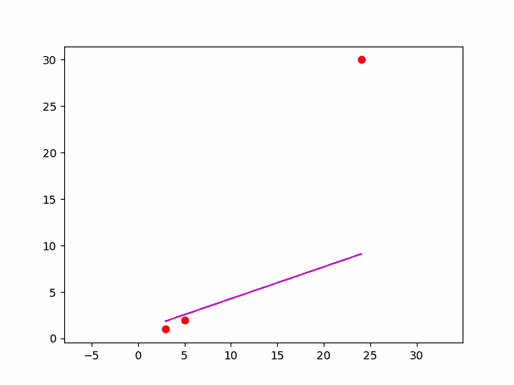

NN 培训的 GIF

最后，我们得到了一个简单的感知器(具体来说，我们使用梯度下降执行线性回归)。其中一个已经很好地预测了一个水瓶的价格——数百、数千甚至数百万个这样的人一起工作的力量是难以想象的。

除非另有说明，所有照片均由作者拍摄/制作。