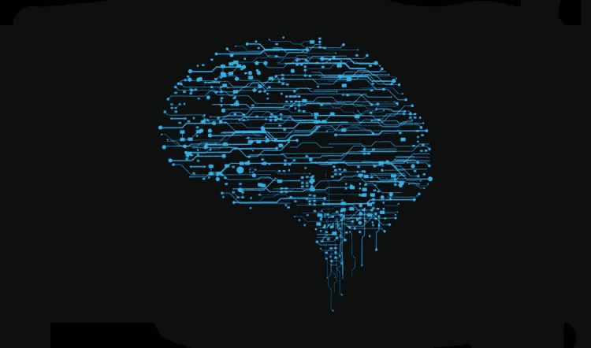
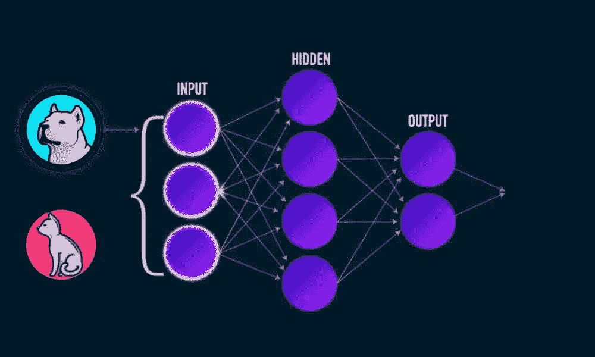
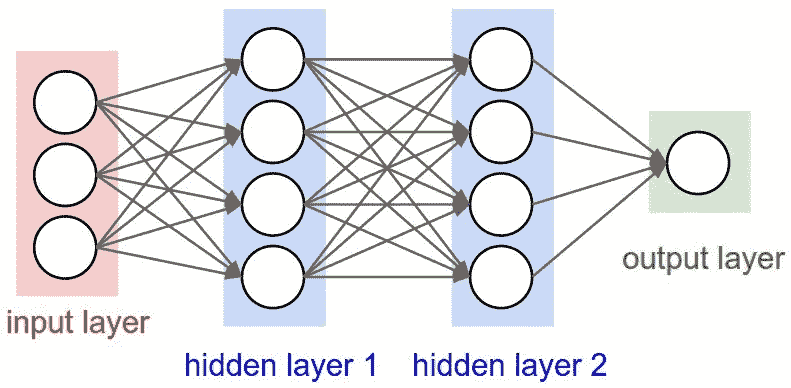
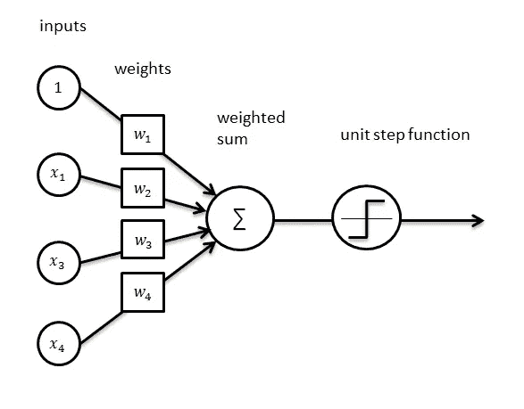
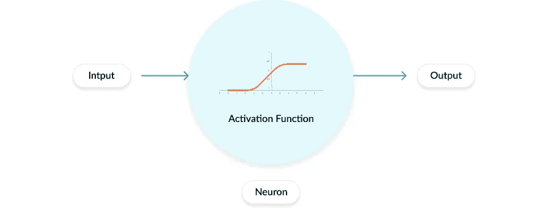
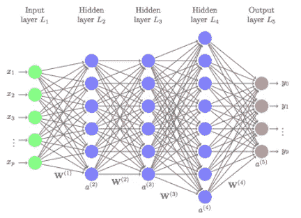

# 神经网络

> 原文：<https://medium.com/analytics-vidhya/neural-networks-simply-explained-79f759468867?source=collection_archive---------28----------------------->

# 什么是神经网络？

神经网络由一系列用于模拟人脑的机器学习技术组成。神经网络能够提取数据中隐藏的模式；他们能够通过将一堆节点相互连接(密集)来做到这一点。每个节点一起工作，找出隐藏的细节，然后将其传递给下一个节点，以找到这些细节中的联系。

## 输入层

神经网络的输入层是我们在模型中使用的变量/特征列表。

## 砝码

在逻辑回归的情况下，这里的权重是我们为适应模型而调整的系数。在其他神经网络中，权重是对任何输入变量的标量变换和矩阵乘法的组合。

## 激活功能

在逻辑回归中，我们使用一个 **sigmoid** 激活函数。你可能看到的其他选项有**线性**、 **Tanh** 和 **ReLU** 。

## 更深的网络=更多的隐藏层

## 为什么要隐藏图层？

它们是隐藏的，因为我们没有指定它们。它们可以表示潜在的因素(如矩阵分解)，或者将现有的变量组合成新的特征。

## 反向传播—调整权重

此外，神经网络是动态的，在一定数量的数据点通过模型后，权重将*更新*，着眼于优化我们的损失函数。(回想一下生物神经元，这就像是修改它们的激活电位。)通常，这是通过使用某种形式的梯度下降来完成的，但是[已经尝试了其他方法](https://arxiv.org/abs/1605.02026)。

# 卷积神经网络

CNN 主要用于图像识别/分类。它们可以用于视频分析、NLP(情感分析、主题建模)和语音识别。今天我们将讨论如何使用 CNN 对图像进行分类。

## 计算机如何看图像

对计算机来说，图像是一个 3D 对象——由 3 个矩阵组成——每个矩阵对应一种原色，可以以不同的强度组合来创建不同的颜色。矩阵中的每个元素代表一个像素的位置，并且包含一个 0 到 255 之间的数字，该数字指示该像素中相应原色的强度。