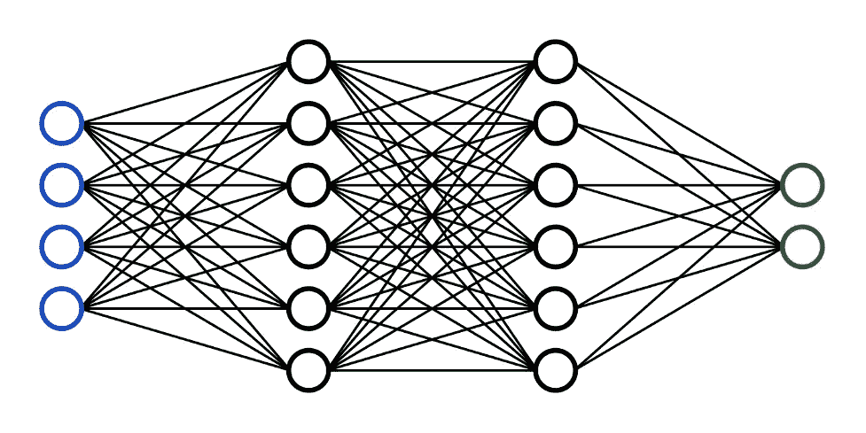
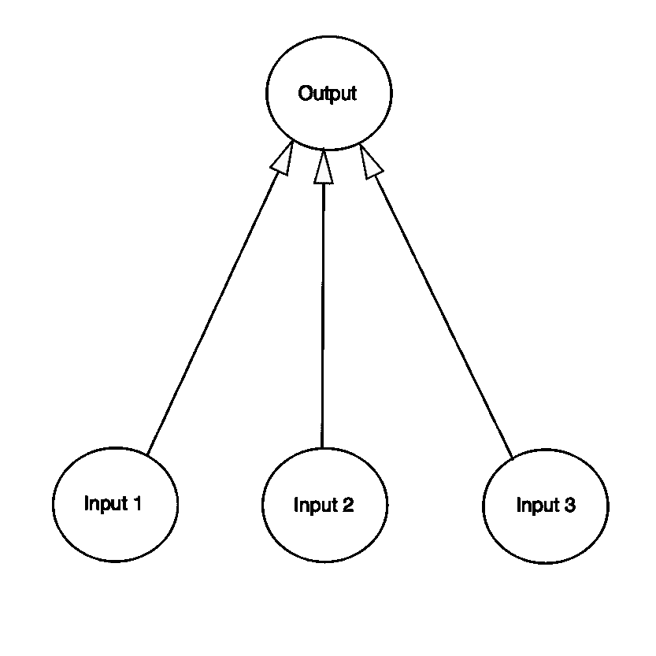
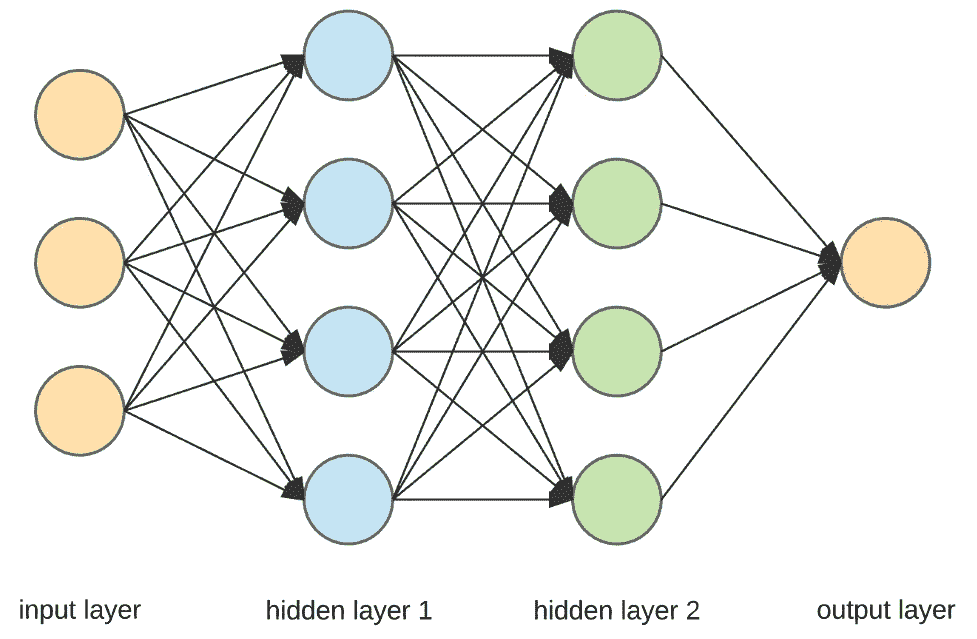
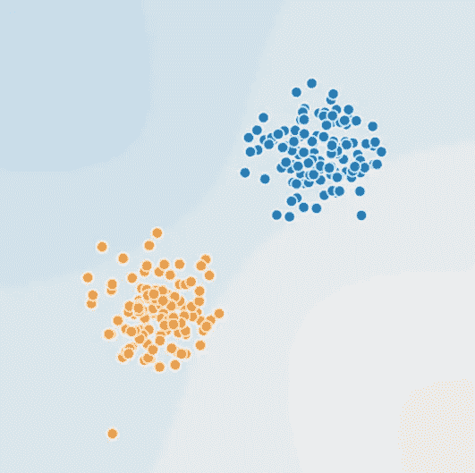
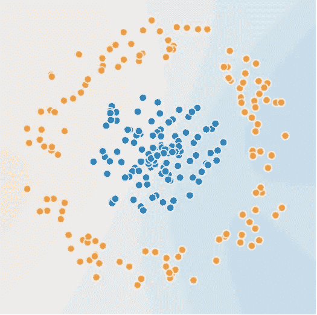
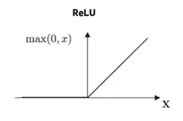
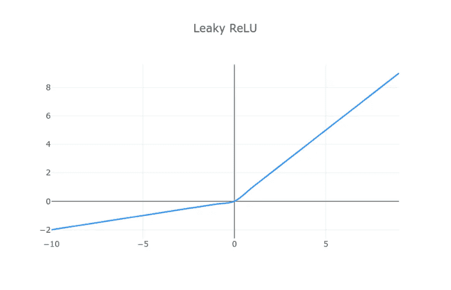
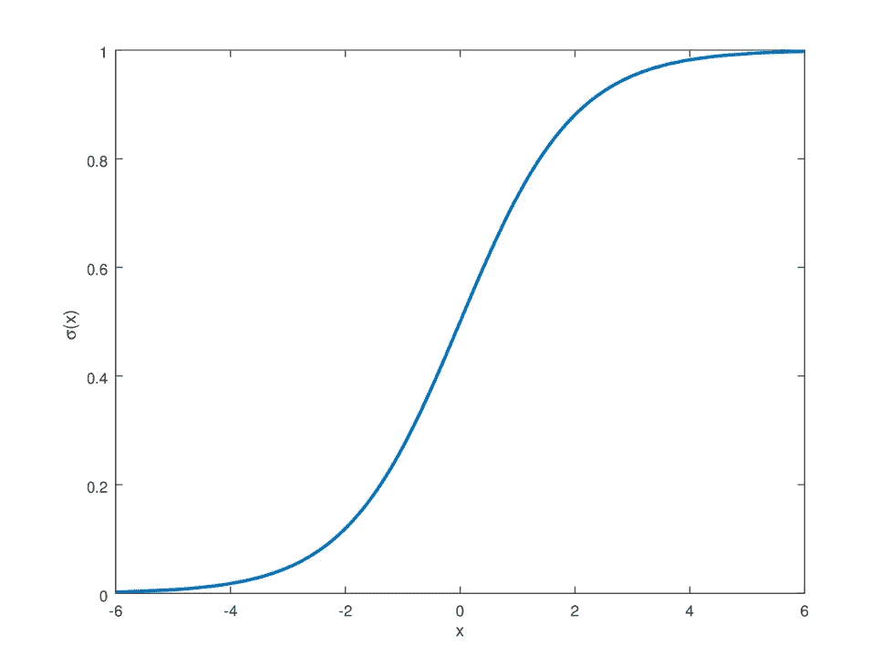

# 神经网络——基础

> 原文：<https://medium.com/analytics-vidhya/neural-networks-the-basics-7cfd2ad15443?source=collection_archive---------10----------------------->

如果我们使用 100%的大脑会怎么样？或者更好的是:如果我们能教会计算机像我们的大脑一样学习，会怎么样？这是**神经网络(NN)背后的基本概念，**机器学习(ML)和人工智能(AI)的重要子集，模拟人脑。在本文中，我将解释神经网络背后的方式和原因，并查看一些具体的应用。

# **定义术语**

为了讨论神经网络的基础知识，我们必须定义一些非常基本的术语。当更复杂的词汇变得有用时，我会解释它们。

*   一个**神经元**是上面网络中的一个小圆圈。每个神经元都包含一些数值。神经元的外观和行为很像图论中的节点。
*   一个**输入神经元**是一个其值由用户设置的神经元，它们是初始图像中以蓝色突出显示的神经元。输入神经元启动网络。
*   一个**输出神经元**在上图中以绿色突出显示。输出神经元回答我们向神经网络提出的问题。(即，哪个队将赢得比赛，是下雨、晴天还是下雪，明天股票将如何定价，等等。)网络可以有多个输出，例如一个可以描述预期的温度，另一个可以描述预期的湿度。
*   **层**是神经元的垂直堆叠。可以有一个输入神经元的输入层，一个输出神经元的输出层，或者填充了隐藏神经元的隐藏层，我们将在后面详细讨论。
*   权重是连接所有神经元的线之一，就像图论中的边一样。权重也各有数值。每一个神经元在它自己和它左右两边的层中的每一个神经元之间都有一个权重。
*   **规范化**是取任意一个数值并使其介于 0 和 1 之间的过程。为此，可以将该值插入一个 **sigmoid 函数**，也称为逻辑曲线。当我们有大范围的相互作用值时，这是很重要的，因为我们不希望一个特别大的神经元决定不成比例的输出量。
*   一个**激活函数**决定了计算中使用了多少神经元的值。有几种不同的函数，我将在后面讨论它们。

# **双层网络**

现在我们已经有了基本的定义，让我们把它们用在我们的第一个神经网络上。这个将有两层，一个输入层和一个输出层。为简单起见，输入层将有三个神经元，每个神经元通过一个权重连接到输出层中的单个神经元。我们的网络将采取以下步骤来生成有用的输出:

在双层网络中，3 个输入变成一个输出

1.从用户那里获得三个输入。

2.将这三者乘以连接它们与输出的权重。

3.将所得乘积相加。

4.归一化总和，你就有一个输出。

上面说的真的很抽象，所以我们来看一个更具体的例子，通过试图弄清楚一个高中生是否要通过他们的课。我们可以把他们上课的百分比，他们在所有其他课程中的 GPA，以及他们完成了多少作业作为输入。然后，我们可以遵循第二步和第三步，如果在标准化我们的输出后，它高于某个阈值(在这种情况下，0.5 可能是有意义的，因为我们正在寻找一个二进制)，我们可以预测该学生将通过他们的课程。否则，我们的神经网络认为它们会失败。

从这四个步骤和示例中可以得出一些关键的想法:

*   首先，注意没有使用激活函数。这是因为我们还没有任何隐藏层，但我们很快就会添加这些。
*   第二，神经网络是非常大的功能。在这么小的规模上更容易看到，因为我们实际上采用了六个参数(三个输入，三个权重)，进行了一些基本运算，并对输出进行了归一化，但随着网络变得越来越复杂，记住这一点是很有用的

# **捉迷藏——隐藏层**

这个网络有蓝色和绿色的隐藏层

我已经多次提到了隐藏层，我认为现在是提供一个定义的好时机:**隐藏层是输入层和输出层之间任意大小的神经元的堆叠。**它对用户来说是*隐藏的*，因为用户只给出输入和接收输出，而根本不与隐藏层交互。可以只有一个隐藏层，总共有三层，也可以有几个隐藏层，一个接一个。像所有神经元一样，隐藏层中的神经元具有从上一层中所有神经元指向它们的权重，以及从它们指向右侧层中每个神经元的权重。

具有隐藏层的网络与只有两层的网络工作方式相同。**这一层中的每个神经元的值是通过将前一层中的所有神经元乘以它们各自的权重并将乘积相加来确定的。**该过程对每个隐藏层重复进行，因此，例如，具有两个隐藏层的网络，第一个隐藏层从输入中确定其值，然后第二个隐藏层从第一个隐藏层中获得其值，最后第二个隐藏层确定输出值。

使用这种设置，两层网络将轻而易举

那么为什么会有这些类似 007 的层呢？答案在于神经网络的功能定义。**当一个网络只有一个输入层和一个输出层时，由于输出的公式是线性函数:*输入 1 *权重 1 +输入 2 *权重 2* + *输入 3 *权重 3* 等，所以只能在两个可能的输出之间画一个线性的决策边界**。一个两层的神经网络可以很好地从左边的数据中分离出蓝色和橙色。

但在这里会完全迷失:

两层网络在这里会有一段艰难的时间

幸运的是，对于隐藏层，函数可以更复杂，因为添加了更多的权重和附加物，因此决策边界可以表示各种不同的形状，如上面的圆形。

# **激活功能**

隐藏层有许多好处，但一个关键的危害是，随着每个隐藏层的出现，越来越多的神经元围绕着我们的计算机(众所周知的大脑)旋转，有时很难知道哪些数据是相关的，以及该给它多少权重。激活功能可以帮助通过对隐藏层中的每个神经元做一些事情，改变其相对于其他神经元的值。您可能还记得，我们在输出层上执行了一种激活功能，方法是用逻辑曲线对其进行归一化。激活函数是神经网络的一个重要组成部分，因此了解以下一些常见的激活函数是很有价值的。

## 线性的

线性激活函数非常简单:它们获取神经元的值并保持不变，有时将该值乘以一个“斜率”，就像图形中的线性函数一样。

## 热卢

ReLu 或整流线性单位与线性函数完全相同，只是任何负值都映射为零。

## 泄漏 ReLU

Leaky ReLu 对大于零的值使用线性激活函数，与 ReLu 非常相似，但与 ReLu 不同的是，它也对小于零的值使用线性激活函数。但是，低于零值的线性函数的斜率必须小于高于零值的斜率。

## 乙状结肠的

正如我们已经讨论过的，sigmoid 函数将所有东西都转换成一个介于 1 和 0 之间的值，当一个值离 0 越远，它就离它旁边的值越近。

# **大问题**

现在，一个很大的问题可能正在你的脑海中出现:**我们如何决定权重的值？**(记住重量是我们从一层到下一层的方式。)设置权重的过程其实很简单:猜测和检查。我们采用一组数据，例如出勤率与及格或不及格的关系，称为训练集，并猜测不同的权重，直到一组权重能够在一定的容差内准确地告诉我们想要知道的东西。

举例来说，容差可以是 5%，这意味着 95%的精度足够好，或者是 1%，这意味着我们要求 99%的精度。通过一种叫做梯度下降的算法，基于前一个猜测的成功来调整每个猜测。现在让我们来看一个更正式的，一步一步的定义，如何设置权重。

1.选择随机权重。

2.将它们用在我们训练数据集中的一段数据上。

3.**将结果逐层插入梯度下降函数，**从输出层开始向后移动-梯度下降的公式非常复杂，不值得记忆，但基本思想很简单:**如果我们的估计过高，减少权重。如果我们的估计太低，增加权重。**这个过程被称为反向传播，因为我们通过网络向后移动我们的调整。

4.重复上述过程，直到我们的网络在容差范围内是准确的。

通过这个过程，我们可以教会多层神经网络使用大量数据做出非常准确的预测，这些数据是人类永远无法识别的模式。

# **避免过度拟合**

过度拟合是机器学习的最大陷阱之一，当我们的人工智能学习得太好时就会出现。它变得如此善于从特定的训练数据集中获得它想要的结果，以至于它不再能够将自己应用于一般情况。这有点像如果一个四分卫太擅长扔深球，以至于他失去了短距离传球的能力。让我们来看看纠正过度拟合的几种方法:

*   **使用更多数据** —数据集越全面，就越难过度拟合。
*   **辍学**——停止过度适应的流行方法之一。Dropout 定期从网络中删除随机节点，迫使网络调整以学习不同的内部结构，并更好地处理任何输入。

# **特殊网络和应用**

## **分类**

神经网络可以基于作为输入给出的那些项目的特征来对项目进行分类。**分类是神经网络最常见的应用。我们已经学习了如何将天气分为雨天或晴天，但这只是众多例子中的一个。其他现实世界的应用包括判断钞票是否是伪造的，以及决定产品的最佳价格。**

## **卷积神经网络**

卷积神经网络(CNN)对于图像识别特别有用。研究人员正在使用它们来制造能够了解环境的自动驾驶汽车。CNN 的工作是将图像每个像素的 RGB 数字作为输入。然后他们在每一层对图像应用滤镜。该过滤器看起来像一个 m 乘 n 矩阵，其工作方式是将每个 m 乘 n 矩形像素乘以矩阵中的任何相应数字，并将结果相加，以创建一个新的、更小的像素集，网络在该像素集上执行其操作。每个过滤器都允许 CNN“学习”一些不同的图像。例如，一些滤镜隔离图像中不同对象之间的边缘，而另一些滤镜从图像中移除颜色，只查看图像内容的形状。

# **关键要点**

*   神经网络使用**不断调整权重**，以及它们如何通过神经元**根据一些输入准确预测结果。**
*   通过**梯度下降调整权重。**
*   **激活函数**决定给定神经元的权重。
*   **网络有几种应用，**如图像识别。

# ***延伸阅读***

如果你想了解更多，网上有很多资源。我特别推荐 edx 的 CS50:AI 入门课程。如果您想继续关注我，与我交谈，或者有更多的问题，以下是我的联系方式:

[*邮箱*](http://yamanhabip@icloud.com/)*|*[*Linkedin*](https://www.linkedin.com/in/yaman-habip-51a5491b6/)*|*[*Github*](https://github.com/Yaman-Habip)

*并请* [*订阅*](https://yamanhabip.substack.com/subscribe?utm_source=menu&simple=true&next=https%3A%2F%2Fyamanhabip.substack.com%2Faccount%2Flogin%3Fredirect%3D%252Fpublish%253Futm_source%253Dmenu%26error%3DPlease%2520log%2520in%2520to%2520access%2520this%2520page.) *我的简讯！*