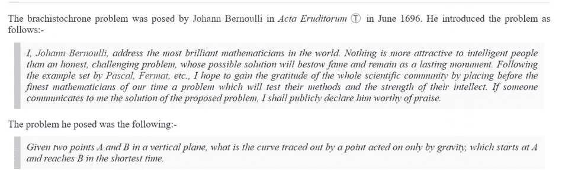

# 神经网络与简单梯度下降:古老的最速降问题。

> 原文：<https://medium.com/analytics-vidhya/neural-networks-vs-simple-gradient-descent-the-age-old-brachistochrone-problem-7503be69d611?source=collection_archive---------13----------------------->

照片由[陶黎黄](https://unsplash.com/@h4x0r3?utm_source=medium&utm_medium=referral)在 [Unsplash](https://unsplash.com?utm_source=medium&utm_medium=referral)

[来源](https://mathshistory.st-andrews.ac.uk/HistTopics/Brachistochrone/)

# 简介:

我计划通过**梯度下降**得出这个问题的解决方案。通过这种求解方法，我们不仅能够找到…