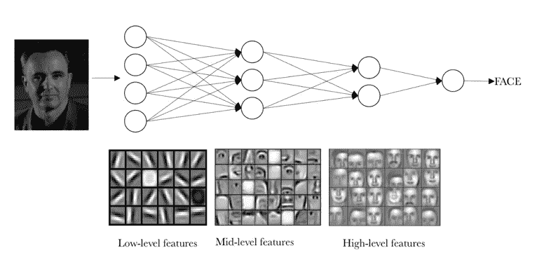

# 基于 GPU 和张量流的神经网络

> 原文：<https://medium.com/analytics-vidhya/neural-networks-with-gpu-bf7def8983a9?source=collection_archive---------10----------------------->

来源于[乔迪·托雷斯](https://torres.ai/deeplearning/)

在我之前的[帖子](/analytics-vidhya/installing-cudnn-for-gpu-support-with-tensorflow-on-windows-10-aff10c6c9929)中，你学习了如何使用 cuDNN 为深度学习安装 GPU 支持。这篇文章是那篇文章的延续，因为我们利用安装的 cuDNN 来训练和测试我们的深度学习模型。

如承诺的那样，这个帖子将是我的第一个“非安装”帖子。我想从简单的东西开始，所以我将在著名的 MNIST 手写数据集上工作…