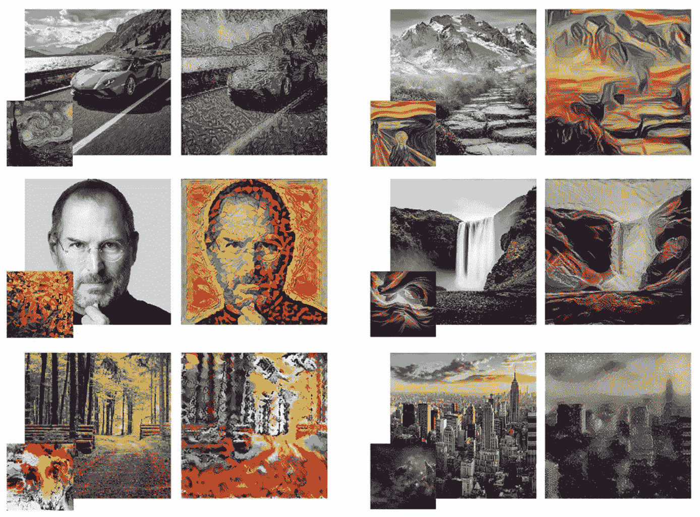
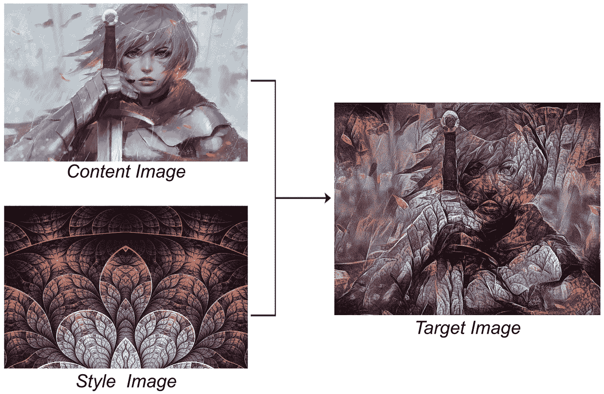
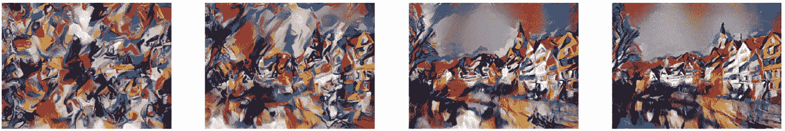
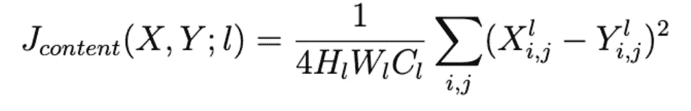
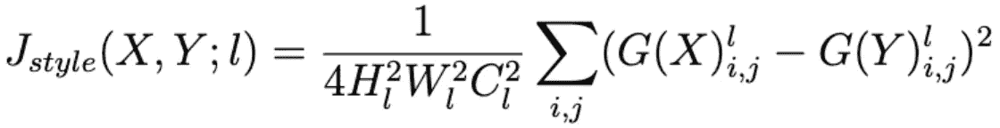
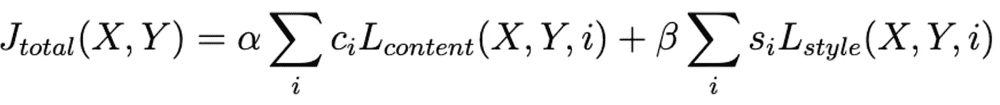
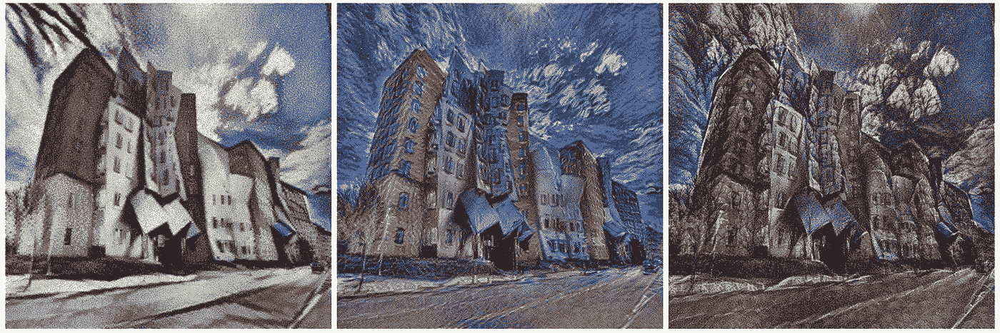
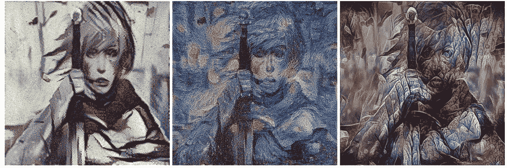
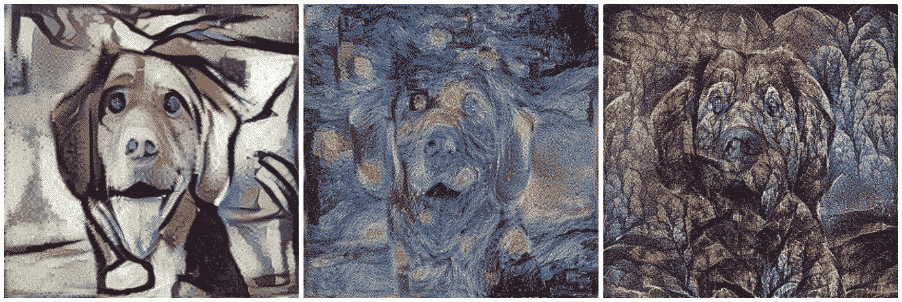

# 简化的神经类型转移

> 原文：<https://medium.com/analytics-vidhya/neural-style-transfer-simplified-b91b990028d?source=collection_archive---------1----------------------->

使用 Tensorflow 和 GoogleCollab 中的这一步一步实现来生成精美的艺术品

用神经风格转移算法生成的艺术品示例。(来源:[https://towards data science . com/light-on-math-machine-learning-intuitive-guide-to-neural-style-transfer-ef88e 46697 ee](https://towardsdatascience.com/light-on-math-machine-learning-intuitive-guide-to-neural-style-transfer-ef88e46697ee))

# 介绍

在过去的几年里，神经网络已经被广泛应用于图像识别。最酷的应用之一是由 Leon A. Gatys 最初提出的[神经类型转移](https://arxiv.org/abs/1508.06576)算法。

使用预先训练的模型和简单的优化过程，该算法将两幅独立图像的风格和内容结合成一幅杰作。

使用神经样式转移将内容和样式图像组合成单个图像

已经有几篇文章解释了算法理论和许多开源实现。然而，我面临着从零开始实现算法并让它工作的困难。

因此，本文与 Google Collab 分享了一个在 Tensorflow 中逐步简化的 [**实现，这样即使是初学者也可以使用它并获得惊人的效果。我假设对张量流会话和图形有基本的理解。**](https://github.com/tusharsircar95/Iterative-Neural-Style-Transfer)

但在此之前，这里有一个神经风格转移算法的快速解释。如果你熟悉这个，你[直接跳到](#1075)实现细节。

# 直觉

任何图像都可以认为有两个组成部分:
**内容:**对象及其在图像中的空间排列 **风格:**纹理、视觉模式和配色方案

让我们将内容要复制的图像定义为 I_CONTENT，样式要复制的图像定义为 I_STYLE。然后，目标是生成一个图像(I_TARGET ),其内容为 I_CONTENT，样式为 I_STYLE。

为了实现这一点，最初用随机像素填充的图像被反复修改，直到获得期望的内容和风格。

将有噪声的图像转换成具有预定义图像的内容和风格特征的图像的迭代步骤(来源:[https://arxiv.org/pdf/1508.06576.pdf](https://arxiv.org/pdf/1508.06576.pdf)

## 它是如何工作的？

我们在上面看到，最初有噪声的图像被反复修改以匹配所选图像的内容和风格。

但是我们如何度量两幅图像之间的内容相似性或者风格相似性呢？这就是预训练卷积神经网络(CNN)发挥作用的地方。

当内容、风格和目标图像通过预先训练的网络时，让 Cᵢⱼˡ、Sᵢⱼˡ和 Tᵢⱼˡ作为层 *l* 的 *i* ᵗʰ特征地图的 *j* ᵗʰ激活。
(假设特征图展平)。此外，H、W 和 C 是指高度、宽度和层 *l.* 的通道数

## 内容损失

在用于对象检测的巨大图像数据集上训练的 CNN 的较高层学习明确地识别和学习图像内对象(内容)的表示，而不是学习精确的像素值。

因此，在较高层生成相似特征地图激活的图像将具有相似的内容。形式上，我们可以将在层 *l* 测量的内容损失定义如下:

层 l 处图像 X 和 Y 之间的内容损失度量

这基本上是通过 CNN 时图像 X 和图像 Y 的单独激活之间的归一化平方误差。

## 风格丧失

风格是以特定图层上不同特征地图激活之间的相关性来衡量的。这在 Gram 矩阵(G)中正式表示如下:

Gram 矩阵:当图像 X 通过神经网络时，在神经网络的层 l 捕获不同特征图之间的相关性

Gᵢⱼˡ在层 *l* 捕捉到 *i* ᵗʰ和 *j* ᵗʰ特征图之间的相关性，因此，在层 *l* 测量的风格损失定义如下:

在层 l 的图像 X 和 Y 之间测量的风格损失

注意，可以在网络的不同层测量内容损失和风格损失，以形成最终的损失函数。

总损失，每一层和每一类损失都有特定的权重

cᵢ和 sᵢ是分别给予在层 *l 计算的内容和风格损失的权重。* α和β分别是给予整体内容和风格损失的权重。

在最初的实现中，VGG-19 被用作预训练的 CNN，并且使用了内容和风格层的不同组合。

理论说够了，让我们开始实施吧。

# 履行

为此我们将使用谷歌 Colab。它本质上是一个免费的 GPU，你可以利用它来运行你的项目。

**设置:**
打开 [Google Colab](https://colab.research.google.com/notebooks/welcome.ipynb) 。
转到文件- >新建 Python 3 笔记本- >笔记本将打开
转到编辑- >笔记本设置
将运行时类型设置为‘Python 3’->将硬件加速器设置为 GPU

现在，您可以在一个免费的 GPU 上运行您的 python 代码了！

**步骤 1:** 我们需要预先训练的 VGG19 模型权重来计算每次迭代的损失。我们将构建一个字典，将图层名称映射到包含 VGG19 每一层的图层权重的张量。

*model.layers* 包含每层的权重张量。
对于每个卷积层 *i，model . layers【I】。weights[0]* 有滤镜权重和 *model.layers[i]。【权重 1】*具有偏置权重。我们将提取这些值，并将它们添加到字典 *weights_dict* 中。

**步骤 2:** 我们将构建一个 Tensorflow 图，复制 VGG19 网络连接和权重。然而，我们将输入张量设置为一个 *tf。Variable()* 并用我们在步骤 1 中存储的权重来定义图。
这是因为我们不会训练网络的权重，我们只会修改输入张量以最小化定义的损失。

像以前一样，我们将把每一层对应的张量存储在一个字典中。

好了，我们已经完成了主要的设置。

**步骤 3:** 让我们加载 I_CONTENT 和 I_STYLE 图像。我们将通过减去像素方式的平均值来预处理这些。

此外，我们定义了 *save_image()* 函数，该函数获取模型输出图像，添加回*均值，将值剪辑到范围【0，255】*并保存图像。

**步骤 4:** 让我们定义层(和相应的权重)来计算内容和风格损失。

让我们定义损失项和一个优化器来最小化损失:

**第五步:**我们需要做的就是用一个白噪音图像初始化*层【输入】*并运行优化器。

大约每 100 次迭代，我们将使用可定义的路径前缀保存图像。将*手段*添加回生成的图像是很重要的。这是在前面定义的 *save_image()* 函数中完成的。

我已经将所有这些打包在一个函数 *run_style_transfer()* 中，您可以将内容和样式图像的文件路径、内容和样式权重(α和β)、学习率和时期数传递给该函数。

我已经设置了α在范围[10，20]内，β为~1e-1，学习率为~5.0。我能够在大约 1000 次迭代中产生好的结果。

使用立体主义绘画、梵高的星夜绘画和图案树叶纹理的图像通过迭代风格转移算法生成的图像。使用了用于内容重构的 conv4_2 层和用于样式重构的 conv1_1、conv1_2、conv1_3、conv1_4、conv1_5 层

我希望这篇文章能帮助你自己实现神经风格转移。这里可以参考整个源代码[。](https://github.com/tusharsircar95/Iterative-Neural-Style-Transfer)

我正在研究快速神经风格转移实现，它训练网络直接生成其输入的风格化版本，而不是遵循迭代优化过程。我很快会分享。