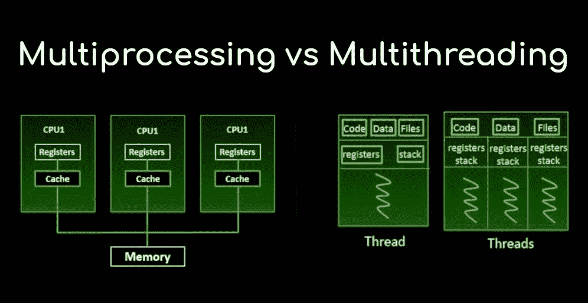
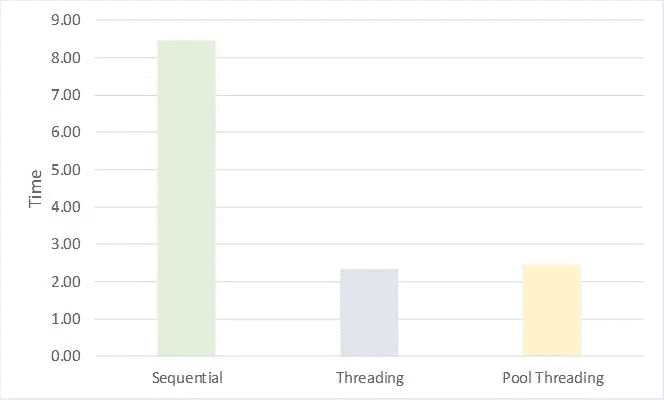

# 神经漫游者的忧郁:线程 vs 多重处理—第 1 部分

> 原文：<https://medium.com/analytics-vidhya/neuromancer-blues-threading-vs-multiprocessing-part-1-60680b03f553?source=collection_archive---------20----------------------->



“Neuromancer Blues”是一系列帖子，我希望读者在其中找到关于整体数据科学主题的指导，如数据争论、数据库连接、应用数学和编程技巧，以提高代码效率、可读性和速度。我的例子和代码片段将会尽可能的简洁明了，以传达关键思想，而不是提供可读性差的冗长代码，这会损害帖子的目的。

**线程**(又名多线程)**多处理**是我想写很久的一个话题。第一篇文章将重点介绍这两个概念，重点是线程，以及为什么线程对于金融领域的开发人员如此重要。未来的 Neuromancer 系列帖子将在多处理和编程效率问题上花费更多时间，如竞争条件或死锁。

**基础知识**
让我们澄清一下这篇文章中反复出现的关键概念:

*   **并发**:当两个任务可以在重叠的时间段内开始、运行、完成。
*   **并行性**:当任务实际上同时运行时，例如多核处理器
*   **I/O 绑定任务:**大部分时间处于 I/O(输入/输出)状态的任务，即网络读/写、数据库查询等。
*   **CPU-bond 任务:**大部分时间花在 CPU 上的任务，即浏览多个网站、机器 algo 训练等。
*   **GIL(全局解释器锁):** GIL 是一种锁，它避免单个 python 进程在任何时间点并行运行线程(使用多个内核)，但它们可以并发运行。虽然对于单线程任务不可见，但在执行多线程代码或 CPU 受限任务时，GIL 会成为一个问题。
*   **死锁:**两个或两个以上的线程/任务互相等待，不执行并阻塞整个程序时发生的事件。
*   **竞争条件**:当两个或多个线程/任务并行运行，但由于操作顺序不正确而导致结果不正确时发生的事件。

在编码中，我们需要避免竞争条件和死锁。避免竞争状况的最佳方法是使用[避免共享状态的方法或与同步相关的方法](https://en.wikipedia.org/wiki/Thread_safety)来应用线程安全策略。此外，我们还希望通过让进程跨越建立相互依赖来避免死锁，即尽可能减少锁定任何东西的需要。这些主题更高级，值得在未来发布另一系列帖子。

**线程与多处理:简介**
现在我们在同一页上，让我们来回答线程与多处理之间的区别，以及为什么它如此重要。下表提供了各种方法之间的综合比较。

简而言之，线程用于在同一进程中同时运行多个线程/任务，但是如果我们已经使用了 100 %的 CPU 时间，它将不会提高速度。另一方面，多处理允许程序员在给定的 CPU 上打开多个处理器，每个处理器都有自己的内存，没有 GIL 限制。

Python 线程主要用在 I/O 绑定的任务中，这些任务的执行需要一些等待时间。在金融领域，一个简单的例子是查询外部数据库，因此我们将使用 yahoo finance 数据模拟一个类似的 i/O 任务。


正如我在引言中提到的，我想在这篇文章中集中讨论线程，所以让我们言归正传。

**经典方法:使用线程模块**
Python 提供的[线程模块](https://docs.python.org/3/library/threading.html)包括一个易于实现的锁定机制，允许您同步线程。换句话说，这个模块允许您让程序的不同部分同时运行，并提高代码的可读性。

我们先来了解一下做线程有什么意义。下面的代码片段显示了一个循环过程，其中我们使用 [pandas datareader 模块](https://pypi.org/project/pandas-datareader/)执行一个 I/O 绑定的任务，从 yahoo finance 读取财务数据。尽管 pandas datareader 允许批量处理(从一个 ticker 列表中一次下载数据),但我们将天真地在每个 ticker 的独立基础上运行每个 I/O 任务，并遵循顺序执行方法，即只有在前一个调用完成时，新的调用才会开始。

请注意在我们的 io_task()函数和 t [ime 模块](https://docs.python.org/3/library/time.html)中引入了一秒钟的延迟。为了简单起见，我们只下载了不到五年的价格数据，因此这是一个非常快速的查询。这一秒钟延迟的引入模拟了我们的查询花费更多的时间，例如下载诸如+100 基本指标之类的数据，这是更真实的模拟。

```
# Modules
import time
import pandas_datareader.data as web
import pandas as pd
import threading# Input and Functions
def io_task(ticker_, dict_): 
 ‘’’
 Download Yahoo Data and store it into dictionary
 ‘’’
 df = web.get_data_yahoo(ticker_)
 time.sleep(1)
 dict_[ticker_]=df
t_list = [‘KO’,’XOM’,’AAPL’,’IBM’,’MCD’] # ticker list
df_dict={} # dictionary to store data# Database Query:
start = time.perf_counter()
for i in t_list:
 io_task(i, df_dict)
finish = time.perf_counter()
print(f’running time: {finish-start} second(s)’)
print(f’dictionary keys are {df_dict.keys()}’)
```

运行代码将产生如下所示的输出:

```
time: 8.457419800000025 second(s)
dictionary keys are dict_keys([‘KO’, ‘XOM’, ‘AAPL’, ‘IBM’, ‘MCD’])
```

正如我们在上面看到的，顺序执行是非常耗时的。我们有什么方法可以优化和减少等待时间？**进入穿线模块:**

```
t_list = [‘KO’,’XOM’,’AAPL’,’IBM’,’MCD’]
df_dict={}
threads=[]
start = time.perf_counter()
for i in t_list:
 t = threading.Thread(target=io_task, args=[i,df_dict]) # 1
 t.start() # 2
 threads.append(t)
for thread in threads:
 thread.join() # 3
finish = time.perf_counter()
print(f’running time: {finish-start} second(s)’)
print(f’dictionary keys are {df_dict.keys()}’)running time: 2.3480712000000494 second(s)
dictionary keys are dict_keys([‘AAPL’, ‘IBM’, ‘XOM’, ‘MCD’, ‘KO’])
```

嗯，真快。**线程显著优于顺序方法，将时间减少了 6 秒多，相当于等待时间的三分之二以上**。线程模块的新用户可能需要对用数字注释突出显示的行进行进一步描述:

1.  我们为列表中的每个 ticker 创建了一个线程。这是一个由线程模块创建的新类。
2.  线程被启动，任务在单独的线程控制中执行。
3.  让程序等待，直到线程终止。这一行很重要，如果我们忽略它，程序会在所有线程完成之前打印出时间，因此，它会给我们一个错误的时间测量。

**新方法:使用并发的线程池。Futures 模块**
[concurrent . futures](https://docs.python.org/3/library/concurrent.futures.html)模块提供了一种更简单易懂的方式来处理线程和多重处理。该模块是 Python 线程和多处理模块之上的抽象层，简化了它们的使用。尽管如此，应该注意的是，在更高的代码简单性和更低的代码灵活性之间有一个权衡。因此，用户可能对使用线程或并发感兴趣。未来取决于项目的复杂性和要求。

但是，现在让我们使用这个新模块来运行我们的 I/O 绑定任务:

```
# New module import
import concurrent.futures# Helper Function and Inputs: 
def helper(inputs): # 1
 io_task(inputs[0], inputs[1])t_list = [‘KO’,’XOM’,’AAPL’,’IBM’,’MCD’]
df_dict={}
args = list(zip(t_list,[df_dict for _ in range(len(t_list))])) # 1# I/O Tasks Threading
start = time.perf_counter() 
with concurrent.futures.ThreadPoolExecutor() as executor: # 2
 executor.map(helper, args) #3
finish = time.perf_counter()
print(f’running time: {finish-start} second(s)’)
print(f’dictionary keys are {df_dict.keys()}’)running time: 2.44674170000053 second(s)
dictionary keys are dict_keys([‘KO’, ‘AAPL’, ‘MCD’, ‘XOM’, ‘IBM’])
```

**与简单的顺序方法**相比，池线程化同样显著地节省了时间，并且比我们的线程模块的第一个代码片段具有更好的可读性。同样，您可以在下面找到这些带有数字注释的行的更多解释:

1.  必须用作嵌入 concurrent.futures 模块中的映射函数的输入的帮助函数。它只是我们最初的 I/O 绑定任务函数，但是因为它需要两个参数而不是一个，所以我们不能在 3 . 1 中定义的 executor.map()对象中使用它。
2.  concurrent.futures 模块中的执行者对象。这是一个抽象类，需要用作它的两个子类之一:ThreadPoolExecutor 或 ProcessPoolExecutor。线程需要前者，而多重处理需要后者，我们将在以后的文章中看到。
3.  Executor.map()是嵌入到 Executor 对象中的一个方法，它的工作方式类似于 Python 的普通 map()函数，对指定 iterable 的所有元素应用一个函数并返回 map 对象。在这种情况下，该方法异步执行调用，为每个跑马灯创建一个线程。

综上所述，【Threading 和 Concurrent.futures 模块具有相似的性能，尽管前者在牺牲代码可读性的同时为自定义任务提供了更大的灵活性。



这是对线程和多处理的简短介绍，用非常简单和简短的代码脚本来传达关键思想。这一次我们为每个线程分配了一个任务，尽管如果需要的话，我们可以为每个线程分配更多的作业/任务。

在 Neuromancer 系列的未来文章中，我的目标是深入研究更多线程细节示例，讨论多处理和其他对投资有用的数据科学主题。

**推荐资源:**

*   **YouTube 最佳线程教程:** [科里·斯查费](https://www.youtube.com/watch?v=IEEhzQoKtQU&t=259s)
*   **Python 冒险** : [concurrent.futures](https://pythonadventures.wordpress.com/tag/threadpoolexecutor/)
*   **原文:** [光明使者](https://www.lightbringercap.com/blog/neuromancer-blues-threading-vs-multiprocessing-part-1)