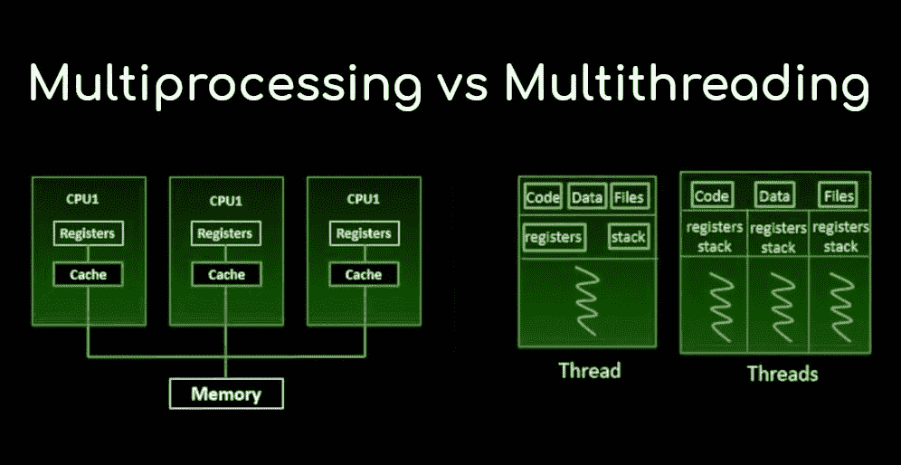

# 神经癌蓝调:线程与处理——第二部分

> 原文：<https://medium.com/analytics-vidhya/neuromancer-blues-threading-vs-processing-part-2-e67f86074721?source=collection_archive---------31----------------------->



“Neuromancer Blues”是一系列帖子，我希望读者在其中找到关于整体数据科学主题的指导，如数据争论、数据库连接、应用数学和编程技巧，以提高代码效率、可读性和速度。我的例子和代码片段将会尽可能的简洁明了，以传达关键思想，而不是提供可读性差的冗长代码，这会损害帖子的目的。

[本主题的第一部分](https://www.lightbringercap.com/blog/neuromancer-blues-threading-vs-multiprocessing-part-1)致力于简要解释线程化和多处理之间的主要区别，同时重点关注线程化应用，以提高我们执行 I/O 相关任务的效率。因为一张图片胜过千言万语，下面的图片清晰地阐释了由[科里·斯查费](https://www.youtube.com/channel/UCCezIgC97PvUuR4_gbFUs5g)提供的理解这些概念的要点


正如本系列的第一部分所强调的，建议将多处理用于 CPU 受限的任务，因为它允许程序员在给定的 CPU 上打开多个处理器，每个处理器都有自己的内存，并且没有 GIL 限制。

**经典方法:使用多处理模块**
Python 中内置的 [](https://docs.python.org/3/library/threading.html) [多处理模块](https://docs.python.org/3/library/multiprocessing.html)是产生多个彼此并行运行的进程的最简单方法，而不是像我们实现线程时那样并发运行。该模块允许用户非常容易和直观地实现多处理，与使用编辑模块时非常相似。请记住，尽管使用这两个模块的编码体验是相似的，但是如前所述，在后台会发生非常不同的事情；一个很大的区别是，线程共享全局变量，而多处理同时运行独立的进程和它们自己的变量。

边做边学是传达上述概念的最佳方式，所以让我们言归正传。请记住，多处理意味着更好地处理 CPU 受限的任务，因此我们将定义一个 CPU 受限的函数，该函数将根据基于 [SVM](https://en.wikipedia.org/wiki/Support-vector_machine) 的简单机器学习模型训练来训练和交付结果。请注意，我们使用“幼稚”这个词是出于显而易见的原因，因为我们不进行数据预处理、特征选择、交叉验证或任何类型的超参数优化，因为这篇文章的目的是专注于使用多处理提高我们的代码效率。其他系列的后续文章将重点关注增强应用于投资的机器学习模型。

首先，我们继续在一个对象中存储一些数据，这些数据是我们的 CPU 受限任务执行 SVM 模型训练所需要的。

```
# Modules
import time
import pandas_datareader.data as web
import numpy as np
import pandas as pd
import multiprocessing
import concurrent.futures
from sklearn.svm import SVC# Data download and storage in “df” object
t_list = [‘KO’,’XOM’,’AAPL’,’IBM’,’MCD’]
s= ‘1999–12–31’
e= ‘2019–12–31’ # Last 20 years
df = web.get_data_yahoo(t_list, s,e) # multiindex level dataframe
df = df[‘Adj Close’].copy() # create a copy only with “Adjusted Closed Price” per ticker
```

# [神经癌蓝调:线程 VS 多重处理——第二部分](https://www.lightbringercap.com/blog/neuromancer-blues-threading-vs-multiprocessing-part-2)

12/30/2019

[0 条评论](https://www.lightbringercap.com/blog/neuromancer-blues-threading-vs-multiprocessing-part-2#comments)


*Neuromancer Blues”是一系列帖子，我希望读者在其中找到关于整体数据科学主题的指导，如数据争论、数据库连接、应用数学和编程技巧，以提高代码效率、可读性和速度。我的例子和代码片段将会尽可能的简洁明了，以传达关键思想，而不是提供可读性差的冗长代码，这会损害帖子的目的。*

[本主题的第一部分](https://www.lightbringercap.com/blog/neuromancer-blues-threading-vs-multiprocessing-part-1)除了重点介绍线程化应用在执行 I/O 相关任务时如何提高我们的工作效率之外，还简要解释了线程化和多处理之间的主要区别。因为一张图片胜过千言万语，下面的图片清晰地阐释了由科里·斯查费提供的理解这些概念的要点


正如本系列的第一部分所强调的，建议将多处理用于 CPU 受限的任务，因为它允许程序员在给定的 CPU 上打开多个处理器，每个处理器都有自己的内存，并且没有 GIL 限制。

**经典方法:使用多处理模块**
Python 中内置的 [](https://docs.python.org/3/library/threading.html) [多处理模块](https://docs.python.org/3/library/multiprocessing.html)是产生多个彼此并行运行的进程的最简单方法，而不是像我们实现线程时那样并发运行。该模块允许用户非常容易和直观地实现多处理，与使用编辑模块时非常相似。请记住，尽管使用这两个模块的编码体验是相似的，但是如前所述，在后台会发生非常不同的事情；一个很大的区别是，线程共享全局变量，而多处理同时运行独立的进程和它们自己的变量。

边做边学是传达上述概念的最佳方式，所以让我们言归正传。请记住，多处理意味着更好地处理受 CPU 限制的任务，因此我们将定义一个受 CPU 限制的函数，该函数将根据基于 [SVM](https://en.wikipedia.org/wiki/Support-vector_machine) 的简单机器学习模型训练来训练和交付结果。请注意，我们使用“幼稚”这个词是出于显而易见的原因，因为我们不进行数据预处理、特征选择、交叉验证或任何类型的超参数优化，因为这篇文章的目的是专注于使用多处理提高我们的代码效率。其他系列的后续文章将重点关注增强应用于投资的机器学习模型。

首先，我们继续在一个对象中存储一些数据，这些数据是我们的 CPU 受限任务执行 SVM 模型训练所需要的。

```
# Modulesimport timeimport pandas_datareader.data as webimport numpy as npimport pandas as pdimport multiprocessingimport concurrent.futuresfrom sklearn.svm import SVC# Data download and storage in "df" objectt_list = ['KO','XOM','AAPL','IBM','MCD']s= '1999-12-31'e= '2019-12-31' # Last 20 yearsdf = web.get_data_yahoo(t_list, s,e) # multiindex level dataframedf = df['Adj Close'].copy() # create a copy only with "Adjusted Closed Price" per ticker
```

第二，任务被封装在函数 **cpu_task()** 中，其中包含我们简单的 SMV 模型训练和模型准确性的交付，以及作为参数传递的每个 ticker 的累积回报。注意，包含 time.sleep(3)行是为了模拟更真实的 CPU 密集型任务时间完成情况。

```
def cpu_task(t):
 ‘’’
 Run SVM model using 6 daily return lags as predictors 
 Params
 — — — 
 t= ticker
 ‘’’
 time.sleep(3)
 lags=6 # number of predictors
 temp=data.filter(regex=t).copy()
 temp[t+’_1d_r’]= np.log(temp[t] / temp[t].shift(1))
 for lag in range(1, lags + 1):
 temp[t+’_’+str(lag)+’d_r’] = np.sign(temp[t+’_1d_r’].shift(lag))
 temp[t+’_y’] = np.sign(np.log(temp[t].shift(-1)/temp[t])) # our dependent variable
 temp.dropna(inplace=True)
 X=temp.filter(regex=’_r’)
 y=temp[t+’_y’]
 model = SVC(gamma=’auto’)
 model.fit(X,y)
 score= model.score(X,y)
 temp[t+’_Pos’] = model.predict(X) # long (1) or Short(-1)
 temp[t+’_strat’] = temp[t+’_Pos’].shift(1) * temp[t+’_1d_r’]
 temp[t+’_strat_cum’] = temp[t+’_strat’].cumsum().apply(np.exp)
 stats[t]=[score,temp[t+’_strat_cum’][-1]] # store training score, cum return
```

# [神经癌蓝调:线程 VS 多重处理——第二部分](https://www.lightbringercap.com/blog/neuromancer-blues-threading-vs-multiprocessing-part-2)

12/30/2019

[0 条评论](https://www.lightbringercap.com/blog/neuromancer-blues-threading-vs-multiprocessing-part-2#comments)


“Neuromancer Blues”是一系列帖子，我希望读者在其中找到关于整体数据科学主题的指导，如数据争论、数据库连接、应用数学和编程技巧，以提高代码效率、可读性和速度。我的例子和代码片段将会尽可能的简洁明了，以传达关键思想，而不是提供可读性差的冗长代码，这会损害帖子的目的。

[本主题的第一部分](https://www.lightbringercap.com/blog/neuromancer-blues-threading-vs-multiprocessing-part-1)致力于简要解释线程化和多处理之间的主要区别，同时重点关注线程化应用，以提高我们执行 I/O 相关任务的效率。因为一张图片胜过千言万语，下面的图片清晰地阐释了由[科里·斯查费](https://www.youtube.com/channel/UCCezIgC97PvUuR4_gbFUs5g)提供的理解这些概念的要点


正如本系列的第一部分所强调的，建议将多处理用于 CPU 受限的任务，因为它允许程序员在给定的 CPU 上打开多个处理器，每个处理器都有自己的内存，并且没有 GIL 限制。

**经典方法:使用多处理模块**
Python 中内置的 [](https://docs.python.org/3/library/threading.html) [多处理模块](https://docs.python.org/3/library/multiprocessing.html)是产生多个彼此并行运行的进程的最简单方法，而不是像我们实现线程时那样并发运行。该模块允许用户非常容易和直观地实现多处理，与使用编辑模块时非常相似。请记住，尽管使用这两个模块的编码体验是相似的，但是如前所述，在后台会发生非常不同的事情；一个很大的区别是，线程共享全局变量，而多处理同时运行独立的进程和它们自己的变量。

边做边学是传达上述概念的最佳方式，所以让我们言归正传。请记住，多处理意味着更好地处理 CPU 受限的任务，因此我们将定义一个 CPU 受限的函数，该函数将根据基于 [SVM](https://en.wikipedia.org/wiki/Support-vector_machine) 的简单机器学习模型训练来训练和交付结果。请注意，我们使用“幼稚”这个词是出于显而易见的原因，因为我们不进行数据预处理、特征选择、交叉验证或任何类型的超参数优化，因为这篇文章的目的是专注于使用多处理提高我们的代码效率。其他系列的后续文章将重点关注增强应用于投资的机器学习模型。

首先，我们继续在一个对象中存储一些数据，这些数据是我们的 CPU 受限任务执行 SVM 模型训练所需要的。

```
# Modulesimport timeimport pandas_datareader.data as webimport numpy as npimport pandas as pdimport multiprocessingimport concurrent.futuresfrom sklearn.svm import SVC# Data download and storage in "df" objectt_list = ['KO','XOM','AAPL','IBM','MCD']s= '1999-12-31'e= '2019-12-31' # Last 20 yearsdf = web.get_data_yahoo(t_list, s,e) # multiindex level dataframedf = df['Adj Close'].copy() # create a copy only with "Adjusted Closed Price" per ticker
```

第二，任务被包装在函数 **cpu_task()** 中，其中包含我们简单的 SMV 模型训练和模型精度的交付，以及作为参数传递的每个 ticker 的累积回报。注意，包含 time.sleep(3)行是为了模拟更真实的 CPU 密集型任务时间完成情况。

```
def cpu_task(t):'''Run SVM model using 6 daily return lags as predictorsParams------t= ticker'''time.sleep(3)lags=6 # number of predictorstemp=data.filter(regex=t).copy()temp[t+'_1d_r']= np.log(temp[t] / temp[t].shift(1))for lag in range(1, lags + 1):temp[t+'_'+str(lag)+'d_r'] = np.sign(temp[t+'_1d_r'].shift(lag))temp[t+'_y'] = np.sign(np.log(temp[t].shift(-1)/temp[t])) # our dependent variabletemp.dropna(inplace=True)X=temp.filter(regex='_r')y=temp[t+'_y']model = SVC(gamma='auto')model.fit(X,y)score= model.score(X,y)temp[t+'_Pos'] = model.predict(X) # long (1) or Short(-1)temp[t+'_strat'] = temp[t+'_Pos'].shift(1) * temp[t+'_1d_r']temp[t+'_strat_cum'] = temp[t+'_strat'].cumsum().apply(np.exp)stats[t]=[score,temp[t+'_strat_cum'][-1]] # store training score, cum return
```

现在我们已经有了要为每个公司运行的数据和任务/工人函数，让我们回顾一下进行这种分析的不同的多处理方法。如本系列的第 1 部分所示，下一个代码片段提供了顺序执行效率的概念，即一次运行一个任务，只有当最后一个任务完成时，下一个任务才开始。

```
start = time.perf_counter()
data=df.copy()
stats={} # store every ticker results.
for t in data.columns:
 cpu_task(t)
finish = time.perf_counter()
print(stats)
print(f’running time: {finish-start} second(s)’)running time: 26.083961900000077 second(s)
```

我们的 CPU 任务大约需要 5 秒钟才能完成。起初，这看起来确实很快，但请记住，我们的目标是使我们的程序尽可能具有可伸缩性。目前，我们的程序需要 40 多分钟来对整个标准普尔 500 宇宙进行同样的分析，因此这里需要改进:**进入多处理模块:**

```
start = time.perf_counter()
data=df.copy()
stats={} # store every ticker results.
processes=[]
if __name__==’__main__’: # 1
 for t in df.columns: # 2 
 p = multiprocessing.Process(target=cpu_task, args=[t]) # 3
 p.start() # 3
 processes.append(p) 
 for p in processes:
 p.join() # 4 
finish = time.perf_counter()
print(f’running time: {finish-start} second(s)’)running time: 15.9997299 second(s)
```

使用顺序方法时，多处理实现几乎将运行 CPU 任务的初始时间减少了一半。多处理模块的新用户可能需要对用数字注释突出显示的行进行进一步描述:

1.  **如果 __name__=='__main__'** 对于 windows 用户是强制的。这行代码允许测试脚本是直接运行还是导入。没有这条线的**多重处理。Process()** 模块将启动一个新的 Python 进程，并将导入调用模块，从而触发新进程的无限延续(或者直到您的机器耗尽资源)。请注意，Mac 用户可以忽略这一行，将缩进的内容放到主脚本中。
2.  为每个 ticker 打开一个进程所必需的循环。
3.  **多重处理。Process()** 使用我们的任务工人函数和每个 ticker 创建一个流程对象 p。下一行启动每个流程，以便他们可以开始并行工作。
4.  **join()** 对于避免我们的脚本在我们的多个进程完成之前跳到“完成”是必不可少的。如果没有这条线，所获得的时间将是一个接近于零的误导数字。因此，join()相当于告诉我们的脚本等待一个进程完成。

关于**多处理模块最好的一点是，它允许使用“池”模式工作，并在我们的脚本中获得显著的可读性增益**，避免不必要的循环，并在时间执行上获得一些增益:

```
start = time.perf_counter()
data=df.copy()
stats={} 
if __name__ == ‘__main__’: # 1
 proc_=len(data.columns) # 2
 with multiprocessing.Pool(processes=proc_) as pool: # 3
 pool.map(cpu_task, df.columns) # 4
finish = time.perf_counter()
print(f’running time: {finish-start} second(s)’)running time: 15.6402651 second(s)
```

同样，对于不熟悉这个模块的人来说，上面的语法可能需要进一步的澄清:

1.  **如果 __name__=='__main__'** 对于 windows 用户是强制的。请阅读上面的段落，同样的解释也适用于这里。
2.  定义要打开的流程数量。在我们的例子中，这等于 tickers 的数量。
3.  **多重处理。Pool()** 创建一个池进程对象“Pool”。下一行使用类“map”方法并行启动每个进程。注意可读性是如何提高的，因为不再需要使用 join()。

**新方法:使用并发的进程池。期货模块**

正如在本系列的第 1 部分中所报道的, [concurrent.futures](https://docs.python.org/3/library/concurrent.futures.html#concurrent.futures.ProcessPoolExecutor) 模块提供了一种更简单易懂的方式来处理线程和多重处理。该模块是 Python 线程和多处理模块之上的抽象层，简化了它们的使用。尽管如此，应该注意的是，在更高的代码简单性和更低的代码灵活性之间有一个权衡。因此，用户可能对使用多处理或并发感兴趣。未来取决于项目的复杂性和要求。

下面是使用这个新库运行我们程序的代码:

```
start = time.perf_counter()
data=df.copy()
stats={} # store every ticker results.
if __name__ == ‘__main__’:
 with concurrent.futures.ProcessPoolExecutor() as executor:
 results = executor.map(cpu_task,data.columns)
finish = time.perf_counter()
print(f’running time: {finish-start} second(s)’)running time: 17.3365097 second(s)
```

这种新方法的性能比我们以前的多处理选项稍差，但它仍然比标准的循环顺序选择快得多。关于 concurrent.futures 或本机多处理模块的使用，需要强调几点:

*   **concurrent . futures . processpoolexecutor()**是本机**多处理的包装器。池()**。因此，多重处理的限制同样适用(例如，对象需要是可选择的)。
*   **concurrent.futures** 提供一个 API 来记住你是使用线程还是多重处理，例如，对于 IO 绑定的任务，在语法 ThreadPoolExecutor()中使用 ThreadPoolExecutor()而不是 ProcessPoolExecutor()，这样就完成了。
*   **concurrent.futures** 使用简单的 API 使得长期维护变得更加容易。然而，**多重处理**库提供了在更大的灵活性和更少的可读性和维护问题之间的权衡。
*   使用 concurrent.futures 时的时间性能比使用多处理时稍差。池。这些时间增益差异的原因是**多重处理。Pool** 将传递给 map 的 iterable 批处理成块，然后将块传递给 worker 进程，这减少了父进程和子进程之间的工作量时间。相反，**concurrent . futures . processpoolexecutor**总是一次将 iterable 中的一个项目传递给子项目，这导致了较差的时间性能。

综上所述，**多重处理和 Concurrent.futures 模块具有相似的性能，尽管前者为自定义任务提供了更多的灵活性，同时牺牲了代码的可读性。这与我们出于线程目的比较两个模块所获得的读数相同。**


这是对线程和多处理的简短介绍，用非常简单和简短的代码脚本来传达关键思想。

我在 Neuromancer 系列的未来帖子中的目标是深入研究编程效率主题，以及对投资有用的其他数据科学主题。

**推荐资源:**

*   **最佳多处理 youtube 教程:** [科里·斯查费](https://www.youtube.com/watch?v=fKl2JW_qrso&t=1852s)
*   **Python 历险记**:[concurrent . futures](https://pythonadventures.wordpress.com/2013/08/13/concurrent-futures/)
*   **Github:** [多重处理脚本](https://github.com/Carlossn/POSTS/blob/master/post_multip.py)