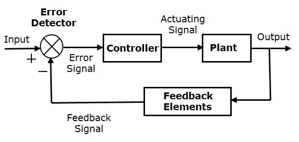
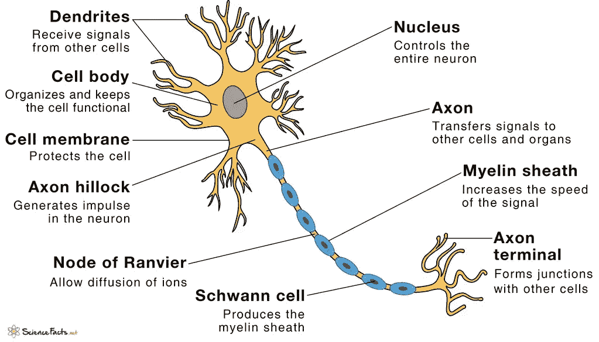
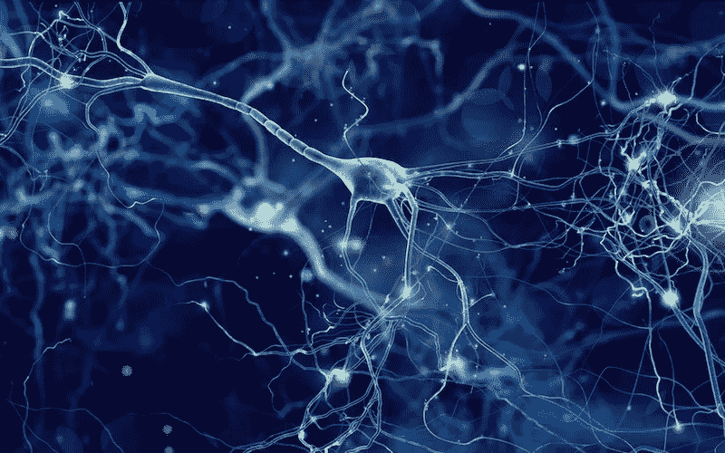
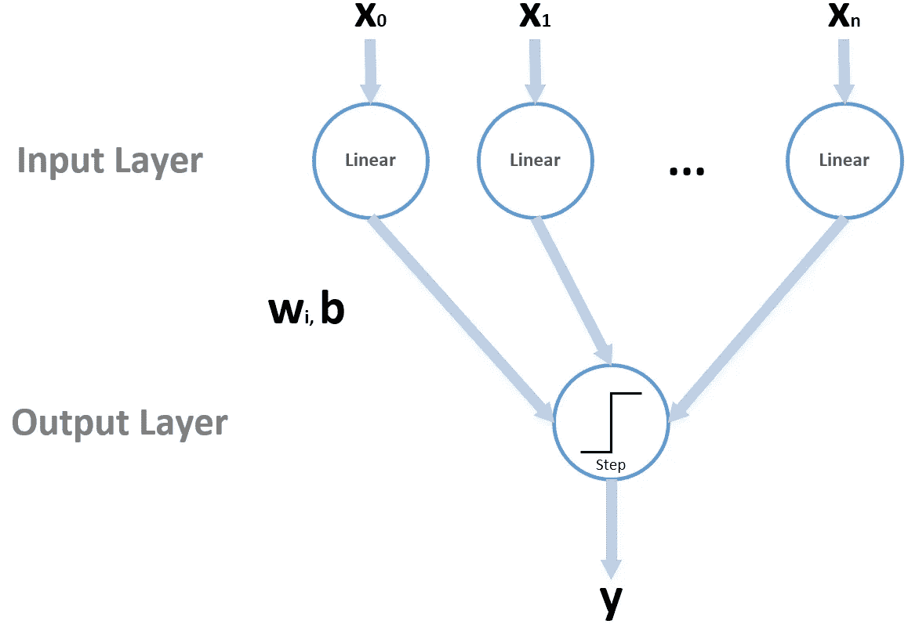
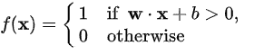
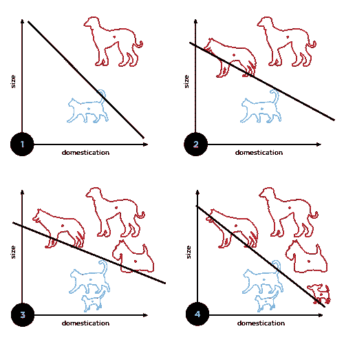
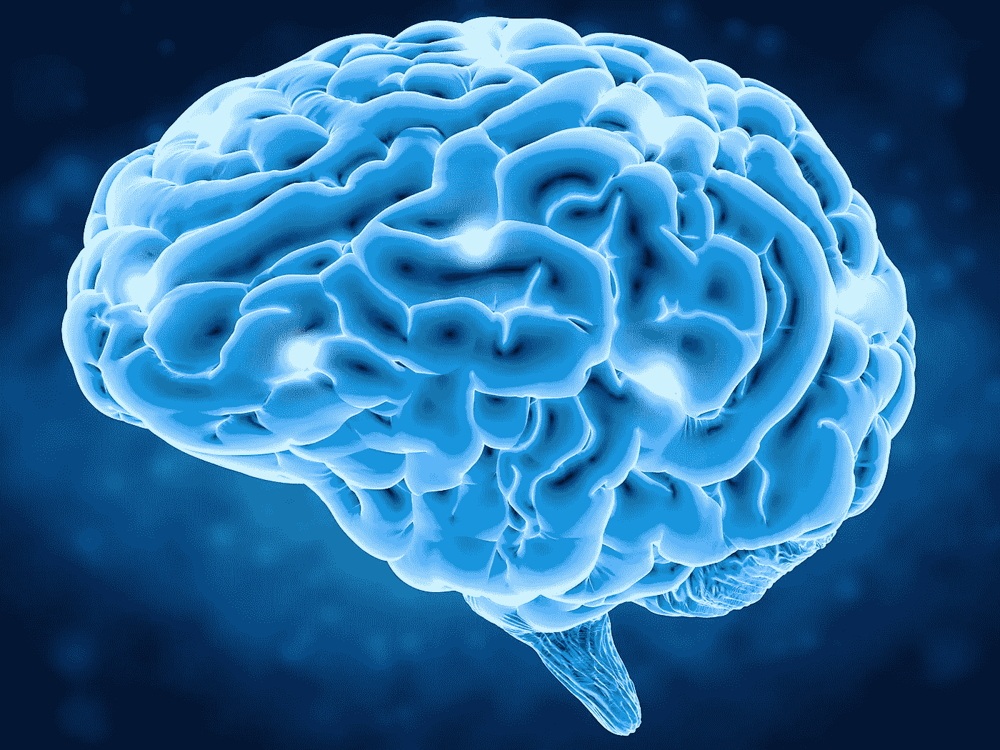

# 神经元——我们智力的基本要素

> 原文：<https://medium.com/analytics-vidhya/neurons-the-nuts-and-bolts-of-our-intelligence-8d30d1dc7c65?source=collection_archive---------28----------------------->

神经元——图片来自 [Pixabay](https://pixabay.com/?utm_source=link-attribution&amp;utm_medium=referral&amp;utm_campaign=image&amp;utm_content=3154926) 的 Gerd Altman

这篇文章的重点是我们智力的生理方面。大脑中细胞的相互联系及其复杂性构成了有机体的行为，或其对环境的反应。我们的大脑是一组称为神经元的特殊细胞的集合体。单个神经元构成了基本的信息处理构件。神经元是百万倍的，并且遍布人体，以收集来自感觉器官的输入，决定信息是否值得传递到下一个级别，将该信息一直带到大脑，发现该信息是否可以与大脑以前的任何经历相关，建立新信息与现有信息的关系，并将其存储以备后用，等等。

神经元运行机制的知识对人工智能非常重要，因为它强化了人类意识和智能的根本数学模型。正如在不同时代的技术中所看到的，信息处理在历史上有自己的故事要说。当谈到人工智能领域时，按照我们的大脑被建模和构造的方式来思考是直观和不可或缺的。神经系统的功能非常多，像感觉和运动神经元构成反馈回路，指导我们的行动形成闭环控制系统。

**控制系统**

控制系统的研究已经成为任何自动化工程机械的设计和实施的一部分。这个想法是根据系统所处环境的变量来调节系统的行为。我们的智能本身在拓扑学上可能被视为属于一个非常复杂的控制系统。

控制系统是一个根据环境变量的变化来调整其输出的反馈系统。一个简单的例子是空调恒温器，其中预设所需的温度，并基于温度传感器报告的环境温度来打开或关闭空调压缩机，从而保持恒定的预设。许多目前的电器在功能上比空调恒温器复杂得多。然而，它们的“智能”仅限于根据输入、初始状态、环境条件和输出生成标准进行微调或生成所需的输出。

基本控制系统—图像[来源](https://www.tutorialspoint.com/control_systems/images/closed_loop.jpg)

在功能上，神经元是一个信息处理单元。每个神经元都有独立的决策能力，就像程序中的功能一样(神经元是一个集成的功能单元)。它们使用树突监听事件，决定是否(以及如何)对报告的事件采取行动，如果是，就向网络中的下一级神经元发出警报。一个主要的区别是——所有的神经元都是并行工作的——而不是像(大多数)计算机程序那样按顺序工作。

神经元的另一个能力是处理“模拟”信息。投入在本质上是连续的；有许多来自其他神经元的输入，基于输入的强度，神经元通过轴突将其输出发送给下一级神经元。一些感觉神经元通过脊髓直接连接到大脑，以便更快地传递信息，因此大脑的决定可以由不同的器官执行，没有任何延迟。与机器相比，这些神经元对信息的并行处理在生物机体中产生了很大的不同。

神经元的组成部分——图像[来源](https://www.sciencefacts.net/wp-content/uploads/2019/12/Parts-of-a-Neuron-Diagram.jpg)

**神经元的工作机制**

神经元有三个主要部分。

*   *细胞体*或*细胞体*指挥神经元的所有活动。
*   *树突*，从细胞体向外延伸的纤维，接收来自其他神经细胞的信息。
*   *轴突*，将信息从细胞体传递到其他神经元的树突或其他身体组织(如肌肉)的长单纤维。

信息以电脉冲的形式沿着单个神经元传播，但是信息在神经元之间的传播方式不同。神经元之间的信息传递是通过将化学物质释放到一个神经元的轴突和另一个神经元的树突之间的间隙中来进行的。这些化学物质被称为神经递质，这个过程被称为神经传递。轴突和树突之间的间隙称为突触。间隙的大小约为 20 纳米。因此，一个神经元轴突的末端按钮，在其激活电位上触发一秒钟的树突。

神经元通过这些突触接收信息输入。根据信息传递的频率，一些神经元与其他神经元“永久”相连，形成一个网络。随着信息频率的降低，神经元的结合也变弱；神经元之间的信息传递不会使神经元彼此“断开”。因此，网络是由信息传递和神经元放电的频率“形成”或“分离”的。在重复活动的情况下，我们有时会用到“肌肉记忆”这个词。

神经元放电—图像[来源](https://4cawmi2va33i3w6dek1d7y1m-wpengine.netdna-ssl.com/wp-content/uploads/2018/12/3.0.jpg)

**感知器**

感知器是生物神经元最简单的计算模型。这可能是有史以来第一台人工智能机器。感知器算法是弗兰克·罗森布拉特于 1958 年在康奈尔航空实验室发明的，尽管它最初是打算用硬件实现的。感知器是二进制分类器的实现，二进制分类器是基于逻辑比较器的阈值函数。

感知器算法—图像[来源](https://www.oreilly.com/library/view/mastering-machine-learning/9781788621113/assets/1a131eaa-d1f4-46e8-9e6e-5d4acdd530ae.png)

其中 **w.x** 表示各个特征通道(特征通道被建模为输入空间矢量 x 的分量)的权重与输入空间矢量分量或特征本身的值的乘积的加权和，b 是偏移偏差。f(x)的值形成了决策边界(以下示例中的直线)，用于将测试变量 x(本示例中动物的大小)分类为属于决策区域的“内部”或“外部”(本示例中为可驯化或不可驯化)。如果 b 为负，则输入的加权组合必须产生大于| b |(b 的大小)的正值，以将分类器神经元推过决策边界。在空间上，偏差改变了决策边界的位置(尽管不是方向)。

二元分类器—图像[来源](https://upload.wikimedia.org/wikipedia/commons/thumb/8/8a/Perceptron_example.svg/500px-Perceptron_example.svg.png)

二元分类器函数(基于动物大小的动物“驯化能力”)由图中的直线表示。特征通道(本例中只有一个)是动物的大小。根据分类器功能定义，红色的是不可驯化的，蓝色的是可驯化的。

**神经网络——生物 vs 深度学习**

AI 大量使用神经网络来执行学习行为。其概念是根据神经元层的训练模型，使用具有特定权重(系数)的新输入，以将先前学习的信息与新数据相匹配(知情 AI)。神经网络中的每个节点(感知器)在其输入端注入一个权重系数乘数。即使这些概念是从人脑继承的，人工神经网络的行为也不像大脑中的神经网络。人工智能算法的神经网络层中的所有“感知器”需要顺序执行以识别信息。

与*感官*生物神经元(感知五种感官的神经元)不同，在大脑中，一个神经元与许多其他神经元三维相连，任何信息都通过这个庞大的生物神经元网络传播，激发路径上所有相关的神经元。这种方法的优点是只激发其行为与输入数据相映射的必要神经元。这种网状拓扑允许高水平的连接。据说我们的大脑有大约一千亿个神经元。

*亿万个神经质中心的涌现行为是一种“觉知”状态。*

大脑中多个神经元的放电——图片[来源](https://www.ucsf.edu/sites/default/files/field/image/news/brain_lit_neurons.jpg)

从神经元的角度来看，每个神经元都是一个半自治的实体，可以在没有指导或外来干扰的情况下处理信息并根据自己的能力做出决定。这也意味着有数十亿个自给自足的微型互联并行处理器，它们可以采取巨大网格的形式，并根据经验做出决定，激发和丰富我们的想象力。

生物神经元的并行执行和相关路径中神经元的选择性触发能否让大脑和一台计算机完全不同？

要回答这个问题，我们需要了解人脑本身的工作。下周我们将详细讨论人脑及其工作原理。

**下周:** [**大脑与神经科学**](/@machvolve/human-brain-the-warehouse-of-universal-wisdom-86bd66df104a)

**前一周:** [**适应性-习惯性智能**](/@machvolve/the-adaptive-habitual-intelligence-4c208f2a2a8d)

**第一周:** [**机器能思考吗？**](/@machvolve/can-machines-think-2fcfc2ce8ef0)