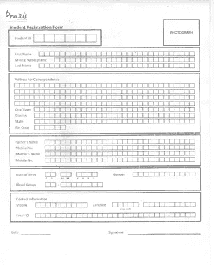
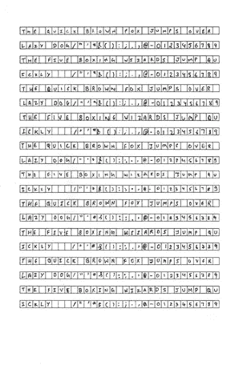
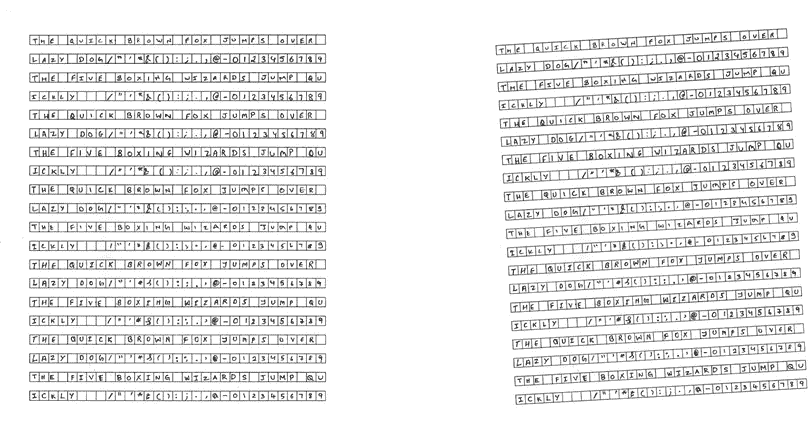
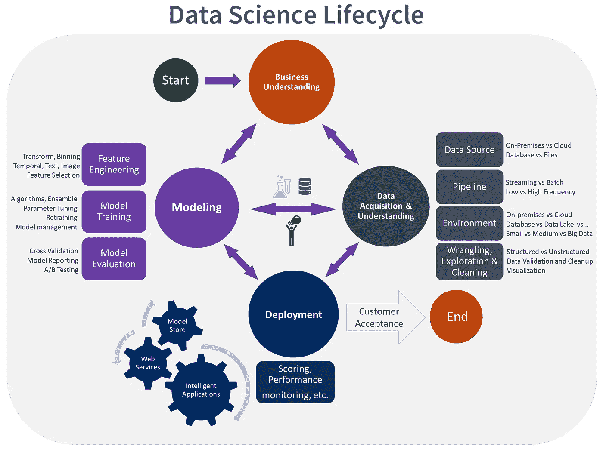

# 永远不要低估数据收集！

> 原文：<https://medium.com/analytics-vidhya/never-underestimate-data-collection-6527089231bd?source=collection_archive---------28----------------------->

> 嘿，各位数据科学家！这是一个有趣的小故事，关于我的第一个端到端顶点项目，以及它如何让我意识到我们通常忽略的一个步骤的重要性，收集数据。*阅读愉快！*

> **故事开始**

这是一切开始的地方…

让我先给你一点背景。这是 2020 年的开始，在世界知道将要发生什么之前(嘘…疫情)，我是班加罗尔 Praxis 商学院的一名学生。我和我的团队刚刚开始着手我们最后一个学期的顶点项目。经过反复思考，以及与不同院系的多次头脑风暴，我们决定实施一个计算机视觉项目，其目标是将扫描的手写表格(例如银行表格，或者在我们的情况下，学生入学表格)转换为包含所有信息(例如，学生姓名、联系人、地址等)的 excel 表格。)

一个示例表单应该是这样的(但是是填充的)

学生入学申请表

因为像 Tesseract 这样的库不能处理手写文本，所以我们的任务是创建我们自己的工作流，从数据收集开始，你猜对了。是的，我们有像 NIST 这样的数据存储，其中包含从 A-Z 的字母和从 0-9 的数字图像，但我们的项目也需要特殊字符，如'！'、' @ '等等等等。

[https://www.nist.gov/data](https://www.nist.gov/data)

所以我们决定创建自己的数据，我们认为这将有助于向我们证明这个概念，因为我们将能够在小范围内进行尝试。

> 挑战

现在我们需要不同的笔迹来训练一个好的人工智能架构，所以我们得到了 Praxis 同学的帮助。第*个挑战*出现了——

> 创建一个标准框架，最大限度地减少混乱和错误，从而使扫描和在系统中实际收集数字图像更容易。

在 Gourab Nath 教授的帮助下，我们想出了这个:

数据收集表单模板

由 20 行组成的标准化表格，每行包含 31 个块。要填写的信息和填写的顺序是预先确定的。准确地说，前 4 行跨越了以下句子-

敏捷的棕色狐狸跳过懒狗/" ' * &():；。,@-0123456789

五个拳击奇才迅速跳/" ' * &():；。,@-0123456789'

之所以选择这些，是因为它们包含了我们所针对的 51 个类别。这 4 行在整个表格中重复 5 次。

写有填写说明的空模板被分发给我们乐于助人的朋友，最终，我们得到了 120 份表格，每份都有独特的笔迹。

时间来扫描他们，并拿出每个盒子作为一个单独的字符图像。第二个挑战出现了——

> 表格倾斜！

宽白边，用于处理高达 5 度的倾斜

如果实际的表格在打印模板时倾斜了，或者如果我们在扫描时不小心倾斜了填好的表格，检测轮廓和取出图像就是一场噩梦。我们最初的反应是重做整个收集部分，并确保这次没有倾斜，但我们很快意识到，如果这将是一个产品，它需要抵抗一点倾斜，因为我们不能指望世界上每个人都将他们的手机摄像头与文档完全平行！

为了做到这一点，我们使用了数据增强技术，如训练时的剪切和旋转，并在收集时处理倾斜，在标准表单模板的所有 4 个边上都加入了宽阔的白色空白。此外，在字符提取期间，根据像素坐标的轮廓排序以一定的误差进行。字符提取有多个步骤，但这是另一个故事。在那之后，我们得到了这个-

字符图像提取后

> 结论

您知道所有 OCR 相关项目的标准 dpi 是 300dpi 吗？少扫描一点会产生一大堆问题，我们也是吃了苦头才知道的！无论如何，我可以继续下去…

我想以此结束:我们都看过一个理想的端到端数据科学项目的流程图，它是这样的

但是我认为如果我们加上每一步所用时间的百分比，会更有教育意义和信息量！

数据采集和理解也可能是项目中最困难的部分。感谢阅读！

这是我 Github 上项目的代码文件-

 [## VarishuPant99/One_Tap_Updater

### 一个自动更新表格的 OCR 应用程序许多组织(如银行和保险公司)给客户空表格…

github.com](https://github.com/VarishuPant99/One_Tap_Updater) 

在这里联系我:

1.  领英([https://www.linkedin.com/in/varishu-pant/](https://www.linkedin.com/in/varishu-pant/))
2.  在媒体上发表的其他博客在分析 vid hya(【https://medium.com/@varishupant】T2
3.  YouTube(【https://www.youtube.com/channel/UCotoIKSpZC6YLP5d11qEkcw? view _ as =订户
4.  insta gram([https://www.instagram.com/v_pawk/](https://www.instagram.com/v_pawk/))