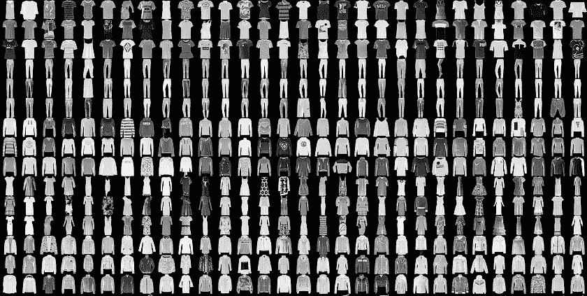
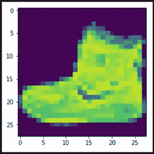
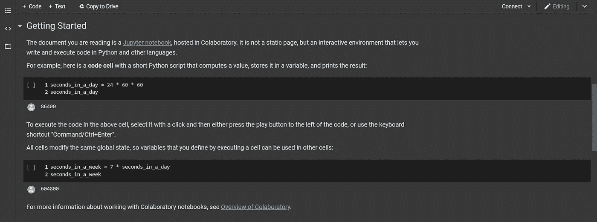
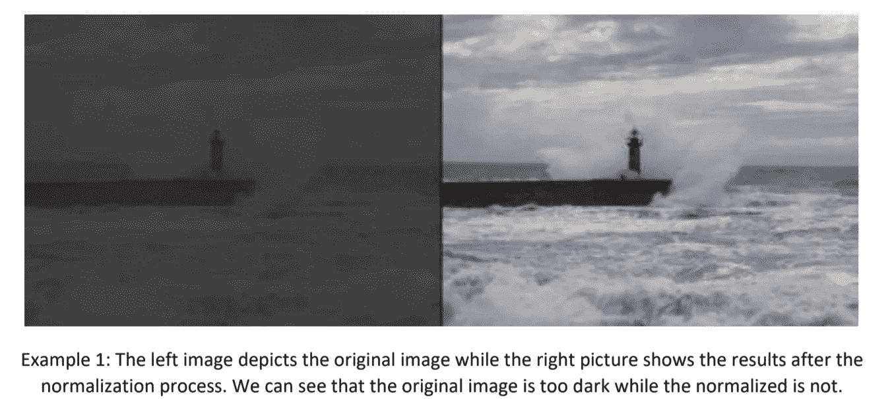
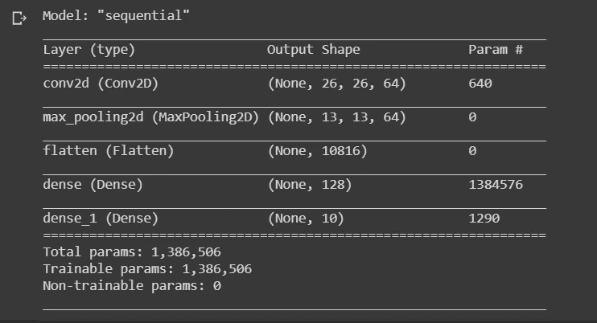
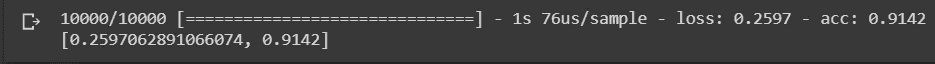

# 机器学习的新 ABCD

> 原文：<https://medium.com/analytics-vidhya/new-abcd-of-machine-learning-c5bf9eba75bf?source=collection_archive---------24----------------------->

时尚 MNIST 形象分类



如果你曾经尝试过图像分类，我打赌你的第一个模型会是 MNIST 手写数字分类，这有点酷。它被认为是机器学习的“你好世界”，但如果你想要一些新的东西，我会有它“*时尚 MNIST 图片分类*”。它的难度和它的兄弟一样，但是有些不同。所以让我们打开它。

本文 Github 链接:[https://github . com/aryan 109/medium/blob/master/medium _ fashion _ mnist . ipynb](https://github.com/aryan109/medium/blob/master/medium_fashion_MNIST.ipynb)

# 时尚 MNIST 数据集

它包括 10 类不同类型的服装和配饰，如鞋子、衬衫、裤子等。

每张图片都是 28*28 像素，黑白的，听起来复古？这是一个单通道图像，意味着它是灰度的，现在听起来很现代😉。如果任何图像将是多色的，那么它将有 3 个通道，每一个红色蓝色和绿色。这是数据集中的一个示例图像。



图像样本

# 模型介绍

我们将在这个项目中使用 TensorFlow 和 Keras，因为它们提供了许多机器学习实用程序的高级实现。我建议您使用*合作实验室*来运行代码，因为它预装了 TensorFlow，并且还提供了 GPU 硬件加速，这将帮助我们缩短模型的训练时间。

# 合作实验室简介

它是一个在线平台，提供类似 Jupyter 笔记本的接口来执行 python。它同时支持 Python 2 和 Python 3。正如我之前告诉你的，它有 TensorFlow 和 ha GPU 硬件加速可用。

这是最好的入门平台。稍后，您可以在自己的设备上安装 TensorFlow。

以下是合作实验室的链接:[https://colab . research . Google . com/notebooks/welcome . ipynb # scroll to = 5 FCE dcu _ qrc 0](https://colab.research.google.com/notebooks/welcome.ipynb#scrollTo=5fCEDCU_qrC0)



合作实验室的惠康之窗

# 从代码开始

我们将从导入所需的库开始。

```
*import tensorflow as t**import numpy as np**from tensorflow import keras*
```

# 数据加载和预处理

在这里，我们将神经网络用于我们的图像分类模型。您可能知道，“数据”是任何模型的燃料，因此我们首先必须将数据加载到我们的系统中，然后对其进行预处理，使其可用于我们的模型。

时尚 MNIST 数据集已经存在于 Keras 中，因此我们不必从外部下载它。

```
fashion_mnist = keras.datasets.fashion_mnist(train_images,train_labels),(test_images,test_lables)=fashion_mnist.load_data()
```

我们将整个数据分为两组“训练数据集”和“测试数据集”，每一组又进一步分为“图像”和“标签”。

这里 *train_images* 和 *train_labels* 将用于训练模型，而 *test_images* 和 *test_labels* 将用于测试我们的模型的准确性。

我们可以使用以下代码查看我们的数据:

```
import matplotlib.pyplot as pltplt.imshow(train_images[0])
```


这将是输出

# 重塑数据集

我们不能将图像直接输入模型。我们需要创建一个 NumPy 图像数组，然后将其提供给模型。转换非常简单，只需调用【reshape()。

```
train_images = train_images.reshape(60000,28,28,1)
#60000 is number of train imagestest_images = test_images.reshape(10000,28,28,1)
#10000 is number of test images
```

# 标准化我们的数据集

图像归一化是图像处理中改变像素强度值范围的典型过程。它的正常目的是将输入图像转换为更熟悉或更正常的像素值范围，因此称为归一化。



为了标准化，我们将简单地除以 255。

```
train_images,test_images=train_images/225.0,test_images/255
```

# 定义我们的模型

现在我们将使用 Keras 定义我们的模型。我们将使用 CNN 连接到完全连接的 DNN。

```
model = keras.Sequential([
 keras.layers.Conv2D(64,(3,3),activation = ‘relu’,input_shape=(28,28,1)),
 keras.layers.MaxPooling2D(2,2),
 keras.layers.Flatten(),
 keras.layers.Dense(128,activation = ‘relu’),
 keras.layers.Dense(10,activation = ‘softmax’)
])
model.summary()
```

model.summary()将为我们提供关于模型的信息



只看可训练参数数量 1，366，506！！！

# 利用优化器和损失函数编译模型

**优化器**更新权重参数以最小化损失函数。损失函数充当地形的向导，告诉**优化器**它是否正朝着正确的方向移动以到达谷底，即全局最小值。

我们将使用 *Adam* 作为我们的优化器，使用*稀疏分类交叉熵*

```
model.compile(optimizer = tf.train.AdamOptimizer(),loss = ‘sparse_categorical_crossentropy’,metrics = [‘accuracy’])
```

# 训练我们的模型

我们将使用 *model.fit()* 来训练我们的模型大约 50 个纪元。

```
model.fit(train_images,train_labels,epochs = 50)
```

# 评估我们的模型

现在，我们将使用测试数据评估我们的模型，并找出它在看不见的数据上的表现有多好。

```
model.evaluate(test_images,test_lables)
```



这就是最终的输出

**损失:0.26，准确率:91.4%**

这个结果还是蛮不错的。由于模型参数的随机初始化，您可能会得到稍微不同的结果。