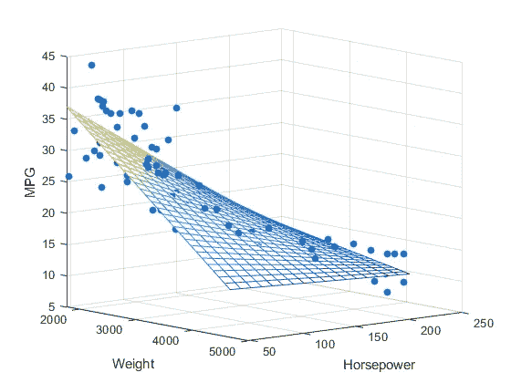
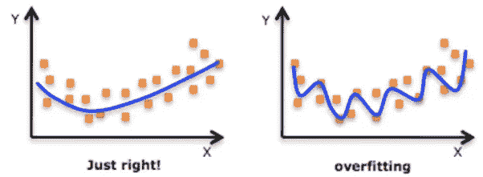
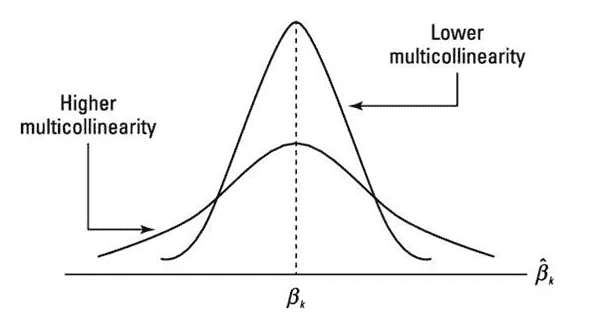
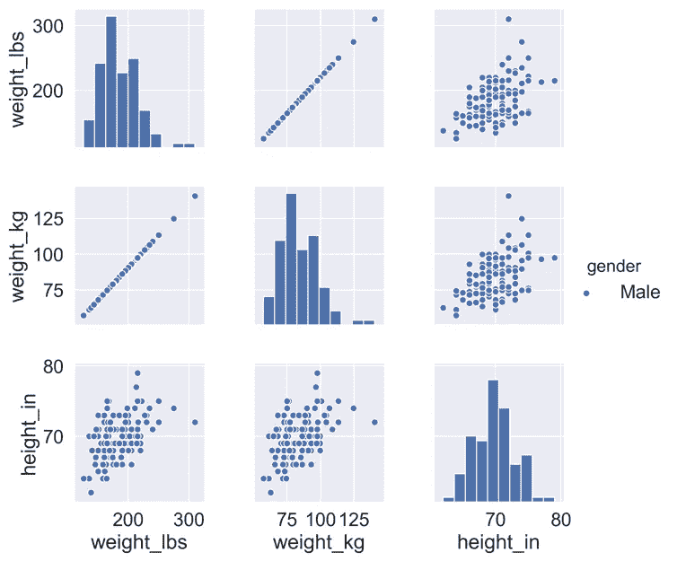
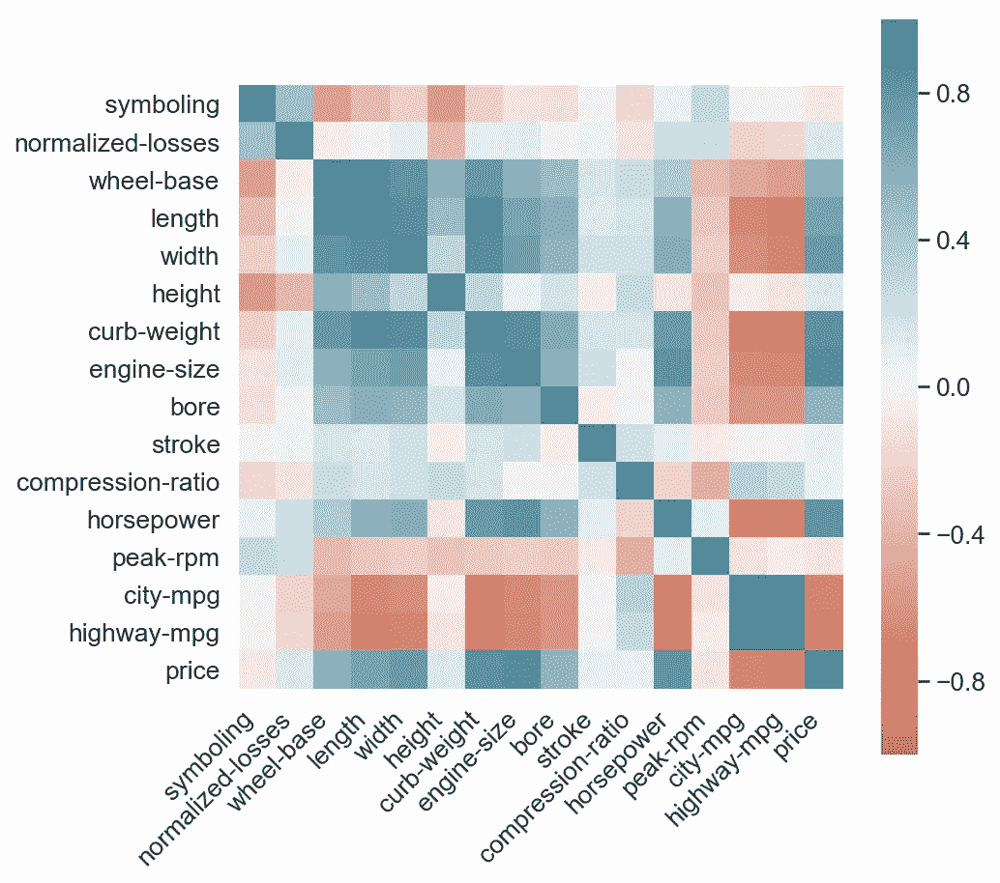

# 从简单线性回归到多元线性回归时要考虑的新方面

> 原文：<https://medium.com/analytics-vidhya/new-aspects-to-consider-while-moving-from-simple-linear-regression-to-multiple-linear-regression-dad06b3449ff?source=collection_archive---------6----------------------->

**简单线性回归**:用直线解释因变量和自变量之间关系的最基本模型。然而，在现实生活中，一个独立变量可能不足以解释输出或因变量。

所以，用多个变量来解释一个因变量可能是个好主意。

**优势**:

1.  添加变量有助于添加关于自变量方差的信息。
2.  一般来说，我们期望解释力随着变量的增加而增加

因此，这就把我们带到了**多元线性回归**，它是简单线性回归的扩展。

**以下是从单反转向多镜头反光时需要考虑的几个方面:**

1.  **过度拟合**:过度拟合是一种建模错误，当一个函数过于接近有限的数据点集合时就会出现这种错误。当我们不断增加模型的变量时，模型可能会“太好地”适应训练集，可能不会很好地概括。这将导致高训练精度、低测试精度，这是过度拟合的典型症状。

**2。多重共线性**:多重共线性是独立变量之间高度相互关联的状态。因此，这是数据中的一种干扰，如果在数据中存在，对数据做出的统计推断可能不可靠。

多重共线性主要影响:

1)

**2) ***推论*** :**

**a.系数摇摆不定，符号可以颠倒**

**b.因此，p 值是不可靠的**

*****检测多重共线性*** :**

**以下是检测模型中多重共线性的两种方法；**

1.  *****看自变量之间的成对相关性或相关性:*****

****

**变量对中的某些变量可能高度相关，因此，在构建模型时，每对变量中的一个变量对于模型来说可能是多余的。**

****

**2. ***检查方差膨胀因子(VIF)* :****

**有时两两相关是不够的，也就是说，一个变量可能不能完全解释另一个变量，但是一些变量组合起来就可以解释。基本上，VIF 计算一个独立变量被所有其他独立变量组合起来解释的程度。**

**VIF 通常遵循的启发是:**

**a)VIF 值为 10 的变量被认为是高值，应予以消除。**

**b)VIF 值为 5 的变量被认为是可以的，但值得检查。**

**c)不需要消除 VIF 值小于 5 变量。**

*****如何处理多重共线性* :****

**以下方法可用于处理多重共线性:**

**a)删除变量**

**I)丢弃与其他变量高度相关的变量**

**ii)选择业务可解释变量**

**b)使用旧变量的交互作用创建新变量**

**I)添加交互特征，即使用一些原始的**

**ii)变量转换**

****3)** **功能选择:****

**以下是最佳特征选择的方法:**

**一. ***手动特征选择*** :**

**a)建立具有所有特征的模型**

**b)丢弃对预测帮助最小的特征(高 p 值)**

**c)丢弃冗余的特征(使用相关性和 VIF)**

**d)重建模型并重复**

**二。 ***自动特征选择*** :**

**a)递归特征消除(RFE)**

**b)基于 AIC 的向前/向后/逐步选择**

**通常建议使用自动(粗调)+手动(微调)选择的组合，以获得最佳模型。**