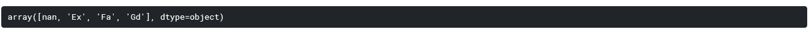

# 刚到 Kaggle？以下是如何开始 Kaggle 竞赛的方法

> 原文：<https://medium.com/analytics-vidhya/new-to-kaggle-heres-how-you-can-get-started-with-kaggle-competitions-2cf6a0604d11?source=collection_archive---------25----------------------->

# 概观

*   Kaggle 可能经常暗示初学者，因此这里有一个指南来帮助你开始参加数据科学竞赛
*   我们将使用 Kaggle 上的房价预测竞赛来指导您如何解决 Kaggle 项目

# 一路走到数据科学世界的顶端！

Kaggle 是数据科学黑客马拉松的市场领导者。我开始了自己的数据科学之旅，将我在分析 Vidhya 和 Kaggle 上的学习结合起来，这种结合帮助我通过实际动手编码来增加我的理论知识。

现在，卡格尔的情况是这样的。它有大量的数据集和数据科学竞赛，但这对任何初学者来说都可能很快变得势不可挡。我记得在我最初的数据科学时代浏览 Kaggle 时，我在想，“我该从哪里开始呢？”。考虑到所涉及的专业知识，这对新来者来说是一个相当令人生畏的前景。

在本文中，我将为您简化这种转变。


我们将通过他们的房价竞争来了解如何在 Kaggle 上进行首次提交。为了在这些 Kaggle 竞赛中胜出，我们将介绍您需要采取的不同步骤，例如特征工程、处理异常值(数据清理)，当然还有模型构建。

您还可以查看 [DataHack](https://datahack.analyticsvidhya.com/?utm_source=blog&utm_medium=get-started-kaggle-competitions) 平台，该平台也有一些非常有趣的数据科学竞赛。

*请注意，我假设你熟悉 Python 和线性回归。如果这些对你来说是新概念，你可以在这里学习或温习:*

*   [*用于数据科学的 Python*](https://courses.analyticsvidhya.com/courses/introduction-to-data-science?utm_source=blog&utm_medium=get-started-kaggle-competitions)
*   [*回归分析基础*](https://courses.analyticsvidhya.com/courses/Fundamentals-of-Regression-Analysis?utm_source=blog&utm_medium=get-started-kaggle-competitions)

# 目录

I)熟悉 Kaggle 笔记本电脑

ii)在 Kaggle 中导入数据集

iii)让我们研究一下数据

iv)执行数据预处理步骤

*   特征转换
*   处理异常值
*   处理缺失数据

v)是时候进行特征工程了

vi)准备预测数据

vii)让我们做一些预测

*   线性回归
*   里脊回归

vii)提交您的第一份 Kaggle 文件

# 熟悉 Kaggle 笔记本电脑

Kaggle 笔记本是整个 Kaggle 体验中最棒的东西之一。这些笔记本是免费的，运行在浏览器上。它们拥有惊人的处理能力，让你可以轻松运行大多数计算饥渴的机器学习算法！

只需看看这些笔记本电脑的性能(打开 GPU):


正如我前面提到的，我们将致力于[房价](https://www.kaggle.com/c/house-prices-advanced-regression-techniques)预测挑战。您可以通过使用自己的 Kaggle 笔记本来遵循本文中的过程。

只需前往房价竞赛页面，加入竞赛，然后前往**笔记本**选项卡，点击**创建新笔记本。**您应该会看到以下屏幕:


在这里，您必须选择您需要的编码语言和加速器设置，并点击**创建**按钮:


您自己的 Kaggle 笔记本将加载已经为您导入的基本库。此外，您可以从这里直接访问培训数据，您在这里所做的任何更改都将自动保存。你还需要什么？

现在让我们开始比赛吧！

# 在 Kaggle 中导入数据集

一旦我们准备好 Kaggle 笔记本，我们将在笔记本中加载所有数据集。在这场竞赛中，我们提供了两个文件—培训和测试文件。我们将使用 Pandas 的 *read_csv()* 函数加载这些数据集:

让我们使用***data frame . head()***函数来查看我们的数据集，该函数默认输出数据集的前 5 行:


数据集有 81 列。' *SalePrice* '列是我们的目标特性，由数据集中剩余的列决定。我们还可以观察到分类列和连续列的混合，并且数据中有一些缺失值。让我们在下一节详细研究这些数据。

# 让我们来探究这些数据

数据探索的第一步是查看数据集中的列以及它们所代表的值。我们可以使用***data frame . info()***函数来实现:


*注意:您可以在竞赛页面上提供的数据描述文件中了解这些特性代表了什么。*

您会注意到相当多的特性包含缺失值。在建立模型之前，我们必须估算这些缺失值。这是一个预处理步骤，我们将在后面的部分中处理它。

但是首先，让我们使用***data frame . describe()***函数来探索我们的目标特性:


这里，25%、50%和 75%分别表示第 25、50 和 75 百分位的值。因此，从输出中，我们可以看出 75%的价值低于 214，000，而一所房子的最高销售价格是 755，000。这两者之间有显著差异，这清楚地表明目标变量有一些异常值。

*在这里* *阅读更多关于百分位数* [*。*](https://www.statisticshowto.datasciencecentral.com/probability-and-statistics/percentiles-rank-range/)

让我们使用 [Seaborn](https://www.analyticsvidhya.com/blog/2019/09/comprehensive-data-visualization-guide-seaborn-python/?utm_source=blog&utm_medium=get-started-kaggle-competitions) 中的***SNS . distplot()***函数来可视化 SalePrice 特性中的分布:


你可以看到许多销售价格集中在 10 万到 20 万英镑之间。但是，由于一些房子的高销售价格，我们的数据似乎没有围绕任何价值。这意味着销售价格对于任何价值都是不对称的。我们的数据分布中存在的这种不对称被称为**偏斜度**。在我们的例子中，数据分布是正偏的(或右偏的)。

*注:你可以在这里阅读更多关于* [*偏斜度*](https://www.investopedia.com/terms/s/skewness.asp) *的内容。*

我们可以使用***data frame . skew()***函数显式检查数据的偏斜度:


我们在这里得到一个正值，因为我们的数据分布由于一些房屋的高销售价格而向右倾斜。

我们的问题要求我们预测房屋的销售价格——这是一个回归问题。因此，我们将拟合数据集的第一个模型是线性回归模型。但是我们的目标特征中的偏斜度对于线性模型造成了问题，因为一些值将对预测产生不对称的影响。拥有一个正态分布的数据是线性回归的[假设之一！但是我们会在转换功能时处理这个问题。](https://www.analyticsvidhya.com/blog/2016/07/deeper-regression-analysis-assumptions-plots-solutions/?utm_source=blog&utm_medium=get-started-kaggle-competitions)

现在，让我们使用 Seaborn 的热图来看看我们的要素是如何相互关联的:


热图是一个很好的工具，可以快速直观地显示一个要素与其余要素之间的关系。我从热图中看到的一些特征之间的显著关联是:

1.  GrLivArea 和 TotRmsAbvGrd
2.  GarageYrBlt 和 YearBuilt
3.  1stFlrSF 和 TotalBsmtSF
4.  总质量和销售价格
5.  车库区域和车库汽车

我们可以绘制这些特征来理解它们之间的关系:


很明显，地面上的房间总数应该随着地面上居住面积的增加而增加:


这种关系很有趣，因为我们可以看到房屋建造年份和车库建造年份之间形成了某种线性关系。想一想——凭直觉，车库可能与房子同时建造，也可能在房子建成之后建造，而不是在房子建成之前。因此，你可以看到大部分的点停留在直线上或直线下。


同样，我们可以看到这两个特征之间的线性关系，并且大多数点位于线的下方。大多数房屋的地下室面积小于或等于一楼面积。虽然我们可以看到一些地下室面积超过一楼面积的房子。你认为原因可能是什么？我很想在下面的评论中读到它！


同样，车库能容纳的汽车数量会随着其面积的增加而增加。你可以做更多的分析，我鼓励你探索所有的特性，并考虑如何处理它们。当你这样做的时候，不要忘记在评论中分享你的见解！

现在，让我们看看这些功能与我们的目标功能是如何关联的— **销售价格**:


我们可以看到，我们上面看到的大多数特征也与我们的目标特征高度相关。因此，让我们尝试将它们与目标特征的关系可视化。

*我会把它们都保存在我的“热门功能”列表中，以备日后参考。*


好的，我们已经绘制了这些值，但是你同意什么？

嗯，你一定已经注意到这些图中的一些点偏离了它们通常的位置，并且倾向于打破特征中的模式。这些被称为**离群值**。异常值会影响数据集的均值和标准差，进而影响我们的预测值。

例如，在 GrLivArea 特性中，注意右下角的那两点？一套 4500 平方英尺的地上居住面积仅售 20 万英镑，而 3000 平方英尺的售价高达 20 万英镑以上！似乎有点奇怪，不是吗？

再举个例子，这次是 TotalBsmtSF。注意到右下角的点了吗？这说不通。

这些异常值需要处理，否则会影响我们的预测。我们可以用许多不同的方法来处理它们，我们将在接下来的预处理部分处理它们。

*注:你可以在这里* *阅读更多关于离群值* [*。*](https://www.analyticsvidhya.com/blog/2016/01/guide-data-exploration/#three?utm_source=blog&utm_medium=get-started-kaggle-competitions)

# 执行数据预处理步骤

# 处理任何异常值

没错，我们在上面的相关特征中看到了一些异常值。虽然有几种方法可以处理数据中的异常值，但我将在这里放弃它们。

要素中任何超出 1.5*IQR(四分位间距)的值都被视为异常值。因此，我们将使用它来检测我们的异常值:


这些是我们包含异常点的主要特征。既然我们已经放弃了这些点，让我们来看看还剩多少行:

```
(1327, 81)
```

我们已经删除了几行，因为它们会影响我们以后的预测。

# 特征转换

在我们开始处理数据中缺失的值之前，我将对训练和测试数据帧进行一些调整。

我将把训练和测试数据帧连接成一个数据帧。这将更容易操纵他们的数据。除此之外，我还会对它们中的每一个进行一些更改:

*   将行数存储在训练数据帧中，以便稍后分离训练和测试数据帧
*   从训练和测试中删除 Id，因为它与预测销售价格无关
*   利用 ***np.log()*** 对目标特征进行对数变换，处理数据中的偏斜度
*   删除目标特征，因为它不在测试数据框架中
*   连接训练和测试数据集

看看日志转换是如何影响我们的目标特性的。这种分布现在似乎是对称的，而且更加正态分布:


现在是处理缺失数据的时候了！

# 处理缺失数据

让我们看看我们的数据中有多少缺失值:


我们的数据集中似乎有相当多的缺失值。你认为这可能是什么原因？这里有一个提示——看一下数据描述文件，试着弄清楚。

有些特征对于缺失的参数具有 NA 值！这很奇怪，但让我告诉你为什么会这样:



例如，PoolQC 功能中的 NA 表示房子中没有游泳池！熊猫将此视为空值(或 np.nan ),并且在相当多的分类特征中存在类似的值。

我将用“无”值替换分类特征中的空值。

然而，对于顺序特性，我将用 0 替换空值，用一组递增的数字替换剩余的值。这被称为[标签编码](https://www.analyticsvidhya.com/blog/2020/03/one-hot-encoding-vs-label-encoding-using-scikit-learn/?utm_source=blog&utm_medium=get-started-kaggle-competitions)，用于捕捉**序数**特征中的趋势。

**标称**特征中的空值将通过替换为“无”值进行处理，该值将在数据集的一次性编码过程中进行处理。

最后，**数字**特征中缺失的值将被替换为 0 或其他统计值:

车库要素中的空值表示房屋中没有车库。这些值将以与上述相同的方式处理:

基底要素中的空值表示不存在基底，将按上述方式处理:

其余要素中的空值也可以用类似的方式处理:

# 该是特征工程的时候了

既然我们已经处理了缺失值，我们可以对其他一些要素进行标注编码，以转换为数值。这保留了特征中的趋势，回归模型将能够理解这些特征。

老实说，功能工程可能是 Kaggle 竞赛最重要的方面。快速浏览一下以前的获奖解决方案，你会发现功能工程是多么重要。这通常是前 20%和排行榜中游位置的区别。

我们可以从数据集中的现有数据创建新的要素，以捕捉数据中可能不明确的一些趋势。这使得已经存在的数据更加有用。例如，添加指示房屋总平方英尺的新要素非常重要，因为面积越大的房屋售价越高。类似地，告诉房子是否是新的特征将是重要的，因为新房子往往比旧房子卖得更高。

下面我做了一些新的特色。我鼓励你自己浏览这些数据，看看是否能找到其他有用的特性。

我在这里执行的所有这些步骤都是特征工程的一部分。你可以在这篇[文章](https://www.analyticsvidhya.com/blog/2016/01/guide-data-exploration/#four?utm_source=blog&utm_medium=get-started-kaggle-competitions)中读到更多关于它们的细节。

# 为预测准备数据

由于数据集中有大量的分类特征，我们需要对数据集应用一次性编码。这将转换数字形式的分类数据，以便回归模型可以了解该值属于哪个类别:


因为我们在开始时已经将训练和测试数据集合并到一个数据框架中，所以现在是时候将两者分开了:

最后，我将把我们的训练数据框架分成训练和验证数据集。这将允许我们训练我们的模型并验证其预测，而不必查看测试数据集！

# 让我们做一些预测

让我们尝试使用线性回归来预测这些值。这是最简单的回归模型，你可以在这篇文章中读到更多关于它的细节。

# 线性回归模型


我们在这里看到的是 RMSE 分数，因为竞争页面说明评估指标是 RMSE 分数。我们没做什么就得到一个相当不错的 RMSE 分数。现在让我们看看是否可以使用另一种经典的机器学习技术来改进它。

# 岭回归模型

岭回归是一种线性回归模型，它允许对特征进行正则化。现在，什么是正规化？

> *正则化将一些特征系数向零收缩，以最小化它们对预测输出值的影响。*

*你可以在这篇* [文章](https://www.analyticsvidhya.com/blog/2015/02/avoid-over-fitting-regularization/)中学习更多关于正规化的知识


我们得到最低的 RMSE 分数，阿尔法值为 3。因为我用岭回归得到了最低的 RMSE，所以我将在我的最终提交中使用这个模型:

但是在提交之前，我们需要进行我们在训练模型时所做的对数变换的逆变换。这是使用 ***np.exp()*** 函数完成的:

现在，我们可以创建一个新的数据框架来提交结果:

# 第一次向 Kaggle 提交

创建提交文件后，它将出现在输出文件夹中，您可以在右侧面板访问该文件夹，如下所示:


你可以从这里下载你的提交文件。完成后，只需将其拖放到竞赛页面上的**提交预测**选项卡中提供的上传空间即可:


# 结束注释

就这样，你第一次提交了 Kaggle。恭喜你。

展望未来，我鼓励你们参加这次比赛，并努力提高我们在这里取得的准确性。您可以继续探索特征工程，并使用[集成学习](https://www.analyticsvidhya.com/blog/2018/06/comprehensive-guide-for-ensemble-models/)来获得更好的结果。

现在，继续努力成为数据科学大师吧！

您也可以在我们的移动应用程序上阅读这篇文章


*原载于 2020 年 6 月 22 日 https://www.analyticsvidhya.com*[](https://www.analyticsvidhya.com/blog/2020/06/get-started-kaggle-competitions/)**。**