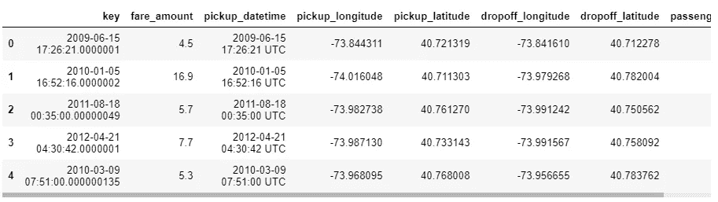
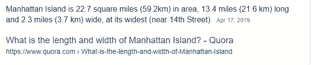

# 纽约市出租车费用预测

> 原文：<https://medium.com/analytics-vidhya/new-york-city-taxi-fare-prediction-1ba96223ba7e?source=collection_archive---------5----------------------->


我们能预测一个乘客的出租车费用吗？

自从我接触到这个密集的技术网络，我就有许多问题需要答案。其中一个问题是，每当我在奥拉或优步预定一次旅程时，我的出租车费是如何决定的。他们不仅给出了票价，而且票价经常根据时间和交通状况而变化。我想我得到了我的答案，现在是时候向你们解释我们是如何做的了！


因此，像往常一样，我在 Kaggle 中获取一些数据库，以获得乐趣和了解更多。一个美丽的地方引起了我的注意，那里的数据库的主要任务是预测乘客的费用。奇怪的是，数据实际上非常庞大，包含 5500 万个条目。现在，由于我非常好奇，想了解和探索关于这个数据集的更多信息，所以我决定抄近路，开始吧:

顺便说一下，你可以在这里找到数据集[](https://www.kaggle.com/c/new-york-city-taxi-fare-prediction)

# *导入相关库*

```
*import numpy as np 
import pandas as pd
import sklearn
import seaborn as sns
import matplotlib.pyplot as plt*
```

*如前所述，给定的数据集包含 5500 万个条目，一次加载所有数据是不可能的，所以在参考了一些笔记本后，我决定取 20 %，即 1100 万个条目。这对于训练目的来说已经足够了，尽管我们可以获取任何数据样本，但是 5500 万太大了。我用的函数是 *nrows* 。对于那些真正有兴趣装载整个坦克的人来说， [*这里的*](https://www.kaggle.com/szelee/how-to-import-a-csv-file-of-55-million-rows) 就是你可以做到的。*

# *正在加载数据集*

```
*train = pd.read_csv("../input/new-york-city-taxi-fare-prediction/train.csv", nrows = 1000000)test = pd.read_csv("../input/new-york-city-taxi-fare-prediction/test.csv")*
```

*训练集包括 1000000 行和 8 列，而测试集包括 9914 个条目和 7 列。*

*好了，在我们装好枪之后，是时候把它对准目标并做一些调整或者预处理我们的数据了。*

# *数据预处理*

*在不做任何改变的情况下，我们应该找出数据帧中的空条目的数量，以免进一步混淆。那么我们还在等什么呢？让我们开始清洁阶段！*

**

```
*train.isnull().sum()*
```

*所以我们有数量可以忽略的空条目。消除它们更方便。*

```
*train = train.dropna(how = 'any', axis = 'rows')*
```

**

```
*test.isnull().sum()*
```

*我是如此笨拙，在寻找所有空条目的匆忙中，我完全忘记了浏览我们的数据集，以找到更多关于数据集及其属性的信息*

```
*train.head()*
```

**

*您还将拥有一个乘客计数列*

*因此，从数据帧中可以看出，有 7 个独立列和一个非独立列，即 fare_amount。*

*让我们开始分析我们的 fare_amount，看看我们是否能在数据框中找到任何异常值或极值。*

**

```
*train[‘fare_amount’].describe()*
```

*fare_amount 的最小值是-44$(似乎不太现实)。*

*票价总是正值，所以让我们去掉训练数据中所有的负值。*

```
*train = train.drop(train[train['fare_amount']<0].index, axis=0)*
```

*经过票价，我们的下一站可以是经度和纬度。我认为这是估算票价时最重要的因素，因为上下客点之间的差异越大，票价就越高。*

*然而，在分析距离之前，让我们先设置一些约束。*

*虽然我不是地质学专家，但经过一番搜索，我发现了一些东西:*

**

*纬度范围从 0-90 度，经度范围从 0-180 度*

*去除所有无效的位置，我们将得到一些有用的数据，这些数据可用于计算两点之间的距离。*

```
*train = train.drop(((train[train['dropoff_latitude']<-90])|(train[train['dropoff_latitude']>90])).index, axis=0)train = train.drop(((train[train['dropoff_longitude']<-180])|(train[train['dropoff_longitude']>180])).index, axis=0)*
```

*在参考了一些内核并进行讨论后，我发现我们需要在数据帧中再增加一列，以获得一些预测票价的主要见解。*

***让我们创建一个名为‘diff _ lat’和‘diff _ long’的新列，它将具有记录之间的绝对差异，而不是分别使用装载点和卸载点的经度和纬度。***

*这将会非常有用——尽管无论谁认为这是个天才，都不是我的主意。因为，不使用距离计算器或欧几里得距离，这可能会减慢我们的训练过程，我们可以创建一列装载点经度和纬度的差异，因为任何两个经度或纬度之间的差异为 1 意味着 66 英里。纽约的总覆盖面积是多少？*

**

*远不到 66 英里。*

```
*train['diff_lat'] = ( train['dropoff_latitude'] - train['pickup_latitude']).abs()
train['diff_long'] = (train['dropoff_longitude'] - train['pickup_longitude'] ).abs()*
```

**

*从表中可以看出，所有的值都在 0 和 1 之间，而且必须在 0 和 1 之间，因为出租车主要用于市内出行，而且如上所述，1 的差值相当于 66 英里。*

*做完这些后，我有一种好奇心，想看看是否有一些组合的差大于 1，让我们看看*

```
*plot = train.iloc[:2000].plot.scatter('diff_long', 'diff_lat')*
```

**

*我想我们又发现了一个异常值！*

*是时候消除我们的异常值了:*

```
*train = train[(train.diff_long < 5.0) & (train.diff_lat < 5.0)]*
```

*现在，我们最重要的属性已经完成，但是还有一个属性需要分析和过滤:passenger_count*

```
*train['passenger_count'].describe()*
```

**

*最高:208？是出租车还是飞机？*

*我认为我们也需要排除这个异常值*

```
*train = train.drop(train[train['passenger_count']==208].index, axis = 0)*
```

# *线性回归*

*我最近在引用了一个内核后释放了一个新的能力，我将在这里与你分享:*

*我们将使用 numpy 的 lstsq 库函数来查找最佳权重列 w。但是最佳权重是什么呢？*

*下面是 numpy 的 lstsq 函数中集成的简单数学*

**

*因此，假设我们有 X(所有因变量的集合)而不是 A，并且 *b* 是我们的 *y* (所有自变量的集合)，那么 *x* 和 *y* 将是我们的最优权重或 *w.**

*这对于提高模型的精度和效率是非常有用和有效的。为了实现上面的公式，我们首先需要将数据帧转换成一个矩阵，并在矩阵中为常数项添加一列 1。让我们创建一个函数来实现上述所有约束:*

```
*def get_input_matrix(df):
    return np.column_stack((df.diff_long, df.diff_lat, np.ones(len(df))))train_X = get_input_matrix(train)
train_y = np.array(train['fare_amount'])*
```

*最后，我们为训练阶段的最后一步做好了准备:*

```
*(w, _, _, _) = np.linalg.lstsq(train_X, train_y, rcond = None)
print(w)*
```

**

*如果我们只是想得到这是什么的提示，而不是只看正值，我们可以知道，随着距离的增加，票价也增加了。所以我们走的方向是对的！*

*对于那些仍然不明白我们是如何得到这个 *w* 的人，我将再解释一次，因为它在我们的培训部分非常重要。*

**

*X.w = y*

*X.w = y，就当 X 的第三列全是 1，所以，我们有 X，我们将有所有的 diff_lat，diff_long，1，y 将有 fare_amount，所以我们的 *w* 将是 a，值为 X，y，z*

*(3 X 3)。(3 X 1) = (3 X 1)。*

# *测试阶段*

*我们已经训练了我们的模型，现在是结果的时候了，让我们检查一下我们的模型在测试数据集上的表现。*

```
*#get_input_matrix is the function which we have made above.To convert dataframe to matrix.test_X = get_input_matrix(test)
test_y = np.matmul(test_X, w).round(decimals = 2)*
```

# *结果*

```
*submission = pd.DataFrame()
submission["key"] = test.key
submission["fare_amount"] = test_y
submission.to_csv('submission.csv', index = False)*
```

**

*我们仅从 20%的数据中得出这一结论。*

## *改进的余地*

*嗯，越大越好。这意味着这只是 20%数据的结果。如果我们增加数据的比例，结果一定会增加，但计算速度一定会下降！*

*好了，暂时就这样了。如果你有任何建议，你可以在下面提出来。作为一个初学者，我总是乐于接受改变和改进，这将真正激励我继续写作！*

*这里是完整代码的[链接](https://github.com/brij1823/Taxi-Fare-Prediction/blob/master/Taxi_Fare_Prediction.ipynb)供参考。*