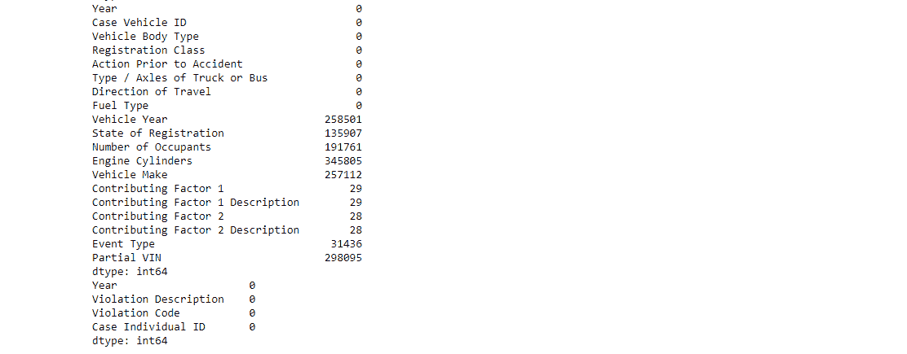

# 使用 Python、Pandas、Matplotlib 和 Seaborn 探索和可视化纽约机动车碰撞数据

> 原文：<https://medium.com/analytics-vidhya/new-york-motor-vehicle-crash-data-exploration-and-visualization-55fd8ce1d328?source=collection_archive---------8----------------------->

使用 Python 探索和可视化纽约州机动车碰撞数据。

数据来自纽约州机动车辆管理局碰撞记录中心/纽约开放数据。数据集包含 2014 年至 2016 年纽约州单个机动车碰撞的案例、违规、涉及的个人和涉及的车辆的信息。

[https://data . ny . gov/Transportation/Motor-Vehicle-crasses-Case-Information-Three-/e8ky-4vqe](https://data.ny.gov/Transportation/Motor-Vehicle-Crashes-Case-Information-Three-Year-/e8ky-4vqe)
[https://data . ny . gov/Transportation/Motor-vehicles-crasses-Individual-Information-Three/ir4y-sesj](https://data.ny.gov/Transportation/Motor-Vehicle-Crashes-Individual-Information-Three/ir4y-sesj)
[https://data . ny . gov/Transportation/Motor-vehicles-crasses-违章-信息-Three-/abfj-y7uq](https://data.ny.gov/Transportation/Motor-Vehicle-Crashes-Violation-Information-Three-/abfj-y7uq)
[https://https](https://data.ny.gov/Transportation/Motor-Vehicle-Crashes-Vehicle-Information-Three-Ye/xe9x-a24f)

来自数据源的关于数据的信息:

## 总体描述

“纽约州机动车辆管理局收到 NYS 境内发生的机动车辆碰撞报告。上述四个数据集提供了车祸的综合视图，包括路况、车祸的成因、可能被引用的违规行为以及受伤情况(如果有的话)以及更多属性。

**数据收集方法**
执法人员处理的所有碰撞报告都被转发给 NYS 车管所进行处理。许多人以电子方式获取和传输事故数据，而其他人继续使用纸质表格记录事故数据，然后邮寄到 DMV 进行处理。NYS 车辆和交通法要求，发生伤亡事故或财产损失超过 1，000 美元的事故的当事人应向 DMV 提交汽车驾驶员事故报告。所提供的数据文件包含从 DMV 存档的执法和汽车驾驶员碰撞报告中接收的数据。"

**关于数据的初步观察:**

我认为，总体而言，我应该记住，我最终可能会发现错误的趋势，因为这些数据实际上可能会遗漏一些最终没有被报告或记录的碰撞信息。

导入库和读入数据:

Pandas 用于数据操作，Matplotlib 和 Seaborn 用于可视化。

**查看数据的形状:**

不出所料，个人数据集的条目最多，然后是车辆数据集，然后是案例数据集，最后是违规数据集的条目最少。

**查看缺失数据:**

通常情况下，案例和违规数据集的缺失数据点较少，个人和车辆数据集的缺失数据点较多。

尝试一个想法:将车辆信息添加到个人数据集中，将个人和车辆信息添加到违章数据集中。Jupyter notebook 首先尝试创建一个字典，用单独的 id 作为键，用车辆 id 作为值，然后给出一个错误。

解决方案:更改 Jupyter 笔记本设置。

另一个问题是:在个人 ID 栏中有重复的条目，可能是因为人们卷入了不止一次事故。所以我稍后会回到这个观点。我首先想到的一个解决方案是删除重复的条目。

**看一些基本统计:**

**一些观察:**

涉及的车辆数的平均值为 1.78，中位数为 2，第三个四分位数为 2。所以大多数撞车事故只涉及一到两辆车。年龄平均值为 38.9 岁，中位数为 37 岁。乘客人数的中位数是 1，所以至少一半的撞车事故中只有一个人。

**关于分类数据的统计:**

**部分数据处理:**

将时间和日期从字符串转换为时间和日期对象以及小时和月的整数。

我决定将星期几的值改为整数，以便更容易排序。我将不得不记住 0 对应于星期一等等。

将警方报告栏中的 Y 和 N 转换为 1 和 0。

**一些可视化:**

锡伯恩计数图

更多的车祸发生在上午 8 点、下午 5 点和午夜，可能是因为交通高峰时间，也可能是人们在深夜出门后酒后驾车。

锡伯恩计数图

更多的车祸发生在六月和冬季，可能是因为天气差异。

锡伯恩计数图

除了每年都在增加的违规数据外，这些年的统计数字相当可观，这可能更多是因为收集/记录的数据的增加，而不是因为碰撞统计数据的变化。

由于法定驾驶年龄限制，18 岁以下的人较少是有道理的。25 岁左右和 55 岁左右的人出现的频率更高，这与纽约州人口的年龄分布大致相符，但 25 岁左右的人不成比例地出现也可能是因为该年龄的司机经验不足。

我试图绘制车辆年份的频率，但 x 轴标签最终太小，挤在一起无法阅读。增加图形大小和手动设置刻度线和标签很有帮助。

首次尝试绘制车辆年份计数

为车辆年份绘制计数的结果更好

一个观察结果是:2010 年左右的下跌。我猜测，这可能与 2007 年左右开始的大衰退有关，导致当时购买新车的人减少。

大多数车辆只有一名乘客。我猜没有乘客的车辆是被另一辆车撞上的停着的车。

**头脑风暴如何处理数据:**

我查看了崩溃的某些方面的价值计数。与行人的碰撞或与骑自行车的人的碰撞是可以更仔细观察的可能类别。

添加二进制列，说明碰撞是行人碰撞还是自行车碰撞。

看看有多少不同类别的车祸是自行车相撞。

**一些观察:**
工作日的自行车碰撞比周末多。大多数自行车相撞事件都会导致警方报案。几乎所有的自行车碰撞都只涉及一辆车。(虽然我可以想象可能有涉及一辆自行车和多辆汽车的撞车事故，这些事故可能被记录在另一个类别中。大多数自行车碰撞发生在白天和/或道路干燥的时候。天气不好的时候，自行车相撞的事故就少了。也许人们不太可能在更糟糕的条件下骑自行车。

一些直方图比较了涉及行人和其他人的碰撞:

