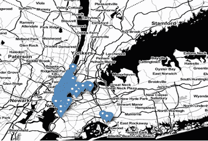
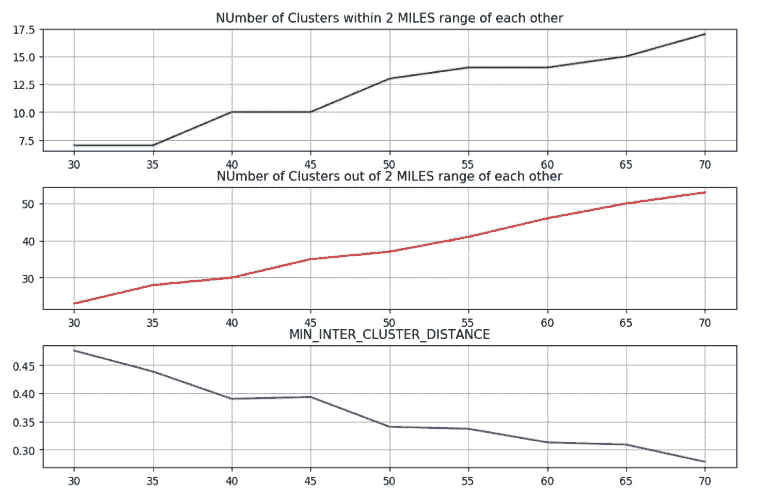
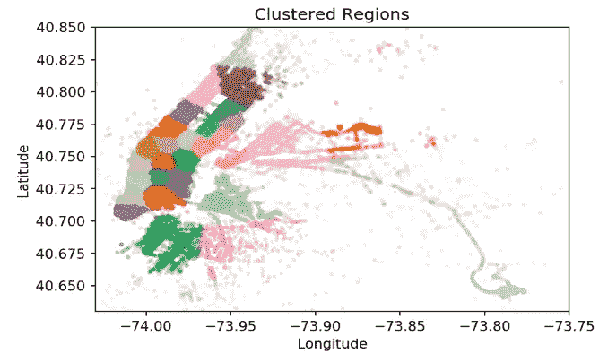
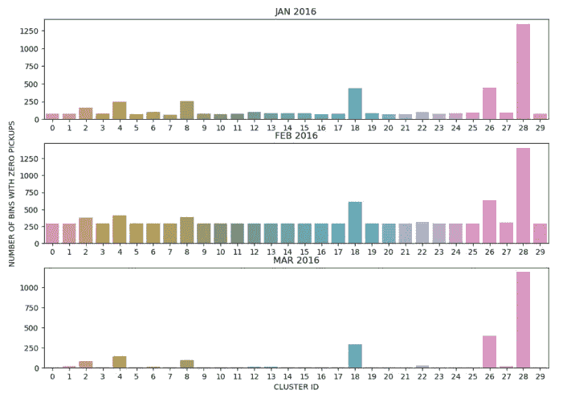
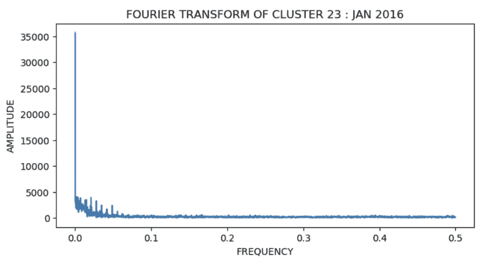
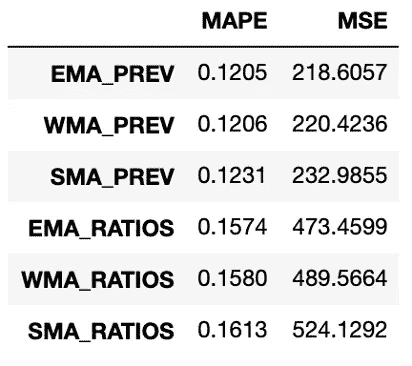
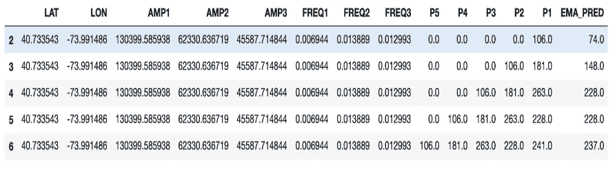
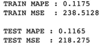
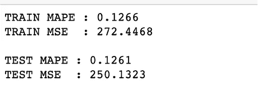
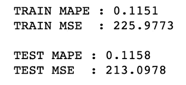

# 基于机器学习的纽约黄色出租车需求预测

> 原文：<https://medium.com/analytics-vidhya/new-york-yellow-taxi-demand-prediction-using-machine-learning-fc697d20ff86?source=collection_archive---------3----------------------->

# 商业理解

黄色出租车集中在曼哈顿区，但在纽约市五个区的任何地方，只要举手或在出租车招呼站，都可以叫到出租车。

在纽约市，人们使用出租车的频率比大多数地方高得多。大多数纽约出租车司机仍然在街上搭载乘客，而不是提前通过电话预约顾客。叫出租车就像走下路边伸出手臂一样简单

> 2011 年，优步宣布将在纽约市推出拼车服务，开创了出租车服务行业的新时代

通过允许任何人注册成为拥有自己私家车的出租车司机，并让点击手机应用程序就能轻松预订出租车，优步开始在 medallion 系统之外建立一个新的出租车网络。根据最近的研究，由于这些拼车服务的竞争，自 2011 年以来，出租车乘客量大幅下降。

> 如果有一种方法可以预测出租车乘客量，为出租车调度员提供有价值的见解，如如何将出租车放置在最需要的地方，调度多少辆出租车，以及乘客量如何随时间变化，会怎么样？这种预测将极大地帮助调度员做出重要决策，从而恢复他们的利润率。

# 数据理解

要解决任何业务问题，了解构建解决方案的数据的优势和局限性是至关重要的。用于构建我们的解决方案的数据由出租车和车辆乘客增强计划(TPEP/LPEP)授权的技术提供商收集并提供给纽约市出租车和豪华轿车委员会(TLC)。出于建模的目的，我们将使用 2015 年 1 月的数据。

**数据来源:**[**https://www1 . NYC . gov/site/TLC/about/TLC-trip-record-Data . page**](https://www1.nyc.gov/site/tlc/about/tlc-trip-record-data.page)

# **数据清理**

进行数据的单变量分析，其中所有错误的数据都被移除。

> 作为数据清理阶段的一部分，我们检查提货的纬度和经度是否在纽约市内，并删除不在纽约市内的。

**清理后拿起地图只在纽约集中**

# **数据准备**

良好的数据准备可以进行有效的分析，并限制因错误数据而产生的错误和不准确性

## 1.聚类和细分:

因为我们的解决方案的一部分是预测某个区域在某个时间间隔内的拾取，所以我们需要从数据中导出区域和时间间隔。让我们从使用皮卡的纬度和经度将 NYC 划分为 K 个集群开始。使用 K-Means 聚类，我们将拾取点聚类到不同的区域。

由于 K-Means 创建大致相同大小的聚类(相同点数的聚类)，具有更多拾取次数的区域形成较小且密集的聚类，而具有较少拾取次数的区域连接成较大且松散/稀疏的聚类。

从数据中，我们观察到出租车可以在 10 分钟内行驶 2 英里。因此，我们希望内部集群距离大于 2 英里，但不小于 0.5 英里。最佳 K 值必须满足这个约束。我们尝试了一系列不同的聚类值，从 30 到 70 个聚类。在尝试了不同范围的聚类后，我们观察到当聚类数为 30 时。

> 半径 2 英里内的星团数量:7.0
> 
> 半径 2 英里以外的星团数量:23.0
> 
> 最小簇间距离:0.475971

从图中可以看出，满足上述条件，我们选择它作为 k 的最佳值，即 30

## **2。时间宁滨**

每个区域被分成 10 分钟的间隔，对应于一个时间点，即每个时间点有 10 分钟。但是，在数据中，我们有格式为“YYYY-MM-DD HH:MM:SS”的时间，它们被转换为 Unix 时间格式，以便检索分钟/小时格式的时间。可能的 10 分钟间隔箱数:4464

> 来自集群的 pickup _ bins 总数:130567
> 
> 来自所有聚类的可能 pickup _ bins 的数量:133920
> 
> 现在，有了任何区域 ID 和 10 分钟时间区间，我们就可以预测提货的数量。

**3。平滑数据**

现在，数据被分成 10 分钟间隔的箱，每个箱应该至少包含一个拾取。有可能时间仓可能包含零拾取，从而导致比率特征误差。为了消除这个异常值:

我们计算每个箱子里的总数量。

如果时间框中没有拾音器，就没有价值。用 0 填充缺失的提货时间箱。

然后，我们将来自相邻箱的一些拾取添加到包含零个拾取的箱中，以便使所有相邻箱拾取相等。

**4。时间序列和傅立叶变换**

理论上，任何波形都可以表示为无限个正弦波的和。每个正弦波都有一定的振幅和频率。我们可以看到，每个集群中一个月的提货次数形成了一个重复的模式。我们不知道重复模式的频率。我们的模式不能用单一频率来表示，因为它是非周期性的。相反，它由无限个正弦波组成，每个正弦波都有一个频率。傅立叶变换使我们能够从时域(每次拾取的数量)到频域(可以被视为具有最高拾取数量的拾取箱数量)来表示我们的模式。

对于每个聚类，存在一个模式，并且使用傅立叶变换，我们可以从聚类中推导出组成我们的模式的正弦波的最高频率和振幅，并且使用它们作为特征。一个集群的频率和幅度表示该集群中的需求。因此它们可以被输入到用于预测拾取数量的模型中。

> 绘制正弦分量的幅度和频率，我们看到
> 
> 1.重复率非常高的模式将具有高频分量，反之亦然。
> 
> 2.早晚时段的频率较高，因为高峰时段的客流量较高。这同样适用于白天和夜晚，但频率较低。

我们看到 f=0 时幅度非常高。当正弦波的频率接近零时，正弦波趋于轴平行/线性，表现为 DC 分量。由于我们傅里叶变换的波是重复波，DC 分量看起来模糊不清，因为它捕捉了波的前一部分的信息。因此，我们将不考虑它的振幅和频率。

# **建模**

## **基线模型**

解决我们业务问题的第一大步是从基线模型开始的。我们将带您了解发现给我们带来最佳结果(最少错误)的正确基线模型的过程。).我们使用这些有两种变化的模型

> 1.使用 2016 年数据与 2015 年数据的比率，即比率= P_2016/P_2015
> 
> 2.使用 2016 年数据本身的先前已知值来预测未来值
> 
> P_2016 和 P_2015 是各自年份的拾音密度。

这是我们的数据帧，拾取密度为 2015 年和 2016 年及其比率。

我们的 3 个选择是简单移动平均线、加权移动平均线和指数加权移动平均线。对于它们中的每一个，计算了 P_2015 和 P_2016 的比率和预测。

将比率和先前拾取密度的指数移动平均值相加后的数据框内容

## **不同基线模型之间的比较**

在使用 MAPE(平均绝对百分比误差)作为我们的误差度量来比较所有基线以了解模型的预测效果以及 MSE(均方误差)以了解我们的预测模型在异常值情况下的表现之后，我们可以确保我们的预测和实际值之间没有太大的误差。

# **特色工程**

在做了所有的数据清理和准备以及基线建模之后，我们现在有了一个有助于建立一个好的预测模型的功能库。我们看到，从基线建模来看，指数加权移动平均线的预测效果最好。在构建回归模型时，我们将把它作为一个特性，与我们在数据准备阶段获得的其他模型一起使用。

> 下面是我们用于建模的 14 个特征的列表，
> 
> 集群的纬度和经度
> 
> 傅立叶变换的前三个振幅及其各自的频率
> 
> 预测拾取密度的聚类中的五个先前拾取密度
> 
> EMA_PREV 基线模型预测的拾取密度

# **回归模型**

**测试和列车拆分:**

对于按时间划分的测试和训练，我们采用 2016 年 3 个月的采集数据，并将其划分为每个地区 70%的数据在训练中，30%在测试中。由于这是一个时间序列问题，我们必须根据时间分割我们的训练和测试数据。

1.  **线性回归**

首先，我们通过去除平均值并缩放到单位方差来标准化测试和训练数据。然后，我们应用这个模型。我们使用了 SDGRegressor，因为它非常适合处理大量训练和测试数据的回归问题。而且，它的速度更快，因为它在每次迭代中处理的数据更少，即在每一步的训练集中选取一个随机实例，并仅基于该单个实例计算梯度。

使用 GridSearchCV()完成超参数的调整，以便找到参数值的最佳组合，即最佳参数。我们还做了三重交叉验证来提高泛化性能。

**测量性能:**

最后，我们计算了 2016 年训练数据的平均绝对百分比误差和均方误差。我们使用了下面的函数来计算误差指标。

**2。随机森林回归**

我们下一个选择的模型是随机森林回归。同样，随机森林对于保持大部分数据的准确性非常有用，如果有太多的树，它不允许过度拟合。我们使用 RandomizedSearchCV()，因为它从指定的分布中采样固定数量的参数设置，而不像 gridsearchcv()那样尝试所有的参数。我们还做了三重交叉验证来提高泛化性能。

**测量性能:**

与之前的模型一样，我们计算了 2016 年训练数据的平均绝对百分比误差和均方误差。

**3。XGBOOST 回归器**

我们的下一个选择是 XGBoost Regressor，它是一个梯度增强决策树的实现，旨在提高速度和性能。在我们的训练数据上训练超参数调谐 Xg-Boost 回归器。

**测量性能:**

与之前的模型一样，我们计算了 2016 年训练数据的平均绝对百分比误差和均方误差。

# **车型评测**

我们已经使用 pickup _ densities 建立了总共九个回归模型。一些模型使用了时间序列属性，而另一些模型忽略了它，并被视为一个适当的回归问题。

我们可以看到，基于 TEST_MAPE 的 XGBoost 性能优于其他模型。线性回归能够获得与 XGBoost 相似的值。但是，我们选择 XGBoost 是为了避免过度拟合。

这些模型使用的一些更重要的特征是拾取密度(P(t-1))，然后是使用先前拾取密度的 EMA 模型。

利用这些预测，黄色出租车的车主可以决定在他们最少接客的时候在哪里停车。

与该计划相关的一些风险是，随着司机转向优步/Lyft，黄色出租车车队本身可能会在未来几年下降，从而没有多少数据可供我们的模型预测皮卡密度。

一个引人注目的商业案例是在黄色出租车上做一年的试点项目，看看这种模式是否真的有助于增加收入。如果这一计划成功，黄色出租车将回到他们统治出租车乘客行业的辉煌时代，并且不会受到优步/Lyft 的影响。

# **部署**

出租车服务是几乎所有城市地区的主要交通方式。像今天的许多其他领域一样，出租车行业正在经历快速的数字化转型，像优步这样的新参与者凭借创新的数字产品占据了市场份额。任何出租车公司和司机最重要的目标是最大限度地减少空闲驾驶时间，其中一个非常重要的方面是知道在哪里可以找到乘客。预测乘客在哪里是一个非常适合机器学习方法的问题。

利用对出租车供求的了解，可以提高城市出租车系统的效率。总体而言，我们用于预测纽约市出租车载客人数的模型表现良好。XGboost 回归模型表现最好，可能是因为它具有捕捉复杂特性依赖关系的独特能力。我们建议开发一个移动应用程序，该应用程序将从本质上使用我们的模型来更有效地定位出租车。我们的模型可供出租车司机/调度员以及城市规划者使用。

与模型使用相关的一些问题可能是，我们使用了平滑来平均拾取为零的仓，这会影响模型的准确性。

与我们建议的解决方案相关的一个主要风险是，有时信息可能存在延迟。给定出租车司机的位置和当前时间，作为出租车司机，他/她期望得到他/她的区域和邻近区域中的预测搭载人数。因此，确保信息的最小延迟是至关重要的。

与该计划相关的一些风险是，随着司机转向优步/Lyft，黄色出租车车队本身可能会逐年减少，因此我们的模型可能没有太多的数据来准确预测未来的接客密度。

> **参考文献:**
> 
> 1.[https://python-visualization . github . io/folio/docs-v 0 . 6 . 0/quick start . html #入门](https://python-visualization.github.io/folium/docs-v0.6.0/quickstart.html#Getting-Started)
> 
> 2.【https://github.com/tkrajina/gpxpy/blob/master/gpxpy/geo.py 
> 
> 3.[http://dask.pydata.org/en/latest/dataframe.html](http://dask.pydata.org/en/latest/dataframe.html)
> 
> 4.[http://scikit-learn.org/stable/](http://scikit-learn.org/stable/)
> 
> 5.[https://xgboost.readthedocs.io/en/latest/](https://xgboost.readthedocs.io/en/latest/)
> 
> 6.[https://pandas.pydata.org/](https://pandas.pydata.org/)
> 
> 7.[http://robertmitchellv . com/blog-bar-chart-annotations-pandas-mpl . html](http://robertmitchellv.com/blog-bar-chart-annotations-pandas-mpl.html)
> 
> 8.[https://matplotlib.org/](https://matplotlib.org/)
> 
> [9。https://docs.scipy.org/doc/numpy/reference/](https://docs.scipy.org/doc/numpy/reference/)